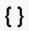

# Criação de fragmentos de conteúdo {#authoring-content-fragments}

A criação dos fragmentos de conteúdo foca na entrega headless e na criação de páginas.

Há dois editores disponíveis para Fragmentos de conteúdo. O editor descreveu nesta seção:

* O foi desenvolvido para entrega de conteúdo headless (embora possa ser usado para todos os cenários)
* está disponível no **Fragmentos de conteúdo** console

Esse editor fornece:

* [Salvamento automático](#saving-autosaving), para evitar a perda acidental de edições.
* [Upload em linha de ativos como referências de conteúdo](#reference-images), sem precisar carregá-los no DAM do ativo primeiro.
* [Visualizar](#preview-content-fragment) da experiência renderizada entregue pelo fragmento de conteúdo.
* Capacidade para [Publish](#publish-content-fragment) e [Cancelar publicação](#unpublish-content-fragment) do editor.
* Capacidade para [exibir e abrir cópias de idioma associadas](#view-language-copies) no editor.
* Capacidade para [exibir detalhes da versão](#view-version-history) no editor.
   * Também é possível reverter para uma versão selecionada.
* Capacidade para [exibir e abrir referências principais](#view-parent-references).
* Uma visualização hierárquica do fragmento de conteúdo e suas referências, usando o [Árvore de estrutura](#structure-tree).

>[!CAUTION]
>
>O editor descrito nesta seção é *somente* disponível no *online* Adobe Experience Manager (AEM) as a Cloud Service.

>[!CAUTION]
>
>Para editar um fragmento de conteúdo, é necessário [as permissões apropriadas](/help/implementing/developing/extending/content-fragments-customizing.md#asset-permissions). Entre em contato com o(a) administrador(a) do sistema em caso de problemas.
> 
>Por exemplo, se você não tiver `edit` permissões que o editor será somente leitura.

>[!NOTE]
>
>Consulte a documentação do Assets para obter informações completas sobre o [editor de fragmento de conteúdo original](/help/assets/content-fragments/content-fragments-variations.md) - estiver disponível a partir de ambos os **Assets** e o **Fragmentos de conteúdo** console.

>[!NOTE]
>
>A equipe do projeto pode personalizar o editor, se necessário. Consulte [Personalização do console e do editor de fragmentos de conteúdo](/help/implementing/developing/extending/content-fragments-console-and-editor.md) para obter mais detalhes.

## Editor de fragmento de conteúdo {#content-fragment-editor}

Ao abrir o Editor de fragmento de conteúdo pela primeira vez, você vê quatro áreas principais:

* barra de ferramentas superior: para informações principais e ações
   * um link para o Console de fragmentos de conteúdo (ícone Início)
   * informações sobre o modelo e a pasta
   * links para [Visualização (se o Padrão de URL de visualização padrão estiver configurado para o modelo)](/help/sites-cloud/administering/content-fragments/content-fragment-models.md#content-fragment-model-properties)
   * [Publish](#publish-content-fragment), e [Cancelar publicação](#unpublish-content-fragment) ações
   * uma opção para mostrar tudo **Referências principais** (ícone de link)
   * o fragmento **[Status](/help/sites-cloud/administering/content-fragments/managing.md#statuses-content-fragments)** e as últimas informações salvas
   * uma alternância para alternar para o editor original (baseado em ativos)
* painel esquerdo: mostra o **[Variações](#variations)** para o Fragmento de conteúdo e suas **Campos**:
   * esses links podem ser usados para [navegar pela estrutura do fragmento de conteúdo](#navigate-structure)
* painel direito: apresenta guias [exibição das propriedades (metadados) e tags](#view-properties-tags), informações sobre o [histórico de versões](#view-version-history)e informações relacionadas a qualquer [cópias de idioma](#view-language-copies)
   * no **Propriedades** guia, é possível atualizar a guia **Título** e **Descrição** para o fragmento ou **Variação**
* painel central: mostra os campos reais e o conteúdo da variação selecionada
   * permite editar o conteúdo
   * se **Espaço reservado da guia** os campos são definidos no modelo mostrado aqui e podem ser usados para navegação; eles serão apresentados horizontalmente ou como uma lista suspensa

>[!CAUTION]
>
>Um modelo de fragmento de conteúdo pode definir campos de dados chamados **Título** e **Descrição**. Se esses campos existirem, eles serão definidos pelo usuário e poderão ser atualizados na *painel central* ao editar o fragmento.
>
>O fragmento de conteúdo e suas variações também têm campos de metadados (propriedades de variação) chamados **Título** e **Descrição**. Esses campos são parte integral de qualquer fragmento de conteúdo e são definidos inicialmente quando o fragmento é criado. Elas podem ser atualizadas no *painel direito* ao editar o fragmento.

## Navegar pela estrutura do fragmento de conteúdo {#navigate-structure}

Um único fragmento de conteúdo;

* Consiste em dois níveis:

   * **[Variações](#variations)** do fragmento de conteúdo
   * **Campos** - definido pelo Modelo de fragmento de conteúdo e usado por cada variação

* Pode conter várias referências.

### Variações e campos {#variations-and-fields}

No painel esquerdo, você pode ver:

* a lista de **[Variações](#variations)** que foram criadas para este fragmento:
   * **Principal** é a Variação presente quando o Fragmento de conteúdo é criado pela primeira vez. É possível adicionar outras posteriormente
   * é possível selecionar e abrir uma Variação para edição
   * você também pode [criar uma variação](#create-variation)
* o **Campos** no fragmento e suas variações:
   * o ícone indica a [Tipo de dados](/help/sites-cloud/administering/content-fragments/content-fragment-models.md#data-types)
   * o texto é o nome do campo
   * juntos, eles fornecem um link direto para o conteúdo do campo no painel central (para a Variação atual)

### Seguir links {#follow-links}

Em várias partes do editor, você verá o ícone de link. Isso pode ser usado para abrir o item exibido; por exemplo, um Modelo de fragmento de conteúdo, uma Referência principal ou um fragmento que está sendo referenciado:

### Árvore de estrutura {#structure-tree}

Abra o **Árvore de estrutura** na barra de ferramentas do editor para mostrar a estrutura hierárquica do fragmento de conteúdo e suas referências. Use os ícones de link para navegar até as referências.

>[!NOTE]
>
>Consulte [Análise da estrutura do fragmento de conteúdo - Árvore de estrutura](/help/sites-cloud/administering/content-fragments/analysis.md#structure-tree) para obter mais detalhes.

## Salvando e salvando automaticamente {#saving-autosaving}

<!-- CHECK: cannot be saved, no undo, redo -->

A cada atualização feita, o fragmento de conteúdo é salvo automaticamente. A última vez que foi salvo é mostrada na barra de ferramentas superior.

## Variações {#variations}

[Variações](/help/sites-cloud/administering/content-fragments/overview.md#main-and-variations) são um recurso importante dos fragmentos de conteúdo do AEM. Eles permitem criar e editar cópias do **Principal** conteúdo para uso em canais e cenários específicos, tornando a entrega de conteúdo headless e a criação de página ainda mais flexíveis.

No editor, é possível:

* [Criar variações](#create-variation) do **Principal** conteúdo

* Selecione a variação necessária para editar o conteúdo

* [Renomear a variação](#rename-variation)

* [Excluir uma variação](#delete-variation)

### Criar uma variação {#create-variation}

Para criar uma variação do fragmento de conteúdo:

1. No painel esquerdo, selecione a **sinal de mais** (**Criar variação**) que é à direita de **Variações**.

   >[!NOTE]
   >
   >Depois de criar sua primeira variação, as variações existentes serão listadas no mesmo painel.

   

1. Na caixa de diálogo, insira um **Título** para sua variação e uma **Descrição** se desejar:

   

1. **Criar** a variação. Ele aparece na lista.

### Renomear uma variação {#rename-variation}

Para renomear um **Variação**:

1. Selecione a variação necessária.

1. Abra o **Propriedades** no painel direito.

1. Atualizar a variação **Título**.

1. Pressione **Retornar** ou mova para outro campo para salvar automaticamente a alteração. O título é atualizado na **Variações** à esquerda.

### Excluir uma variação {#delete-variation}

Para excluir uma variação do fragmento de conteúdo:

>[!NOTE]
>
>Não é possível excluir **Principal**.

1. Selecione a Variação.

1. No **Variação** selecione o ícone excluir (Lixeira):

   

1. Uma caixa de diálogo é aberta. Selecionar **Excluir** para confirmar a ação

## Editar campos de texto multilinha - Texto sem formatação ou Markdown {#edit-multi-line-text-fields-plaintext-markdown}

**[Texto multilinha](/help/sites-cloud/administering/content-fragments/content-fragment-models.md#data-types)** Os campos podem ter um dos três formatos:

* Texto sem formatação
* [Markdown](/help/sites-cloud/administering/content-fragments/markdown.md)
* [Texto formatado](#edit-multi-line-text-fields-rich-text)

Os campos definidos como Texto sem formatação ou Markdown têm uma caixa de texto simples, sem opções de formatação (na tela):

## Editar campos de texto multilinha - Rich text {#edit-multi-line-text-fields-rich-text}

Para **[Texto multilinha](/help/sites-cloud/administering/content-fragments/content-fragment-models.md#data-types)** campos definidos como **Rich Text**, vários recursos estão disponíveis:

* Edite o conteúdo:
   * Desfazer / Refazer
   * Colar/Colar como texto
   * Copiar
   * Selecionar formato de parágrafo
   * Criar/gerenciar tabela
   * Formatar texto; negrito, itálico, sublinhado, cor
   * Definir alinhamento do parágrafo
   * Criar/gerenciar listas; com marcadores, numeradas
   * Recuar texto; diminuir, aumentar
   * Limpar formatação atual
   * Inserir links
   * Selecionar e inserir referências a ativos de imagem
   * Adicionar caracteres especiais
* [Editor de tela cheia](#full-screen-editor-rich-text) - alternar entre tela cheia e em fluxo
* [Estatísticas](#statistics-rich-text)
* [Comparar e sincronizar](#compare-and-synchronize-rich-text)

Por exemplo:

>[!NOTE]
>
>Os campos de texto multilinha também são indicados pela tag [ícone](#fields-datatypes-icons) no **Campos** painel.

### Editor de tela cheia - Rich Text {#full-screen-editor-rich-text}

O editor de tela cheia oferece as mesmas opções de edição que quando em fluxo, mas oferece mais espaço para o texto.

Por exemplo:

### Estatísticas - Rich Text {#statistics-rich-text}

A ação **Estatísticas** O exibe uma variedade de informações sobre o texto em um campo de Várias linhas.

Por exemplo:

### Comparar e Sincronizar - Rich Text {#compare-and-synchronize-rich-text}

A ação **Comparar** está disponível para campos de Várias linhas quando você tem uma **Variação** aberto.

O campo Várias linhas é aberto em tela cheia e:

* exibe o conteúdo de ambos **Principal** e o atual **Variação** paralelamente, com quaisquer diferenças salientadas

* as diferenças são indicadas por cor:

   * verde indica conteúdo adicionado (à variação)
   * vermelho indica conteúdo removido (da variação)
   * azul indica texto substituído

* fornece a **Sincronizar** ação, que sincroniza o conteúdo de **Principal** para a variação atual

   * se **Principal** foi atualizada, essas alterações serão transferidas para a variável
   * se a variação tiver sido atualizada, essas alterações serão substituídas pelo conteúdo de **Principal**

  >[!CAUTION]
  >
  >A sincronização só está disponível para copiar alterações *de **Principal**à variação*.
  >
  >Transferindo alterações *de uma variação para **Principal*** não está disponível como uma opção.

Por exemplo, um cenário em que o conteúdo de variação foi completamente reescrito, portanto, uma sincronização substituirá esse novo conteúdo pelo conteúdo de **Principal**:

## Gerenciar referências {#manage-references}

### Referências de fragmento {#fragment-references}

[Referências do fragmento](/help/sites-cloud/administering/content-fragments/content-fragment-models.md#fragment-reference-nested-fragments) pode ser usado para:

* [criar uma referência a um fragmento de conteúdo existente](#create-reference-existing-content-fragment)
* [criar um fragmento de conteúdo e, em seguida, referenciá-lo](#create-reference-content-fragment)

#### Criar uma referência a um fragmento de conteúdo existente {#create-reference-existing-content-fragment}

Para criar uma referência a um fragmento de conteúdo existente:

1. Selecione o campo.
1. Selecionar **Adicionar fragmento existente**.
1. Selecione o fragmento necessário no seletor de fragmentos.

   >[!NOTE]
   >
   >Você pode selecionar apenas um fragmento por vez.

#### Criar um fragmento de conteúdo e fazer referência {#create-reference-content-fragment}

Como alternativa, você pode [selecionar **Criar novo fragmento** para abrir o **Criar** caixa de diálogo](/help/sites-cloud/administering/content-fragments/managing.md#creating-a-content-fragment). Depois de criado, esse fragmento será referenciado.

### Referências do conteúdo {#content-references}

[Referências de conteúdo](/help/sites-cloud/administering/content-fragments/content-fragment-models.md#content-reference) são usados para fazer referência a outros tipos de conteúdo de AEM, como imagens, páginas e Fragmentos de experiência.

#### Imagens de referência {#reference-images}

Entrada **Referência de conteúdo** campos que você pode:

* ativos de referência que já existem no repositório
* carregá-los diretamente no campo; isso evita a necessidade de usar a variável **Assets** console a ser carregado

  >[!NOTE]
  >
  >Para fazer upload de uma imagem diretamente na **Referência de conteúdo** campo, ele **deve**:
  >
  >* têm um **Caminho raiz** definido (no campo [Modelo de fragmento de conteúdo](/help/sites-cloud/administering/content-fragments/content-fragment-models.md#content-reference)). Especifica onde a imagem será armazenada.
  >* include **Imagem** na lista de tipos de conteúdo aceitos

Para adicionar um ativo, é possível:

* arraste e solte o novo arquivo de ativo diretamente (por exemplo, do seu sistema de arquivos) na **Referência de conteúdo** campo
* use o **Adicionar ativo** e selecione **Procurar ativos** ou **Carregar** para abrir o seletor apropriado para você usar:

  

#### Páginas de referência {#reference-pages}

Para adicionar referências a páginas AEM, Fragmentos de experiência ou outros tipos de conteúdo:

1. Selecionar **Adicionar caminho de conteúdo**.

1. Adicione o caminho necessário no campo de entrada.

1. Confirmar com **Adicionar**.

### Exibir Referências Pai {#view-parent-references}

Selecionar o ícone de link na barra de ferramentas superior abre uma lista de todas as referências principais.

Por exemplo:

Uma janela é aberta, listando todas as referências relacionadas. Para abrir uma referência, selecione o nome, o título ou o ícone de link.

Por exemplo:

## Propriedades da exibição e tags {#view-properties-tags}

Na guia Propriedades do painel direito, as propriedades (metadados) e as tags podem ser visualizadas. As propriedades podem ser:

* para o **Fragmento do conteúdo** - se **Principal** está selecionado no momento
* para um **Variação**

### Editar propriedades e tags {#edit-properties-tags}

Na guia Propriedades (painel direito), também é possível editar:

* **Título**
* **Descrição**
* **Tags**: usando a lista suspensa ou a caixa de diálogo de seleção

  

### Abrir o modelo de fragmento de conteúdo {#open-content-fragment-model}

Quando tiver **Principal** selecionada, o nome do Modelo de fragmento de conteúdo subjacente é exibido na seção propriedades. Selecionar o ícone de link abre o modelo em uma guia separada.

Por exemplo:

## Exibir o histórico da versão {#view-version-history}

No **Histórico de versão** do painel direito, detalhes das versões atual e anterior são mostrados:

>[!NOTE]
>
>Uma nova versão é criada quando o fragmento de conteúdo é publicado.

### Reverter para uma versão {#revert-version}

Você pode reverter para qualquer versão do.

Para reverter para uma versão específica:

1. Selecione o ícone de três pontos ao lado da versão.

1. Selecionar **Reverter**.

## Exibir as cópias de idioma {#view-language-copies}

No **Propriedades de idioma** os detalhes da guia de todas as cópias de idioma relacionadas são mostrados. Selecionar um ícone de link abre a cópia em uma guia separada.

Por exemplo:

>[!NOTE]
>
>Para obter mais detalhes sobre como traduzir um fragmento de conteúdo e criar cópias de idioma, consulte a [Jornada de tradução sem periféricos de AEM](/help/journey-headless/translation/overview.md).

## Visualizar o fragmento {#preview-content-fragment}

O editor de fragmento de conteúdo fornece aos autores a opção de visualizar suas edições em um aplicativo de front-end externo.

Para usar esse recurso, primeiro é necessário:

* Trabalhe com sua equipe de TI para configurar o aplicativo de front-end externo que renderizará o fragmento de conteúdo consumindo sua saída JSON.
* Quando o aplicativo de front-end externo estiver configurado, a variável **Padrão de URL de Visualização Padrão** precisa ser definido como um [propriedade do modelo de fragmento de conteúdo apropriado](/help/sites-cloud/administering/content-fragments/content-fragment-models.md#properties).

Quando o URL tiver sido definido, a variável **Visualizar** O botão está ativo. Você pode selecionar esse botão para iniciar o aplicativo externo (em uma guia separada) para renderizar o fragmento de conteúdo.

## Publicar seu fragmento {#publish-content-fragment}

Você pode **Publish** o fragmento é anexado ao:

* Visualizar instância
* Instância de publicação

Você pode publicar o fragmento no editor ou no console. Consulte [Publicar e visualizar um fragmento](/help/sites-cloud/administering/content-fragments/managing.md#publishing-and-previewing-a-fragment) para obter detalhes completos.

## Cancelar publicação do fragmento {#unpublish-content-fragment}

Também é possível **Cancelar publicação** o fragmento é proveniente de:

* Visualizar instância
* Instância de publicação

Você pode desfazer a publicação do fragmento no editor ou no console. Consulte [Desfazer a publicação de um fragmento](/help/sites-cloud/administering/content-fragments/managing.md#unpublishing-a-fragment) para obter detalhes completos.

## Campos, tipos de dados e ícones {#fields-datatypes-icons}

A variável **Campos** O painel lista todos os campos no Fragmento de conteúdo. O ícone indica a **[Tipo de dados](/help/sites-cloud/administering/content-fragments/content-fragment-models.md#data-types)**:

<table style="table-layout:auto">
 <tbody>
  <tr>
   <td>
<b>Texto em linha única</b>
 </td>
   <td>
  
</td>
  </tr>
  <tr>
   <td>
<b>Texto multilinha</b>
 </td>
   <td>
  
</td>
  </tr>
  <tr>
   <td>
<b>Número</b>
 </td>
   <td>
  
</td>
  </tr>
  <tr>
   <td>
<b>Booleano</b>
 </td>
   <td>
  
</td>
  </tr>
  <tr>
   <td>
<b>Data e hora</b>
 </td>
   <td>
  
</td>
  </tr>
  <tr>
   <td>
<b>Lista discriminada</b>
 </td>
   <td>
  
</td>
  </tr>
  <tr>
   <td>
<b>Tags</b>
 </td>
   <td>
  
</td>
  </tr>
  <tr>
   <td>
<b>Referência de conteúdo</b>
 </td>
   <td>
  
</td>
  </tr>
  <tr>
   <td>
<b>Referência de fragmento</b>
 </td>
   <td>
  
</td>
  </tr>
  <tr>
   <td>
<b>Objeto JSON</b>
 </td>
   <td>
  
</td>
  </tr>
  <tr>
   <td>
<b>Espaço reservado da guia</b>

Embora não seja representado por um ícone real, um <b>Espaço reservado da guia</b> O é representado no painel esquerdo, bem como no painel central.
 </td>
   <td>
  
</td>
  </tr>
 </tbody>
</table>
