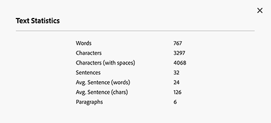

# Criação de fragmentos de conteúdo {#authoring-content-fragments}

A criação dos fragmentos de conteúdo foca na entrega headless e na criação de páginas.

Há dois editores disponíveis para Fragmentos de conteúdo. O editor descreveu nesta seção:

* O foi desenvolvido para entrega de conteúdo headless (embora possa ser usado para todos os cenários)
* está disponível no console **Fragmentos de conteúdo**

Esse editor fornece:

* [Salvando automaticamente](#saving-autosaving), para evitar a perda acidental de edições.
* [Carregamento embutido de ativos como referências de conteúdo](#reference-images), sem ter que carregá-los primeiro no DAM de Ativos.
* [Gerar variações](#generate-variations-ai) para usar a IA de geração para acelerar a criação de conteúdo com base em prompts.
* [Visualização](#preview-content-fragment) da experiência renderizada entregue pelo Fragmento de conteúdo.
* Capacidade de [Publicar](#publish-content-fragment) e [Cancelar publicação](#unpublish-content-fragment) do editor.
* Capacidade de [exibir e abrir cópias de idioma associadas](#view-language-copies) no editor.
* Capacidade de [exibir detalhes da versão](#view-version-history) no editor. Também é possível reverter para uma versão selecionada.
* Capacidade de [exibir e abrir referências principais](#view-parent-references).
* Uma exibição hierárquica do fragmento de conteúdo e suas referências, usando a [árvore de estrutura](#structure-tree).

>[!WARNING]
>
>O editor descrito nesta seção está disponível como *somente* no [Unified Shell](/help/overview/aem-cloud-service-on-unified-shell.md); portanto, *online* no Adobe Experience Manager (AEM) as a Cloud Service, não é uma instância local.

## Editor de fragmento de conteúdo {#content-fragment-editor}

Ao abrir o Editor de fragmento de conteúdo pela primeira vez, você vê quatro áreas principais:

* barra de ferramentas superior: para informações principais e ações
   * um link para o Console de fragmentos de conteúdo (ícone Início)
   * informações sobre o modelo e a pasta
   * links para [Visualizar](#preview-content-fragment); se o Padrão de URL de Visualização Padrão estiver configurado para o modelo
   * [Publicar](#publish-content-fragment) e [Cancelar publicação](#unpublish-content-fragment) ações
   * uma opção para mostrar todas as **Referências principais** (ícone de link)
   * o fragmento **[Status](/help/sites-cloud/administering/content-fragments/managing.md#statuses-content-fragments)** e as últimas informações salvas
   * um botão para alternar para o editor original (baseado no Assets)

     >[!WARNING]
     >
     >O editor original é aberto na mesma guia. Não é recomendável ter ambos os editores abertos ao mesmo tempo.

* painel esquerdo: mostra as **[Variações](#variations)** do fragmento de conteúdo e seus **Campos**:
   * estes links podem ser usados para [navegar pela estrutura do Fragmento de Conteúdo](#navigate-structure)
* painel direito: apresenta as guias [mostrando as propriedades (metadados) e tags](#view-properties-tags), informações sobre o [histórico de versões](#view-version-history) e informações relacionadas a quaisquer [cópias de idioma](#view-language-copies)
   * na guia **Propriedades**, é possível atualizar o **Título** e a **Descrição** do fragmento ou a **Variação**
   * Na guia **Comentários**, é possível adicionar e ler comentários para ajudá-lo a colaborar com outros autores
* painel central: mostra os campos reais e o conteúdo da variação selecionada
   * permite editar o conteúdo
      * quando configurado (como vários) no modelo, vários tipos de dados permitem **Adicionar** instâncias do campo relevante
   * se os campos **Espaço Reservado para Guia** forem definidos no modelo, eles serão mostrados aqui e:
      * pode ser usado para navegar
      * será exibido horizontalmente ou como uma lista suspensa

  >[!NOTE]
  >
  >Dependendo das definições no modelo subjacente, os campos podem estar sujeitos a determinados tipos de [Validação](/help/assets/content-fragments/content-fragments-models.md#validation).

## Navegar pela estrutura do fragmento de conteúdo {#navigate-structure}

Um único fragmento de conteúdo;

* Consiste em dois níveis:

   * **[Variações](#variations)** do fragmento de conteúdo
   * **Campos** - definidos pelo Modelo de fragmento de conteúdo e usados por cada variação

* Pode conter várias referências.

### Variações e campos {#variations-and-fields}

No painel esquerdo, você pode ver:

* a lista de **[Variações](#variations)** que foram criadas para este fragmento:
   * **Principal** é a variação que está presente quando o fragmento de conteúdo é criado pela primeira vez. Você pode adicionar outros mais tarde
   * você pode usar Gerar variações(#generate-variations) para usar um modelo baseado em prompt que o Adobe criou para um caso de uso específico.
   * você também pode [criar uma Variação](#create-variation)
* os **Campos** dentro do fragmento e suas variações:
   * o ícone indica o [Tipo de Dados](/help/sites-cloud/administering/content-fragments/content-fragment-models.md#data-types)
   * o texto é o nome do campo
   * juntos, eles fornecem um link direto para o conteúdo do campo no painel central (para a Variação atual)

### Seguir links {#follow-links}

Em várias partes do editor, é possível ver o ícone de link. Esse ícone pode ser usado para abrir o item mostrado; por exemplo, um Modelo de fragmento de conteúdo, uma Referência principal ou um fragmento que é referenciado:

### Árvore de estrutura {#structure-tree}

Abra a guia **Árvore de estrutura** na barra de ferramentas do editor para mostrar a estrutura hierárquica do fragmento de conteúdo e suas referências. Use os ícones de link para navegar até as referências.

>[!NOTE]
>
>Consulte [Analisando a estrutura do fragmento de conteúdo - Árvore de estrutura](/help/sites-cloud/administering/content-fragments/analysis.md#structure-tree) para obter mais detalhes.

## Salvando e salvando automaticamente {#saving-autosaving}

<!-- CHECK: cannot be saved, no undo, redo -->

A cada atualização feita, o fragmento de conteúdo é salvo automaticamente. A última vez que foi salvo é mostrada na barra de ferramentas superior.

## Variações {#variations}

[Variações](/help/sites-cloud/administering/content-fragments/overview.md#main-and-variations) são um recurso importante dos fragmentos de conteúdo do AEM. Eles permitem criar e editar cópias do conteúdo **Principal** para uso em canais e cenários específicos, tornando a entrega de conteúdo headless e a criação de página ainda mais flexíveis.

No editor, é possível:

* [Criar variações](#create-variation) do conteúdo **Principal**

* [Use a IA de Geração de Variações](#generate-variations-ai) para usar a IA Gerativa para usar um modelo baseado em prompt que a Adobe criou para um caso de uso específico.

* Selecione a variação necessária para editar o conteúdo

* [Renomear a variação](#rename-variation)

* [Excluir uma variação](#delete-variation)

### Criar uma variação {#create-variation}

Para criar uma variação do fragmento de conteúdo:

1. No painel esquerdo, selecione o **sinal de adição** (**Criar variação**) à direita de **Variações**.

   >[!NOTE]
   >
   >Depois de criar sua primeira variação, as variações existentes serão listadas no mesmo painel.

   

1. Na caixa de diálogo, insira um **Título** para sua variação e uma **Descrição**, se desejar:

   

1. **Crie** a variação. Ele aparece na lista.

### Renomear uma variação {#rename-variation}

Para renomear uma **Variação**:

1. Selecione a variação necessária.

1. Abra a guia **Propriedades** no painel direito.

1. Atualize a variação **Título**.

1. Pressione **Retornar** ou mova para outro campo para salvar automaticamente a alteração. O título é atualizado no painel **Variações** à esquerda.

### Criar variações usando GenAI com Gerar variações {#generate-variations-ai}

Use as Variações gerativas para aproveitar a IA gerativa para acelerar a criação de conteúdo.

Abra o Editor de fragmento de conteúdo para encontrar o ponto de entrada para Gerar variações.

Consulte [Gerar variações - Integrado em editores do AEM](/help/generative-ai/generate-variations-integrated-editor.md) para saber mais.

### Excluir uma variação {#delete-variation}

Para excluir uma variação do fragmento de conteúdo:

>[!NOTE]
>
>Você não pode excluir **Principal**.

1. Selecione a Variação.

1. No painel **Variação**, selecione o ícone Excluir (Lixeira):

   

1. Uma caixa de diálogo é aberta. Selecione **Excluir** para confirmar a ação.

## Editar campos de texto multilinha - Texto sem formatação ou Markdown {#edit-multi-line-text-fields-plaintext-markdown}

**[Os campos de texto de várias linhas](/help/sites-cloud/administering/content-fragments/content-fragment-models.md#data-types)** podem ter um destes três formatos:

* Texto sem formatação
* [Markdown](/help/sites-cloud/administering/content-fragments/markdown.md)
* [Texto formatado](#edit-multi-line-text-fields-rich-text)

Os campos definidos como Texto sem formatação ou Markdown têm uma caixa de texto simples, sem opções de formatação (na tela):

## Editar campos de texto multilinha - Rich text {#edit-multi-line-text-fields-rich-text}

Para campos de **[Texto multilinha](/help/sites-cloud/administering/content-fragments/content-fragment-models.md#data-types)** definidos como **Rich Text**, vários recursos estão disponíveis:

* Edite o conteúdo:
   * Desfazer/Refazer
   * Colar/Colar como texto
   * Copiar
   * Selecionar formato de parágrafo
   * Criar/gerenciar tabela
   * Formatar texto; negrito, itálico, sublinhado, cor
   * Definir alinhamento do parágrafo
   * Criar/gerenciar listas; com marcadores, numeradas
   * Recuar texto; diminuir, aumentar
   * Limpar formatação atual
   * Inserir links
   * Selecionar e inserir referências a ativos de imagem
   * Adicionar caracteres especiais
* [Editor de tela cheia](#full-screen-editor-rich-text) - alternar entre tela cheia e em fluxo
* [Estatísticas](#statistics-rich-text)
* [Comparar e sincronizar](#compare-and-synchronize-rich-text)

Por exemplo:

>[!NOTE]
>
>Campos de texto multilinha também são indicados pelo [ícone](#fields-datatypes-icons) apropriado no painel **Campos**.

### Editor de tela cheia - Rich Text {#full-screen-editor-rich-text}

O editor de tela cheia oferece as mesmas opções de edição que quando em fluxo, mas oferece mais espaço para o texto.

Por exemplo:

### Estatísticas - Rich Text {#statistics-rich-text}

A ação **Estatísticas** exibe um intervalo de informações sobre o texto em um campo de Várias linhas.

Por exemplo:

### Comparar e Sincronizar - Rich Text {#compare-and-synchronize-rich-text}

A ação **Comparar** estará disponível para campos de Várias linhas quando você tiver uma **Variação** aberta.

O campo Várias linhas é aberto em tela cheia e:

* exibe o conteúdo de **Principal** e da **Variação** atual em paralelo, com todas as diferenças realçadas

* as diferenças são indicadas por cor:

   * verde indica conteúdo adicionado (à variação)
   * vermelho indica conteúdo removido (da variação)
   * azul indica texto substituído

* fornece a ação **Sincronizar**, que sincroniza o conteúdo de **Principal** para a variação atual

   * se **Principal** tiver sido atualizado, essas alterações serão transferidas para a variação
   * se a variação foi atualizada, essas alterações serão substituídas pelo conteúdo de **Principal**

  >[!CAUTION]
  >
  >A sincronização só está disponível para copiar alterações *de **Main**para a variação*.
  >
  >A transferência de alterações *de uma variação para **Main*** não está disponível como uma opção.

Por exemplo, um cenário em que o conteúdo de variação foi completamente reescrito, portanto, uma sincronização substituirá esse novo conteúdo pelo conteúdo de **Principal**:

## Gerenciar referências {#manage-references}

### Referências de fragmento {#fragment-references}

[Referências de fragmento](/help/sites-cloud/administering/content-fragments/content-fragment-models.md#fragment-reference-nested-fragments) podem ser usadas para:

* [criar uma referência a um fragmento de conteúdo existente](#create-reference-existing-content-fragment)
* [criar um fragmento de conteúdo e, em seguida, referenciá-lo](#create-reference-content-fragment)

#### Criar uma referência a um fragmento de conteúdo existente {#create-reference-existing-content-fragment}

Para criar uma referência a um fragmento de conteúdo existente:

1. Selecione o campo.
1. Selecione **Adicionar fragmento existente**.
1. Selecione o fragmento necessário no seletor de fragmentos.

   >[!NOTE]
   >
   >Você pode selecionar apenas um fragmento por vez.

#### Criar um fragmento de conteúdo e fazer referência {#create-reference-content-fragment}

Como alternativa, [selecione **Criar novo fragmento** para abrir a caixa de diálogo **Criar**](/help/sites-cloud/administering/content-fragments/managing.md#creating-a-content-fragment). Depois de criado, esse fragmento será referenciado.

### Referências do conteúdo {#content-references}

As [Referências de conteúdo](/help/sites-cloud/administering/content-fragments/content-fragment-models.md#content-reference) são usadas para fazer referência a outros tipos de conteúdo do AEM, como imagens, páginas e Fragmentos de experiência.

#### Imagens de referência {#reference-images}

Nos campos **Referência de Conteúdo**, é possível:

* fazer referência a ativos que já existem no repositório local
* ativos de referência que residem em um repositório remoto
* carregar ativos diretamente no campo; isso evita a necessidade de usar o console **Assets** para carregar

  >[!NOTE]
  >
  >Para carregar uma imagem diretamente no campo **Referência de Conteúdo**, ela **deve**:
  >
  >* tem um **Caminho Raiz** definido (no [Modelo de Fragmento de Conteúdo](/help/sites-cloud/administering/content-fragments/content-fragment-models.md#content-reference)). Especifica onde a imagem será armazenada.
  >* incluir **Imagem** na lista de tipos de conteúdo aceitos

##### Referência do Assets local {#reference-local-assets}

Para fazer referência a um ativo local, é possível:

* arraste e solte o novo arquivo de ativo diretamente (por exemplo, do seu sistema de arquivos) no campo **Referência de conteúdo**
* use a ação **Adicionar ativo** e selecione **Procurar Assets** ou **Carregar** para abrir o seletor apropriado para você usar:

  

##### Referência ao Assets remoto {#reference-remote-assets}

Para fazer referência a ativos remotos:

1. Especifique o **Repositório** remoto ao procurar ativos:

   

2. Após a seleção, o local pode ser visto nas informações do ativo:

   

###### Assets remoto - Limitações {#remote-assets-limitations}

Existem algumas limitações ao fazer referência a ativos remotos:

* Somente ativos [Aprovados](/help/assets/approve-assets.md) estão disponíveis para referência a partir de um repositório de ativos remoto.

* Se um ativo referenciado for removido do repositório remoto, isso resultará em uma Referência de conteúdo desfeita.

* Todos os Repositórios de ativos de entrega aos quais o usuário tem acesso estão disponíveis para seleção. A lista disponível não pode ser limitada.

* A instância do AEM e as instâncias do repositório de ativos remoto devem ter a mesma versão.

* Nenhum metadado de ativo é exposto por meio da API de gerenciamento ou da API de entrega. É necessário usar a API de metadados do ativo para recuperar os detalhes dos metadados do ativo:

   * os metadados de ativos individuais: [https://developer.adobe.com/experience-cloud/experience-manager-apis/api/stable/assets/delivery/#operation/getAssetMetadata](https://developer.adobe.com/experience-cloud/experience-manager-apis/api/stable/assets/delivery/#operation/getAssetMetadata)

   * obter informações de metadados em massa usando a API de pesquisa (experimental): [https://developer.adobe.com/experience-cloud/experience-manager-apis/api/stable/assets/delivery/#operation/search](https://developer.adobe.com/experience-cloud/experience-manager-apis/api/stable/assets/delivery/#operation/search)

>[!NOTE]
>
>Consulte também [API do AEM GraphQL para uso com Fragmentos de conteúdo - Dynamic Media para suporte a ativos OpenAPI (Assets remoto)](/help/headless/graphql-api/content-fragments.md#dynamic-media-for-openapi-asset-support)

#### Páginas de referência {#reference-pages}

Para adicionar referências a páginas do AEM, Fragmentos de experiência ou outros tipos de conteúdo semelhantes:

1. Selecione **Adicionar caminho de conteúdo**.

1. Adicione o caminho necessário no campo de entrada.

1. Confirmar com **Adicionar**.

>[!NOTE]
>
>Isso não deve ser usado para referências a:
>
>* Fragmentos de conteúdo - use uma [Referência de fragmento](#fragment-references)
>* Imagens - use [Imagens de Referência](#reference-images)

### Exibir Referências Pai {#view-parent-references}

Selecionar o ícone de link na barra de ferramentas superior abre uma lista de todas as referências principais.

Por exemplo:

Uma janela é aberta, listando todas as referências relacionadas. Para abrir uma referência, selecione o nome, o título ou o ícone de link.

Por exemplo:

## Propriedades da exibição e tags {#view-properties-tags}

Na guia Propriedades do painel direito, as propriedades (metadados) e as tags podem ser visualizadas. As propriedades podem ser:

* para o **Fragmento do conteúdo** - se **Principal** estiver selecionado no momento
* para uma **Variação** específica

### Editar propriedades e tags {#edit-properties-tags}

Na guia Propriedades (painel direito), também é possível editar:

* **Título**
* **Descrição**
* **Marcas**: usando a lista suspensa ou a caixa de diálogo de seleção

  

### Abrir o modelo de fragmento de conteúdo {#open-content-fragment-model}

Quando você seleciona **Principal**, o nome do modelo de fragmento de conteúdo subjacente é exibido na seção de propriedades. Selecionar o ícone de link abre o modelo em uma guia separada.

Por exemplo:

## Exibir o histórico da versão {#view-version-history}

Na guia **Histórico de versões** do painel direito, os detalhes das versões atual e anterior são mostrados:

>[!NOTE]
>
>Uma nova versão é criada quando o fragmento de conteúdo é publicado.

### Comparar versão {#compare-version}

Para um fragmento de conteúdo, é possível comparar uma versão anterior com a versão atual.

Para comparar uma versão anterior à atual:

1. Selecione o ícone de três pontos ao lado da versão.

1. Selecione **Comparar**.

Isso abre uma visualização que mostra as diferenças entre a versão atual do conteúdo e a versão anterior selecionada do fragmento de conteúdo. No menu suspenso **Variações com alterações**, é possível selecionar para ver as diferenças do conteúdo principal e/ou do conteúdo de uma Variação.

As diferenças são indicadas por cor:

* Verde: indica conteúdo adicionado (à versão atual)
* Vermelho: indica conteúdo removido (da versão atual)

### Reverter para uma versão {#revert-version}

Você pode reverter para qualquer versão do.

Para reverter para uma versão específica:

1. Selecione o ícone de três pontos ao lado da versão.

1. Selecione **Reverter**.

## Exibir as cópias de idioma {#view-language-copies}

Na guia **Propriedades de idioma**, são exibidos detalhes de todas as cópias de idioma relacionadas. Selecionar um ícone de link abre a cópia em uma guia separada.

Por exemplo:

>[!NOTE]
>
>Para obter mais detalhes sobre a tradução de um fragmento de conteúdo e a criação de cópias de idioma, consulte a [Jornada de tradução headless do AEM](/help/journey-headless/translation/overview.md).

## Comentar no seu fragmento {#commenting-on-your-fragment}

Para permitir que você colabore no produto e no contexto, a guia **Comentários**, no painel direito, fornece os seguintes recursos:

* Adicionar um novo comentário
* Marcar usuários específicos em um comentário
   * Eles receberão uma notificação, com um link para abrir o fragmento diretamente
* Como um comentário existente
* Responder a um comentário
* Formatar seus comentários; a formatação básica está disponível
* Fazer uma pesquisa de texto por meio de comentários existentes
* Editar um comentário existente
* Excluir comentários

>[!NOTE]
>
>Estes comentários não estão visíveis como [Anotações no editor original](/help/assets/content-fragments/content-fragments-managing.md#annotating-a-content-fragment) nem na [Linha do Tempo do console do Assets](/help/assets/content-fragments/content-fragments-managing.md#timeline-for-content-fragments).

## Visualizar o fragmento {#preview-content-fragment}

O editor de fragmento de conteúdo fornece aos autores a opção de visualizar suas edições em um aplicativo de front-end externo. Isso requer que o **[Padrão de URL de Visualização Padrão](/help/sites-cloud/administering/content-fragments/preview.md#preview-url-pattern)** esteja definido para ativar o botão **Visualizar** na barra de ferramentas superior do editor. Você pode selecionar esse botão para iniciar o aplicativo externo (em uma guia separada) para renderizar o fragmento de conteúdo.

## Publicar seu fragmento {#publish-content-fragment}

Você pode **Publicar** seu fragmento em:

* Visualizar instância
* Publicar instância

Você pode publicar o fragmento no editor ou no console. Consulte [Publicação e visualização de um fragmento](/help/sites-cloud/administering/content-fragments/managing.md#publishing-and-previewing-a-fragment) para obter detalhes completos.

## Cancelar publicação do fragmento {#unpublish-content-fragment}

Você também pode **Desfazer a publicação** do fragmento de:

* Visualizar instância
* Publicar instância

Você pode desfazer a publicação do fragmento no editor ou no console. Consulte [Desfazer a publicação de um fragmento](/help/sites-cloud/administering/content-fragments/managing.md#unpublishing-a-fragment) para obter detalhes completos.

## Campos, tipos de dados e ícones {#fields-datatypes-icons}

O painel **Campos** lista todos os campos dentro do Fragmento de conteúdo. O ícone indica o **[Tipo de Dados](/help/sites-cloud/administering/content-fragments/content-fragment-models.md#data-types)**:

<table style="table-layout:auto">
 <tbody>
  <tr>
   <td>
<b>Texto em linha única</b>
 </td>
   <td>
  
</td>
  </tr>
  <tr>
   <td>
<b>Texto multilinha</b>
 </td>
   <td>
  
</td>
  </tr>
  <tr>
   <td>
<b>Número</b>
 </td>
   <td>
  
</td>
  </tr>
  <tr>
   <td>
<b>Booleano</b>
 </td>
   <td>
  
</td>
  </tr>
  <tr>
   <td>
<b>Data e hora</b>
 </td>
   <td>
  
</td>
  </tr>
  <tr>
   <td>
<b>Enumeração</b>
 </td>
   <td>
  
</td>
  </tr>
  <tr>
   <td>
<b>Tags</b>
 </td>
   <td>
  
</td>
  </tr>
  <tr>
   <td>
<b>Referência de conteúdo</b>
 </td>
   <td>
  
</td>
  </tr>
  <tr>
   <td>
<b>Referência de fragmento</b>
 </td>
   <td>
  
</td>
  </tr>
  <tr>
   <td>
<b>Objeto JSON</b>
 </td>
   <td>
  
</td>
  </tr>
  <tr>
   <td>
<b>Espaço reservado da guia</b>

Embora não seja representado por um ícone real, um <b>Espaço reservado para tabulação</b> é representado no painel esquerdo.  Ele também é representado no painel central, seja horizontalmente, como mostrado, ou em uma lista suspensa (quando houver muitos para serem exibidos horizontalmente).
 </td>
   <td>
  
</td>
  </tr>
 </tbody>
</table>

## É bom saber {#good-to-know}

* Para editar um fragmento de conteúdo, você precisa de [as permissões apropriadas](/help/implementing/developing/extending/content-fragments-customizing.md#asset-permissions). Entre em contato com o(a) administrador(a) do sistema em caso de problemas.

  Por exemplo, se você não tiver `edit` permissões, o editor será somente leitura.

* Um modelo de fragmento de conteúdo geralmente pode definir campos de dados chamados **Título** e **Descrição**. Se esses campos existirem, eles serão definidos pelo usuário e poderão ser atualizados no *painel central* ao editar o fragmento.

  O Fragmento de Conteúdo e suas variações também têm campos de metadados (propriedades de Variação) chamados **Título** e **Descrição**. Esses campos são parte integral de qualquer fragmento de conteúdo e são definidos inicialmente quando o fragmento é criado. Eles podem ser atualizados no *painel direito* ao editar o fragmento.

* Consulte a documentação do Assets para obter informações completas sobre o [editor original de Fragmento de Conteúdo](/help/assets/content-fragments/content-fragments-variations.md) - ela está disponível no console do **Assets** e no console do **Fragmentos de Conteúdo**.

* A equipe do projeto pode personalizar o editor, se necessário. Consulte [Personalização do Console e do Editor de Fragmentos de Conteúdo](/help/implementing/developing/extending/content-fragments-console-and-editor.md) para obter mais detalhes.
