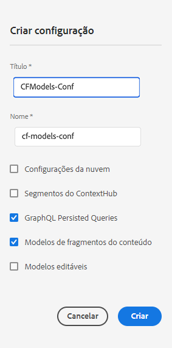

# Fragmentos de conteúdo — Navegador de configuração{#content-fragments-configuration-browser}

Saiba como ativar funcionalidades específicas do fragmento de conteúdo no navegador de configuração.

## Ativar a funcionalidade de fragmento de conteúdo para sua instância {#enable-content-fragment-functionality-instance}

Antes de usar fragmentos de conteúdo, você deve usar **Navegador de configuração** para ativar:

* **Modelos de fragmentos de conteúdo** (obrigatório)
* **Consultas GraphQL persistidas** - opcional

>[!CAUTION]
>
>Se você não ativar os **modelos de fragmentos de conteúdo**:
>
>* o **Criar** opção não está disponível para criar modelos.
>* você não pode [selecione a configuração Sites para criar o ponto de extremidade relacionado](/help/headless/graphql-api/graphql-endpoint.md).

Para ativar a funcionalidade de fragmento de conteúdo, você deve fazer o seguinte:

* Ativar o uso da funcionalidade de fragmento de conteúdo por meio do navegador de configuração
* Aplicar a configuração à sua pasta de ativos

### Ativar a funcionalidade de fragmento de conteúdo no navegador de configuração {#enable-content-fragment-functionality-in-configuration-browser}

Para usar determinados [Funcionalidade Fragmento de conteúdo](#creating-a-content-fragment-model), você **deve** primeiro ative-os por meio da **Navegador de configuração**:

>[!NOTE]
>
>Para obter mais detalhes, consulte [Navegador de configuração](/help/implementing/developing/introduction/configurations.md#using-configuration-browser).

>[!NOTE]
>
>[Subconfigurações](/help/implementing/developing/introduction/configurations.md#configuration-resolution) (uma configuração aninhada em outra configuração) são totalmente compatíveis com o uso de fragmentos de conteúdo, modelos de fragmento de conteúdo e consultas do GraphQL.
>
>Apenas observe que:
>
>
>* Depois de criar modelos em uma subconfiguração, NÃO é possível mover ou copiar o modelo para outra subconfiguração.
>
>* Um endpoint do GraphQL (ainda) se baseia em uma configuração principal (raiz).
>
>* As consultas persistentes são (ainda) salvas relevantes para a configuração principal (raiz).

1. Navegue até **Ferramentas**, **Geral**, e abra o **Navegador de configuração**.

1. Selecione **Criar** para abrir a caixa de diálogo, onde você:

   1. Especifica um **Título**.
   1. A variável **Nome** torna-se o nome do nó no repositório.
      * Ela é gerada automaticamente com base no título e ajustada de acordo com [Convenções de nomenclatura do AEM](/help/implementing/developing/introduction/naming-conventions.md).
      * Você pode ajustá-lo se necessário.
   1. Para permitir seu uso, selecione
      * **Modelos de fragmentos do conteúdo**
      * **Consultas GraphQL persistidas**

      

1. Selecione **Criar** para salvar a definição.

<!-- 1. Select the location appropriate to your website. -->

### Aplicar a configuração à sua pasta {#apply-the-configuration-to-your-folder}

Quando a configuração **global** estiver ativada para a funcionalidade de fragmento de conteúdo, ela se aplica a qualquer pasta de ativos acessível por meio do **Assets** console.

Para usar outras configurações (ou seja, excluindo globais) com uma pasta do Assets comparável, é necessário definir a conexão. Essa conexão é feita selecionando o **Configuração** no **Cloud Services** guia do **Propriedades da pasta** da pasta apropriada.

