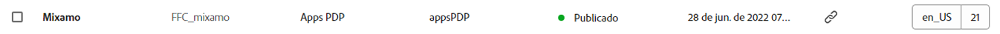

# Console de fragmentos de conteúdo  {#content-fragments-console}

Saiba como o Console de fragmentos de conteúdo otimiza o acesso aos fragmentos de conteúdo, ajudando você a criá-los, pesquisá-los e gerenciá-los realizando ações administrativas como publicar, desfazer a publicação e copiar.

O Console de fragmentos de conteúdo é dedicado ao gerenciamento, pesquisa e criação de fragmentos de conteúdo. Ele foi otimizado para uso em um contexto headless, mas também é usado ao criar fragmentos de conteúdo para uso na criação de páginas.

>[!NOTE]
>
>Esse console só exibe fragmentos de conteúdo. Ele não exibe outros tipos de ativos como imagens e vídeos.

>[!NOTE]
>
>No momento, o acesso aos fragmentos de conteúdo é possível através:
>
>* deste console de **Fragmentos de conteúdo**
>* do console de **Ativos** — consulte [Gerenciamento de fragmentos de conteúdo](/help/assets/content-fragments/content-fragments-managing.md)

>[!NOTE]
>
>Uma seleção de [atalhos de teclado estão disponíveis para uso neste console](/help/sites-cloud/administering/content-fragments/content-fragments-console-keyboard-shortcuts.md).

>[!NOTE]
>
>A equipe do projeto pode personalizar o console, se necessário. Consulte [Personalização do Console de Fragmentos de conteúdo](/help/implementing/developing/extending/content-fragment-console-customizing.md) para obter mais detalhes.

O Console de fragmentos de conteúdo pode ser acessado diretamente do nível superior da navegação global:

## Estrutura básica e manuseio do console {#basic-structure-handling-content-fragments-console}

Selecionar **Fragmentos de conteúdo** abrirá o console em uma nova guia.

Aqui você pode ver três áreas principais:

* A barra de ferramentas superior
   * Fornece a funcionalidade padrão do AEM
   * Também mostra sua organização IMS
* O painel esquerdo
   * Aqui você pode ocultar ou revelar a árvore de pastas
   * É possível selecionar uma ramificação específica da árvore
   * Isso pode ser redimensionado para mostrar pastas aninhadas
* O painel principal/direito; aqui, você pode:
   * Consultar a lista de todos os fragmentos de conteúdo na ramificação selecionada da árvore:
      * A localização é indicada pela navegação estrutural; elas também podem ser usadas para alterar a localização
      * Os fragmentos de conteúdo da pasta selecionada e de todas as pastas derivadas serão mostrados:
         * [Vários campos de informação](#selectuse-available-columns) sobre um Fragmento do conteúdo fornecem links. Dependendo do campo, eles podem:
            * Abrir o fragmento apropriado no editor
            * Mostrar informações sobre referências
            * Mostrar informações sobre versões de idioma do fragmento
      * Ao usar o mouse sobre os cabeçalhos da coluna, um seletor de ação suspenso e os controles deslizantes de largura serão mostrados. Isso permite:
         * Classificar - selecione a ação apropriada para crescente ou decrescente. Essa opção classificará toda a tabela de acordo com essa coluna. A classificação só está disponível nas colunas apropriadas.
         * Redimensionar a coluna - usando os controles deslizantes de ação ou largura
      * É possível [selecionar um ou mais Fragmentos de conteúdo para mostrar as ações disponíveis](#actions-selected-content-fragment)
   * **[Criar](#creating-new-content-fragment)** um novo fragmento de conteúdo
   * [Filtrar](#filtering-fragments) os fragmentos de conteúdo de acordo com uma seleção de predicados e salvar o filtro para uso futuro
   * [Pesquisar](#searching-fragments) os fragmentos de conteúdo
   * [Personalizar a visualização da tabela para mostrar as colunas de informações selecionadas](#select-available-columns)
   * Usar o recurso **Abrir no Assets** para abrir o local atual diretamente no console de **Ativos**

      >[!NOTE]
      >
      >O console de **Ativos** é usado para acessar ativos, como imagens, vídeos etc.  Esse console pode ser acessado:
      >
      >* usando o link **Abrir no Assets** (no Console de fragmentos de conteúdo)
      >* diretamente do painel de navegação global

## Ações para um Fragmento de conteúdo (selecionado) {#actions-selected-content-fragment}

Selecionar um fragmento específico abrirá uma barra de ferramentas focada nas ações disponíveis para esse fragmento. Também é possível selecionar vários fragmentos; a seleção de ações será ajustada de acordo.

* **Abrir**
* **Publicar** (e **Desfazer publicação**)
* **Copiar**
* **Mover**
* **Renomeie**
* **Excluir**

>[!NOTE]
>
>Ações como Publicar, Desfazer publicação, Excluir, Mover, Renomear e Copiar acionam um processo assíncrono. O progresso desse processo pode ser monitorado por meio da interface de processos assíncronos do AEM.

## As informações fornecidas sobre os seus Fragmentos de conteúdo {#information-content-fragments}

O painel principal/direito (exibição de tabela) do console fornece uma variedade de informações sobre os Fragmentos de conteúdo. Alguns itens também fornecem links diretos para outras ações e/ou informações:

* **Nome**
   * Fornece um link para abrir o fragmento no editor.
* **Modelo**
   * Fornece um link para abrir o fragmento no editor.
* **Pasta**
   * Fornece um link para abrir a pasta no console.
Passar o mouse sobre o nome da pasta mostrará o caminho JCR.
* **Status**
   * Somente informações
* **Modificado**
   * Somente informações
* **Modificado por**
   * Somente informações
* **Publicado em**
   * Somente informações
* **Publicado por**
   * Somente informações
* **Referenciado por**

   * Fornece um link que abre uma caixa de diálogo listando todas as referências principais desse fragmento; incluindo as referências a Fragmentos de conteúdo, Fragmentos de experiência e páginas. Para abrir uma referência específica, clique no botão **Título** na caixa de diálogo.

      

* **Idioma**

   * Indica a localidade do fragmento de conteúdo, juntamente com o número total de localidades/cópias de idioma associadas ao fragmento de conteúdo.

      

      * Clique/toque na contagem para abrir uma caixa de diálogo que exibe todas as cópias de idioma. Para abrir uma cópia de idioma específica, clique no botão **Título** na caixa de diálogo.

         

## Selecionar as colunas disponíveis {#select-available-columns}

Assim como em outros consoles, você pode configurar as colunas que estão visíveis e disponíveis para ação:

Isso apresentará uma lista de colunas que você pode ocultar ou mostrar:

## Criar um novo fragmento de conteúdo {#creating-new-content-fragment}

Selecionar **Criar** abre a caixa de diálogo compacta **Novo fragmento de conteúdo**:

## Filtrar fragmentos {#filtering-fragments}

O painel Filtro oferece:

* uma seleção de predicados; um ou mais predicados podem ser selecionados e combinados para criar o filtro
* a oportunidade de **Salvar** sua configuração
* a opção de recuperar um filtro de pesquisa salvo para reutilização

### Filtragem rápida {#fast-filtering}

Você também pode selecionar um predicado clicando em um valor de coluna específico na lista. Você pode selecionar um ou mais valores para combinar predicados.

Por exemplo, selecione **Publicado** no **Status** coluna:

>[!NOTE]
>
>A filtragem rápida só é compatível com o **Modelo**, **Status**, **Modificado por** e **Publicado por** colunas.

Uma vez selecionado, isso será mostrado como um predicado de filtro, e a lista será filtrada adequadamente:

## Pesquisar fragmentos {#searching-fragments}

A caixa de pesquisa é compatível com a pesquisa de texto completo. Inserir seus termos de pesquisa na caixa de pesquisa:

Fornecerá os resultados selecionados:

A caixa de pesquisa também fornece acesso rápido aos **Fragmentos de conteúdo recentes** e às **Pesquisas salvas**:

