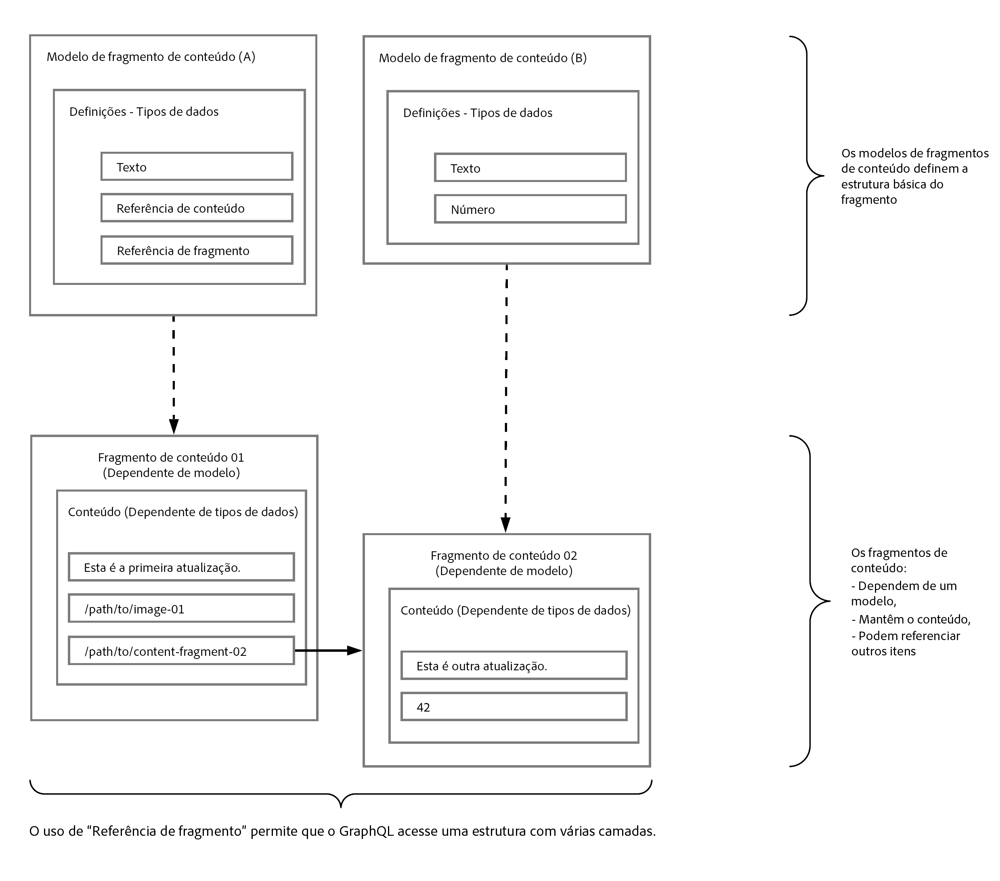

# Entrega de conteúdo headless usando fragmentos de conteúdo com GraphQL {#headless-content-delivery-using-content-fragments-with-graphQL}

Com os fragmentos de conteúdo e a API GraphQL, é possível usar o Adobe Experience Manager (AEM) as a Cloud Service como um sistema de gerenciamento de conteúdo (CMS) headless.

Isso é feito usando fragmentos de conteúdo em conjunto com a API GraphQL do AEM (uma implementação personalizada, com base no GraphQL padrão), para fornecer conteúdo estruturado para uso em seus aplicativos de forma headless. A capacidade de personalizar uma única consulta de API permite recuperar e entregar o conteúdo específico que você deseja/precisa renderizar (como resposta à consulta de API).

>[!NOTE]
>
>Consulte também:
>
>* [O que é Headless?](/help/headless/what-is-headless.md) para obter uma introdução a conceitos e terminologia sobre headless.
>
>* [Headless e AEM](/help/headless/introduction.md) para obter uma introdução ao desenvolvimento headless no AEM Sites as a Cloud Service.

>[!NOTE]
>
>O GraphQL é usado atualmente em dois cenários (separados) no Adobe Experience Manager (AEM) as a Cloud Service:
>
>* [O AEM Commerce consome dados de uma plataforma de comércio por meio do GraphQL](/help/commerce-cloud/integrating/magento.md).
>* [Fragmentos de conteúdo do AEM trabalham em conjunto com a API GraphQL do AEM (uma implementação personalizada, com base no GraphQL padrão), para fornecer conteúdo estruturado para uso em seus aplicativos](/help/headless/graphql-api/content-fragments.md).

## CMS headless {#headless-cms}

Um Sistema de gerenciamento de conteúdo sem cabeçalho (CMS) é um sistema de gerenciamento de conteúdo somente de back-end, projetado e criado explicitamente como um repositório de conteúdo que torna o conteúdo acessível por meio de uma API, para exibição em qualquer dispositivo.

Em termos de criação de fragmentos de conteúdo no AEM, isso significa que:

* É possível usar fragmentos de conteúdo para criar um conteúdo que não é inicialmente destinado a ser publicado diretamente (1:1) em páginas formatadas.

* O conteúdo dos fragmentos de conteúdo será estruturado de maneira predeterminada, de acordo com os Modelos de fragmento de conteúdo. Isso simplifica o acesso para os seus aplicativos, que processarão ainda mais seu conteúdo.

## GraphQL - Uma visão geral {#graphql-overview}

O GraphQL é:

* “*...um idioma de consulta para APIs e um tempo de execução para realizar essas consultas com seus dados existentes.*”.

   Consulte [GraphQL.org](https://graphql.org)

A [API GraphQL do AEM](#aem-graphql-api) permite realizar consultas (complexas) nos [fragmentos de conteúdo](/help/sites-cloud/administering/content-fragments/content-fragments.md); cada uma dessas consultas está de acordo com um tipo de modelo específico. O conteúdo retornado pode ser usado pelos seus aplicativos.

## API GraphQL do AEM {#aem-graphql-api}

Para o Adobe Experience as a Cloud Experience, uma implementação personalizada da API GraphQL padrão foi desenvolvida. Consulte [API GraphQL do AEM para uso com fragmentos de conteúdo](/help/headless/graphql-api/content-fragments.md) para obter detalhes.

A implementação da API GraphQL do AEM é baseada nas [bibliotecas GraphQL do Java](https://graphql.org/code/#java).

## Fragmentos de conteúdo para uso com a API GraphQL do AEM {#content-fragments-use-with-aem-graphql-api}

Os [fragmentos de conteúdo](#content-fragments) podem ser usados como base para o GraphQL em consultas do AEM, pois:

* Permitem projetar, criar, preparar e publicar conteúdo independente de páginas.
* Os [Modelos de fragmentos do conteúdo](#content-fragments-models) fornecem a estrutura necessária por meio de tipos de dados definidos.
* A [referência do fragmento](#fragment-references), disponível ao definir um modelo, pode ser usada para definir camadas adicionais de estrutura.

### Fragmentos de conteúdo {#content-fragments}

Fragmentos de conteúdo:

* Contêm conteúdo estruturado.

* Baseiam-se em um [Modelo de fragmento de conteúdo](#content-fragments-models), que predefine a estrutura do fragmento resultante.

### Modelos de fragmentos do conteúdo {#content-fragments-models}

Esses [Modelos de fragmento de conteúdo](/help/sites-cloud/administering/content-fragments/content-fragments-models.md):

* São usados para gerar os [Esquemas](https://graphql.org/learn/schema/), uma vez **Ativados**.

* Fornecem os tipos de dados e campos necessários para o GraphQL. Garantem que seu aplicativo solicite apenas o que é possível e receba o que é esperado.

* O tipo de dados **[Referências de fragmento](#fragment-references)** pode ser usado no modelo para fazer referência a outro fragmento de conteúdo e, assim, introduzir níveis adicionais de estrutura.

### Referências do fragmento {#fragment-references}

A **[Referência do fragmento](/help/sites-cloud/administering/content-fragments/content-fragments-models.md#fragment-reference-nested-fragments)**:

* É particularmente interessante em conjunto com o GraphQL.

* É um tipo de dados específico que pode ser usado ao definir um Modelo de fragmento de conteúdo.

* Faz referência a outro fragmento, dependente de um Modelo de fragmento de conteúdo específico.

* Permite recuperar dados estruturados.

   * Quando definido como **multifeed**, vários fragmentos secundários podem ser referenciados (recuperados) pelo fragmento principal.

### Visualização JSON {#json-preview}

Para ajudar a projetar e desenvolver os Modelos de fragmentos de conteúdo, você pode visualizar a [saída JSON](/help/sites-cloud/administering/content-fragments/content-fragments-json-preview.md).

## Saiba como usar o GraphQL com o AEM - Exemplos de conteúdo e consultas {#learn-graphql-with-aem-sample-content-queries}

Consulte [Saiba como usar o GraphQL com o AEM - Exemplos de conteúdo e consultas](/help/headless/graphql-api/sample-queries.md) para obter uma introdução sobre o uso da API GraphQL do AEM.

## Tutorial - Introdução ao AEM Headless e GraphQL

Procurando um tutorial prático? Veja o tutorial completo de [Introdução ao AEM Headless e GraphQL](https://experienceleague.adobe.com/docs/experience-manager-learn/getting-started-with-aem-headless/graphql/overview.html?lang=pt-BR) que ilustra como criar e expor conteúdo usando as APIs GraphQL do AEM e consumi-lo por meio de um aplicativo externo, em um cenário de CMS headless.
