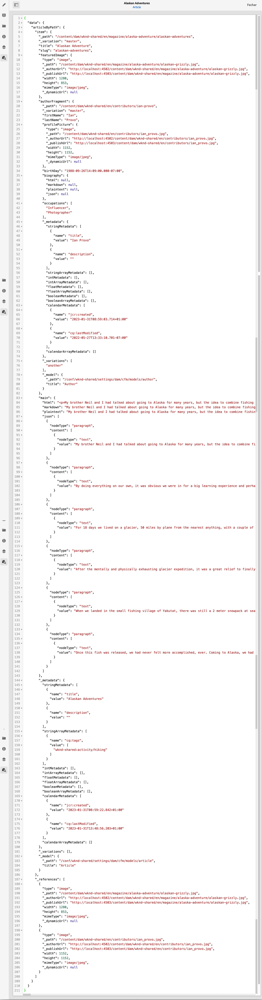

# Visualização - Representação JSON {#preview-json-representation}

Ao desenvolver os modelos para fragmentos de conteúdo como parte de sua implementação do AEM Headless, você pode querer visualizar uma amostra da saída em JSON para um fragmento de conteúdo, conforme baseada em um modelo. Por exemplo, para ter uma ideia de como a saída final será. Isso pode ser útil ao validar a estrutura JSON do modelo, talvez com conteúdo de amostra padrão por tipo de dados.

Ao usar o ícone **Visualizar**:

É possível visualizar a representação em JSON do fragmento atual. Por exemplo:

