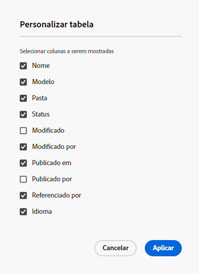
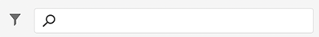
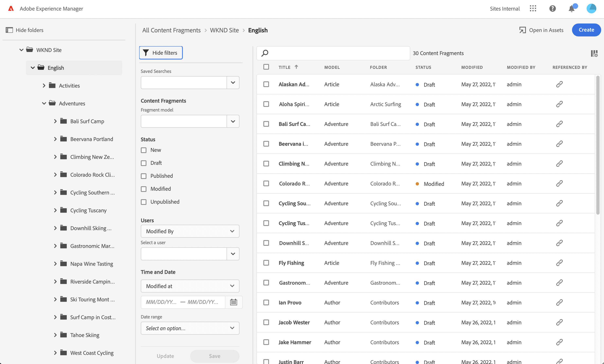

# Gerenciamento dos fragmentos de conteúdo {#managing-content-fragments}

Saiba como usar o **Fragmentos de conteúdo** para gerenciar os Fragmentos do conteúdo do AEM. Eles podem ser usados para a criação de página ou como base do seu conteúdo sem periféricos.

Depois de definir o [Modelos de fragmentos do conteúdo](#creating-a-content-model) você pode usá-los para [criar os Fragmentos do conteúdo](#creating-a-content-fragment).

O [Editor de fragmentos de conteúdo](#opening-the-fragment-editor) fornece vários [modos](#modes-in-the-content-fragment-editor) para permitir:

* [Editar o conteúdo](#editing-the-content-of-your-fragment) e [gerenciar variações](#creating-and-managing-variations-within-your-fragment)
* [Anotar em seu fragmento](/help/sites-cloud/administering/content-fragments/content-fragments-variations.md#annotating-a-content-fragment)
* [Associar conteúdo ao fragmento](#associating-content-with-your-fragment)
* [Configurar os metadados](#viewing-and-editing-the-metadata-properties-of-your-fragment)
* [Exibir a árvore de estrutura](/help/sites-cloud/administering/content-fragments/content-fragments-structure-tree.md)
* [Visualizar a representação JSON](/help/sites-cloud/administering/content-fragments/content-fragments-json-preview.md)

>[!NOTE]
>
>Fragmentos de conteúdo podem ser usados:
>
>* ao criar páginas; see [Criação de página com fragmentos de conteúdo](/help/sites-cloud/authoring/fundamentals/content-fragments.md).
>* para [Entrega de conteúdo sem cabeçalho usando Fragmentos de conteúdo com GraphQL](/help/sites-cloud/administering/content-fragments/content-fragments-graphql.md).

>[!NOTE]
>
>Fragmentos de conteúdo são armazenados como **Ativos**. Eles são gerenciados principalmente pelo **Fragmentos de conteúdo** , mas também pode ser gerenciado no **Ativos** console.

## Criação de fragmentos de conteúdo {#creating-content-fragments}

### Criação de um modelo de conteúdo {#creating-a-content-model}

[Modelos de fragmento de conteúdo](/help/sites-cloud/administering/content-fragments/content-fragments-models.md) podem ser ativados e criados, antes da criação de fragmentos de conteúdo com conteúdo estruturado.

### Criação de um fragmento de conteúdo {#creating-a-content-fragment}

Para criar um fragmento de conteúdo:

1. No **Fragmentos de conteúdo** , selecione **Criar** (canto superior direito).

   >[!NOTE]
   >
   >Para predefinir o local do novo fragmento, você pode navegar até a pasta onde deseja criar o fragmento ou especificar o local durante o processo de criação.

1. O **Novo fragmento de conteúdo** será aberta, nele é possível especificar:

   * **Localização** - será preenchido automaticamente com o local atual, mas você pode selecionar um local diferente, se necessário
   * **Modelo de fragmento de conteúdo** - selecione o modelo a ser usado como base do fragmento na lista suspensa
   * **Título**
   * **Nome** - será preenchido automaticamente com base no **Título**, mas você pode editá-la, se necessário
   * **Descrição**

   

1. Selecionar **Criar** ou **Criar e abrir** para manter sua definição.

## Status dos fragmentos de conteúdo {#statuses-content-fragments}

Durante sua existência, um Fragmento de conteúdo pode ter vários status, como mostrado na variável [Console do fragmento do conteúdo](/help/sites-cloud/administering/content-fragments/content-fragments-console.md):

* **Novo**
Um novo Fragmento de conteúdo foi criado, mas nunca foi editado ou aberto, no editor Fragmento de conteúdo.
* **Rascunho**
Alguém editou ou abriu o (novo) Fragmento de conteúdo no Editor de fragmento de conteúdo - mas ele ainda não foi publicado.
* **Publicado**
O Fragmento do conteúdo foi publicado.
* **Modificado**
O Fragmento do conteúdo foi editado após sua publicação (mas antes da publicação da modificação).
* **Não publicado**
A publicação do Fragmento do conteúdo foi cancelada.

## Ações para um fragmento de conteúdo no console Fragmentos de conteúdo {#actions-content-fragment-console}

No **Fragmentos de conteúdo** no console, uma variedade de ações está disponível para seus fragmentos de conteúdo na barra de ferramentas:

* **Abrir em ativos**
* **Criar**
* O **Referenciado por** coluna também fornece um link direto para mostrar todas as referências principais desse fragmento; incluindo a referência a Fragmentos de conteúdo, Fragmentos de experiência e páginas.
* Passar o mouse sobre o nome da pasta mostrará o caminho JCR.

Após a seleção do fragmento, todas as ações apropriadas estarão disponíveis:

* **Abrir**
* **Publicar** e **Cancelar publicação**)
* **Copiar**
* **Mover**
* **Renomeie**
* **Excluir**

>[!NOTE]
>
>Ações como Publicar, Cancelar publicação, Excluir, Mover, Renomear, Copiar, acionam um trabalho assíncrono. O progresso desse trabalho pode ser monitorado por meio da interface do usuário de trabalhos assíncronos AEM.

## Personalização da visualização no console Fragmentos de conteúdo {#viewing-content-fragment-console}

O console mostra informações sobre os fragmentos de conteúdo - na pasta atual e em todas as pastas filhas.

Você pode personalizar as informações mostradas usando o **Personalizar tabela** ícone :

Isso abrirá o **Personalizar tabela** , onde é possível selecionar/desmarcar as colunas disponíveis:

## Pesquisar e filtrar no console Fragmentos de conteúdo {#search-filter-content-fragment-console}

Você pode pesquisar e/ou filtrar os Fragmentos de conteúdo a serem exibidos no console.

É possível:

* selecione a pasta necessária
* selecione os filtros com o **Mostrar filtros** e use a caixa de pesquisa em paralelo:

Uma seleção de filtros está disponível:

A combinação de filtros e pesquisa também pode ser salva para referência posterior.

## Abrir o Editor de fragmentos {#opening-the-fragment-editor}

Para abrir o fragmento para edição:

>[!CAUTION]
>
>Para editar um fragmento de conteúdo, você precisa [as permissões apropriadas](/help/implementing/developing/extending/content-fragments-customizing.md#asset-permissions). Entre em contato com o administrador do sistema em caso de problemas.

1. Use o **Fragmentos de conteúdo** para navegar até o local do fragmento de conteúdo.
1. Abra o fragmento para edição, selecionando o fragmento e **Abrir** na barra de ferramentas.

1. O editor de fragmentos será aberto. Faça as alterações necessárias:

   

1. Depois de fazer alterações, use **Salvar**, **Salvar e fechar** ou **Fechar** conforme necessário.

   >[!NOTE]
   >
   >**Salvar e fechar** está disponível por meio do **Salvar** lista suspensa.

   >[!NOTE]
   >
   >Ambos **Salvar e fechar** e **Fechar** sairá do editor - consulte [Salvar, fechar e versões](#save-close-and-versions) para obter informações completas sobre como as várias opções operam para fragmentos de conteúdo.

## Modos e ações no Editor de fragmento de conteúdo {#modes-actions-content-fragment-editor}

Há vários modos e ações disponíveis no Editor de fragmentos de conteúdo.

### Modos no Editor de fragmento de conteúdo {#modes-in-the-content-fragment-editor}

Navegue pelos vários modos usando os ícones no painel lateral:

* Variações: [Edição de conteúdo](#editing-the-content-of-your-fragment) e [Gerenciamento de variações](#creating-and-managing-variations-within-your-fragment)

* [Anotações](/help/sites-cloud/administering/content-fragments/content-fragments-variations.md#annotating-a-content-fragment)
* [Conteúdo associado](#associating-content-with-your-fragment)
* [Metadados](#viewing-and-editing-the-metadata-properties-of-your-fragment)
* [Árvore de estrutura](/help/sites-cloud/administering/content-fragments/content-fragments-structure-tree.md)
* [Visualizar](/help/sites-cloud/administering/content-fragments/content-fragments-json-preview.md)

### Ações da barra de ferramentas no Editor de fragmentos de conteúdo {#toolbar-actions-in-the-content-fragment-editor}

Alguns recursos na barra de ferramentas superior estão disponíveis em vários modos:

* Uma mensagem será exibida quando o fragmento já estiver referenciado em uma página de conteúdo. Você pode **Fechar** a mensagem.

* O painel lateral pode ser oculto/exibido usando o **Alternar painel lateral** ícone .

* Sob o nome do fragmento, você pode ver o nome do [Modelo de fragmento de conteúdo](/help/sites-cloud/administering/content-fragments/content-fragments-models.md) usado para criar o fragmento atual:

   * O nome também é um link que abrirá o editor de modelo.

* Ver o status do fragmento; por exemplo, informações sobre quando foi criado, modificado ou publicado. O status também é codificado por cores:

   * **Novo**: cinza
   * **Rascunho**: azul
   * **Publicado**: verde
   * **Modificado**: laranja
   * **Desativado**: vermelho

* **Salvar** fornece acesso ao **Salvar e fechar** opção.

* Os três pontos (**...**) fornece acesso a ações adicionais:
   * **Atualizar referências de página**
      * Isso atualiza todas as referências de página.
   * **[Publicação rápida](#publishing-and-referencing-a-fragment)**
   * **[Gerenciar publicação](#publishing-and-referencing-a-fragment)**

<!--
This updates any page references and ensures that the Dispatcher is flushed as required. -->

## Salvar, fechar e versões {#save-close-and-versions}

>[!NOTE]
>
>As versões também podem ser [criado, comparado e revertido a partir da Linha do tempo](/help/sites-cloud/administering/content-fragments/content-fragments-managing.md#timeline-for-content-fragments).

O editor tem várias opções:

* **Salvar** e **Salvar e fechar**

   * **Salvar** O salvará as alterações mais recentes e permanecerá no editor.
   * **Salvar e fechar** O salvará as alterações mais recentes e sairá do editor.

   >[!CAUTION]
   >
   >Para editar um fragmento de conteúdo, você precisa [as permissões apropriadas](/help/implementing/developing/extending/content-fragments-customizing.md#asset-permissions). Entre em contato com o administrador do sistema em caso de problemas.

   >[!NOTE]
   >
   >É possível permanecer no editor, fazendo uma série de alterações, antes de salvar.

   >[!CAUTION]
   >
   >Além de simplesmente salvar suas alterações, as ações também atualizam quaisquer referências e garantem que o Dispatcher seja liberado conforme necessário. Essas alterações podem levar tempo para serem processadas. Devido a isso, pode haver um impacto no desempenho de um sistema grande/complexo/com carga intensa.
   >
   >Lembre-se disso ao usar **Salvar e fechar** e, em seguida, insira novamente rapidamente o editor de fragmentos para fazer e salvar mais alterações.

* **Fechar**

   Sairá do editor sem salvar as alterações mais recentes (ou seja, feitas desde a última **Salvar**).

Ao editar o fragmento de conteúdo, o AEM cria automaticamente versões para garantir que o conteúdo anterior possa ser restaurado se você cancelar as alterações (usando **Fechar** sem salvar):

1. Quando um fragmento de conteúdo é aberto para edição, o AEM verifica a existência do token baseado em cookie que indica se uma *sessão de edição* existe:

   1. Se o token for encontrado, o fragmento será considerado parte da sessão de edição existente.
   2. Se o token for *not* disponível e o usuário inicia a edição de conteúdo, uma versão é criada e um token para essa nova sessão de edição é enviado ao cliente, onde é salvo em um cookie.

2. Enquanto há um *ative* sessão de edição, o conteúdo que está sendo editado é automaticamente salvo a cada 600 segundos (padrão).

   >[!NOTE]
   >
   >O intervalo de salvamento automático pode ser configurado usando o `/conf` mecanismo.
   >
   >Valor padrão, consulte:
   >  `/libs/settings/dam/cfm/jcr:content/autoSaveInterval`

3. Se o usuário cancelar a edição, a versão criada no início da sessão de edição será restaurada e o token será removido para encerrar a sessão de edição.
4. Se o usuário selecionar **Salvar** as edições, os elementos/variações atualizados são persistentes e o token é removido para encerrar a sessão de edição.

## Edição do conteúdo do fragmento {#editing-the-content-of-your-fragment}

Após abrir o fragmento, é possível usar a variável [Variações](/help/sites-cloud/administering/content-fragments/content-fragments-variations.md) para criar o conteúdo.

## Criação e gerenciamento de variações dentro do fragmento {#creating-and-managing-variations-within-your-fragment}

Depois de criar o conteúdo Principal, você pode criar e gerenciar, [Variações](/help/sites-cloud/administering/content-fragments/content-fragments-variations.md) desse conteúdo.

## Associar conteúdo ao fragmento {#associating-content-with-your-fragment}

Você também pode [conteúdo associado](/help/sites-cloud/administering/content-fragments/content-fragments-assoc-content.md) com um fragmento. Isso fornece uma conexão para que os ativos (ou seja, imagens) possam ser usados (opcionalmente) com o fragmento quando ele é adicionado a uma página de conteúdo.

## Visualização e edição dos metadados (propriedades) do fragmento {#viewing-and-editing-the-metadata-properties-of-your-fragment}

É possível exibir e editar as propriedades de um fragmento usando a variável [Metadados](/help/sites-cloud/administering/content-fragments/content-fragments-metadata.md) guia .

## Publicação e referência a um fragmento {#publishing-and-referencing-a-fragment}

>[!CAUTION]
Se o fragmento for baseado em um modelo, você deve garantir que a variável [o modelo foi publicado](/help/sites-cloud/administering/content-fragments/content-fragments-models.md#publishing-a-content-fragment-model).
Se você publicar um fragmento de conteúdo para o qual o modelo ainda não foi publicado, uma lista de seleção indicará isso e o modelo será publicado com o fragmento.

Os Fragmentos de conteúdo devem ser publicados para uso no ambiente de publicação. Isso é feito usando a funcionalidade padrão do Assets

* No **Publicar** na barra de ferramentas do [Console Fragmentos de conteúdo](#actions-content-fragment-console)
   * **Agora** - após confirmação, o fragmento será publicado imediatamente
   * **Agendar** - é possível selecionar a data e a hora em que o fragmento será publicado

   Quando necessário, será necessário especificar a variável **Data de ativação** e quais referências para publicar. Por exemplo:
   

* No [Editor de fragmentos de conteúdo](#toolbar-actions-in-the-content-fragment-editor)
   * [**Publicação rápida**](/help/assets/manage-publication.md#quick-publish)
   * [**Gerenciar publicação**](/help/assets/manage-publication.md#manage-publication)

Além disso, ao [publicar uma página que use o fragmento](/help/sites-cloud/authoring/fundamentals/content-fragments.md#publishing); o fragmento será listado nas referências da página.

>[!CAUTION]
Depois que um fragmento tiver sido publicado e/ou referenciado, AEM exibirá um aviso quando um autor abrir o fragmento para edição novamente. Isso serve para avisar que as alterações no fragmento também afetarão as páginas referenciadas.

## Desfazer a publicação de um fragmento {#unpublishing-a-fragment}

Para cancelar a publicação de Fragmentos de conteúdo, selecione um ou mais fragmentos e **Cancelar publicação**.

>[!NOTE]
O **Cancelar publicação** estará visível quando os fragmentos publicados estiverem disponíveis.

>[!CAUTION]
Se o fragmento já estiver referenciado a partir de outro fragmento, ou de uma página, você verá uma mensagem de aviso e será solicitado a confirmar que deseja continuar.

## Excluir um fragmento {#deleting-a-fragment}

Para excluir um fragmento:

1. No **Fragmentos de conteúdo** console navegue até o local do fragmento de conteúdo.
2. Selecione o fragmento.

   >[!NOTE]
   O **Excluir** não está disponível como uma ação rápida.

3. Selecionar **Excluir** na barra de ferramentas.
4. Confirme o **Excluir** ação.

   >[!CAUTION]
   Se o fragmento já estiver referenciado a partir de outro fragmento, ou de uma página, você verá uma mensagem de aviso e será solicitado a confirmar que deseja continuar com uma **Forçar exclusão**. O fragmento, junto com seu componente do fragmento de conteúdo, será excluído de qualquer página de conteúdo.

## Linha do tempo dos fragmentos de conteúdo {#timeline-for-content-fragments}

>[!NOTE]
Essa funcionalidade só está disponível no **Ativos** console

Além das opções padrão, [Linha do tempo](/help/assets/manage-digital-assets.md#timeline) fornece informações e ações específicas para fragmentos de conteúdo:

* Exibir informações sobre versões, comentários e anotações
* Ações para versões

   * **[Reverter para esta versão](#reverting-to-a-version)** (selecione um fragmento existente e, em seguida, uma versão específica)

   * **[Comparar com Atual](#comparing-fragment-versions)** (selecione um fragmento existente e, em seguida, uma versão específica)

   * Adicione um **Rótulo** e/ou **Comentário** (selecione um fragmento existente e, em seguida, uma versão específica)

   * **Salvar como versão** (selecione um fragmento existente, em seguida, a seta para cima na parte inferior da Linha do tempo)

* Ações para anotações

   * **Excluir**

>[!NOTE]
Os comentários são:
* Funcionalidade padrão para todos os ativos
* Feito na Linha do Tempo
* Relacionado ao ativo de fragmento
>
As anotações (para Fragmentos de conteúdo) são:
* Inserido no editor de fragmentos
* Específico de um segmento selecionado de texto no fragmento
>

Por exemplo:

## Comparação de versões do fragmento {#comparing-fragment-versions}

>[!NOTE]
Essa funcionalidade só está disponível no **Ativos** console

O **Comparar com Atual** está disponível no [Linha do tempo](/help/sites-cloud/administering/content-fragments/content-fragments-managing.md#timeline-for-content-fragments) após selecionar uma versão específica.

Isso abrirá:

* o **Atual** (mais recente) versão (à esquerda)

* a versão selecionada **v&lt;*x.y*>** (à direita)

Elas serão mostradas lado a lado, onde:

* Quaisquer diferenças são destacadas

   * Texto excluído - vermelho
   * Texto inserido - verde
   * Texto substituído - azul

* O ícone de tela cheia permite abrir uma versão por conta própria; em seguida, voltar para a exibição paralela
* Você pode **Reverter** da versão específica
* **Concluído** retornará ao console

>[!NOTE]
Não é possível editar o conteúdo do fragmento ao comparar fragmentos.

## Reverter para uma versão  {#reverting-to-a-version}

>[!NOTE]
Essa funcionalidade só está disponível no **Ativos** console

Você pode reverter para uma versão específica do fragmento:

* Diretamente do [Linha do tempo](/help/sites-cloud/administering/content-fragments/content-fragments-managing.md#timeline-for-content-fragments).

   Selecione a versão necessária, em seguida, a **Reverter para esta versão** ação.

* Ao [comparação de uma versão com a versão atual](/help/sites-cloud/administering/content-fragments/content-fragments-managing.md#comparing-fragment-versions) você pode **Reverter** à versão selecionada.

