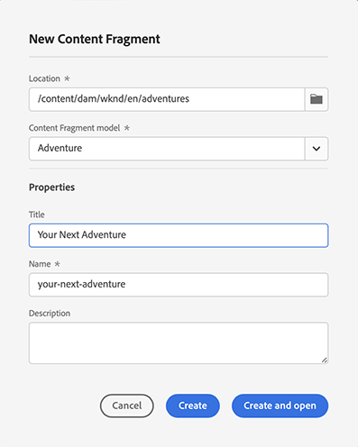

# Gerenciamento dos fragmentos de conteúdo {#managing-content-fragments}

Saiba como usar o console de **Fragmentos de conteúdo** para gerenciar os fragmentos de conteúdo do AEM. Eles podem ser usados para criação de páginas ou como base para o conteúdo headless.

Depois de definir os [Modelos de fragmentos de conteúdo](#creating-a-content-model), você pode usá-los para [criar fragmentos de conteúdo](#creating-a-content-fragment).

O [Editor de fragmentos de conteúdo](#opening-the-fragment-editor) fornece vários [modos](#modes-in-the-content-fragment-editor) para permitir:

* [Editar o conteúdo](#editing-the-content-of-your-fragment) e [gerenciar as variações](#creating-and-managing-variations-within-your-fragment)
* [Anotar em seu fragmento](/help/sites-cloud/administering/content-fragments/content-fragments-variations.md#annotating-a-content-fragment)
* [Associar conteúdo ao fragmento](#associating-content-with-your-fragment)
* [Configurar os metadados](#viewing-and-editing-the-metadata-properties-of-your-fragment)
* [Visualizar a árvore de estrutura](/help/sites-cloud/administering/content-fragments/content-fragments-structure-tree.md)
* [Visualizar a representação JSON](/help/sites-cloud/administering/content-fragments/content-fragments-json-preview.md)

>[!NOTE]
>
>Os fragmentos de conteúdo podem ser usados:
>
>* ao criar páginas; consulte [Criação de páginas com fragmentos de conteúdo](/help/sites-cloud/authoring/fundamentals/content-fragments.md).
>* para [entrega de conteúdo headless usando fragmentos de conteúdo com GraphQL](/help/sites-cloud/administering/content-fragments/content-fragments-graphql.md).

>[!NOTE]
>
>Os fragmentos de conteúdo são armazenados como **Ativos**. Eles são gerenciados principalmente pelo console de **Fragmentos de conteúdo**, mas também podem ser gerenciados no console de **Ativos**.

## O console de Fragmentos de conteúdo {#content-fragments-console}

O console de Fragmentos de conteúdo fornece acesso direto aos seus fragmentos e às tarefas relacionadas. Para mais informações, consulte:

* [Estrutura básica e manuseio do console de Fragmentos de conteúdo](/help/sites-cloud/administering/content-fragments/content-fragments-console.md#basic-structure-handling-content-fragments-console)

* [As informações fornecidas sobre os seus Fragmentos de conteúdo](/help/sites-cloud/administering/content-fragments/content-fragments-console.md#information-content-fragments)

* [Ações para um fragmento de conteúdo no console de Fragmentos de conteúdo](/help/sites-cloud/administering/content-fragments/content-fragments-console.md#actions-selected-content-fragment)

* [Personalizar as colunas disponíveis no console de Fragmentos de conteúdo](/help/sites-cloud/administering/content-fragments/content-fragments-console.md#select-available-columns)

* [Pesquisar e filtrar no Console de fragmentos de conteúdo](/help/sites-cloud/administering/content-fragments/content-fragments-console.md#filtering-fragments)

## Criação de fragmentos de conteúdo {#creating-content-fragments}

### Criação de um modelo de conteúdo {#creating-a-content-model}

Os [modelos de fragmento de conteúdo](/help/sites-cloud/administering/content-fragments/content-fragments-models.md) podem ser ativados e criados antes da criação de fragmentos de conteúdo com conteúdo estruturado.

### Criação de um fragmento de conteúdo {#creating-a-content-fragment}

Para criar um fragmento de conteúdo:

1. No console de **Fragmentos de conteúdo**, selecione **Criar** (canto superior direito).

   >[!NOTE]
   >
   >Para predefinir o local do novo fragmento, você pode navegar até a pasta onde deseja criar o fragmento ou especificar o local durante o processo de criação.

1. A caixa de diálogo **Novo fragmento de conteúdo** será aberta, onde é possível especificar:

   * **Local** — será preenchido automaticamente com o local atual, mas você pode selecionar um local diferente, se necessário
   * **Modelo de fragmento de conteúdo** — selecione o modelo a ser usado como base do fragmento na lista suspensa
   * **Título**
   * **Nome** — será preenchido automaticamente com base no **Título**, mas você pode editá-lo, se necessário
   * **Descrição**

   

1. Selecione **Criar** ou **Criar e abrir** para manter sua definição.

## Status dos fragmentos de conteúdo {#statuses-content-fragments}

Durante sua existência, um fragmento de conteúdo pode ter vários status, como mostrado no [Console de fragmentos de conteúdo](/help/sites-cloud/administering/content-fragments/content-fragments-console.md):

* **Novo**
Um novo fragmento de conteúdo foi criado, mas nunca foi editado ou aberto no editor de fragmentos de conteúdo.
* **Rascunho**
Alguém editou ou abriu o (novo) fragmento de conteúdo no editor de fragmentos de conteúdo, mas não o publicou ainda.
* **Publicado**
O fragmento de conteúdo foi publicado.
* **Modificado**
O fragmento de conteúdo foi editado após a publicação (mas antes da publicação da modificação).
* **Publicação desfeita**
A publicação do fragmento de conteúdo foi desfeita.

## Abrir o editor de fragmentos {#opening-the-fragment-editor}

Para abrir o fragmento para edição:

>[!CAUTION]
>
>Para editar um fragmento de conteúdo, você precisa [das permissões apropriadas](/help/implementing/developing/extending/content-fragments-customizing.md#asset-permissions). Entre em contato com o administrador do sistema em caso de problemas.

1. Use o console de **Fragmentos de conteúdo** para navegar até o local do fragmento de conteúdo.
1. Abra o fragmento para edição, selecionando o fragmento e clicando em **Abrir** na barra de ferramentas.

1. O editor de fragmentos será aberto. Faça as alterações necessárias:

   

1. Depois de fazer as alterações, clique em **Salvar**, **Salvar e fechar** ou **Fechar**, conforme necessário.

   >[!NOTE]
   >
   >**Salvar e fechar** está disponível por meio da lista suspensa **Salvar**.

   >[!NOTE]
   >
   >Tanto a opção **Salvar e fechar** quanto **Fechar** fecharão o editor — consulte [Salvar, fechar e versões](#save-close-and-versions) para obter informações completas sobre como as várias opções operam para os fragmentos de conteúdo.

## Modos e ações no Editor de fragmento de conteúdo {#modes-actions-content-fragment-editor}

Há vários modos e ações disponíveis no Editor de fragmento de conteúdo.

### Modos no Editor de fragmento de conteúdo {#modes-in-the-content-fragment-editor}

Navegue pelos vários modos usando os ícones no painel lateral:

* Variações: [Edição de conteúdo](#editing-the-content-of-your-fragment) e [Gerenciamento de variações](#creating-and-managing-variations-within-your-fragment)

* [Anotações](/help/sites-cloud/administering/content-fragments/content-fragments-variations.md#annotating-a-content-fragment)
* [Conteúdo associado](#associating-content-with-your-fragment)
* [Metadados](#viewing-and-editing-the-metadata-properties-of-your-fragment)
* [Árvore de estrutura](/help/sites-cloud/administering/content-fragments/content-fragments-structure-tree.md)
* [Visualizar](/help/sites-cloud/administering/content-fragments/content-fragments-json-preview.md)

### Ações da barra de ferramentas no Editor de fragmento de conteúdo {#toolbar-actions-in-the-content-fragment-editor}

Alguns recursos na barra de ferramentas superior estão disponíveis em vários modos:

* Uma mensagem será exibida quando o fragmento já tiver sido referenciado em uma página de conteúdo. Você pode **Fechar** a mensagem.

* O painel lateral pode ser oculto/exibido usando o ícone **Ativar painel lateral**.

* Abaixo do nome do fragmento, você pode ver o nome do [Modelo de fragmento de conteúdo](/help/sites-cloud/administering/content-fragments/content-fragments-models.md) usado para criar o fragmento atual:

   * O nome também é um link que abrirá o editor de modelo.

* Veja o status do fragmento; por exemplo, informações sobre quando ele foi criado, modificado ou publicado. O status também é codificado por cores:

   * **Novo**: cinza
   * **Rascunho**: azul
   * **Publicado**: verde
   * **Modificado**: laranja
   * **Desativado**: vermelho

* **Salvar** fornece acesso à opção **Salvar e fechar**.

* O menu suspenso de três pontos (**...**) fornece acesso a ações adicionais:
   * **Atualizar referências de página**
      * Isso atualiza todas as referências de página.
   * **[Publicação rápida](#publishing-and-referencing-a-fragment)**
   * **[Gerenciar publicação](#publishing-and-referencing-a-fragment)**

<!--
This updates any page references and ensures that the Dispatcher is flushed as required. -->

## Salvar, fechar e versões {#save-close-and-versions}

>[!NOTE]
>
>As versões também podem ser [criadas, comparadas e revertidas a partir da linha de tempo](/help/sites-cloud/administering/content-fragments/content-fragments-managing.md#timeline-for-content-fragments).

O editor tem várias opções:

* **Salvar** e **Salvar e fechar**

   * **Salvar** salva as alterações mais recentes e permanece no editor.
   * **Salvar e fechar** salva as alterações mais recentes e fecha o editor.

   >[!CAUTION]
   >
   >Para editar um fragmento de conteúdo, você precisa [das permissões apropriadas](/help/implementing/developing/extending/content-fragments-customizing.md#asset-permissions). Entre em contato com o administrador do sistema em caso de problemas.

   >[!NOTE]
   >
   >É possível permanecer no editor e fazer uma série de alterações antes de salvar.

   >[!CAUTION]
   >
   >Além de simplesmente salvar suas alterações, as ações também atualizam quaisquer referências e garantem que o Dispatcher seja liberado conforme necessário. Essas alterações podem levar tempo para serem processadas. Devido a isso, pode haver um impacto no desempenho de um sistema grande/complexo/com bastante conteúdo.
   >
   >Lembre-se disso ao usar a opção **Salvar e fechar** e, logo em seguida, entrar novamente no editor de fragmentos para fazer mais alterações e salvá-las.

* **Fechar**

   Fechará o editor sem salvar as alterações mais recentes (ou seja, feitas desde o último **Salvamento**).

Ao editar o fragmento de conteúdo, o AEM cria versões automaticamente para garantir que o conteúdo anterior possa ser restaurado se você cancelar as alterações (usando **Fechar** sem salvar):

1. Quando um fragmento de conteúdo é aberto para edição, o AEM verifica a existência do token baseado em cookie que indica se uma *sessão de edição* existe:

   1. Se o token for encontrado, o fragmento será considerado parte da sessão de edição existente.
   2. Se o token *não* estiver disponível e o usuário iniciar a edição do conteúdo, uma versão será criada e um token para essa nova sessão de edição será enviado ao cliente e salvo em um cookie.

2. Enquanto houver uma seção de edição *ativa*, o conteúdo que está sendo editado será salvo automaticamente a cada 600 segundos (padrão).

   >[!NOTE]
   >
   >O intervalo de salvamento automático pode ser configurado usando o mecanismo `/conf`.
   >
   >Valor padrão, consulte:
   >  `/libs/settings/dam/cfm/jcr:content/autoSaveInterval`

3. Se o usuário cancelar a edição, a versão criada no início da sessão de edição será restaurada e o token será removido para encerrar a sessão de edição.
4. Se o usuário escolher **Salvar** as edições, os elementos/variações atualizados serão mantidos e o token será removido para encerrar a sessão de edição.

## Edição do conteúdo do fragmento {#editing-the-content-of-your-fragment}

Após abrir o fragmento, é possível usar a guia [Variações](/help/sites-cloud/administering/content-fragments/content-fragments-variations.md) para criar o conteúdo.

## Criação e gerenciamento de variações dentro do fragmento {#creating-and-managing-variations-within-your-fragment}

Depois de criar o conteúdo Principal, é possível criar e gerenciar [Variações](/help/sites-cloud/administering/content-fragments/content-fragments-variations.md) desse conteúdo.

## Associar conteúdo ao fragmento {#associating-content-with-your-fragment}

Você também pode [associar conteúdo](/help/sites-cloud/administering/content-fragments/content-fragments-assoc-content.md) a um fragmento. Isso fornece uma conexão para que os ativos (por exemplo, imagens) possam ser usados (opcionalmente) com o fragmento quando ele é adicionado a uma página de conteúdo.

## Visualização e edição dos metadados (propriedades) do fragmento {#viewing-and-editing-the-metadata-properties-of-your-fragment}

É possível visualizar e editar as propriedades de um fragmento usando a guia [Metadados](/help/sites-cloud/administering/content-fragments/content-fragments-metadata.md).

## Publicar e referenciar um fragmento {#publishing-and-referencing-a-fragment}

>[!CAUTION]
Se o fragmento for baseado em um modelo, é preciso certificar-se de que o [modelo foi publicado](/help/sites-cloud/administering/content-fragments/content-fragments-models.md#publishing-a-content-fragment-model).
Se você publicar um fragmento de conteúdo cujo modelo ainda não foi publicado, uma lista de seleção indicará isso e o modelo será publicado junto com o fragmento.

Os fragmentos de conteúdo devem ser publicados para uso no ambiente de publicação.

* Na opção **Publicar** da barra de ferramentas do [console de Fragmentos de conteúdo](/help/sites-cloud/administering/content-fragments/content-fragments-console.md#actions-selected-content-fragment)
   * **Agora** — após a confirmação, o fragmento será publicado imediatamente
   * **Agendar** — é possível selecionar a data e a hora em que o fragmento será publicado

   Quando necessário, você deverá especificar a **Data de ativação** e quais referências publicar. Por exemplo:
   

* No [Editor de fragmento de conteúdo](#toolbar-actions-in-the-content-fragment-editor)
   * [**Publicação rápida**](/help/assets/manage-publication.md#quick-publish)
   * [**Gerenciar publicação**](/help/assets/manage-publication.md#manage-publication)

Além disso, ao [publicar uma página que use o fragmento](/help/sites-cloud/authoring/fundamentals/content-fragments.md#publishing); o fragmento será listado nas referências da página.

>[!CAUTION]
Depois que um fragmento tiver sido publicado e/ou referenciado, o AEM exibirá um aviso quando um autor abrir o fragmento para edição novamente. Isso serve para avisar que as alterações no fragmento também afetarão as páginas referenciadas.

## Desfazer a publicação de um fragmento {#unpublishing-a-fragment}

Para desfazer a publicação de fragmentos de conteúdo, selecione um ou mais fragmentos e selecione **Desfazer publicação**.

>[!NOTE]
A ação **Desfazer publicação** estará visível quando os fragmentos publicados estiverem disponíveis.

>[!CAUTION]
Se o fragmento já tiver sido referenciado a partir de outro fragmento, ou de uma página, você verá uma mensagem de aviso e terá que confirmar que deseja continuar.

## Excluir um fragmento {#deleting-a-fragment}

Para excluir um fragmento:

1. No console de **Fragmentos de conteúdo**, navegue até o local do fragmento de conteúdo.
2. Selecione o fragmento.

   >[!NOTE]
   A opção **Excluir** não está disponível como uma ação rápida.

3. Selecione **Excluir** na barra de ferramentas.
4. Confirme a ação **Excluir**.

   >[!CAUTION]
   Se o fragmento já tiver sido referenciado a partir de outro fragmento, ou de uma página, você verá uma mensagem de aviso e terá que confirmar se deseja continuar com uma **Exclusão forçada**. O fragmento, junto com seu componente do fragmento de conteúdo, será excluído de qualquer página de conteúdo.

## Encontrar referências principais do fragmento {#parent-references-fragment}

É possível acessar os detalhes de referências principais na coluna **Referências** do [Console de Fragmentos de conteúdo](/help/sites-cloud/administering/content-fragments/content-fragments-console.md#information-content-fragments).

## Encontrar cópias de idioma do fragmento {#language-copies-fragment}

É possível acessar os detalhes das cópias de idioma na coluna **Idioma** do [Console Fragmentos de conteúdo](/help/sites-cloud/administering/content-fragments/content-fragments-console.md#information-content-fragments).

## Linha de tempo dos fragmentos de conteúdo {#timeline-for-content-fragments}

>[!NOTE]
Essa funcionalidade só está disponível no console de **Ativos**

Além das opções padrão, a [Linha de tempo](/help/assets/manage-digital-assets.md#timeline) fornece informações e ações específicas para fragmentos de conteúdo:

* Visualizar informações sobre versões, comentários e anotações
* Ações para versões

   * **[Reverter para esta versão](#reverting-to-a-version)** (selecione um fragmento existente e, em seguida, uma versão específica)

   * **[Comparar com atual](#comparing-fragment-versions)** (selecione um fragmento existente e, em seguida, uma versão específica)

   * Adicionar um **Rótulo** e/ou **Comentário** (selecione um fragmento existente e, em seguida, uma versão específica)

   * **Salvar como versão** (selecione um fragmento existente e, em seguida, a seta para cima na parte inferior da Linha de tempo)

* Ações para anotações

   * **Excluir**

>[!NOTE]
Os comentários são:
* Uma funcionalidade padrão para todos os ativos
* Feitos na Linha de tempo
* Relacionados ao ativo de fragmento
>
As anotações (para fragmentos de conteúdo) são:
* Inseridas no editor de fragmentos
* Específicas de um segmento de texto selecionado no fragmento
>

Por exemplo:

## Comparação de versões do fragmento {#comparing-fragment-versions}

>[!NOTE]
Essa funcionalidade só está disponível no console de **Ativos**

A ação **Comparar com atual** fica disponível na [Linha de tempo](/help/sites-cloud/administering/content-fragments/content-fragments-managing.md#timeline-for-content-fragments) após selecionar uma versão específica.

Isso abrirá:

* a versão (à esquerda) **Atual** (mais recente)

* a versão selecionada **v&lt;*x.y*>** (à direita)

Elas serão mostradas lado a lado, onde:

* Quaisquer diferenças serão destacadas

   * Texto excluído — vermelho
   * Texto inserido — verde
   * Texto substituído — azul

* O ícone de tela cheia permite abrir uma versão por conta própria e, em seguida, voltar para a visualização paralela
* É possível **Reverter** para a versão específica
* **Concluído** retornará ao console

>[!NOTE]
Não é possível editar o conteúdo do fragmento ao comparar fragmentos.

## Reverter para uma versão  {#reverting-to-a-version}

>[!NOTE]
Essa funcionalidade só está disponível no console de **Ativos**

Você pode reverter para uma versão específica do fragmento:

* Diretamente da [Linha de tempo](/help/sites-cloud/administering/content-fragments/content-fragments-managing.md#timeline-for-content-fragments).

   Selecione a versão necessária e, em seguida, a ação **Reverter para esta versão**.

* Ao [comparar uma versão com a versão atual](/help/sites-cloud/administering/content-fragments/content-fragments-managing.md#comparing-fragment-versions), é possível **Reverter** para a versão selecionada.
