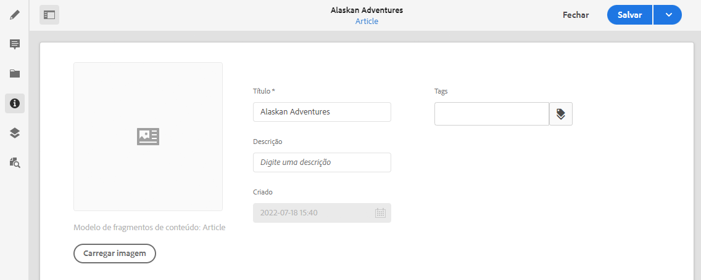

# Metadados - propriedades dos fragmentos {#metadata-fragment-properties}

Veja como visualizar e editar as propriedades de metadados dos fragmentos de conteúdo do AEM.

## Edição de propriedades / metadados {#editing-properties-meta-data}

Você pode visualizar e editar os metadados (propriedades) dos fragmentos de conteúdo:

1. No console de **Ativos**, navegue até o local do fragmento de conteúdo.
2. Ou:

   * Selecione [**Visualizar propriedades** para abrir as caixas de diálogo](/help/assets/manage-digital-assets.md#editing-properties). Depois de aberto para visualização, você também pode editá-los.
   * Abra o fragmento de conteúdo para edição e selecione **Metadados** no painel lateral.

   

3. A guia **Básico** fornece opções que podem ser visualizadas ou editadas:

   * Miniatura, para a qual você pode **Carregar uma imagem**
   * O **Modelo de fragmento de conteúdo** indica o modelo usado para criar o fragmento atual
   * **Título**
   * **Descrição**
   * **Tags**
      * As [Tags](/help/sites-cloud/authoring/features/tags.md) são particularmente eficientes ao organizar os fragmentos, pois podem ser usadas para a classificação de conteúdo e taxonomia. As tags podem ser usadas para encontrar conteúdo (por tags) e aplicar operações em massa.
Por exemplo, você pode marcar fragmentos relevantes como “lançamento de Natal” para permitir a navegação somente entre eles como um subconjunto ou copiá-los para uso com outro lançamento futuro em uma nova pasta.
   * Criado (somente exibição)
   
