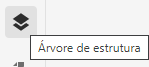
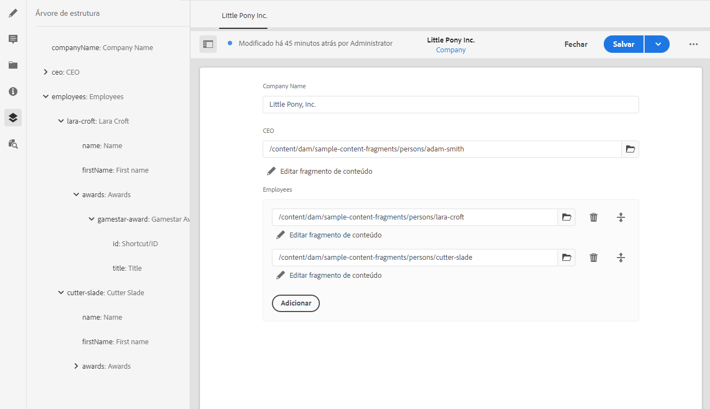

# Árvore de estrutura do fragmento de conteúdo {#content-fragment-structure-tree}

<!--
hide: yes
index: no
hidefromtoc: yes
-->

Use o recurso de árvore de estrutura do editor de fragmento de conteúdo no AEM para auxiliar seu entendimento sobre o conteúdo headless.

No editor de fragmento de conteúdo, é possível selecionar o ícone Árvore de estrutura:

Isso abrirá uma representação da estrutura do fragmento no painel esquerdo. Com isso, você pode navegar pelos fragmentos referenciados. Selecionar uma referência abre esse fragmento para edição.

>[!NOTE]
>
>Ao usar a navegação estrutural no painel principal, é possível navegar de volta ao ponto inicial.

