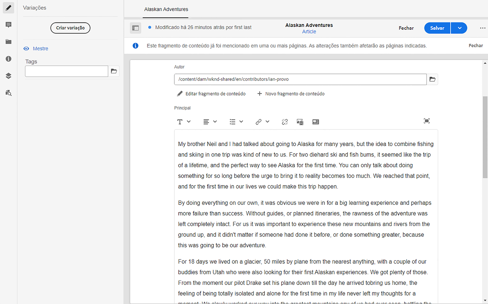
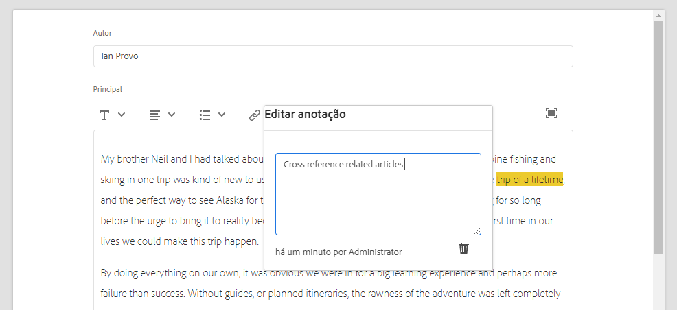
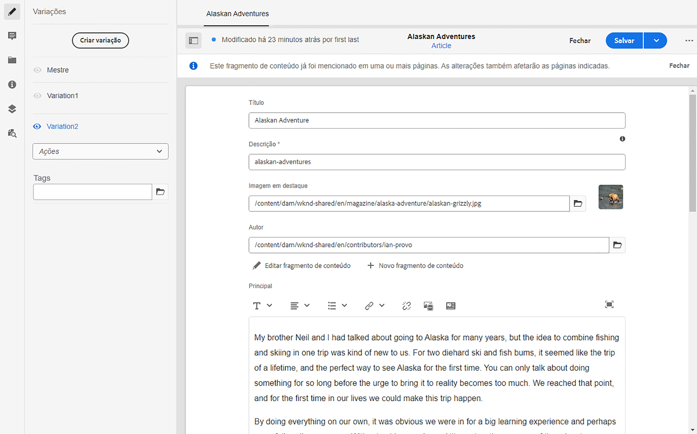

# Variações - Criação dos fragmentos de conteúdo{#variations-authoring-fragment-content}

<!--
hide: yes
index: no
hidefromtoc: yes
-->

[Variações](/help/sites-cloud/administering/content-fragments/content-fragments.md#constituent-parts-of-a-content-fragment) são um recurso importante dos fragmentos de conteúdo do Adobe Experience Manager (AEM). Eles permitem criar e editar cópias do conteúdo principal para uso em canais e cenários específicos, tornando a criação de páginas e a entrega de conteúdo headless ainda mais flexíveis.

No **Variações** você pode fazer o seguinte:

* [Inserir o conteúdo](#authoring-your-content) para o fragmento,
* [Criar e gerenciar variações](#managing-variations) do conteúdo **Principal**,

Executar uma série de outras ações, dependendo do tipo de dados que está sendo editado; por exemplo:

* [Inserir ativos visuais no fragmento](#inserting-assets-into-your-fragment) (imagens)

* Selecionar entre [Rich Text](#rich-text), [Texto sem formatação](#plain-text), e [Markdown](#markdown) para edição

* [Fazer upload de conteúdo](#uploading-content)

* [Visualizar as principais estatísticas](#viewing-key-statistics) (sobre textos multilinha)

* [Resumir texto](#summarizing-text)

* [Sincronizar as variações com o conteúdo Principal](#synchronizing-with-master)

>[!CAUTION]
>
>Depois que um fragmento é publicado e/ou referenciado, o AEM exibe um aviso quando um autor abre o fragmento para edição novamente. Isso serve para avisar que as alterações no fragmento também afetam as páginas referenciadas.

## Criação de conteúdo {#authoring-your-content}

Ao abrir o fragmento de conteúdo para edição, a guia **Variações** é aberta por padrão. Aqui é possível criar conteúdo para o principal ou quaisquer variações que você possua. O fragmento estruturado contém campos de vários tipos de dados que foram definidos no modelo de conteúdo.

Por exemplo:

É possível:

* Fazer edições no conteúdo diretamente da guia **Variações**; cada tipo de dados fornece opções de edição diferentes, por exemplo:

   * para **Texto multilinha** também é possível abrir a variável [editor de tela cheia](#full-screen-editor) para:

      * selecionar o [Formato](#formats)
      * ver mais opções de edição (para formato [Rich text](#rich-text))
      * acessar uma variedade de [ações](#actions)

   * Para **Referência do fragmento** campos, a variável [Editar fragmento de conteúdo](#fragment-references-edit-content-fragment) pode estar disponível, dependendo da definição do modelo.

* Atribuir **Tags** à variação atual; as tags podem ser adicionadas, atualizadas e removidas.

   * [Tags](/help/sites-cloud/authoring/features/tags.md) são eficientes ao organizar os fragmentos, pois podem ser usados para classificação de conteúdo e taxonomia. As tags podem ser usadas para localizar conteúdo (por tags) e aplicar operações em massa.

      * As pesquisas por uma tag retornam o fragmento, com a variação da tag destacada.
      * As tags de variação também podem ser usadas para agrupar variações de um perfil específico da rede de entrega de conteúdo (CDN) (para armazenamento em cache da CDN), em vez de usar o nome da variação.

     Por exemplo, você pode marcar fragmentos relevantes como “Lançamento de Natal” para permitir a navegação somente entre eles como um subconjunto ou a cópia para uso com outro lançamento futuro em uma nova pasta.

  >[!NOTE]
  >
  >**Tags** também podem ser adicionadas (à variação **principal**) como parte dos [metadados](/help/sites-cloud/administering/content-fragments/content-fragments-metadata.md)

* [Criar e gerenciar variações](#managing-variations) do conteúdo **principal.**

### Editor de tela cheia {#full-screen-editor}

Ao editar um campo de texto multilinha, você pode abrir o editor de tela cheia; toque ou clique no texto e selecione o seguinte ícone de ação:

Isso abre o editor de texto em tela cheia:

O editor de texto em tela cheia fornece:

* Acesso a várias [ações](#actions)
* Dependendo do [formato](#formats), opções adicionais de formatação ([Rich text](#rich-text))

### Ações {#actions}

As seguintes ações também estão disponíveis (para todos os [formatos](#formats)) quando o editor de tela cheia (ou seja, texto multilinha) está aberto:

* Selecionar o [formato](#formats) ([Rich text](#rich-text), [Texto sem formatação](#plain-text) ou [Markdown](#markdown))

* [Fazer upload de conteúdo](#uploading-content)

* [Mostrar estatísticas do texto](#viewing-key-statistics)

* [Sincronizar com o Principal](#synchronizing-with-master) (ao editar uma variação)

* [Resumir texto](#summarizing-text)

### Formatos {#formats}

As opções para editar texto de várias linhas dependem do formato selecionado:

* [Texto formatado](#rich-text)
* [Texto sem formatação](#plain-text)
* [Markdown](#markdown)

O formato pode ser selecionado no editor de tela cheia.

### Rich Text {#rich-text}

A edição de rich text permite formatar:

* Negrito
* Itálico
* Sublinhado
* Alinhamento: esquerda, centro, direita
* Lista com marcadores
* Lista numerada
* Recuo: aumentar, diminuir
* Criar/quebrar hiperlinks
* Colar texto/do Word
* Inserir uma tabela
* Estilo do parágrafo: parágrafo, cabeçalho 1/2/3
* [Inserir ativo](#inserting-assets-into-your-fragment)
* Abrir o editor de tela cheia, onde as seguintes opções de formatação estão disponíveis:
   * Pesquisar
   * Localizar/substituir
   * Verificador ortográfico
   * [Anotações](/help/sites-cloud/administering/content-fragments/content-fragments-variations.md#annotating-a-content-fragment)
* [Inserir fragmento de conteúdo](#inserting-content-fragment-into-your-fragment); disponível quando seu **Texto multilinha** o campo está configurado com **Permitir referência de fragmento**.

As [ações](#actions) também podem ser acessadas pelo editor de tela cheia.

### Texto sem formatação {#plain-text}

O texto sem formatação permite inserir rapidamente conteúdo sem formatação ou markdown. Também é possível abrir o editor de tela cheia para obter mais [ações](#actions).

>[!CAUTION]
>
>Se você selecionar **Texto sem formatação**, você poderá perder qualquer formatação, marcação e/ou ativos inseridos no **Rich Text** ou **Markdown**.

### Markdown {#markdown}

>[!NOTE]
>
>Para obter informações completas, consulte [Markdown](/help/sites-cloud/administering/content-fragments/content-fragments-markdown.md).

Isso permite formatar o texto usando markdown. Você pode definir:

* Cabeçalhos
* Parágrafos e quebras de linha
* Links
* Imagens
* Citações em bloco
* Listas
* Ênfase
* Blocos de código
* Escapes de barra invertida

Você também pode abrir o editor de tela cheia para obter mais [ações](#actions).

>[!CAUTION]
>
>Se você alternar entre **Rich Text** e **Markdown**, poderá ver efeitos inesperados com Cotas de bloqueio e Bloqueios de código, já que esses dois formatos podem ter diferenças na maneira como são tratados.

### Referências do fragmento {#fragment-references}

Se o Modelo do fragmento de conteúdo contiver Referências de fragmento, os autores do fragmento podem ter opções adicionais:

* [Editar fragmento de conteúdo](#fragment-references-edit-content-fragment)
* [Novo fragmento de conteúdo](#fragment-references-new-content-fragment)

#### Editar fragmento de conteúdo {#fragment-references-edit-content-fragment}

A opção **Editar fragmento de conteúdo** abre esse fragmento em uma nova guia do editor (na mesma guia do navegador).

Selecionar a guia original novamente (por exemplo, **Little Pony Inc.**), fecha essa guia secundária (nesse caso, **Adam Smith**).

#### Novo fragmento de conteúdo {#fragment-references-new-content-fragment}

A opção **Novo fragmento de conteúdo** permite criar um fragmento. Para isso, uma variação do assistente de criação de fragmento de conteúdo é aberta no editor.

**Para criar um fragmento de conteúdo:**

1. Navegar até a pasta desejada e selecioná-la.
1. Selecionar **Próximo**.
1. Especificação de propriedades; por exemplo, **Título**.
1. Selecionar **Criar**.
1. Finalmente:
   1. **Concluído**:
      * retorna (ao fragmento original)
      * faz referência ao novo fragmento
   1. **Abrir**:
      * faz referência ao novo fragmento
      * abre o novo fragmento para edição em uma nova guia do navegador

### Visualizar as principais estatísticas {#viewing-key-statistics}

Quando o editor de tela cheia estiver aberto, a ação **Estatísticas de texto** O exibe uma variedade de informações sobre o texto.

Por exemplo:

### Fazer upload de conteúdo {#uploading-content}

Para facilitar o processo de criação de fragmentos de conteúdo, você pode fazer upload de um texto preparado em um editor externo e adicioná-lo diretamente ao fragmento.

### Resumo de texto {#summarizing-text}

O resumo de texto foi criado para ajudar os usuários a reduzir o comprimento do texto para um número predefinido de palavras, mas mantendo os pontos principais e o significado geral.

>[!NOTE]
>
>A um nível mais técnico, o sistema mantém as frases que julga proverem ao *melhor relação entre densidade e exclusividade das informações* segundo algoritmos específicos.

>[!CAUTION]
>
>O fragmento de conteúdo deve ter uma pasta de idioma válida (código ISO) como ancestral; ela serve para determinar o modelo de idioma a ser usado.
>
>Por exemplo, `en/`, como no seguinte caminho:
>
>  `/content/dam/my-brand/en/path-down/my-content-fragment`

>[!CAUTION]
>
O inglês está disponível pronto para uso.
>
Outros idiomas estão disponíveis como Pacotes de modelo de idioma na Distribuição de software:
>
* [Francês (fr)](https://experience.adobe.com/#/downloads/content/software-distribution/en/aem.html?package=/content/software-distribution/en/details.html/content/dam/aem/public/adobe/packages/cq630/product/smartcontent-model-fr)
* [Alemão (de)](https://experience.adobe.com/#/downloads/content/software-distribution/en/aem.html?package=/content/software-distribution/en/details.html/content/dam/aem/public/adobe/packages/cq630/product/smartcontent-model-de)
* [Italiano (it)](https://experience.adobe.com/#/downloads/content/software-distribution/en/aem.html?package=/content/software-distribution/en/details.html/content/dam/aem/public/adobe/packages/cq630/product/smartcontent-model-it)
* [Espanhol (es)](https://experience.adobe.com/#/downloads/content/software-distribution/en/aem.html?package=/content/software-distribution/en/details.html/content/dam/aem/public/adobe/packages/cq630/product/smartcontent-model-es)
>

1. Selecione o **Principal** ou a variação exigida.
1. Abra o editor de tela cheia.

1. Selecione **Resumir texto** na barra de ferramentas.

   

1. Especifique o número alvo de palavras e selecione **Iniciar**:
1. O texto original é apresentado lado a lado com o resumo proposto:

   * As frases que serão eliminadas são destacadas em vermelho e tachadas.
   * Clique em qualquer frase destacada para mantê-la no conteúdo resumido.
   * Clique em qualquer frase não destacada para eliminá-la.

1. Selecionar **Resuma**.

1. O texto original é apresentado lado a lado com o resumo proposto:

   * As frases que serão eliminadas são destacadas em vermelho e tachadas.
   * Clique em qualquer frase destacada para mantê-la no conteúdo resumido.
   * Clique em qualquer frase não destacada para eliminá-la.
   * As estatísticas do resumo são apresentadas: **Real** e **Alvo**-
   * Você pode **Visualizar** as alterações.

   

### Anotação de um fragmento de conteúdo {#annotating-a-content-fragment}

1. Selecione o **Principal** ou a variação exigida.

1. Abra o editor de tela cheia.

1. O ícone de **Anotar** está disponível na barra de ferramentas superior. Você pode selecionar algum texto, se necessário.

   

1. Uma caixa de diálogo é aberta. Aqui é possível inserir sua anotação.

   

1. Selecionar **Aplicar** na caixa de diálogo.

   

   Se a anotação tiver sido aplicada ao texto selecionado, esse texto permanecerá destacado.

   

1. Feche o editor de tela cheia; as anotações permanecem destacadas. Se selecionada, uma caixa de diálogo será aberta para que você possa editar mais a anotação.

1. Selecione **Salvar**.

1. Feche o editor de tela cheia; as anotações permanecem destacadas. Se selecionada, uma caixa de diálogo será aberta para que você possa continuar a editar a anotação.

   

### Visualizar, editar e excluir anotações {#viewing-editing-deleting-annotations}

Anotações:

* Indicado pelo destaque no texto, no modo de tela cheia e no modo normal do editor. Detalhes completos de uma anotação podem ser visualizados, editados ou excluídos ao clicar no texto destacado, o que reabre a caixa de diálogo.

  >[!NOTE]
  >
  Um seletor suspenso é fornecido se várias anotações tiverem sido aplicadas a um texto.

* Quando você exclui o texto inteiro ao qual a anotação foi aplicada, a anotação também é excluída.

* Elas podem ser listadas e excluídas selecionando o **Anotações** no editor de fragmentos.

  

* Elas podem ser visualizadas e excluídas no [Linha do tempo](/help/sites-cloud/administering/content-fragments/content-fragments-managing.md#timeline-for-content-fragments) para o fragmento selecionado.

### Inserir ativos no fragmento {#inserting-assets-into-your-fragment}

Para facilitar o processo de criação de fragmentos de conteúdo, você pode adicionar [Assets](/help/assets/manage-digital-assets.md) (imagens) diretamente no fragmento.

Eles serão adicionados à sequência de parágrafo do fragmento sem qualquer formatação; a formatação pode ser feita quando o [fragmento for usado/referenciado em uma página](/help/sites-cloud/authoring/fundamentals/content-fragments.md).

>[!CAUTION]
>
Esses ativos não podem ser movidos ou excluídos em uma página de referência. Isso deve ser feito no editor do fragmento.
>
No entanto, a formatação do ativo (por exemplo, seu tamanho) deve ser feita no [editor de páginas](/help/sites-cloud/authoring/fundamentals/content-fragments.md). A representação do ativo no editor de fragmento serve meramente para a criação do fluxo de conteúdo.

>[!NOTE]
>
Existem vários métodos de adicionar [imagens](/help/sites-cloud/administering/content-fragments/content-fragments.md#fragments-with-visual-assets) ao fragmento e/ou página.

1. Posicione o cursor onde deseja adicionar a imagem.
1. Use o **Inserir ativo** ícone para abrir a caixa de diálogo de pesquisa.

   

1. Na caixa de diálogo, é possível navegar até o ativo necessário no DAM ou pesquisar pelo ativo no DAM.

   Quando localizado, selecione o ativo necessário clicando na miniatura.

1. Use **Selecionar** para adicionar o ativo ao sistema de parágrafo do fragmento de conteúdo no local atual.

   >[!CAUTION]
   >
   Depois de adicionar um ativo, se você alterar o formato para:
   >
   * **Texto sem formatação**: o ativo é perdido do fragmento.
   * **Marcação**: o ativo não estará visível, mas ainda estará presente ao retornar para **Rich Text**.

### Inserir um fragmento de conteúdo no fragmento {#inserting-content-fragment-into-your-fragment}

Para facilitar o processo de criação de fragmentos de conteúdo, você também pode adicionar outro fragmento de conteúdo ao seu fragmento.

Eles são adicionados como referência no local atual no fragmento.

>[!NOTE]
>
Essa opção está disponível quando seu **Texto multilinha** está configurado com **Permitir referência de fragmento**.

>[!CAUTION]
>
Esses ativos não podem ser movidos ou excluídos em uma página de referência. Isso deve ser feito no editor do fragmento.
>
No entanto, a formatação do ativo (por exemplo, seu tamanho) deve ser feita no [editor de páginas](/help/sites-cloud/authoring/fundamentals/content-fragments.md). A representação do ativo no editor de fragmento serve meramente para a criação do fluxo de conteúdo.

>[!NOTE]
>
Existem vários métodos de adicionar [imagens](/help/sites-cloud/administering/content-fragments/content-fragments.md#fragments-with-visual-assets) ao fragmento e/ou página.

1. Posicione o cursor onde deseja adicionar o fragmento.
1. Use o **Inserir fragmento de conteúdo** ícone para abrir a caixa de diálogo de pesquisa.

   

1. Na caixa de diálogo, é possível navegar até o fragmento necessário na pasta de Ativos ou pesquisar pelo fragmento.

   Quando localizado, selecione o fragmento necessário clicando na miniatura.

1. Use **Selecionar** para adicionar uma referência ao fragmento de conteúdo selecionado no seu fragmento de conteúdo atual (no local atual).

   >[!CAUTION]
   >
   Depois de adicionar uma referência a outro fragmento, se você alterar o formato para:
   >
   * **Texto sem formatação**: a referência é perdida do fragmento.
   * **Markdown**: a referência permanece.

## Gerenciamento de variações {#managing-variations}

[!CONTEXTUALHELP]
id="aemcloud_sites_contentfragments_variations"
title="Variações - Criação dos fragmentos de conteúdo"
abstract="Saiba como fazer variações de conteúdo para usar com canais específicos."
additional-url="https://video.tv.adobe.com/v/333295" text="Variações de fragmento do conteúdo"

### Criar uma variação {#creating-a-variation}

As variações permitem pegar o **Principal** conteúdo e alterá-lo de acordo com a finalidade (se necessário).

Para criar uma variação:

1. Abra o fragmento e verifique se o painel lateral está visível.
1. Selecione **Variações** na barra de ícones, no painel lateral.
1. Selecione **Criar variação**.
1. Uma caixa de diálogo é aberta, especifique a **Título** e **Descrição** para a nova variação.
1. Selecione **Adicionar**; o fragmento **principal** será copiado para a nova variação, que agora está aberta para [edição](#editing-a-variation).

   >[!NOTE]
   >
   Ao criar uma variação, é sempre o **Principal** que é copiado, não a variação que está aberta.

   >[!NOTE]
   >
   Ao criar uma variação, todas as **Tags** atualmente atribuído à **Principal** são copiadas para a nova variação.

### Editar uma variação {#editing-a-variation}

Você pode editar o conteúdo de variação após:

* [Criar a variação](#creating-a-variation).
* Abrir um fragmento existente e, em seguida, selecionar a variação necessária no painel lateral.

### Renomear uma variação {#renaming-a-variation}

Para renomear uma variação existente:

1. Abra o fragmento e selecione **Variações** no painel lateral.
1. Selecione a variação necessária.
1. Selecione **Renomear** no menu suspenso de **Ações**.

1. Digite o novo **Título** e/ou **Descrição** na caixa de diálogo resultante.

1. Confirme a ação **Renomear**.

>[!NOTE]
>
Isso só afeta o **Título** da variação.

### Excluir uma Variação {#deleting-a-variation}

Para excluir uma variação existente:

1. Abra o fragmento e selecione **Variações** no painel lateral.
1. Selecione a variação necessária.
1. Selecione **Excluir** no menu suspenso de **Ações**.

1. Confirme a **Excluir** ação na caixa de diálogo.

>[!NOTE]
>
Não é possível excluir o **Principal**.

### Sincronização com o Principal {#synchronizing-with-master}

**Principal** O é parte de um fragmento de conteúdo e, por definição, contém a cópia principal do conteúdo, enquanto as variações contêm as versões individuais atualizadas e personalizadas desse conteúdo. Quando o Principal é atualizado, é possível que essas alterações também sejam relevantes para as variações e, portanto, devem ser propagadas para elas.

Ao editar uma variação, você tem acesso à ação para sincronizar o elemento atual da variação com o Principal. Isso permite copiar automaticamente as alterações feitas no Principal para a variação necessária.

>[!CAUTION]
>
A sincronização só está disponível para copiar alterações *do **Principal**para a variação*.
>
Somente o elemento atual da variação será sincronizado.
>
A sincronização só funciona no **Texto multilinha** tipo de dados.
>
A transferência de alterações *de uma variação para o **Principal*** não está disponível como uma opção.

1. Abra o fragmento de conteúdo no editor de fragmentos. Certifique-se de que o **Principal** foi editado.

1. Selecione uma variação específica e, em seguida, a ação de sincronização apropriada:

   * no seletor suspenso de **Ações** - **Sincronizar elemento atual com o principal**

     

   * a barra de ferramentas do editor de tela cheia — **Sincronizar com o Principal**

     

1. O principal e a variação serão mostrados lado a lado:

   * verde indica que o conteúdo foi adicionado (à variação)
   * vermelho indica que o conteúdo foi removido (da variação)
   * azul indica texto substituído

   

1. Selecione **Sincronizar**; a variação será atualizada e mostrada.
