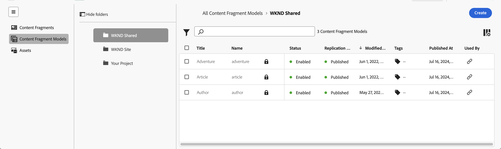
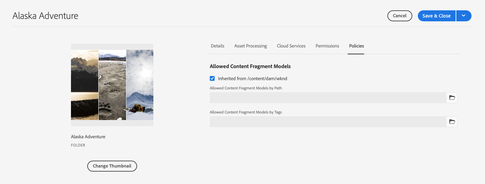

# Gerenciamento de Modelos de fragmentos de conteúdo {#managing-content-fragment-models}

No console de Fragmentos de conteúdo, é possível gerenciar os Modelos de fragmento de conteúdo e [abrir o editor](/help/sites-cloud/administering/content-fragments/content-fragment-models.md) para definir a estrutura.

Os modelos de fragmento de conteúdo no Adobe Experience Manager (AEM) as a Cloud Service definem a estrutura do conteúdo dos seus [fragmentos de conteúdo](/help/sites-cloud/administering/content-fragments/overview.md). Esses fragmentos podem ser usados como base para o conteúdo headless ou para a criação de páginas.

>[!NOTE]
>
>Essa página aborda a seção do console que (somente) exibe os Modelos de fragmento de conteúdo. Para outros painéis, consulte:
>
>* [Gerenciamento dos fragmentos de conteúdo](/help/sites-cloud/administering/content-fragments/managing.md)
>* [Exibindo e gerenciando o Assets no Console de Fragmentos de Conteúdo](/help/sites-cloud/administering/content-fragments/assets-content-fragments-console.md)

>[!NOTE]
>
>Os fragmentos de conteúdo são armazenados como **Ativos**. Os Modelos de Fragmento de Conteúdo são gerenciados principalmente pelo console **Fragmentos de Conteúdo**, mas também podem ser gerenciados no console [Assets](/help/assets/content-fragments/content-fragments-managing.md) e na opção [Modelos de Fragmento de Conteúdo](/help/assets/content-fragments/content-fragments-models.md), disponível em **Ferramentas** - **Geral**.

## Como trabalhar com modelos de fragmento de conteúdo {#how-to-work-with-content-fragment-models}

Como uma visão geral muito rápida, para trabalhar com modelos de fragmento de conteúdo, você pode:

1. [Habilitar a funcionalidade de modelo de fragmento de conteúdo para sua instância](/help/sites-cloud/administering/content-fragments/setup.md)
1. [Crie](#creating-a-content-fragment-model) seu modelo de fragmento de conteúdo.
   * Neste ponto, também é possível **Habilitar** o modelo (para uso ao criar fragmentos de conteúdo).
1. [Defina](/help/sites-cloud/administering/content-fragments/content-fragment-models.md#defining-your-content-fragment-model) a estrutura do seu modelo.
1. [Habilite o Modelo de Fragmento de Conteúdo](#enabling-a-content-fragment-model), se ainda não estiver pronto.
1. [Autorizar os modelos de fragmento de conteúdo nas pastas de ativos necessárias](#allowing-content-fragment-models-assets-folder) ao configurar as **Políticas**.

## Estrutura básica e manuseio de modelos de fragmento de conteúdo no console {#basic-structure-handling-content-fragment-models-console}

Você pode usar o painel à esquerda do [Console de fragmentos de conteúdo](/help/sites-cloud/administering/content-fragments/overview.md#content-fragments-console) para selecionar **Modelos de fragmentos de conteúdo** como tipo de recurso para exibir, navegar e gerenciar:

Isso abrirá a exibição dos modelos de fragmento de conteúdo:

Aqui você pode ver três áreas principais:

* A barra de ferramentas superior
   * Fornece a funcionalidade padrão do AEM
   * Mostra sua organização IMS
   * Fornece várias [ações](#actions-unselected), que podem [ser alteradas quando você selecionar um ou mais modelos](#actions-selected-content-fragment-models)
* O painel esquerdo
   * Mostra os [caminhos para todas as configurações](/help/sites-cloud/administering/content-fragments/setup.md#enable-content-fragment-functionality-configuration-browser) listadas como pastas
   * Aqui você pode ocultar ou revelar a árvore de pastas
   * É possível selecionar uma pasta específica da árvore
   * Isso pode ser redimensionado para mostrar pastas aninhadas (subconfigurações)
   * Além dos Modelos de fragmentos do conteúdo, você pode exibir [Fragmentos do conteúdo](/help/sites-cloud/administering/content-fragments/managing.md) ou [Assets](/help/sites-cloud/administering/content-fragments/assets-content-fragments-console.md); também é possível compactar ou expandir links para os painéis
* O painel principal/direito; aqui, você pode:
   * Consulte a lista de todos os modelos de fragmento de conteúdo mantidos na pasta selecionada:
      * Modelos de fragmentos de conteúdo da pasta selecionada e todas as subpastas serão exibidas:
         * A localização é indicada pela navegação estrutural; elas também podem ser usadas para alterar a localização:
      * [As informações são mostradas sobre cada modelo](#information-content-fragment-models)
         * [Você pode selecionar quais colunas mostrar](#select-columns-console)
      * [Vários campos de informações](#information-content-fragment-models) sobre um Modelo de fragmento de conteúdo fornecem links. Dependendo do campo, eles podem:
         * Abra o modelo apropriado no editor
         * Mostrar informações sobre o caminho para a configuração
         * Mostrar informações sobre o status do modelo
      * [Determinados outros campos de informações](#information-content-fragments) sobre um Modelo de Fragmento de Conteúdo podem ser usados para [Filtragem Rápida](#fast-filtering):
         * Selecione um valor na coluna e ele será aplicado imediatamente como filtro
         * A filtragem rápida é aceita pelas colunas **Modificado por**, **Publicado por** e **Status**.
      * Ao passar o mouse sobre os cabeçalhos da coluna, um seletor de ação suspenso e os controles deslizantes de largura serão mostrados. Eles permitem:
         * Classificar: selecione a ação apropriada para classificar em ordem crescente ou decrescente 
Isso classificará toda a tabela de acordo com essa coluna. A classificação só está disponível nas colunas apropriadas.
         * Redimensionar a coluna: usando os controles deslizantes de ação ou largura
      * Selecione um ou mais modelos para outra [ação](#actions-selected-content-fragment-models)
   * Abra o [painel de Filtro](#filter-content-fragment-models)
   * Uma seleção de [atalhos de teclado](/help/sites-cloud/administering/content-fragments/keyboard-shortcuts.md) estão disponíveis para uso neste console

## As informações fornecidas sobre os modelos de fragmento de conteúdo {#information-content-fragment-models}

O painel principal/direito (exibição de tabela) do console fornece uma variedade de informações sobre os modelos de fragmento de conteúdo. Alguns itens também fornecem links diretos para outras ações e/ou informações:

* **Nome**
   * Fornece um link para abrir o modelo no editor.
* **Bloqueado** (Ícone de cadeado)
   * Quando o modelo está bloqueado, isso é indicado com um ícone de cadeado.
* **Caminho**
   * Fornece o caminho como um link para abrir a configuração no console.
Passar o mouse sobre o nome da pasta mostrará o caminho JCR.
* **Status**
   * Somente informações.
   * Pode ser usada para [Filtragem Rápida](#fast-filtering)
* **Status da Replicação**
   * Somente informações.
   * Pode ser usada para [Filtragem Rápida](#fast-filtering).
* **Visualização**
   * Somente informações.
* **Modificado Em**
   * Somente informações.
   * Pode ser usada para [Filtragem Rápida](#fast-filtering).
* **Modificado por**
   * Somente informações.
   * Pode ser usada para [Filtragem Rápida](#fast-filtering).
* **Tags**
   * Somente informações.
   * Abre uma caixa de diálogo mostrando todas as tags relacionadas ao modelo.
   * Pode ser usada para [Filtragem Rápida](#fast-filtering).
* **Publicado em**
   * Somente informações.
   * Pode ser usada para [Filtragem Rápida](#fast-filtering).
* **Publicado por**
   * Somente informações.
   * Pode ser usada para [Filtragem Rápida](#fast-filtering).
* **Usado por**
   * Abre uma caixa de diálogo listando os Fragmentos de conteúdo baseados no modelo. A lista fornece links para permitir abrir fragmentos diretamente.

## Propriedades do modelo {#model-properties}

Quando você seleciona um modelo específico, as propriedades desse modelo são mostradas (como definido ao [criar o modelo](#creating-a-content-fragment-model)). Se o modelo não estiver **Bloqueado**, alguns itens poderão ser atualizados. Você também pode usar o ícone de informações (ao lado do modelo **Título**) para abrir e fechar este painel de informações.

* **[Caminho](/help/sites-cloud/administering/content-fragments/setup.md#enable-content-fragment-functionality-configuration-browser)**
* **[Status](#enabling-a-content-fragment-model)**
* **Título**
* **Tags**
* **Descrição**
* **Visualizar padrão de URL**

  Os Modelos de fragmentos do conteúdo permitem que os autores **Visualizem** o conteúdo em um aplicativo de front-end externo. Depois que o **Serviço de visualização** estiver configurado, adicione a URL para o aplicativo front-end.

  O URL de visualização deve seguir este padrão:
    `https://<preview_url>?param=${expression}`

  As expressões disponíveis são:

   * `${contentFragment.path}`
   * `${contentFragment.model.path}`
   * `${contentFragment.model.name}`
   * `${contentFragment.variation}`
   * `${contentFragment.id}`

<!-- CHECK: currently under FT -->
<!--
* **GraphQL**
  Define names relevant for GraphQL.
  Changing the GraphQL API Name, or Query field names will impact client applications.
  * **API Name**
    Represents the GraphQL type and query field names in the GraphQL schema.
  * **Single Query Field Name**
    Represents the GraphQL single query field name in the GraphQL schema.
  * **Multiple Query Field Name**
    Represents the GraphQL multiple query field name in the GraphQL schema.
-->

## Ações {#actions}

Depois de selecionar uma pasta (no painel esquerdo), há uma variedade de ações que você pode usar diretamente ou depois de selecionar um modelo específico:

* Várias ações estão diretamente [disponíveis no console](#actions-unselected)
* Você pode [selecionar um ou mais modelos de fragmento de conteúdo para mostrar as ações apropriadas](#actions-selected-content-fragment)

### Ações (não selecionadas) {#actions-unselected}

Determinadas ações estão disponíveis no console — depois de selecionar uma pasta, mas sem selecionar um Modelo de fragmento de conteúdo específico:

* **[Criar](#creating-a-content-fragment-model)** um novo modelo (vazio)

### Ações para um modelo de fragmento de conteúdo no Console de fragmentos de conteúdo {#actions-selected-content-fragment-models}

Selecionar um modelo específico abre uma barra de ferramentas focada nas ações disponíveis para esse modelo. Você também pode selecionar vários modelos. As ações disponíveis serão ajustadas de acordo.

* **[Edite](/help/sites-cloud/administering/content-fragments/content-fragment-models.md)** para definir seu modelo de fragmento de conteúdo.
* **[Publicar](#publishing-a-content-fragment-model)** e **[Cancelar publicação](#unpublishing-a-content-fragment-model)** nos níveis [Publicar](/help/implementing/cloud-manager/manage-environments.md#environment-types) ou [Visualizar](/help/implementing/cloud-manager/manage-environments.md#access-preview-service).
* **Bloquear**/**Desbloquear** para controlar se um usuário tem permissão para modificar o Modelo.
* **Copiar** seu modelo.
* **[Habilite](#enabling-a-content-fragment-model)**/**[Desabilitar](#disabling-a-content-fragment-model)** para controlar se um usuário tem permissão para criar Fragmentos de Conteúdo com base neste modelo.

Selecionar um único modelo também mostra as [propriedades do modelo](#properties) no painel direito.

## Selecionar colunas mostradas no console {#select-columns-console}

Assim como em outros consoles, você pode configurar as colunas que estão visíveis e disponíveis para ação:

Isso apresentará uma lista de colunas que você pode ocultar ou mostrar:

## Filtrar modelos de fragmento do conteúdo {#filter-content-fragment-models}

O painel Filtro oferece:

* uma seleção de predicados;
   * incluindo campos de status, tags, usuários, entre outros
   * um ou mais predicados podem ser selecionados e combinados para criar o filtro

<!--
* the opportunity to **Save** your filter
* the option to retrieve a saved search filter for reuse
-->

Depois de selecionadas, as opções **Filtrar por** são exibidas (na parte superior do painel principal). Eles podem ser desmarcados a partir daí. Por exemplo:

### Filtragem rápida {#fast-filtering}

Você também pode selecionar um predicado clicando em um valor de coluna específico na lista. Você pode selecionar um ou mais valores para combinar predicados.

Por exemplo, selecione **Habilitado** na coluna **Status**. Uma vez selecionado, isso será mostrado como um predicado de filtro e a lista será filtrada de acordo.

>[!NOTE]
>
>A filtragem rápida só tem suporte para as colunas **Status**, **Modificado por**, **Marcas** e **Publicado por**.

>[!NOTE]
>
>A Filtragem rápida opera da mesma forma que para [Fragmentos de conteúdo](/help/sites-cloud/administering/content-fragments/managing.md#fast-filtering) no console.

## Criação de um modelo de fragmento de conteúdo {#creating-a-content-fragment-model}

1. Navegue até a pasta apropriada à sua [configuração ou subconfiguração](/help/sites-cloud/administering/content-fragments/setup.md).
1. Use **Criar** para abrir a caixa de diálogo.

   >[!CAUTION]
   >
   >A opção **Criar** só estará disponível:
   >
   >* Se o [uso de Modelos de fragmento de conteúdo foi habilitado](/help/sites-cloud/administering/content-fragments/setup.md)
   >* quando tiver selecionado a pasta em que deseja criar o modelo.

1. Selecione o **Caminho** para a configuração e especifique o **Nome**.

   >[!NOTE]
   >
   >A configuração será preenchida automaticamente com a configuração atual (a pasta em que você está no momento).
   >
   >Você também pode alterar a configuração clicando no ícone de pasta.

   Também é possível definir várias propriedades:

   * **Título**
Se você inserir o **Título** primeiro, o **Nome** será gerado a partir dele.
   * uma **Descrição**
   * **Habilitar modelo** para [habilitar o modelo](#enabling-disabling-a-content-fragment-model)

   >[!NOTE]
   >
   >Consulte [Modelo de fragmento de conteúdo - Propriedades](#model-properties) para obter detalhes completos.

   

1. Use **Criar** para salvar o modelo vazio ou **Criar e abrir**.

### Habilitar um modelo de fragmento de conteúdo {#enabling-a-content-fragment-model}

Depois que um modelo é criado, ele deve ser ativado para:

* Está disponível para seleção ao criar um fragmento de conteúdo.
* Poder ser referenciado a partir de um modelo de fragmento de conteúdo.
* Estar disponível no GraphQL; assim, o esquema é gerado.

Você pode **Habilitar** um modelo:

* Ao criar um novo modelo
   * Uma opção é apresentada na caixa de diálogo.
* Quando um modelo tiver sido especificamente **Desabilitado**
   * Quando o Modelo necessário estiver selecionado, a ação **Habilitar** estará disponível na barra de ferramentas superior.

### Desativar um modelo de fragmento de conteúdo {#disabling-a-content-fragment-model}

Um modelo também pode ser desativado para que:

* O modelo não fique mais disponível como base para a criação de *novos* fragmentos de conteúdo.
* No entanto:
   * O esquema de GraphQL continua sendo gerado e ainda pode ser consultado (para evitar impacto na API JSON).
   * Quaisquer fragmentos de conteúdo baseados no modelo ainda podem ser consultados e retornados a partir do ponto de acesso do GraphQL.
* O modelo não pode mais ser referenciado, mas as referências existentes são mantidas e ainda podem ser consultadas e retornadas a partir do ponto de acesso do GraphQL.

Para desabilitar um Modelo que esteja sinalizado como **Habilitado**, use a opção **Desabilitar** de:

* Da barra de ferramentas superior, quando o modelo necessário estiver selecionado.

## Permitir modelos de fragmentos de conteúdo na pasta de ativos {#allowing-content-fragment-models-assets-folder}

Para implementar a governança de conteúdo, você pode configurar **Políticas** na pasta de ativos para controlar quais modelos de fragmento de conteúdo são permitidos na criação de fragmentos dessa pasta.

>[!NOTE]
>
>O mecanismo é semelhante ao de [permitir modelos de página](/help/sites-cloud/authoring/page-editor/templates.md#allowing-a-template-author) para uma página e suas filhas nas suas propriedades avançadas.

Para configurar as **políticas** para **modelos de fragmento de conteúdo permitidos**:

1. Navegue e abra as **Propriedades** da pasta de ativos necessária.

1. Abra a guia **Políticas**, onde é possível configurar:

   * **Herdado de`<folder>`**

     As políticas são automaticamente herdadas ao criar novas pastas derivadas; a política pode ser reconfigurada (e a herança quebrada) se as subpastas precisarem permitir modelos diferentes da pasta principal.

   * **Modelos de fragmento de conteúdo permitidos por caminho**

     Vários modelos podem ser permitidos.

   * **Modelos de fragmento de conteúdo permitidos por tag**

     Vários modelos podem ser permitidos.

   

1. **Salve** quaisquer alterações.

Os modelos de fragmento de conteúdo permitidos para uma pasta são resolvidos da seguinte maneira:

* As **políticas** para **modelos de fragmento do conteúdo permitidos**.
* Se estiver vazia, tente determinar a política usando as regras de herança.
* Se a cadeia de herança não fornecer um resultado, verifique a configuração de **Cloud Services** dessa pasta (diretamente e, em seguida, por herança).
* Se nenhuma das opções acima fornecer resultados, então não há modelos permitidos para essa pasta.

## Exclusão de um modelo de fragmento de conteúdo {#deleting-a-content-fragment-model}

>[!CAUTION]
>
>A exclusão de um modelo de Fragmento de conteúdo pode afetar fragmentos dependentes.

Para excluir um modelo de fragmento de conteúdo:

1. Navegue até Modelo de fragmento de conteúdo e selecione-o. É possível selecionar vários modelos.

1. Selecione **Excluir** na barra de ferramentas.

   >[!NOTE]
   >
   >Se o modelo for referenciado, um aviso será exibido para que você possa tomar as medidas apropriadas.

## Publicação de um Modelo de fragmento de conteúdo {#publishing-a-content-fragment-model}

Os modelos de fragmento de conteúdo precisam ser publicados quando/antes de qualquer fragmento de conteúdo dependente ser publicado.

Para publicar um modelo de fragmento de conteúdo:

1. Navegue até Modelo de fragmento de conteúdo e selecione-o. É possível selecionar vários modelos.

1. Selecione **Publicar** na barra de ferramentas.

1. Na caixa de diálogo Publicar, selecione o **Destino**:

   * **Serviço de publicação**
   * **Serviço de visualização**

1. O fluxo de trabalho para publicar os modelos selecionados e suas referências será iniciado. O status publicado é exibido no console.

## Desfazer a publicação de um Modelo de fragmento de conteúdo {#unpublishing-a-content-fragment-model}

Os modelos de fragmento de conteúdo podem ter a publicação desfeita se não forem referenciados por nenhum fragmento.

Para desfazer a publicação de um modelo de fragmento de conteúdo:

1. Navegue até Modelo de fragmento de conteúdo e selecione-o.
O status publicado é indicado no console.

1. Selecione **Cancelar publicação** na barra de ferramentas.

1. Na caixa de diálogo Cancelar publicação, selecione o **Destino**:

   * **Serviço de publicação**
   * **Serviço de visualização**

1. O fluxo de trabalho para desfazer a publicação dos modelos selecionados e suas referências será iniciado. O status não publicado é exibido no console.

Se você tentar desfazer a publicação de um modelo que é usado atualmente por um ou mais fragmentos, um aviso de erro será exibido. A mensagem sugere que você verifique o painel [Referências](/help/sites-cloud/authoring/basic-handling.md#references) para investigar melhor:

## Modelos de fragmentos do conteúdo bloqueados {#locked-content-fragment-models}

Esse recurso permite controlar se um modelo pode ser atualizado, mas também fornece o controle dos modelos de fragmento de conteúdo que foram publicados.

### O desafio {#the-challenge}

* Os modelos de fragmento de conteúdo determinam o esquema para consultas GraphQL no AEM.

   * Os esquemas GraphQL do AEM são criados assim que um modelo de fragmento de conteúdo é criado e podem existir em ambientes do autor e de publicação.

   * Os esquemas em publicação são os mais críticos, pois fornecem a base para a entrega em tempo real do conteúdo do fragmento de conteúdo no formato JSON.

* Problemas podem ocorrer quando os modelos de fragmento de conteúdo são modificados ou, em outras palavras, editados. Isso significa que o esquema é alterado, o que, por sua vez, pode afetar as consultas GraphQL existentes.

* A adição de novos campos a um modelo de fragmento de conteúdo (normalmente) não deve ter efeitos prejudiciais. No entanto, a modificação de campos de dados existentes (por exemplo, seu nome) ou a exclusão de definições de campos quebrará as consultas GraphQL existentes quando estas solicitarem esses campos.

### Os requisitos {#the-requirements}

* Conscientizar os usuários sobre os riscos de se editar modelos que já são usados para a entrega de conteúdo em tempo real (em outras palavras, modelos que foram publicados).

* Além disso, evitar alterações não intencionais.

Qualquer um desses critérios pode quebrar as consultas se os modelos modificados forem republicados.

### A solução {#the-solution}

Para solucionar esses problemas, os modelos de fragmento de conteúdo são *bloqueados* em um modo SOMENTE LEITURA na criação — assim que são publicados. Este status é indicado por **Bloqueado**.

Quando o modelo está **bloqueado** (no modo SOMENTE LEITURA ), é possível visualizar o conteúdo e a estrutura dos modelos, mas não editá-los.

É possível gerenciar modelos **Bloqueados** no console ou no editor de modelos:

* Console

  No console, é possível gerenciar o modo SOMENTE LEITURA com as ações **Desbloquear** e **Bloquear** da barra de ferramentas.

   * É possível **desbloquear** um modelo para permitir a edição.

     Se você selecionar **Desbloquear**, um aviso será exibido e você deverá confirmar a ação **Desbloquear**.

     Em seguida, você pode abrir o modelo para edição.

   * Também é possível **bloquear** o modelo depois.
   * A republicação do modelo imediatamente o retorna ao modo **Bloqueado** (SOMENTE LEITURA).

* Editor de modelos

   * Ao abrir um modelo bloqueado, você será avisado e três ações serão apresentadas: **Cancelar**, **Exibir Somente Leitura**, **Editar**.

   * Se você selecionar **Exibir Somente Leitura**, poderá ver o conteúdo e a estrutura do modelo.

   * Se você selecionar **Editar**, poderá editar e salvar suas atualizações:

     

     >[!NOTE]
     >
     >Ainda pode haver um aviso na parte superior, mas isso acontece quando o modelo já está em uso pelos fragmentos de conteúdo existentes.

   * **Cancelar** retorna você ao console.
