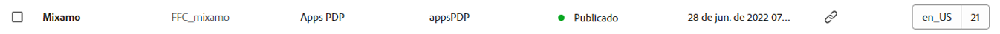
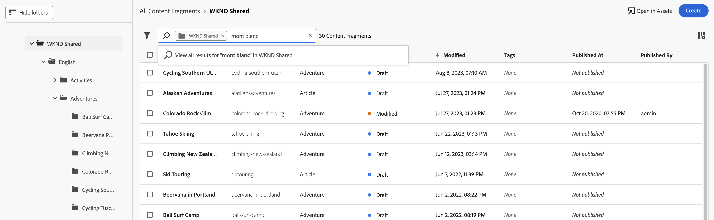

# Gerenciamento dos Fragmentos de conteúdo {#managing-content-fragments}

Saiba como gerenciar o seu **Fragmentos de conteúdo** no Adobe Experience Manager (AEM) as a Cloud Service, da dedicada [Console de fragmentos de conteúdo](#content-fragments-console), e [Editor de fragmento de conteúdo](/help/sites-cloud/administering/content-fragments/authoring.md#content-fragment-editor). Esses fragmentos de conteúdo podem ser usados como base para o conteúdo headless ou para a criação de páginas.

>[!NOTE]
>
>A equipe do projeto pode personalizar o console e o editor, se necessário. Consulte [Personalização do console e do editor de fragmentos de conteúdo](/help/implementing/developing/extending/content-fragments-console-and-editor.md) para obter mais detalhes.

Depois de definir o [Modelos de fragmentos do conteúdo](#creating-a-content-model) você pode usá-los para:

* [Criar os fragmentos de conteúdo](#creating-a-content-fragment).
* Em seguida, abra o [Editor de fragmento de conteúdo](#opening-the-fragment-editor) para [criar seu conteúdo e gerenciar suas variações](#editing-the-content-of-your-fragment).
* [Gerenciar tags](#manage-tags)
* [Exibir e editar as Propriedades (Metadados)](#viewing-and-editing-properties)
* [Visualizar a árvore de estrutura](/help/sites-cloud/administering/content-fragments/authoring.md#structure-tree)

>[!NOTE]
>
>Os fragmentos de conteúdo podem ser usados:
>
>* para [Entrega de conteúdo headless usando fragmentos de conteúdo com o GraphQL](/help/sites-cloud/administering/content-fragments/content-delivery-with-graphql.md),
>* ao criar páginas; consulte [Criação de páginas com fragmentos de conteúdo](/help/sites-cloud/authoring/fundamentals/content-fragments.md).

>[!NOTE]
>
>Os fragmentos de conteúdo são armazenados como **Ativos**. Eles são gerenciados principalmente pelo console de **Fragmentos de conteúdo**, mas também podem ser gerenciados no console de [Ativos](/help/assets/content-fragments/content-fragments-managing.md).

## O console de Fragmentos de conteúdo {#content-fragments-console}

O Console de fragmentos de conteúdo é dedicado ao gerenciamento, pesquisa e criação de fragmentos de conteúdo. Ele foi otimizado para uso em um contexto headless, mas também é usado ao criar fragmentos de conteúdo para uso na criação de páginas.

O console de Fragmentos de conteúdo fornece acesso direto aos seus fragmentos e às tarefas relacionadas. O console pode ser acessado diretamente do nível superior da Navegação global.

Para mais informações, consulte:

* [Estrutura básica e manuseio do console de Fragmentos de conteúdo](#basic-structure-handling-content-fragments-console)

* [As informações fornecidas sobre os seus Fragmentos de conteúdo](#information-content-fragments)

* [Ações para um fragmento de conteúdo no console de Fragmentos de conteúdo](#actions-selected-content-fragment)

* [Selecionar colunas mostradas no console](#select-columns-console)

* [Pesquisar e filtrar no Console de fragmentos de conteúdo](#filtering-fragments)

* Uma seleção de [atalhos de teclado](/help/sites-cloud/administering/content-fragments/keyboard-shortcuts.md) estão disponíveis para uso neste console

>[!NOTE]
>
>Esse console só exibe fragmentos de conteúdo. Ele não exibe outros tipos de ativos como imagens e vídeos.

>[!CAUTION]
>
>Este console é *somente* disponível na internet no Adobe Experience Manager (AEM) as a Cloud Service.

### Estrutura básica e manuseio do console {#basic-structure-handling-content-fragments-console}

Selecionar **Fragmentos de conteúdo** abre o console em uma nova guia.

Aqui você pode ver três áreas principais:

* A barra de ferramentas superior
   * Fornece a funcionalidade padrão do AEM
   * Também mostra sua organização IMS
   * Fornece vários [ações](#actions-unselected)
* O painel esquerdo
   * Aqui você pode ocultar ou revelar a árvore de pastas
   * É possível selecionar uma ramificação específica da árvore
   * Ela pode ser redimensionada para mostrar pastas aninhadas
* O painel principal/direito; aqui, você pode:
   * Consulte a lista de todos os fragmentos de conteúdo na ramificação selecionada da árvore:
      * Os fragmentos de conteúdo da pasta selecionada e de todas as pastas derivadas serão mostrados:
         * A localização é indicada pela navegação estrutural; elas também podem ser usadas para alterar a localização:
      * [As informações são mostradas sobre cada fragmento](#information-content-fragments)
         * [Você pode selecionar quais colunas mostrar](#select-columns-console)
      * [Vários campos de informação](#information-content-fragments) sobre um Fragmento do conteúdo fornecem links. Dependendo do campo, eles podem:
         * Abrir o fragmento apropriado no editor
         * Mostrar informações sobre referências
         * Mostrar informações sobre versões de idioma do fragmento
      * [Determinados outros campos de informação](#information-content-fragments) sobre um fragmento de conteúdo pode ser usado para [Filtragem rápida](#fast-filtering):
         * Selecione um valor na coluna e é aplicado imediatamente como filtro
         * A filtragem rápida é compatível com o **Modelo**, **Status**, **Modificado por**, **Tags** e **Publicado por** colunas.
      * Ao passar o mouse sobre os cabeçalhos da coluna, um seletor de ação suspenso e os controles deslizantes de largura serão mostrados. Eles permitem:
         * Classificar: selecione a ação apropriada para classificar em ordem crescente ou decrescente 
Isso classificará toda a tabela de acordo com essa coluna. A classificação só está disponível nas colunas apropriadas.
         * Redimensionar a coluna: usando os controles deslizantes de ação ou largura
      * Selecione um ou mais fragmentos para [ação](#actions-selected-content-fragment)
   * Use o [Pesquisar](#searching-fragments) caixa
   * Abra o [Painel Filtro](#filtering-fragments)

### Ações {#actions}

No console, há um intervalo de ações que podem ser usadas, diretamente ou após selecionar um fragmento específico:

* Várias ações estão diretamente [disponíveis no console](#actions-unselected)
* É possível [selecionar um ou mais fragmentos de conteúdo para mostrar as ações apropriadas](#actions-selected-content-fragment)

#### Ações (não selecionadas) {#actions-unselected}

Algumas ações estão disponíveis no console, sem selecionar um fragmento de conteúdo específico:

* **[Criar](#creating-a-content-fragment)** um novo fragmento de conteúdo
* [Filtrar](#filtering-fragments) os fragmentos de conteúdo de acordo com uma seleção de predicados e salvar o filtro para uso futuro
* [Pesquisar](#searching-fragments) os fragmentos de conteúdo
* [Personalizar a visualização da tabela para mostrar as colunas de informações selecionadas](#select-columns-console)
* Usar o recurso **Abrir no Assets** para abrir o local atual diretamente no console de **Ativos**

  >[!NOTE]
  >
  >A variável **Assets** O console do é usado para acessar ativos, como imagens, vídeos e assim por diante.  Esse console pode ser acessado:
  >
  >* usando o link **Abrir no Assets** (no Console de fragmentos de conteúdo)
  >* diretamente do global **Navegação** painel

#### Ações para um Fragmento de conteúdo (selecionado) {#actions-selected-content-fragment}

Selecionar um fragmento específico abre uma barra de ferramentas focada nas ações disponíveis para esse fragmento. Também é possível selecionar vários fragmentos; a seleção de ações será ajustada de acordo.

* **[Abrir em novo Editor](#editing-the-content-of-your-fragment)**
* **[Abertura](/help/assets/content-fragments/content-fragments-variations.md)** (no editor original)
* **[Publicar](#publishing-and-previewing-a-fragment)** (e **[Desfazer publicação](#unpublishing-a-fragment)**)
* **[Gerenciar tags](#manage-tags)**
* **[Copiar](/help/assets/manage-digital-assets.md)**
* **[Mover](/help/assets/manage-digital-assets.md)**
* **[Renomeie](/help/assets/manage-digital-assets.md)**
* **[Excluir](#deleting-a-fragment)**
* **[Substituir](#find-and-replace)**

>[!NOTE]
>
>Uso **Abertura** para abrir o fragmento selecionado no *original* editor.

>[!NOTE]
>
>Ações como Publicar, Desfazer publicação, Excluir, Mover, Renomear e Copiar acionam um trabalho assíncrono. O progresso desse processo pode ser monitorado por meio da interface de processos assíncronos do AEM.

### As informações fornecidas sobre os seus Fragmentos de conteúdo {#information-content-fragments}

O painel principal/direito (exibição de tabela) do console fornece uma variedade de informações sobre os Fragmentos de conteúdo. Alguns itens também fornecem links diretos para outras ações e/ou informações:

* **Nome**
   * Fornece um link para abrir o fragmento no editor.
* **Modelo**
   * Somente informações.
   * Pode ser usado para [Filtragem rápida](#fast-filtering)
* **Pasta**
   * Fornece um link para abrir a pasta no console.
Passar o mouse sobre o nome da pasta mostrará o caminho JCR.
* **Status**
   * Somente informações.
   * Pode ser usado para [Filtragem rápida](#fast-filtering)
* **Visualização**
   * Somente informações:
      * **Sincronizado**: o fragmento de conteúdo está sincronizado nos serviços de **Autor** e **Visualização**.
      * **Não sincronizado**: o fragmento de conteúdo não está sincronizado nos serviços de **Autor** e **Visualização**. É necessário **publicar** no serviço de **Visualização** para garantir que as duas instâncias voltem a estar sincronizadas.
      * Em branco: o fragmento de conteúdo não existe no serviço de **Visualização**.
* **Modificado**
   * Somente informações.
* **Modificado por**
   * Somente informações.
   * Pode ser usado para [Filtragem rápida](#fast-filtering).
* **Tags**
   * Somente informações.
   * Mostra todas as tags relacionadas ao fragmento de conteúdo; tanto a Principal quanto qualquer variação.
   * Pode ser usado para [Filtragem rápida](#fast-filtering).
* **Publicado em**
   * Somente informações.
* **Publicado por**
   * Somente informações.
   * Pode ser usado para [Filtragem rápida](#fast-filtering).
* **Referenciado por**:
   * Fornece um link que abre uma caixa de diálogo listando todas [referências principais](#parent-references-fragment)  desse fragmento; incluindo a referência a Fragmentos de conteúdo, Fragmentos de experiência e páginas. Para abrir uma referência específica, clique no link **Título** na caixa de diálogo.

     

* **Idioma**: indique qualquer [Idioma](#language-copies-fragment) cópias

   * Indica a localidade do fragmento de conteúdo, juntamente com o número total de locais/[Idioma](#language-copies-fragment)  cópias associadas ao fragmento de conteúdo.

     

   * Selecione a contagem para abrir uma caixa de diálogo que exibe todas as cópias de idioma. Para abrir uma cópia de idioma específica, clique no link **Título** na caixa de diálogo.

     

## Criação de fragmentos de conteúdo {#creating-content-fragments}

Antes de criar o fragmento de conteúdo, o modelo de fragmento de conteúdo subjacente deve ser criado.

### Criação de um modelo de conteúdo {#creating-a-content-model}

[Modelos de fragmentos do conteúdo](/help/sites-cloud/administering/content-fragments/content-fragment-models.md) O deve ser ativado e criado antes da criação de fragmentos de conteúdo com conteúdo estruturado.

### Criação de um fragmento de conteúdo {#creating-a-content-fragment}

Para criar um fragmento de conteúdo:

1. No console de **Fragmentos de conteúdo**, selecione **Criar** (canto superior direito).

   >[!NOTE]
   >
   >Para predefinir o local do novo fragmento, você pode navegar até a pasta onde deseja criar o fragmento ou especificar o local durante o processo de criação.

1. A variável **Novo fragmento de conteúdo** será aberta, aqui será possível especificar:

   * **Localização** - Preenchido automaticamente com o local atual, mas você pode selecionar um local diferente, se necessário.
   * **Modelo de fragmento de conteúdo** - Selecione o modelo a ser usado como base do fragmento na lista suspensa.
   * **Título**
   * **Nome** - Preenchido automaticamente com base na variável **Título**, mas você pode editá-lo, se necessário.
   * **Descrição**

   

1. Selecione **Criar** ou **Criar e abrir** para manter sua definição.

## Status dos fragmentos de conteúdo {#statuses-content-fragments}

Durante sua existência, um fragmento de conteúdo pode ter vários status, como mostrado na [Console de fragmentos de conteúdo](/help/sites-cloud/administering/content-fragments/managing.md#content-fragments-console) e [Editor de fragmento de conteúdo](/help/sites-cloud/administering/content-fragments/authoring.md):

* **Novo** (cinza) Um novo fragmento de conteúdo foi criado, mas não tem conteúdo, pois nunca foi editado ou aberto no editor de fragmentos de conteúdo.
* **Rascunho** (azul) Alguém editou ou abriu o (novo) fragmento de conteúdo no editor de fragmentos de conteúdo, mas não o publicou ainda.
* **Publicado** (verde) O fragmento de conteúdo foi publicado.
* **Modificado** (laranja) O fragmento de conteúdo foi editado após a publicação (mas antes da publicação da modificação).
* **Não publicado** (vermelho) A publicação do fragmento de conteúdo foi desfeita.

## Edição do conteúdo do fragmento (e variações) {#editing-the-content-of-your-fragment}

>[!IMPORTANT]
>
>Para obter detalhes completos, [Consulte Criação de fragmentos de conteúdo](/help/sites-cloud/administering/content-fragments/authoring.md)

Para abrir o fragmento para edição:

1. Use o console de **Fragmentos de conteúdo** para navegar até o local do fragmento de conteúdo.
1. Abra o fragmento para edição, selecionando o fragmento e **Abrir em novo Editor** na barra de ferramentas.

1. O editor de fragmento é aberto. Selecione o que for necessário **Variação** O amd fará as alterações necessárias (elas serão salvas automaticamente):

   

## Exibir e gerenciar tags {#manage-tags}

No console de Fragmentos de conteúdo, é possível exibir todas as tags aplicadas na **Tags** coluna; depois de garantir que [a coluna é exibida](#select-columns-console).

### Gerenciar tags (console) {#manage-tags-console}

Para gerenciar as tags:

1. Navegue até o Console de fragmentos de conteúdo.
1. Selecione um fragmento de conteúdo.
1. Selecionar **Gerenciar tags** na barra de ferramentas.
1. Use o Seletor de tags para selecionar tags que serão aplicadas ou remover:

   

1. **Salvar** atualizações. Isso retornará ao console.

### Exibição e edição de tags (Editor) {#viewing-and-editing-tags}

Também é possível visualizar e editar as tags aplicadas a um fragmento usando o [Propriedades](/help/sites-cloud/administering/content-fragments/authoring.md) do editor. As informações mostradas diferem entre **Principal** e qualquer **Variações**.

## Visualizando e editando propriedades (Editor) {#viewing-and-editing-properties}

É possível visualizar e editar as propriedades (metadados) de um fragmento usando o [Propriedades](/help/sites-cloud/administering/content-fragments/authoring.md) do editor. As informações mostradas diferem entre **Principal** e qualquer **Variações**.

## Publicar e visualizar um fragmento {#publishing-and-previewing-a-fragment}

Você pode publicar os fragmentos de conteúdo nos seguintes serviços:

* **[serviço de Publicação](/help/headless/deployment/architecture.md)**: para obter um acesso público completo

* **[serviço de Visualização](/help/headless/deployment/architecture.md)**: para visualizar o conteúdo antes da disponibilidade completa

  >[!CAUTION]
  >
  >Publicar fragmentos de conteúdo na **Serviço de visualização** O só está disponível no console de Fragmentos de conteúdo; usando o **Publish** ação.

  >[!NOTE]
  >
  >Para obter mais detalhes sobre os ambientes de Visualização, consulte o seguinte:
  >
  >* [Gerenciamento de ambientes](/help/implementing/cloud-manager/manage-environments.md#access-preview-service)
  >* [Configurações do OSGi para o nível de visualização](/help/implementing/preview-tier/preview-tier-configuring-osgi.md#configuring-osgi-settings-for-the-preview-tier)
  >* [Depuração da visualização usando o Developer Console](/help/implementing/preview-tier/preview-tier-configuring-osgi.md#debugging-preview-using-the-developer-console)

>[!CAUTION]
>
>Se o fragmento for baseado em um modelo, é preciso certificar-se de que o [modelo foi publicado](/help/sites-cloud/administering/content-fragments/content-fragment-models.md#publishing-a-content-fragment-model).
>
>Se você publicar um fragmento de conteúdo cujo modelo ainda não foi publicado, uma lista de seleção indicará isso e o modelo será publicado junto com o fragmento.

### Publicação {#publishing}

Você pode publicar os fragmentos de conteúdo usando o **Publish** opção a partir:

* a barra de ferramentas do [Console de fragmentos de conteúdo](#actions-selected-content-fragment)

   * Selecione um ou mais fragmentos na lista.

* a barra de ferramentas do [Editor de fragmentos de conteúdo](/help/sites-cloud/administering/content-fragments/authoring.md#content-fragment-editor)

Depois de selecionar o **Publish** ação:

1. Selecione uma das seguintes opções para abrir a caixa de diálogo apropriada:

   * **Agora**: selecione o **serviço de Publicação** ou **Visualização**; após a confirmação, o fragmento será publicado imediatamente
   * **Agendar**: além do serviço necessário, também é possível selecionar a data e a hora em que o fragmento será publicado

1. Forneça todos os detalhes na caixa de diálogo. Por exemplo, para uma solicitação de publicação agendada:

   

   >[!NOTE]
   >
   >Se necessário, você deve especificar as referências a serem publicadas. Por padrão, as referências também são publicadas no serviço de Visualização para garantir que não haja interrupção no conteúdo.

1. Confirme a ação de publicação.

Após a publicação, o status do fragmento será atualizado e ficará visível no editor e no console. Se você tiver especificado uma publicação agendada, as informações serão exibidas.

>[!NOTE]
>
>Além disso, ao [publicar uma página que use o fragmento](/help/sites-cloud/authoring/fundamentals/content-fragments.md#publishing); o fragmento será listado nas referências da página.

## Desfazer a publicação de um fragmento {#unpublishing-a-fragment}

Você pode desfazer a publicação de fragmentos de conteúdo:

* a barra de ferramentas do [Console de fragmentos de conteúdo](#actions-selected-content-fragment)

   * Selecione um ou mais fragmentos na lista.

* a barra de ferramentas do [Editor de fragmentos de conteúdo](/help/sites-cloud/administering/content-fragments/authoring.md#content-fragment-editor)

Em ambos os casos, selecione **Cancelar publicação** na barra de ferramentas, seguido por **Agora** ou **Agendado**.

Quando a caixa de diálogo relevante for aberta, você poderá selecionar o serviço apropriado:

>[!NOTE]
>
>A ação **Desfazer a publicação** só estará visível quando os fragmentos publicados estiverem disponíveis.

>[!CAUTION]
>
>Se o fragmento já tiver sido referenciado a partir de outro fragmento, ou de uma página, você verá uma mensagem de aviso e terá que confirmar que deseja continuar.

## Localizar e substituir {#find-and-replace}

A variável **Substituir** A ação está disponível (na barra de ferramentas superior) para localizar e substituir o texto especificado nos Fragmentos de conteúdo selecionados.

Antes da substituição, os critérios de validação são verificados e você é informado sobre conflitos, permitindo alterar a string de substituição ou substituir apenas as instâncias validadas.

>[!NOTE]
>
>A ação de localizar e substituir só pode ser executada em no máximo 20 fragmentos de conteúdo selecionados (de cada vez).
>
>Se selecionar mais de 20 fragmentos de conteúdo, você verá a mensagem **Não é possível localizar e substituir**.

## Excluir um fragmento {#deleting-a-fragment}

Para excluir um fragmento:

1. No console de **Fragmentos de conteúdo**, navegue até o local do fragmento de conteúdo.
1. Selecione o fragmento.
1. Selecione **Excluir** na barra de ferramentas.
1. Confirme a ação **Excluir**.

>[!NOTE]
>
>A variável **Excluir** não estiver disponível para fragmentos que estão publicados no momento, a publicação deles deverá ser desfeita primeiro.

## Encontrar referências principais do fragmento {#parent-references-fragment}

É possível acessar os detalhes de referências principais no

* **Referências** coluna do Console de fragmentos de conteúdo
* o [link de referências principais na barra de ferramentas superior do editor de Fragmentos de conteúdo](/help/sites-cloud/administering/content-fragments/authoring.md#view-parent-references)

Ambos fornecem um link que abre uma caixa de diálogo listando todas as referências principais desse fragmento; incluindo a referência a Fragmentos de conteúdo, Fragmentos de experiência e páginas. Para abrir uma referência específica, clique no link **Título** ou no ícone de link, na caixa de diálogo.

Por exemplo:

## Encontrar cópias de idioma do fragmento {#language-copies-fragment}

É possível acessar os detalhes das cópias de idioma em:

* o **Idioma** coluna da [Console de fragmentos de conteúdo](#information-content-fragments)
* o [Guia Cópias de idioma do editor de fragmentos de conteúdo](/help/sites-cloud/administering/content-fragments/authoring.md#view-language-copies)

O ícone indica a localidade do fragmento de conteúdo, juntamente com o número total de localidades/cópias de idioma associadas ao fragmento de conteúdo. Por exemplo, no console:

Selecione a contagem para abrir uma caixa de diálogo que exibe todas as cópias de idioma. Para abrir uma cópia de idioma específica, clique no link **Título** na caixa de diálogo.

## Selecionar colunas mostradas no console {#select-columns-console}

Assim como em outros consoles, você pode configurar as colunas que estão visíveis e disponíveis para ação:

Isso apresentará uma lista de colunas que você pode ocultar ou mostrar:

## Filtrar fragmentos {#filtering-fragments}

O painel Filtro oferece:

* uma seleção de predicados;
   * incluindo modelos de fragmento de conteúdo, localização, tags, campos de status, entre outros
   * um ou mais predicados podem ser selecionados e combinados para criar o filtro
* a oportunidade de **Salvar** sua configuração
* a opção de recuperar um filtro de pesquisa salvo para reutilização

Uma vez selecionado, o **Filtrar por** são exibidas (na caixa Pesquisar ). Eles podem ser desmarcados a partir daí. Por exemplo:

### Filtragem rápida {#fast-filtering}

Você também pode selecionar um predicado clicando em um valor de coluna específico na lista. Você pode selecionar um ou mais valores para combinar predicados.

Por exemplo, selecione **Publicado** na coluna **Status**:

>[!NOTE]
>
>A filtragem rápida é suportada somente para o **Modelo**, **Status**, **Modificado por**, **Tags**, e **Publicado por** colunas.

Após a seleção, isso será exibido como um predicado de filtro, e a lista será filtrada adequadamente:

## Pesquisar fragmentos {#searching-fragments}

A caixa de pesquisa é compatível com a pesquisa de texto completo. Inserir seus termos de pesquisa na caixa de pesquisa:

Fornecerá os resultados selecionados:

A caixa de pesquisa também fornece acesso rápido aos **Fragmentos de conteúdo recentes** e às **Pesquisas salvas**:

