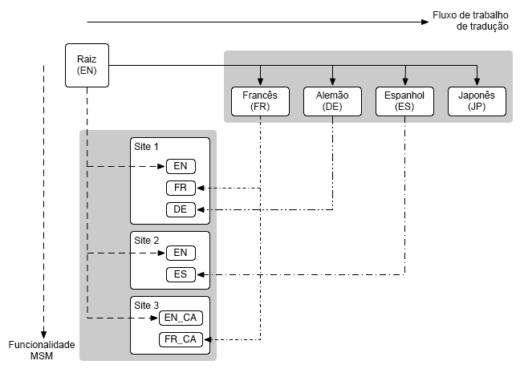

# Gerenciador de vários sites e tradução {#msm-and-translation}

O gerenciador de vários sites e as ferramentas de tradução integradas do Adobe Experience Manager simplificam a localização do conteúdo.

* O gerenciador de vários sites (MSM) e seus recursos de Live Copy permitem usar o conteúdo do mesmo site em vários locais, permitindo variações:
   * [Reutilizar conteúdo: gerenciador de vários sites e Live Copy](msm/overview.md)
* A ferramenta de tradução permite automatizar a tradução de conteúdo da página para criar e manter sites multilíngues:
   * [Tradução de conteúdo para sites multilíngues](translation/overview.md)

Esses dois recursos podem ser combinados para atender a sites que são, ao mesmo tempo, [multinacionais e multilíngues](#multinational-and-multilingual-sites).

>[!TIP]
>
>Se você é novo na tradução de conteúdo, consulte [Jornada de tradução de sites](/help/journey-sites/translation/overview.md). É um caminho guiado pela tradução de conteúdo do AEM Sites usando ferramentas de tradução poderosas do AEM; ideal se você não tiver experiência com AEM ou tradução.

## Sites multinacionais e multilíngues {#multinational-and-multilingual-sites}

É possível criar conteúdo para sites multinacionais e multilíngues com eficiência usando o gerenciador de vários sites e o fluxo de trabalho de tradução.

Normalmente, você cria um site principal em um idioma e para um país específico e, em seguida, usa esse conteúdo como base para os outros sites, usando a tradução quando necessário.

1. [Traduza](translation/overview.md) o site principal em diferentes idiomas.
1. Use o [Gerenciador de vários sites](msm/overview.md) para:
   1. Reutilizar o conteúdo do site principal e suas traduções para criar sites para outros países e culturas.
   1. Quando necessário, desconecte elementos das Live Copies para adicionar detalhes de localização.

>[!TIP]
>
>Limite o uso do gerenciador de vários sites para conteúdo em um único idioma.
>
>Por exemplo, use o inglês primário para criar a versão em inglês das páginas dos EUA, Canadá e Reino Unido. Em seguida, use o francês principal para criar a versão em francês das páginas da França, Suíça, Canadá e assim por diante.

O diagrama a seguir ilustra como os principais conceitos se cruzam (mas não mostra todos os níveis/elementos envolvidos):

Neste cenário, e em situações comparáveis, o MSM não gerencia as diferentes versões de idioma dessa maneira.

* [MSM](msm/overview.md) gerencia a implantação do conteúdo traduzido de um blueprint (ou seja, um conteúdo global primário) para as Live Copies (ou seja, os sites locais), dentro dos limites de um idioma.
* A variável [tradução](translation/overview.md) os recursos de integração do AEM, com serviços de gerenciamento de tradução de terceiros, gerenciam os idiomas e a tradução de conteúdo para esses diferentes idiomas.

Para casos de uso mais avançados, o MSM também pode ser usado em vários idiomas principais.

>[!TIP]
>
>Em todos os casos de uso, é recomendável ler as seguintes práticas recomendadas:
>
>* [Práticas recomendadas para MSM](msm/best-practices.md)
>* [Práticas recomendadas para tradução](translation/best-practices.md)
