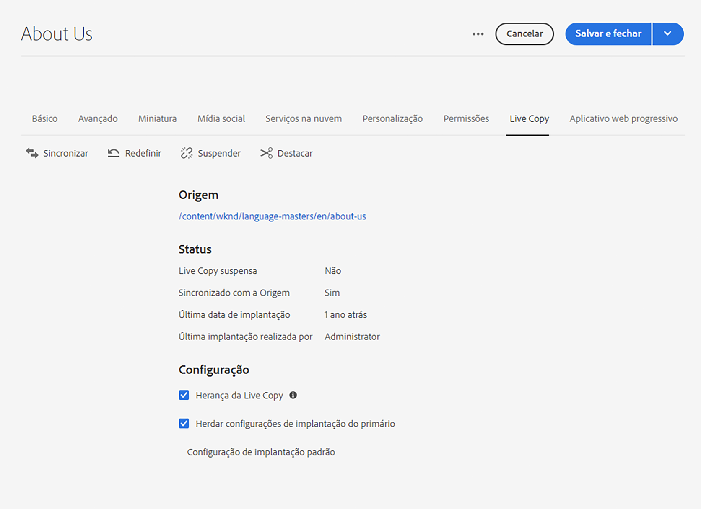
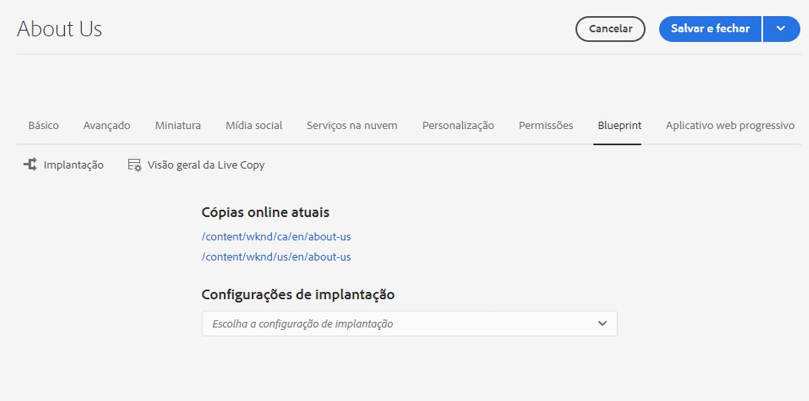
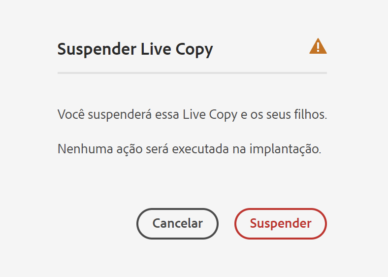

# Criação e sincronização de cópias em tempo real {#creating-and-synchronizing-live-copies}

Você pode criar uma Live Copy a partir de uma página ou configuração de blueprint para reutilizar esse conteúdo em seu site. Gerencie a herança e a sincronização, você pode controlar como as alterações no conteúdo são propagadas.

## Gerenciando configurações do Blueprint {#managing-blueprint-configurations}

Uma configuração de blueprint identifica um site existente que você deseja usar como origem de uma ou mais páginas de Live Copy.

>[!TIP]
>
>As configurações do Blueprint permitem que você envie alterações de conteúdo para Live Copies. Consulte [Live Copies - Origem, Blueprints e configurações do Blueprint](overview.md#source-blueprints-and-blueprint-configurations).

Ao criar uma configuração do blueprint, você seleciona um modelo que define a estrutura interna do blueprint. O modelo de blueprint padrão assume que o site de origem tem as seguintes características:

* O site tem uma página raiz.
* As páginas secundárias imediatas da raiz são ramificações de idioma do site. Ao criar uma Live Copy, os idiomas são apresentados como conteúdo opcional a ser incluído na cópia.
* A raiz de cada ramificação de idioma tem uma ou mais páginas secundárias. Ao criar uma Live Copy, as páginas filhas são apresentadas para que você possa incluir na Live Copy.

>[!NOTE]
>
>Uma estrutura diferente requer um modelo de blueprint diferente.

Após criar a configuração do blueprint, configure as seguintes propriedades:

* **Nome**: O nome da configuração do blueprint
* **Caminho** de origem: O caminho da página raiz do site que você está usando como fonte (blueprint)
* **Descrição**. (Opcional) Uma descrição da configuração do blueprint, que aparece na lista de configurações do blueprint para escolher ao criar um site

Quando sua configuração do blueprint é usada, você pode associá-la a uma configuração de implementação que determina como as Live Copies da origem/blueprint são sincronizadas. Consulte [Especificando as Configurações de Implantação para Usar](live-copy-sync-config.md#specifying-the-rollout-configurations-to-use).

### Como criar e editar configurações do Blueprint {#creating-editing-blueprint-configurations}

As configurações do Blueprint são consideradas dados imutáveis e, como tal, não são editáveis no tempo de execução. Por esse motivo, todas as alterações de configuração devem ser implantadas por meio do Git usando o pipeline de CI/CD.

Mais informações podem ser encontradas no artigo [Alterações importantes no Adobe Experience Manager (AEM) como Cloud Service.](/help/release-notes/aem-cloud-changes.md)

As etapas a seguir estão disponíveis para um administrador em uma instância de desenvolvimento local somente para fins de teste e desenvolvimento. Essas opções não estão disponíveis em nenhuma instância da nuvem do AEMaaCS.

#### Criação de uma configuração do Blueprint localmente {#creating-a-blueprint-configuration}

Para criar uma configuração do blueprint:

1.  Navegue até o menu  **** Ferramentas e selecione o  **** menu Sites.
1. Selecione **Blueprints** para abrir o console **Configurações do Blueprint**:

   

1. Selecione **Criar**.
1. Selecione o modelo do blueprint e **Next** para continuar.
1. Selecione a página de origem a ser usada como blueprint; em seguida **Próximo** para continuar.
1. Defina:

   * **Título**: título obrigatório para o blueprint
   * **Descrição**: uma descrição opcional para fornecer mais detalhes.

1. **** Criar criará a configuração do blueprint com base em sua especificação.

### Editar ou excluir uma configuração do Blueprint localmente{#editing-or-deleting-a-blueprint-configuration}

Você pode editar ou excluir uma configuração de blueprint existente:

1.  Navegue até o menu  **** Ferramentas e selecione o  **** menu Sites.
1. Selecione **Blueprints** para abrir o console **Configurações do Blueprint**:

   

1. Selecione a configuração necessária do blueprint; as ações apropriadas ficarão disponíveis na barra de ferramentas:

   * **Propriedades**; é possível usar essa opção para exibir e editar as propriedades da configuração.
   * **Excluir**

## Criação de uma Live Copy {#creating-a-live-copy}

Há várias maneiras de criar uma Live Copy.

### Criação de uma Live Copy de uma Página {#creating-a-live-copy-of-a-page}

Você pode criar uma Live Copy de qualquer página ou ramificação. Ao criar a Live Copy, você pode especificar as configurações de implementação a serem usadas para sincronizar o conteúdo:

* As configurações de implementação selecionadas se aplicam à página Live Copy e suas páginas filhas.
* Se você não especificar nenhuma configuração de implementação, o MSM determinará quais configurações de implementação usar. Consulte [Especificando a Configuração de Implantação a Ser Usada](live-copy-sync-config.md#specifying-the-rollout-configurations-to-use).

Você pode criar uma Live Copy de qualquer página:

* Páginas referenciadas por uma [configuração do blueprint](#creating-a-blueprint-configuration)
* E páginas que não têm conexão com uma configuração
* Live Copy nas páginas de outra Live Copy ([Live Copies aninhadas](overview.md#nested-live-copies))

A única diferença é que a disponibilidade do comando **Rollout** nas páginas de origem/blueprint depende de se a origem é referenciada por uma configuração de blueprint:

* Se você criar a Live Copy a partir de uma página de origem que **é** referenciada em uma configuração do blueprint, o comando Implantação estará disponível na(s) página(s) de origem/blueprint.
* Se você criar a Live Copy a partir de uma página de origem que **não é** referenciada em uma configuração do blueprint, o comando Implantação não estará disponível na(s) página(s) de origem/blueprint.

Para criar uma Live Copy:

1. No console **Sites** selecione **Criar**, em seguida **Live Copy**.

   

1. Selecione a página de origem e clique ou toque em **Próximo**. Por exemplo:

   

1. Especifique o caminho de destino da Live Copy (abra a pasta/página principal da Live Copy) e clique ou toque em **Próximo**.

   

   >[!NOTE]
   >
   >O caminho de destino não pode estar dentro do caminho de origem.

1. Informe:

   * um **Título** para a página.
   * um **Nome**, que é usado no URL.

   

1. Use a caixa de seleção **Excluir subpáginas**:

   * Selecionado: criar uma Live Copy somente da página selecionada (Live Copy superficial)
   * Não Selecionado: criar uma Live Copy que inclui todos os descendentes da página selecionada (deep Live Copy)

1. (Opcional) Para especificar uma ou mais configurações de implementação a serem usadas para a Live Copy, use a lista suspensa **Configurações de implementação** para selecioná-las. As configurações selecionadas serão mostradas abaixo do seletor suspenso.
1. Clique ou toque em **Criar**. Uma mensagem de confirmação será exibida; aqui, você pode selecionar **Open** ou **Concluído**.

### Criação de uma Live Copy de um Site a partir de uma Configuração do Blueprint {#creating-a-live-copy-of-a-site-from-a-blueprint-configuration}

Crie uma Live Copy usando uma configuração de blueprint para criar um site com base no conteúdo do blueprint (fonte). Ao criar uma Live Copy a partir de uma configuração do blueprint, você seleciona uma ou mais ramificações de idioma da origem do blueprint a serem copiadas e, em seguida, seleciona os capítulos a serem copiados das ramificações de idioma. Consulte [Criação de uma Configuração do Blueprint](#creating-a-blueprint-configuration).

Se você omitir algumas ramificações de idioma da Live Copy, poderá adicioná-las posteriormente. Consulte [Criação de uma Live Copy em uma Live Copy (Configuração do Blueprint)](#creating-a-live-copy-inside-a-live-copy-blueprint-configuration) para obter detalhes.

>[!CAUTION]
>
>Quando a origem do blueprint contém links e referências que direcionam um parágrafo em uma ramificação diferente, os destinos não são atualizados nas páginas de Live Copy, mas permanecem apontados para o destino original.

Ao criar o site, forneça valores para as seguintes propriedades:

* **Idiomas** iniciais: As ramificações de idioma da origem do blueprint a serem incluídas na Live Copy
* **Capítulos** iniciais: As páginas filhas das ramificações de idioma do blueprint a serem incluídas na Live Copy
* **Caminho** de destino: O local da página raiz do site Live Copy.
* **Título**: O título da página raiz do site Live Copy.
* **Nome**: (Opcional) O nome do nó JCR que armazena a página raiz da Live Copy (o valor padrão é baseado no título)
* **Proprietário** do Site: (Opcional) Informações sobre o responsável pela Live Copy
* **Live Copy**: Selecione essa opção para estabelecer uma relação ativa com o site de origem. Se você não selecionar essa opção, uma cópia do blueprint será criada, mas não será sincronizada subsequentemente com a origem.
* **Configurações** de implantação: (Opcional) Selecione uma ou mais configurações de implementação a serem usadas para sincronizar a Live Copy. Por padrão, as configurações de implementação são herdadas do blueprint. Consulte [Especificando as Configurações de Implantação para Usar](live-copy-sync-config.md#specifying-the-rollout-configurations-to-use) para obter mais detalhes.

Para criar uma Live Copy de um site a partir de uma configuração do blueprint:

1. No console **Sites**, selecione **Criar** e **Site** no seletor suspenso.
1. Selecione a configuração do blueprint a ser usada como a fonte da Live Copy e continue com **Next**:

   

1. Use o seletor **Idiomas iniciais** para especificar os idiomas do site do blueprint a serem usados na Live Copy.

   Todos os idiomas disponíveis são selecionados por padrão. Para remover um idioma, clique ou toque no **X** que aparece ao lado do idioma.

   Por exemplo:

   

1. Use o menu suspenso **Capítulos iniciais** para selecionar as seções do blueprint a serem incluídas na Live Copy. Todos os capítulos disponíveis são incluídos por padrão, mas podem ser removidos.
1. Forneça valores para as propriedades restantes e selecione **Create**. Na caixa de diálogo de confirmação, selecione **Concluído** para retornar ao console **Sites** ou **Abrir Site** para abrir a página raiz do site.

### Criação de uma Live Copy dentro de uma Live Copy (Configuração do Blueprint) {#creating-a-live-copy-inside-a-live-copy-blueprint-configuration}

Ao criar uma Live Copy dentro da Live Copy existente (criada usando uma configuração de blueprint), você pode inserir qualquer cópia de idioma ou capítulos que não foram incluídos quando a Live Copy foi originalmente criada.

## Monitorar a Live Copy {#monitoring-your-live-copy}

### Visualização do status de uma Live Copy {#seeing-the-status-of-a-live-copy}

As propriedades de uma página de Live Copy mostram as seguintes informações sobre a Live Copy:

* **Fonte**: A página de origem da página Live Copy.
* **Status**: O status de sincronização da Live Copy, incluindo se a Live Copy está atualizada com a origem, quando a última sincronização ocorreu e quem executou a sincronização
* **Configuração**:

   * Se a página ainda está sujeita à herança da Live Copy
   * Se a configuração é herdada da página principal
   * Todas as configurações de implementação que a Live Copy usa

Para exibir as propriedades:

1. No console **Sites**, selecione a página Live Copy e abra as propriedades.
1. Selecione a guia **Live Copy**.

   Por exemplo:

   

   Consulte a seção [Uso da visão geral da Live Copy](live-copy-overview.md#using-the-live-copy-overview) no artigo Console Visão geral da Live Copy para obter mais detalhes.

### Ver as cópias em tempo real de uma página do Blueprint {#seeing-the-live-copies-of-a-blueprint-page}

As páginas do blueprint (referenciadas em uma configuração do blueprint) fornecem uma lista das páginas da Live Copy que usam a página atual (blueprint) como fonte. Use esta lista para rastrear as Live Copies. A lista é exibida na guia **Blueprint** das [propriedades da página](/help/sites-cloud/authoring/fundamentals/page-properties.md).

## Sincronização da Live Copy {#synchronizing-your-live-copy}

Há várias maneiras de sincronizar sua Live Copy.

### Implantação de um blueprint {#rolling-out-a-blueprint}

Implemente uma página de blueprint para enviar alterações de conteúdo às Live Copies. Uma ação **Rollout** executa as configurações de implementação que usam o acionador [Na implantação](live-copy-sync-config.md#rollout-triggers).

>[!NOTE]
>
>Conflitos podem ocorrer se novas páginas com o mesmo nome de página forem criadas na ramificação do blueprint e em uma ramificação dependente da Live Copy.
>
>Esses [conflitos precisam ser tratados e resolvidos na implantação](rollout-conflicts.md).

#### Implantação de um blueprint nas propriedades da página {#rolling-out-a-blueprint-from-page-properties}

1. No console **Sites**, selecione a página no blueprint e abra as propriedades.
1. Abra a guia **Blueprint.**
1. Selecione **Implantação**.

   

1. Especifique as páginas e quaisquer subpáginas e, em seguida, confirme com a marca de seleção:

   

1. Especifique se o trabalho de implementação deve ser executado imediatamente (**Now**) ou em outra data/hora (**Later**).

   

As implantações são processadas como trabalhos assíncronos e podem ser verificadas na página [***Status de Trabalhos Assíncronos**.](/help/operations/asynchronous-jobs.md#monitor-the-status-of-asynchronous-operations)

#### Implantar um blueprint no painel de referência {#roll-out-a-blueprint-from-the-reference-rail}

1. No console **Sites**, selecione a página na live copy e abra o painel **[Referências](/help/sites-cloud/authoring/getting-started/basic-handling.md#references)** (na barra de ferramentas).
1. Selecione a opção **Blueprint** na lista para mostrar os blueprints associados a esta página.
1. Selecione o blueprint necessário na lista.
1. Clique ou toque em **Implantação**.

   

1. Você receberá uma solicitação para confirmar os detalhes da implantação:

   * **Escopo da implantação**:

      Especifique se o escopo é apenas para a página selecionada ou deve incluir subpáginas.

   * **Programação**:

      Especifique se o trabalho de implementação deve ser executado imediatamente (**Now**) ou em uma data/hora posterior (**Mais Tarde**).

      

1. Depois de confirmar esses detalhes, selecione **Rollout** para executar a ação.

As implantações são processadas como trabalhos assíncronos e podem ser verificadas na página [**Status de Trabalhos Assíncronos**.](/help/operations/asynchronous-jobs.md#monitor-the-status-of-asynchronous-operations)

#### Implantar um blueprint na visão geral da Live Copy {#roll-out-a-blueprint-from-the-live-copy-overview}

A ação [**Rollout** também está disponível na Visão geral da Live Copy](live-copy-overview.md#using-the-live-copy-overview), quando uma página do Blueprint é selecionada.

1. Abra o [Visão geral da Live Copy](live-copy-overview.md#using-the-live-copy-overview) e selecione uma Página do Blueprint.
1. Selecione **Implantação** na barra de ferramentas.

   

1. Especifique as páginas e quaisquer subpáginas e, em seguida, confirme com a marca de seleção:

   

1. Especifique se o trabalho de implementação deve ser executado imediatamente (**Now**) ou em outra data/hora (**Later**).

   

As implantações são processadas como trabalhos assíncronos e podem ser verificadas na página [**Status de Trabalhos Assíncronos**.](/help/operations/asynchronous-jobs.md#monitor-the-status-of-asynchronous-operations)

### Sincronização de uma Live Copy {#synchronizing-a-live-copy}

Sincronize uma página de Live Copy para extrair as alterações de conteúdo da origem para a Live Copy.

#### Sincronizar uma Live Copy das propriedades da página {#synchronize-a-live-copy-from-page-properties}

Sincronize uma Live Copy para extrair as alterações da origem para a Live Copy.

>[!NOTE]
>
>A sincronização executa as configurações de implementação que usam o acionador [Na implantação](live-copy-sync-config.md#rollout-triggers).

1. No console **Sites**, selecione a página Live Copy e abra as propriedades.
1. Abra a guia **Live Copy**.
1. Clique ou toque em **Sincronizar**.

   

   A confirmação será solicitada, use **Sync** para continuar.

#### Sincronizar uma Live Copy da visão geral da Live Copy {#synchronize-a-live-copy-from-the-live-copy-overview}

A ação [Sincronizar também está disponível na Visão geral da Live Copy](live-copy-overview.md#using-the-live-copy-overview), quando uma página de Live Copy é selecionada.

1. Abra o [Visão geral da Live Copy](live-copy-overview.md#using-the-live-copy-overview) e selecione uma Página da Live Copy.
1. Selecione **Sincronizar** na barra de ferramentas.
1. Confirme a ação **Rollout** na caixa de diálogo depois de especificar se deseja incluir:

   * **Páginas e subpáginas**
   * **Somente página**

   

## Alterar conteúdo da Live Copy {#changing-live-copy-content}

Para alterar o conteúdo da Live Copy, você pode:

* Adicionar parágrafos à página.
* Atualize o conteúdo existente quebrando a herança da Live Copy de qualquer página ou componente.

>[!TIP]
>
>Se você criar manualmente uma nova página na Live Copy, a nova página será local para a Live Copy, o que significa que ela não tem uma página de origem correspondente à qual está anexada.
>
>Como prática recomendada para criar uma página local que faça parte do relacionamento, é criar a página local na origem e executar uma implantação profunda. Essa ação criará a página localmente como Live Copies.

>[!NOTE]
>
>Conflitos podem ocorrer se novas páginas com o mesmo nome de página forem criadas na ramificação do blueprint e em uma ramificação dependente da Live Copy.
>
>Esses [conflitos precisam ser tratados e resolvidos na implantação](rollout-conflicts.md).

### Adicionar componentes a uma página de Live Copy {#adding-components-to-a-live-copy-page}

Você pode adicionar componentes a uma página de Live Copy a qualquer momento. O status de herança da Live Copy e de seu sistema de parágrafo não controla sua capacidade de adicionar componentes.

Quando a página Live Copy é sincronizada com a página de origem, os componentes adicionados permanecem inalterados. Consulte também [Alteração da ordem dos componentes em uma página de Live Copy.](#changing-the-order-of-components-on-a-live-copy-page)

>[!TIP]
>
>As alterações feitas localmente em um componente marcado como um contêiner não serão substituídas pelo conteúdo do blueprint em uma implementação. Consulte [Práticas recomendadas do MSM](best-practices.md#components-and-container-synchronization) para obter mais informações.

### Suspensão da herança de uma página {#suspending-inheritance-for-a-page}

Ao criar uma Live Copy, a configuração da Live Copy é salva na página raiz das páginas copiadas. Todas as páginas filhas da página raiz herdam as configurações da Live Copy. Os componentes nas páginas de Live Copy também herdam a configuração de Live Copy.

Você pode suspender a herança da Live Copy de uma página Live Copy para poder alterar as propriedades e os componentes da página. Quando você suspende a herança, as propriedades e os componentes da página não são mais sincronizados com a fonte.

>[!TIP]
>
>Você também pode [desconectar uma Live Copy](#detaching-a-live-copy) de seu blueprint para remover todas as conexões. Ao contrário da suspensão da herança, a ação de desanexar é permanente e não reversível.

#### Suspensão da herança das propriedades da página {#suspending-inheritance-from-page-properties}

Para suspender a herança em uma página:

1. Abra as propriedades da página Live Copy usando o comando **Exibir propriedades** do console **Sites** ou usando **Informações da página** na barra de ferramentas da página.
1. Clique ou toque na guia **Live Copy**.
1. Selecione **Suspender** na barra de ferramentas. Em seguida, é possível selecionar:

   * **Suspender**: para suspender somente a página atual.
   * **Suspender com filhos**: para suspender a página atual junto com qualquer página secundária.

1. Selecione **Suspender** na caixa de diálogo de confirmação.

#### Suspensão da herança da visão geral da Live Copy {#suspending-inheritance-from-the-live-copy-overview}

A ação [Suspender também está disponível na Visão geral da Live Copy](live-copy-overview.md#using-the-live-copy-overview), quando uma página de Live Copy é selecionada.

1. Abra o [Visão geral da Live Copy](live-copy-overview.md#using-the-live-copy-overview) e selecione uma Página da Live Copy.
1. Selecione **Suspender** na barra de ferramentas.
1. Selecione a opção apropriada de:

   * **Suspender**
   * **Suspender com secundários**

   

1. Confirme a ação **Suspender** na caixa de diálogo **Suspender Live Copy**:

   

### Retomando a herança de uma página {#resuming-inheritance-for-a-page}

Suspender a herança da Live Copy para uma página é uma ação temporária. Uma vez suspensa, a ação **Resume** fica disponível, permitindo que você reinstale a relação ativa.

Quando você reativa a herança, a página não é sincronizada automaticamente com a fonte. Você pode solicitar uma sincronização, se necessário:

* Na caixa de diálogo **Retomar**/**Reverter**; por exemplo:

   

* Em um estágio posterior, selecionando manualmente a ação de sincronização.

>[!NOTE]
>
>Quando você reativa a herança, a página não é sincronizada automaticamente com a fonte. Se isso for necessário, é possível solicitar manualmente uma sincronização no momento da retomada ou posteriormente.

#### Retomando herança das propriedades da página {#resuming-inheritance-from-page-properties}

Depois de [suspenso](#suspending-inheritance-from-page-properties) a ação **Retomar** torna-se na barra de ferramentas das propriedades da página:

Quando selecionada, a caixa de diálogo será exibida. É possível selecionar uma sincronização, se necessário, e confirmar a ação.

#### Retomar uma página de Live Copy da visão geral da Live Copy {#resume-a-live-copy-page-from-the-live-copy-overview}

A ação [Retomar também está disponível na Visão geral da Live Copy](live-copy-overview.md#using-the-live-copy-overview), quando uma página de Live Copy é selecionada.

1. Abra o [Visão geral da Live Copy](live-copy-overview.md#using-the-live-copy-overview) e selecione uma Página da Live Copy que foi suspensa. A página será exibida como **INHERANÇA CANCELADA**.
1. Selecione **Retomar** na barra de ferramentas.
1. Indique se deseja sincronizar a página após reverter a herança e, em seguida, confirme a ação **Resume** na caixa de diálogo **Resume Live Copy**.

### Alterar a profundidade da herança (superficial/profunda) {#changing-inheritance-depth-shallow-deep}

Em uma Live Copy existente, é possível alterar a profundidade de uma página, ou seja, se as páginas filhas estão incluídas.

* Alternando para uma Live Copy superficial:

   * Terá efeito imediato e não será reversível.

   * Detalha páginas filhas explicitamente na Live Copy. Não é possível manter outras modificações em crianças se estas forem anuladas.

   * Remove qualquer descendente `LiveRelationships` mesmo se houver `LiveCopies` aninhado.

* Alternando para uma Live Copy detalhada:

   * Deixa páginas secundárias intactas.
   * Para ver o efeito do switch, é possível fazer uma implantação, qualquer modificação de conteúdo é aplicada de acordo com a configuração de implantação.

* Alternar para uma Live Copy superficial e, em seguida, voltar para o profundo:

   * Trata todos os filhos da (antiga) Live Copy superficial como se tivessem sido criados manualmente e, portanto, são movidos para fora usando `[oldname]_msm_moved name`.

Para especificar ou alterar a profundidade:

1. Abra as propriedades da página Live Copy usando o comando **Exibir propriedades** do console **Sites** ou usando **Informações da página** na barra de ferramentas da página.
1. Clique ou toque na guia **Live Copy**.
1. Na seção **Configuration**, defina ou desmarque a opção **Herança da Live Copy**, dependendo se as páginas filhas estão incluídas:

   * Marcado - uma Live Copy profunda (as páginas filhas estão incluídas)
   * Desmarcado - uma Live Copy superficial (páginas filhas são excluídas)

   >[!CAUTION]
   >
   >A alternância para uma Live Copy superficial terá efeito imediato e não será reversível.
   >
   >Consulte [Live Copies - Composição](overview.md#live-copies-composition) para obter mais informações.

1. Clique ou toque em **Salvar** para continuar suas atualizações.

### Cancelar herança de um Componente {#cancelling-inheritance-for-a-component}

Cancele a herança da Live Copy de um componente para que ele não seja mais sincronizado com o componente de origem. Você pode ativar a herança em um ponto posterior, se necessário.

>[!NOTE]
>
>Quando você reativa a herança, o componente não é sincronizado automaticamente com a origem. Você pode solicitar manualmente uma sincronização, se necessário.

Cancelar herança para alterar o conteúdo do componente ou excluir o componente:

1. Clique ou toque no componente para o qual deseja cancelar a herança.

   

1. Na barra de ferramentas do componente, clique ou toque no ícone **Cancelar herança**.

   

1. Na caixa de diálogo Cancelar herança, confirme a ação com **Sim**.

   A barra de ferramentas do componente é atualizada para incluir todos os comandos de edição (apropriados).

### Ativar novamente a herança de um componente {#re-enabling-inheritance-for-a-component}

Para ativar a herança de um componente, clique ou toque no ícone **Reativar herança** na barra de ferramentas do componente.

### Alteração da ordem dos componentes em uma página de Live Copy {#changing-the-order-of-components-on-a-live-copy-page}

Se uma Live Copy contiver componentes que fazem parte de um sistema de parágrafo, a herança desse sistema de parágrafo observará as seguintes regras:

* A ordem dos componentes em um sistema de parágrafo herdado pode ser modificada, mesmo com herança estabelecida.
* Na implantação, a ordem dos componentes será restaurada a partir do blueprint. Se novos componentes tiverem sido adicionados à Live Copy antes da implantação, eles serão reorganizados junto com os componentes acima dos quais foram adicionados.
* Se a herança do sistema de parágrafo for cancelada, a ordem dos componentes não será restaurada na implantação e permanecerá como está na Live Copy.

>[!NOTE]
>
>Ao reverter uma herança cancelada em um sistema de parágrafo, a ordem dos componentes **não será restaurada automaticamente** a partir do blueprint. Você pode solicitar manualmente uma sincronização, se necessário.

Use o procedimento a seguir para cancelar a herança do sistema de parágrafo.

1. Abra a página Live Copy .
1. Arraste um componente existente para um novo local na página.
1. Na caixa de diálogo **Cancelar herança**, confirme a ação com **Sim**.

### Substituição das propriedades de uma página de Live Copy {#overriding-properties-of-a-live-copy-page}

As propriedades de página de uma página de Live Copy são herdadas da página de origem por padrão e não são editáveis.

Você pode cancelar a herança de uma propriedade quando precisar alterar o valor da propriedade para a Live Copy. Um ícone de link indica que a herança está ativada para a propriedade.

Ao cancelar a herança, você pode alterar o valor da propriedade. Um ícone de link quebrado indica que a herança foi cancelada.

Posteriormente, você pode reativar a herança de uma propriedade, se necessário.

>[!NOTE]
>
>Quando você reativa a herança, a propriedade da página Live Copy não é sincronizada automaticamente com a propriedade de origem. Você pode solicitar manualmente uma sincronização, se necessário.

1. Abra as propriedades da página Live Copy usando a opção **Exibir propriedades** do console **Sites** ou o ícone **Informações da página** na barra de ferramentas da página.
1. Para cancelar a herança de uma propriedade, clique ou toque no ícone de link exibido à direita da propriedade.

   

1. Na caixa de diálogo de confirmação **Cancelar herança**, clique ou toque em **Sim**.

### Reverter propriedades de uma página de Live Copy {#revert-properties-of-a-live-copy-page}

Para habilitar a herança de uma propriedade, clique ou toque no ícone **Reverter herança** que aparece ao lado da propriedade.

### Redefinir uma página de Live Copy {#resetting-a-live-copy-page}

Você pode redefinir uma página de Live Copy para:

* Remova todos os cancelamentos de herança e
* Retorne a página ao mesmo estado que a página de origem.

A redefinição afeta as alterações feitas nas propriedades da página, no sistema de parágrafo e nos componentes.

#### Redefinir uma página de Live Copy a partir das propriedades da página {#reset-a-live-copy-page-from-the-page-properties}

1. No console **Sites**, selecione a página Live Copy e selecione **Exibir propriedades**.
1. Abra a guia **Live Copy**.
1. Selecione **Redefinir** na barra de ferramentas.

   

1. Na caixa de diálogo **Redefinir Live Copy**, confirme com **Redefinir**.

#### Redefinir uma página de Live Copy a partir da visão geral da Live Copy {#reset-a-live-copy-page-from-the-live-copy-overview}

A ação [**Redefinir** também está disponível na Visão geral da Live Copy](live-copy-overview.md#using-the-live-copy-overview), quando uma página de Live Copy é selecionada.

1. Abra o [Visão geral da Live Copy](live-copy-overview.md#using-the-live-copy-overview) e selecione uma Página da Live Copy.
1. Selecione **Redefinir** na barra de ferramentas.
1. Confirme a ação **Redefinir** na caixa de diálogo **Redefinir Live Copy**:

   

## Comparação de uma página de Live Copy com uma página do Blueprint {#comparing-a-live-copy-page-with-a-blueprint-page}

Para rastrear as alterações feitas, é possível exibir a página do blueprint em **Referências** e compará-la com a página Live Copy:

1. No console **Sites**, [navegue até uma página de blueprint ou Live Copy e selecione-a.](/help/sites-cloud/authoring/getting-started/basic-handling.md#viewing-and-selecting-resources)
1. Abra o painel **[Referências](/help/sites-cloud/authoring/getting-started/basic-handling.md#references)** e, dependendo do contexto, selecione um dos seguintes itens:

   * **Blueprint**
   * **Live Copies**

1. Selecione sua Live Copy específica dependendo do contexto e selecione:

   * **Comparar ao Blueprint**
   * **Comparar à Live Copy**

   Por exemplo:

   

1. As páginas Live Copy e blueprint serão abertas lado a lado.

   Para obter informações completas sobre como usar o recurso de comparação, consulte [Diff de página](/help/sites-cloud/authoring/features/page-diff.md).

## Desanexar uma Live Copy {#detaching-a-live-copy}

A ação de desanexar remove permanentemente o relacionamento em tempo real entre uma Live Copy e sua página de origem/blueprint. Todas as propriedades relevantes ao MSM são removidas da Live Copy e as páginas da Live Copy se tornam uma cópia independente.

>[!CAUTION]
>
>Não é possível restabelecer a relação ativa após desconectar a Live Copy.
>
>Para remover o relacionamento dinâmico com a opção de reinstalação posterior, você pode [cancelar a herança da Live Copy](#suspending-inheritance-for-a-page) para a página.

Há implicações em onde na árvore você usa **Desanexar**:

* **Desanexar em uma página raiz de uma Live Copy**

   Quando essa operação é executada na página raiz de uma Live Copy, ela remove o relacionamento em tempo real entre todas as páginas do blueprint e sua Live Copy.

   Outras alterações nas páginas no blueprint **não** afetarão a Live Copy.

* **Desanexar em uma subpágina de uma Live Copy**

   Quando esta operação é executada em uma subpágina (ou ramificação) dentro de uma Live Copy:

   * A relação ao vivo é removida para essa subpágina (ou ramificação) e
   * As (sub)páginas na ramificação Live Copy são tratadas como se tivessem sido criadas manualmente.

   No entanto, as subpáginas ainda estão sujeitas ao relacionamento em tempo real da ramificação pai, portanto, uma nova implantação das páginas do blueprint ambas:

   1. Renomeie as páginas desconectadas:

      * Isso ocorre porque o MSM os considera páginas criadas manualmente que causam um conflito, pois têm o mesmo nome das páginas da Live Copy que ele está tentando criar.
   1. Crie uma nova página de Live Copy com o nome original, contendo as alterações da implantação.

   >[!NOTE]
   >
   >Consulte [Conflitos de implementação MSM](rollout-conflicts.md) para obter detalhes sobre tais situações.

### Desanexar uma página de Live Copy das propriedades da página {#detach-a-live-copy-page-from-the-page-properties}

Para desanexar uma Live Copy:

1. No console **Sites**, selecione a página Live Copy e clique ou toque em **Exibir propriedades**.
1. Abra a guia **Live Copy**.
1. Na barra de ferramentas, selecione **Desanexar**.

   

1. Uma caixa de diálogo de confirmação será exibida, selecione **Desanexar** para concluir a ação.

### Desanexar uma página de Live Copy da visão geral da Live Copy {#detach-a-live-copy-page-from-the-live-copy-overview}

A ação [Desanexar também está disponível na Visão geral da Live Copy](live-copy-overview.md#using-the-live-copy-overview), quando uma página de Live Copy é selecionada.

1. Abra o [Visão geral da Live Copy](live-copy-overview.md#using-the-live-copy-overview) e selecione uma Página da Live Copy.
1. Selecione **Desanexar** na barra de ferramentas.
1. Confirme a ação **Desanexar** na caixa de diálogo **Desanexar Live Copy**:

   
