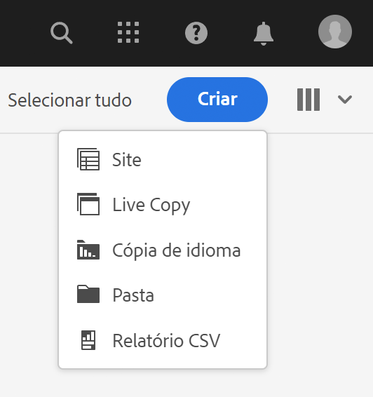

# Criação e sincronização de Live Copies {#creating-and-synchronizing-live-copies}

E possível criar uma Live Copy a partir de uma página ou configuração de blueprint para reutilizar esse conteúdo em seu site. Gerencie a herança e a sincronização, onde é possível controlar como as alterações no conteúdo são propagadas.

## Gerenciando configurações de blueprint {#managing-blueprint-configurations}

Uma configuração de blueprint identifica um site existente que você deseja usar como origem para uma ou mais páginas Live Copy.

>[!TIP]
>
>As configurações de blueprint permitem enviar alterações de conteúdo para Live Copies. Consulte [Live Copies - Origem, blueprints e configurações de blueprint](overview.md#source-blueprints-and-blueprint-configurations).

Ao criar uma configuração de blueprint, você seleciona um modelo que define a estrutura interna do blueprint. O modelo de blueprint padrão presume que o site de origem tem as seguintes características:

* O site tem uma página raiz.
* As páginas secundárias diretas da raiz são ramificações de idioma do site. Ao criar uma Live Copy, os idiomas são apresentados como conteúdo opcional a ser incluído na cópia.
* A raiz de cada ramificação de idioma tem uma ou mais páginas secundárias. Ao criar uma Live Copy, as páginas secundárias são apresentadas para que você possa incluí-las na Live Copy.

>[!NOTE]
>
>Uma estrutura diferente exige um modelo de blueprint diferente.

Após criar a configuração de blueprint, configure as seguintes propriedades:

* **Nome**: o nome da configuração de blueprint
* **Caminho de origem**: o caminho da página raiz do site que você está usando como origem (blueprint)
* **Descrição**. (Opcional) Uma descrição da configuração de blueprint, que aparece na lista de configurações de blueprint para escolher ao criar um site

Quando sua configuração de blueprint é usada, você pode associá-la a uma configuração de implantação que determina como as Live Copies da origem/blueprint são sincronizadas. Consulte [Especificar as configurações de implantação a serem usadas](live-copy-sync-config.md#specifying-the-rollout-configurations-to-use).

### Criar e editar configurações de blueprint {#creating-editing-blueprint-configurations}

As configurações de blueprint são consideradas dados imutáveis e, como tal, não são editáveis no tempo de execução. Por esse motivo, todas as alterações de configuração devem ser implantadas por meio do Git usando o pipeline de CI/CD.

Mais informações podem ser encontradas no artigo [Alterações importantes no Adobe Experience Manager (AEM) as a Cloud Service](/help/release-notes/aem-cloud-changes.md).

As etapas a seguir estão disponíveis para um administrador em uma instância de desenvolvimento local somente para fins de teste e desenvolvimento. Estas opções não estão disponíveis em nenhuma instância da nuvem do AEMaaCS.

#### Criação de uma configuração de blueprint localmente {#creating-a-blueprint-configuration}

Para criar uma configuração de blueprint:

1. [Navegue](/help/sites-cloud/authoring/getting-started/basic-handling.md#global-navigation) até o menu **Ferramentas** e, em seguida, selecione o menu **Sites**.
1. Selecione **Blueprints** para abrir o console de **Configurações de blueprint**:

   

1. Selecione **Criar**.
1. Selecione o modelo de blueprint e depois selecione **Próximo** para continuar.
1. Selecione a página de origem a ser usada como blueprint; depois, selecione **Próximo** para continuar.
1. Defina:

   * **Título**: título obrigatório para o blueprint
   * **Descrição**: uma descrição opcional para fornecer mais detalhes.

1. **Criar** irá criar a configuração de blueprint com base em sua especificação.

### Editar ou excluir uma configuração de blueprint localmente{#editing-or-deleting-a-blueprint-configuration}

É possível editar ou excluir uma configuração de blueprint existente:

1. [Navegue](/help/sites-cloud/authoring/getting-started/basic-handling.md#global-navigation) até o menu **Ferramentas** e, em seguida, selecione o menu **Sites**.
1. Selecione **Blueprints** para abrir o console de **Configurações de blueprint**:

   

1. Selecione a configuração necessária para o blueprint - as ações apropriadas ficarão disponíveis na barra de ferramentas:

   * **Propriedades**; é possível usar essa opção para visualizar e editar as propriedades da configuração.
   * **Excluir**

## Criação de uma Live Copy {#creating-a-live-copy}

Há diversas maneiras de criar uma Live Copy.

### Criação de uma Live Copy de uma página {#creating-a-live-copy-of-a-page}

É possível criar uma Live Copy de qualquer página ou ramificação. Ao criar a Live Copy, é possível especificar as configurações de implantação a serem usadas para sincronizar o conteúdo:

* As configurações de implantação selecionadas se aplicam à página Live Copy e suas páginas secundárias.
* Se você não especificar nenhuma configuração de implantação, o MSM determinará quais configurações de implantação usar. Consulte [Especificação da configuração de implantação a ser usada](live-copy-sync-config.md#specifying-the-rollout-configurations-to-use).

É possível criar uma Live Copy de qualquer página:

* Páginas referenciadas por uma [configuração de blueprint](#creating-a-blueprint-configuration)
* E páginas que não têm conexão com uma configuração
* Live Copy dentro das páginas de outra Live Copy ([Live Copies aninhadas](overview.md#nested-live-copies))

A única diferença é que a disponibilidade do comando **Implantação** nas páginas de origem/blueprint depende da origem ser ou não referenciada por uma configuração de blueprint:

* Se você criar a Live Copy a partir de uma página de origem que **é** referenciada em uma configuração de blueprint, o comando Implantação estará disponível nas páginas de origem/blueprint.
* Se você criar a Live Copy a partir de uma página de origem que **não é** referenciada em uma configuração de blueprint, o comando Implantação não estará disponível nas páginas de origem/blueprint.

Para criar uma Live Copy:

1. No console do **Sites**, selecione **Criar** e, em seguida, **Live Copy**.

   

1. Selecione a página de origem e clique ou toque em **Próximo**. Por exemplo:

   

1. Especifique o caminho de destino da Live Copy (abra a pasta/página principal da Live Copy) e clique ou toque em **Próximo**.

   

   >[!NOTE]
   >
   >O caminho de destino não pode estar dentro do caminho de origem.

1. Insira:

   * um **Título** para a página.
   * um **Nome**, que é usado no URL.

   

1. Use a caixa de seleção **Excluir subpáginas**:

   * Selecionado: cria uma Live Copy somente da página selecionada (Live Copy superficial)
   * Não selecionado: cria uma Live Copy que inclui todos os descendentes da página selecionada (Live Copy profunda)

1. (Opcional) Para especificar uma ou mais configurações de implantação a serem usadas na Live Copy, use a lista suspensa **Configurações de implantação** para selecioná-las. As configurações selecionadas serão exibidas abaixo do seletor da lista suspensa.
1. Clique ou toque em **Criar**. Uma mensagem de confirmação será exibida, e daqui será possível selecionar **Abrir** ou **Concluído**.

   >[!NOTE]
   >
   >Uma caixa de diálogo de erro pode ser exibida com a mensagem “Falha ao enviar o formulário”. Isso acontece devido a um tempo limite de rede. No entanto, o processo para criar a live copy está em execução em segundo plano. Aguarde alguns minutos e verifique se as páginas da live copy foram criadas corretamente.

### Criação de uma Live Copy de um site a partir de uma configuração de blueprint {#creating-a-live-copy-of-a-site-from-a-blueprint-configuration}

Crie uma Live Copy usando uma configuração de blueprint para criar um site com base no conteúdo do blueprint (origem). Ao criar uma Live Copy a partir de uma configuração de blueprint, você seleciona uma ou mais ramificações de idioma para serem copiadas da origem do blueprint e, em seguida, seleciona os capítulos a serem copiados das ramificações de idioma. Consulte [Criação de uma configuração de blueprint](#creating-a-blueprint-configuration).

Se omitir algumas ramificações de idioma da Live Copy, você poderá adicioná-las posteriormente. Consulte [Criação de uma Live Copy dentro de uma Live Copy (configuração de blueprint)](#creating-a-live-copy-inside-a-live-copy-blueprint-configuration) para obter mais detalhes.

>[!CAUTION]
>
>Quando a origem do blueprint contém links e referências que fazem referência a um parágrafo em uma ramificação diferente, os destinos não são atualizados nas páginas Live Copy, mas permanecem apontando para o destino original.

Ao criar o site, forneça valores para as seguintes propriedades:

* **Idiomas iniciais**: as ramificações de idioma da origem do blueprint a serem incluídas na Live Copy.
* **Capítulos iniciais**: as páginas secundárias das ramificações de idioma do blueprint a serem incluídas na Live Copy.
* **Caminho de destino**: o local da página raiz do site Live Copy.
* **Título**: o título da página raiz do site Live Copy.
* **Nome**: (opcional) o nome do nó JCR que armazena a página raiz da Live Copy (o valor padrão é baseado no título).
* **Proprietário do site**: (opcional) informações sobre o responsável pela Live Copy.
* **Live Copy**: selecione essa opção para estabelecer uma relação dinâmica com o site de origem. Se essa opção não for selecionada, uma cópia do blueprint será criada, mas não será sincronizada com a origem na sequência.
* **Configurações de implantação**: (opcional) selecione uma ou mais configurações de implantação a serem usadas para sincronizar a Live Copy. Por padrão, as configurações de implantação são herdadas do blueprint. Consulte [Especificar as configurações de implantação a serem usadas](live-copy-sync-config.md#specifying-the-rollout-configurations-to-use) para obter mais detalhes.

Para criar uma Live Copy de um site a partir de uma configuração de blueprint:

1. No console dos **Sites**, selecione **Criar** e, em seguida, **Site** no seletor da lista suspensa.
1. Selecione a configuração de blueprint a ser usada como origem da Live Copy e prossiga com **Próximo**:

   

1. Use o seletor de **Idiomas iniciais** para especificar o(s) idioma(s) do site do blueprint a serem usados na Live Copy.

   Todos os idiomas disponíveis estão selecionados por padrão. Para remover um idioma, clique ou toque no botão **X** que aparece ao lado do idioma.

   Por exemplo:

   

1. Use a lista suspensa **Capítulos iniciais** para selecionar as seções do blueprint que serão incluídas na Live Copy. Todos os capítulos disponíveis estão incluídos por padrão, mas podem ser removidos.
1. Forneça valores para as propriedades restantes e selecione **Criar**. Na caixa de diálogo de confirmação, selecione **Concluído** para retornar ao console do **Sites** ou **Abrir site** para abrir a página raiz do site.

### Criação de uma Live Copy dentro de uma Live Copy (configuração do blueprint) {#creating-a-live-copy-inside-a-live-copy-blueprint-configuration}

Ao criar uma Live Copy dentro da Live Copy existente (criada usando uma configuração de blueprint), é possível inserir qualquer cópia de idioma ou capítulos que não foram incluídos quando a Live Copy foi originalmente criada.

## Monitorar a Live Copy {#monitoring-your-live-copy}

### Visualização do status de uma Live Copy {#seeing-the-status-of-a-live-copy}

As propriedades de uma página Live Copy mostram as seguintes informações sobre ela:

* **Origem**: a página de origem da página Live Copy
* **Status**: o status de sincronização da Live Copy, incluindo se a Live Copy está atualizada em relação à origem, quando a última sincronização ocorreu e quem executou a sincronização
* **Configuração**:

   * Se a página ainda está sujeita à herdar da Live Copy
   * Se a configuração é herdada da página principal
   * Todas as configurações de implantação que a Live Copy usa

Para exibir as propriedades:

1. No console do **Sites**, selecione a página Live Copy e abra as propriedades.
1. Selecione a guia **Live Copy**.

   Por exemplo:

   

   Consulte a seção [Uso da visão geral da Live Copy](live-copy-overview.md#using-the-live-copy-overview) no artigo Console da visão geral da Live Copy para obter mais detalhes.

### Visualizar as Live Copies de uma página de blueprint {#seeing-the-live-copies-of-a-blueprint-page}

As páginas de blueprint (referenciadas em uma configuração de blueprint) fornecem uma lista das páginas Live Copy que usam a página atual (blueprint) como origem. Use esta lista para monitorar as Live Copies. A lista é exibida na guia **Blueprint** das [propriedades da página](/help/sites-cloud/authoring/fundamentals/page-properties.md).

## Sincronização da Live Copy {#synchronizing-your-live-copy}

Há diversas maneiras de sincronizar a Live Copy.

### Implantação de um blueprint {#rolling-out-a-blueprint}

Implemente uma página de blueprint para enviar alterações de conteúdo às Live Copies. Uma ação de **Implantação** executa as configurações de implementação que usam acionador [Na implantação](live-copy-sync-config.md#rollout-triggers).

>[!NOTE]
>
>Conflitos podem ocorrer se novas páginas com o mesmo nome de página forem criadas na ramificação do blueprint e em uma ramificação dependente da Live Copy.
>
>Tais [conflitos precisam ser tratados e resolvidos na implantação](rollout-conflicts.md).

#### Implantação de um blueprint nas propriedades da página {#rolling-out-a-blueprint-from-page-properties}

1. No console do **Sites**, selecione a página no blueprint e abra as propriedades.
1. Abra a guia **Blueprint.**
1. Selecione **Implantação**.

   

1. Especifique as páginas e quaisquer subpáginas e, em seguida, confirme com a marca de seleção:

   

1. Especifique se o trabalho de implantação deve ser executado imediatamente (**Agora**) ou em outra data/hora (**Mais tarde**).

   

As implantações são processadas como processos assíncronos e podem ser verificadas na página [***Status dos processos assíncronos**](/help/operations/asynchronous-jobs.md#monitor-the-status-of-asynchronous-operations).

#### Implantar um blueprint a partir do painel de referência {#roll-out-a-blueprint-from-the-reference-rail}

1. No console do **Sites**, selecione a página na Live Copy e abra o painel **[Referências](/help/sites-cloud/authoring/getting-started/basic-handling.md#references)** (na barra de ferramentas).
1. Selecione a opção **Blueprint** na lista para mostrar os blueprints associados a esta página.
1. Selecione o blueprint desejado na lista.
1. Clique ou toque em **Implantação**.

   

1. Você receberá uma solicitação para confirmar os detalhes da implantação:

   * **Escopo da implantação**:

     Especifique se o escopo é apenas para a página selecionada ou deve incluir subpáginas.

   * **Programação**:

     Especifique se o trabalho de implantação deve ser executado imediatamente (**Agora**) ou em data/hora posterior (**Mais tarde**).

     

1. Depois de confirmar esses detalhes, selecione **Implantação** para executar a ação.

As implantações são processadas como processos assíncronos e podem ser verificadas na página [**Status dos processos assíncronos**](/help/operations/asynchronous-jobs.md#monitor-the-status-of-asynchronous-operations).

#### Implantar um blueprint a partir de uma visão geral da Live Copy {#roll-out-a-blueprint-from-the-live-copy-overview}

A ação de [**Implantação** também está disponível a partir da visão geral da Live Copy](live-copy-overview.md#using-the-live-copy-overview), quando uma página do blueprint é selecionada.

1. Abra a [Visão geral da Live Copy](live-copy-overview.md#using-the-live-copy-overview) e selecione uma página do blueprint.
1. Selecione **Implantação** na barra de ferramentas.

   

1. Especifique as páginas e quaisquer subpáginas e, em seguida, confirme com a marca de seleção:

   

1. Especifique se o trabalho de implantação deve ser executado imediatamente (**Agora**) ou em outra data/hora (**Mais tarde**).

   

As implantações são processadas como processos assíncronos e podem ser verificadas na página [**Status dos processos assíncronos**](/help/operations/asynchronous-jobs.md#monitor-the-status-of-asynchronous-operations).

### Sincronizar uma Live Copy {#synchronizing-a-live-copy}

Sincronize uma página de Live Copy para extrair as alterações de conteúdo da origem para a Live Copy.

#### Sincronizar uma Live Copy a partir das propriedades da página {#synchronize-a-live-copy-from-page-properties}

Sincronize uma Live Copy para extrair as alterações da origem para a Live Copy.

>[!NOTE]
>
>A sincronização executa as configurações de implantação que usam o acionador [Na implantação](live-copy-sync-config.md#rollout-triggers).

1. No console **Sites**, selecione a página da Live Copy e abra as propriedades.
1. Abra a guia **Live Copy**.
1. Clique ou toque em **Sincronizar**.

   

   Confirmação solicitada, use **Sincronizar** para continuar.

#### Sincronizar uma Live Copy a partir da visão geral da Live Copy {#synchronize-a-live-copy-from-the-live-copy-overview}

A [ação Sincronizar também está disponível na visão geral da Live Copy](live-copy-overview.md#using-the-live-copy-overview), quando uma página de Live Copy é selecionada.

1. Abra a [Visão geral da Live Copy](live-copy-overview.md#using-the-live-copy-overview) e selecione uma página de Live Copy.
1. Selecione **Sincronizar** na barra de ferramentas.
1. Confirme a ação de **Implantação** na caixa de diálogo depois de especificar se deseja incluir:

   * **Páginas e subpáginas**
   * **Somente página**

   

## Alterar conteúdo da Live Copy {#changing-live-copy-content}

Para alterar o conteúdo da Live Copy, você pode:

* Adicionar parágrafos à página.
* Atualizar o conteúdo existente quebrando a herança da Live Copy para qualquer página ou componente.

>[!TIP]
>
>Se você criar manualmente uma nova página na Live Copy, a nova página será local para a Live Copy, o que significa que ela não terá uma página de origem correspondente à qual está anexada.
>
>Como prática recomendada, para criar uma página local que faça parte da relação, crie a página local na origem e execute uma implantação profunda. Isso criará a página localmente como Live Copies.

>[!NOTE]
>
>Conflitos podem ocorrer se novas páginas com o mesmo nome de página forem criadas na ramificação do blueprint e em uma ramificação dependente da Live Copy.
>
>Tais [conflitos precisam ser tratados e resolvidos na implantação](rollout-conflicts.md).

### Adicionar componentes a uma página de Live Copy {#adding-components-to-a-live-copy-page}

Você pode adicionar componentes a uma página de Live Copy a qualquer momento. O status de herança da Live Copy e de seu sistema de parágrafo não controla sua capacidade de adicionar componentes.

Quando a página de Live Copy é sincronizada com a página de origem, os componentes adicionados permanecem inalterados. Consulte também [Alterar a ordem dos componentes em uma página de Live Copy.](#changing-the-order-of-components-on-a-live-copy-page)

>[!TIP]
>
>As alterações feitas localmente em um componente marcado como um contêiner não serão substituídas pelo conteúdo do blueprint em uma implantação. Consulte [Práticas recomendadas do MSM](best-practices.md#components-and-container-synchronization) para obter mais informações.

### Suspender a herança de uma página {#suspending-inheritance-for-a-page}

Ao criar uma Live Copy, a configuração da Live Copy é salva na página raiz das páginas copiadas. Todas as páginas secundárias da página raiz herdam as configurações da Live Copy. Os componentes nas páginas da Live Copy também herdam a configuração da Live Copy.

Você pode suspender a herança da Live Copy de uma página de Live Copy para poder alterar as propriedades e os componentes da página. Ao suspender a herança, as propriedades e os componentes da página não são mais sincronizados com a origem.

>[!TIP]
>
>Você também pode [desconectar uma Live Copy](#detaching-a-live-copy) do blueprint para remover todas as conexões. Diferentemente da suspensão da herança, a ação de desconectar é permanente e não reversível.

#### Suspensão da herança das propriedades da página {#suspending-inheritance-from-page-properties}

Para suspender a herança em uma página:

1. Abra as propriedades da página de Live Copy usando o comando **Propriedades de exibição** do console **Sites** ou usando **Informações da página** na barra de ferramentas da página.
1. Clique ou toque na guia **Live Copy**.
1. Selecione **Suspender** na barra de ferramentas. Em seguida, é possível selecionar:

   * **Suspender**: para suspender somente a página atual.
   * **Suspender com filhos**: para suspender a página atual juntamente com qualquer página secundária.

1. Selecione **Suspender** na caixa de diálogo de confirmação.

#### Suspender a herança na visão geral da Live Copy {#suspending-inheritance-from-the-live-copy-overview}

A [ação Suspender também está disponível na visão geral da Live Copy](live-copy-overview.md#using-the-live-copy-overview), quando uma página de Live Copy é selecionada.

1. Abra a [Visão geral da Live Copy](live-copy-overview.md#using-the-live-copy-overview) e selecione uma página de Live Copy.
1. Selecione **Suspender** na barra de ferramentas.
1. Selecione a opção apropriada de:

   * **Suspender**
   * **Suspender com secundários**

   

1. Confirme a ação **Suspender** na caixa de diálogo **Suspender Live Copy**:

   

### Retomar a herança de uma página {#resuming-inheritance-for-a-page}

Suspender a herança da Live Copy para uma página é uma ação temporária. Uma vez suspensa, a ação **Retomar** fica disponível, permitindo que você restaure o relacionamento ativo.

Quando você reativa a herança, a página não é sincronizada automaticamente com a origem. Você pode solicitar uma sincronização, se necessário:

* Na caixa de diálogo **Retomar**/**Reverter**; por exemplo:

  

* Em um estágio posterior, selecionando manualmente a ação de sincronização.

>[!NOTE]
>
>Quando você reativa a herança, a página não é sincronizada automaticamente com a origem. Se isso for necessário, é possível solicitar manualmente uma sincronização no momento da retomada ou posteriormente.

#### Retomar a herança nas propriedades da página {#resuming-inheritance-from-page-properties}

Uma vez [suspensa](#suspending-inheritance-from-page-properties), a ação **Retomar** fica disponível na barra de ferramentas das propriedades de página:

Quando selecionada, a caixa de diálogo é exibida. É possível selecionar uma sincronização, se necessário, e confirmar a ação.

#### Retomar uma página de Live Copy na visão geral da Live Copy {#resume-a-live-copy-page-from-the-live-copy-overview}

A [ação Retomar também está disponível na visão geral da Live Copy](live-copy-overview.md#using-the-live-copy-overview), quando uma página de Live Copy é selecionada.

1. Abra a [Visão geral da Live Copy](live-copy-overview.md#using-the-live-copy-overview) e selecione uma página suspensa de Live Copy. A página será exibida como **HERANÇA CANCELADA**.
1. Selecione **Retomar** na barra de ferramentas.
1. Indique se você deseja sincronizar a página após reverter a herança e, em seguida, confirme a ação **Retomar** na caixa de diálogo **Retomar Live Copy**.

### Alterar a profundidade da herança (superficial/profunda) {#changing-inheritance-depth-shallow-deep}

Em uma Live Copy já existente, é possível alterar a profundidade de uma página, ou seja, se as páginas secundárias serão incluídas.

* Alternar para uma Live Copy superficial:

   * Terá efeito imediato e não será reversível.

   * Desconecta explicitamente as páginas secundárias da Live Copy. Modificações posteriores nas páginas secundárias não podem ser preservadas, caso desfeitas.

   * Removerá qualquer `LiveRelationships` descendente, mesmo que haja `LiveCopies` aninhadas.

* Alternar para uma Live Copy profunda:

   * Deixa as páginas secundárias intactas.
   * Para ver o efeito da alteração, é possível fazer uma implantação. Qualquer modificação de conteúdo é aplicada de acordo com a configuração de implantação.

* Alternar para uma Live Copy superficial e, em seguida, de volta para uma profunda:

   * Trata todos os filhos da Live Copy superficial (anterior) como se tivessem sido criados manualmente e, portanto, são transferidos usando `[oldname]_msm_moved name`.

Para especificar ou alterar a profundidade:

1. Abra as propriedades da página de Live Copy usando o comando **Propriedades da exibição** do console **Sites** ou usando **Informações da página** na barra de ferramentas da página.
1. Clique ou toque na guia **Live Copy**.
1. Na seção **Configuração**, defina ou limpe a opção **Herança da Live Copy** dependendo se as páginas filhas estão incluídas:

   * Marcado — uma Live Copy profunda (as páginas secundárias estão incluídas)
   * Desmarcado — uma Live Copy superficial (páginas secundárias são excluídas)

   >[!CAUTION]
   >
   >Alternar para uma Live Copy superficial terá efeito imediato e não será reversível.
   >
   >Consulte [Live Copies — Composição](overview.md#live-copies-composition) para obter mais informações.

1. Clique ou toque em **Salvar** para manter suas atualizações.

### Cancelar herança de um Componente {#cancelling-inheritance-for-a-component}

Cancele a herança da Live Copy de um componente para que ele não seja mais sincronizado com o componente de origem. Você pode ativar a herança em um ponto posterior, se necessário.

>[!NOTE]
>
>Quando você reativa a herança, o componente não é sincronizado automaticamente com a origem. Você pode solicitar manualmente uma sincronização, se necessário.

Cancelar a herança para alterar o conteúdo do componente ou excluir o componente:

1. Clique ou toque no componente para o qual deseja cancelar a herança.

   

1. Na barra de ferramentas do componente, clique ou toque no ícone **Cancelar herança**.

   

1. Na caixa de diálogo Cancelar herança, confirme a ação com **Sim**.

   A barra de ferramentas do componente é atualizada para incluir todos os comandos de edição (apropriados).

### Ativar novamente a herança de um componente {#re-enabling-inheritance-for-a-component}

Para habilitar a herança de um componente, clique ou toque no ícone **Reativar herança** na barra de ferramentas do componente.

### Alterar a ordem dos componentes em uma página de Live Copy {#changing-the-order-of-components-on-a-live-copy-page}

Se uma Live Copy contiver componentes que fazem parte de um sistema de parágrafo, a herança desse sistema de parágrafo observará as seguintes regras:

* A ordem dos componentes em um sistema de parágrafo herdado pode ser modificada, mesmo com a herança estabelecida.
* Na implantação, a ordem dos componentes será restaurada a partir do blueprint. Se novos componentes forem adicionados à Live Copy antes da implantação, eles serão reorganizados junto com os componentes acima dos quais foram adicionados.
* Se a herança do sistema de parágrafo for cancelada, a ordem dos componentes não será restaurada na implantação e permanecerá como está na Live Copy.

>[!NOTE]
>
>Ao reverter uma herança cancelada em um sistema de parágrafo, a ordem dos componentes **não será restaurada automaticamente** no blueprint. Você pode solicitar manualmente uma sincronização, se necessário.

Use o procedimento a seguir para cancelar a herança do sistema de parágrafo.

1. Abra a página de Live Copy.
1. Arraste um componente existente para um novo local na página.
1. Na caixa de diálogo **Cancelar herança**, confirme a ação com **Sim**.

### Substituir as propriedades de uma página de Live Copy {#overriding-properties-of-a-live-copy-page}

Por padrão, as propriedades de página de uma página de Live Copy são herdadas da página de origem e não são editáveis.

Você pode cancelar a herança de uma propriedade quando precisar alterar o valor da propriedade para a Live Copy. Um ícone de link indica que a herança está ativada para a propriedade.

Ao cancelar a herança, você pode alterar o valor da propriedade. Um ícone de link quebrado indica que a herança foi cancelada.

Posteriormente, você pode reativar a herança de uma propriedade, se necessário.

>[!NOTE]
>
>Quando você reativa a herança, a propriedade da página de Live Copy não é sincronizada automaticamente com a propriedade de origem. Você pode solicitar manualmente uma sincronização, se necessário.

1. Abra as propriedades da página de Live Copy usando a opção **Propriedades de exibição** do console **Sites** ou do ícone **Informações da página** na barra de ferramentas da página.
1. Para cancelar a herança de uma propriedade, clique ou toque no ícone de link exibido à direita da propriedade.

   

1. No caixa de diálogo de confirmação **Cancelar herança**, clique ou toque em **Sim**.

### Reverter propriedades de uma página Live Copy {#revert-properties-of-a-live-copy-page}

Para habilitar a herança de uma propriedade, clique ou toque no ícone **Reverter herança** que aparece ao lado da propriedade.

### Redefinir uma página Live Copy {#resetting-a-live-copy-page}

É possível redefinir uma página de Live Copy para fazer o seguinte:

* Remover todos os cancelamentos de herança e
* Retornar a página ao mesmo estado da página de origem.

A redefinição afeta as alterações feitas nas propriedades da página, no sistema de parágrafos e nos componentes.

#### Redefinir uma página Live Copy a partir das propriedades da página {#reset-a-live-copy-page-from-the-page-properties}

1. No console do **Sites**, selecione a página Live Copy e selecione **Propriedades de exibição**.
1. Abra a guia **Live Copy**.
1. Selecione **Redefinir** na barra de ferramentas.

   

1. No caixa de diálogo **Redefinir Live Copy**, confirme com **Redefinir**.

#### Redefinir uma página Live Copy a partir da Visão geral da Live Copy {#reset-a-live-copy-page-from-the-live-copy-overview}

A ação [**Redefinir** também está disponível na Visão geral da Live Copy](live-copy-overview.md#using-the-live-copy-overview), quando uma página Live Copy está selecionada.

1. Abra a [Visão geral da Live Copy](live-copy-overview.md#using-the-live-copy-overview) e selecione uma página Live Copy.
1. Selecione **Redefinir** na barra de ferramentas.
1. Confirme a ação **Redefinir** na caixa de diálogo **Redefinir Live Copy**:

   

## Comparação de uma página Live Copy com uma página de blueprint {#comparing-a-live-copy-page-with-a-blueprint-page}

Para acompanhar as alterações feitas, é possível exibir a página do blueprint em **Referências** e compará-la com a página Live Copy:

1. No console do **Sites**, [navegue até uma página de blueprint ou do Live Copy e selecione-a](/help/sites-cloud/authoring/getting-started/basic-handling.md#viewing-and-selecting-resources).
1. Abra o painel **[Referências](/help/sites-cloud/authoring/getting-started/basic-handling.md#references)** e, dependendo do contexto, selecione:

   * **Blueprint**
   * **Live Copies**

1. Selecione sua Live Copy específica, dependendo do contexto, selecione:

   * **Comparar ao Blueprint**
   * **Comparar à Live Copy**

   Por exemplo:

   

1. As páginas do Live Copy e de blueprint serão abertas lado a lado.

   Para obter informações completas sobre como usar o recurso de comparação, consulte [Diferencial de página](/help/sites-cloud/authoring/features/page-diff.md).

## Desconectar uma Live Copy {#detaching-a-live-copy}

A ação de desanexar remove permanentemente o relacionamento dinâmico entre uma Live Copy e sua página de origem/blueprint. Todas as propriedades relevantes ao MSM são removidas da Live Copy e as páginas da Live Copy se tornam uma cópia independente.

>[!CAUTION]
>
>Não é possível restabelecer a relação dinâmica após desanexar a Live Copy.
>
>Para remover o relacionamento dinâmico com a opção de reinstalação posterior, é possível [cancelar a herança da Live Copy](#suspending-inheritance-for-a-page) para a página.

Há implicações com relação ao local na árvore em que você usa **Desanexar**:

* **Desanexar em uma página raiz de uma Live Copy**

  Quando essa operação é executada na página raiz de uma Live Copy, ela remove o relacionamento dinâmico entre todas as páginas de blueprint e sua Live Copy.

  Demais alterações em páginas no blueprint **não** impactarão a Live Copy.

* **Desanexar em uma subpágina de uma Live Copy**

  Quando esta operação é executada em uma subpágina (ou ramificação) dentro de uma Live Copy:

   * O relacionamento dinâmico é removido desta subpágina (ou ramificação) e
   * As (sub)páginas na ramificação da Live Copy são tratadas como se tivessem sido criadas manualmente.

  No entanto, as subpáginas ainda estão sujeitas ao relacionamento dinâmico da ramificação principal; logo, uma nova implantação da(s) página(s) de blueprint irá:

   1. Renomear a(s) página(s) desanexada(s):

      * Isso ocorre porque o MSM as considera como páginas criadas manualmente que causam um conflito, pois têm o mesmo nome das páginas Live Copy que ele está tentando criar.

   1. Crie uma nova página Live Copy com o nome original, contendo as alterações da implantação.

  >[!NOTE]
  >
  >Consulte [Conflitos de implementação do MSM](rollout-conflicts.md) para obter detalhes sobre essas situações.

### Desanexar uma página Live Copy das propriedades da página {#detach-a-live-copy-page-from-the-page-properties}

Para desanexar uma Live Copy:

1. No console do **Sites**, selecione a página Live Copy e clique ou toque em **Propriedades de exibição**.
1. Abra a guia **Live Copy**.
1. Na barra de ferramentas, selecione **Desanexar**.

   

1. Uma caixa de diálogo de confirmação será exibida, selecione **Desconectar** para concluir a ação.

### Desconectar uma página de Live Copy da visão geral da Live Copy {#detach-a-live-copy-page-from-the-live-copy-overview}

A [ação de desconectar também está disponível na visão geral da Live Copy](live-copy-overview.md#using-the-live-copy-overview), quando uma página de Live Copy é selecionada.

1. Abra a [Visão geral da Live Copy](live-copy-overview.md#using-the-live-copy-overview) e selecione uma página de Live Copy.
1. Selecione **Desconectar** na barra de ferramentas.
1. Confirme a ação **Desconectar** na caixa de diálogo **Desconectar Live Copy**:

   
