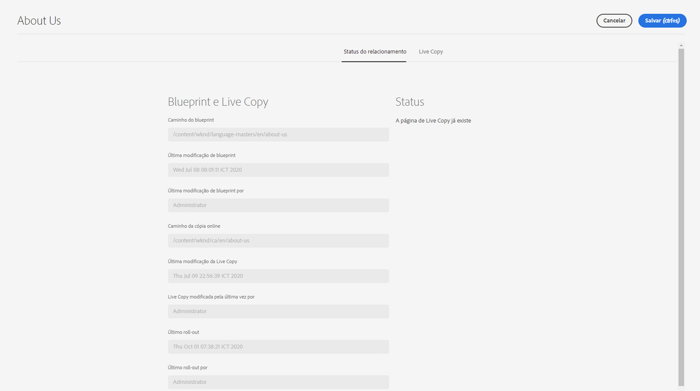

# Visão geral do console da Live Copy {#live-copy-overview-console}

O console **Visão geral da Live Copy** permite:

* Visualizar/gerenciar a herança em um site.
   * Visualizar a árvore do blueprint e a estrutura correspondente da Live Copy, junto com o status da herança
   * Alterar o status da herança, como suspender e retomar
   * Visualizar as propriedades do blueprint e da Live Copy
* Executar ações de implantação.

## Abrir a visão geral da Live Copy {#opening-the-live-copy-overview}

Você pode abrir a visão geral da Live Copy em:

* [Painel lateral Referências de uma página do blueprint (console Sites)](#opening-live-copy-overview-references-for-a-blueprint-page)
* [Propriedades de uma página do blueprint](#opening-live-copy-overview-properties-of-a-blueprint-page)

### Referências a uma página do blueprint {#references-to-a-blueprint-page}

A **Visão geral da Live Copy** pode ser aberta a partir do painel lateral **Referências** do console **Sites**:

1. No console **Sites**, [navegue até a página do blueprint e selecione-a](/help/sites-cloud/authoring/basic-handling.md#viewing-and-selecting-resources).
1. Abra o painel **[Referências](/help/sites-cloud/authoring/basic-handling.md#references)** e selecione **Live Copies**.

   

   >[!TIP]
   >
   >Você também pode abrir as referências primeiro e depois selecionar o blueprint.

1. Selecione a **Visão geral da Live Copy** para exibir e usar a visão geral de todas as Live Copies relacionadas ao blueprint selecionado.
1. Use **Fechar** para sair e retornar ao console **Sites**.

### Propriedades de uma página do blueprint {#properties-of-a-blueprint-page}

A **Visão geral da Live Copy** pode ser aberta ao visualizar propriedades de uma página do blueprint:

1. Abra as **Propriedades** para a página do blueprint apropriada.
1. Abra a guia **Blueprint** e verá a opção **Visão geral da Live Copy** exibida na barra de ferramentas superior:

   

1. Selecione **Visão geral da Live Copy** para exibir e usar a visão geral de todas as Live Copies relacionadas ao blueprint atual.

1. Use **Fechar** para sair e retornar ao console **Sites**.

## Usar a visão geral da Live Copy {#using-the-live-copy-overview}

A janela **Visão geral da Live Copy** fornece uma visão geral do status das Live Copies relacionadas à página selecionada.

Uma implantação depende das ações de sincronização definidas na configuração de implantação específica. Algumas ações dependem de modificações no conteúdo. No entanto, também há muitas ações que não dependem de modificações no conteúdo, mas que dependem de eventos como ativações de páginas. Esses eventos não modificam o conteúdo, mas modificam as propriedades internas relacionadas ao conteúdo.

Os campos de status também dependem das ações de sincronização definidas na configuração de implementação específica e indicam se houve alguma dessas ações no blueprint ou na Live Copy desde a última implantação bem-sucedida. Um campo de status refletirá apenas as ações na configuração de implantação específica. Se nenhuma implantação bem-sucedido tiver sido executada em uma Live Copy, o status sempre será atualizado.

Por exemplo, uma configuração de implantação é definida como `targetActivate`. Portanto, uma implantação dependerá apenas dos eventos de ativação. O campo de status indicará apenas se algum evento de ativação ocorreu desde a última implantação bem-sucedida.

A **Visão geral da Live Copy** também pode ser usada para executar ações na Live Copy:

1. Abra a **Visão geral da Live Copy**. 
1. Selecione o blueprint necessário ou a página da Live Copy e a barra de ferramentas será atualizada para mostrar as ações disponíveis. As [ações](overview.md#terms-used) disponíveis variam dependendo se você seleciona um [blueprint](#actions-for-a-blueprint-page) ou uma página de [Live Copy](#actions-for-a-live-copy-page).

### Ações para uma página do blueprint {#actions-for-a-blueprint-page}

Quando você seleciona uma página do blueprint, as seguintes ações estão disponíveis:

* **Editar** — abre a página do blueprint para edição.
* **[Implantar](overview.md#rollout-and-synchronize)** — executa uma implantação para enviar as alterações da origem para a Live Copy.

### Ações para uma página de Live Copy {#actions-for-a-live-copy-page}

Quando você seleciona uma página de Live Copy, as seguintes ações estão disponíveis:

* **Editar** — abre a página de Live Copy para edição.
* **[Status do relacionamento](#relationship-status)** — exibe informações sobre o status e a herança.
* **[Sincronizar](overview.md#rollout-and-synchronize)** — sincroniza uma Live Copy para extrair as alterações da origem para a Live Copy.
* **[Redefinir](creating-live-copies.md#resetting-a-live-copy-page)** — redefine uma página de Live Copy para remover todos os cancelamentos de herança e retornar a página ao mesmo estado que a página de origem.
* **[Suspender](overview.md#suspending-and-cancelling-inheritance-and-synchronization)** — desativa temporariamente a relação ativa entre uma Live Copy e sua página do blueprint.
* **[Retomar](creating-live-copies.md#resuming-inheritance-for-a-page)** - Retomar permite que você restaure uma relação suspensa.
* **[Destacar](overview.md#detaching-a-live-copy)** — remove permanentemente a relação ativa entre uma Live Copy e sua página de blueprint.

## Status do relacionamento {#relationship-status}

O console **Status do relacionamento** tem duas guias que fornecem uma variedade de funcionalidades.

* [Status do relacionamento](#relationship-status-tab)
* [Live Copy &#x200B;](#live-copy-tab)

### Status do relacionamento {#relationship-status-tab}

Esta guia fornece informações detalhadas sobre o status da relação entre o blueprint e a Live Copy.

### Live Copy  {#live-copy-tab}

Essa guia permite visualizar e editar a configuração da Live Copy.

