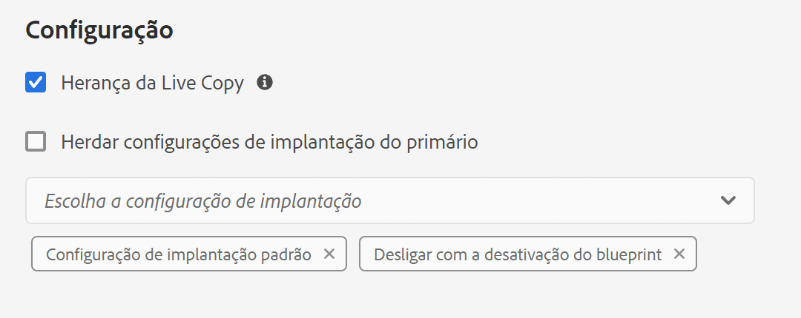

# Configurar a sincronização da Live Copy {#configuring-live-copy-synchronization}

O Adobe Experience Manager fornece várias configurações de sincronização prontas para uso. Antes de usar as Live Copies, você deve considerar o seguinte para definir como e quando as Live Copies são sincronizadas com o conteúdo de origem.

1. Decida se as configurações de implementação existentes atendem aos seus requisitos
1. Se não atendem, decida se é necessário criar as suas próprias configurações.
1. Especifique as configurações de implantação a serem usadas para as Live Copies.

## Configurações de implantação instaladas e personalizadas {#installed-and-custom-rollout-configurations}

Esta seção fornece informações sobre as configurações de implantação instaladas e as ações de sincronização que elas usam, e como criar configurações personalizadas, se necessário.

>[!CAUTION]
>
>Atualizar ou alterar uma configuração de implantação pronta para uso **not** é recomendado. Se houver um requisito para uma ação ativa personalizada, ela deverá ser adicionada em uma configuração de implantação personalizada.

### Acionadores de implantação {#rollout-triggers}

Cada configuração de implantação usa um acionador de implantação que ocasiona a implantação. As configurações de implantação podem usar um dos seguintes acionadores:

* **Ao implantar**: o comando **Implantação** é usado na página de blueprint ou o comando **Sincronizar** é usado na página da Live Copy.
* **Em modificação**: a página de origem é modificada.
* **Em ativação**: a página de origem é ativada.
* **Em desativação**: a página de origem é desativada.

>[!NOTE]
>
>O uso do acionador **Ao modificar** pode afetar o desempenho. Consulte [Práticas recomendadas do MSM](best-practices.md#onmodify) para obter mais informações.

### Configurações de implementação {#rollout-configurations}

A tabela a seguir lista as configurações de implantação que vêm prontas para uso com o AEM. A tabela inclui as ações de acionador e de sincronização de cada configuração de implementação.

Se as ações de configuração de implantação instaladas não atenderem aos seus requisitos, você poderá [criar uma configuração de implantação.](#creating-a-rollout-configuration)

| Nome | Descrição | Acionar | [Ações de sincronização](#synchronization-actions) |
|---|---|---|---|
| Configuração de implantação padrão | A configuração de implementação padrão que permite que o processo de implementação comece com estímulos de implementação e executa as ações: criar, atualizar, excluir conteúdo e ordenar os nós filhos | Na implantação | `contentUpdate` `contentCopy` `contentDelete` `referencesUpdate` `productUpdate` `orderChildren` |
| Acionar com a ativação do blueprint | Publica a Live Copy quando a origem é publicada | No modo de ativação | `targetActivate` |
| Desligar com a desativação do blueprint | Desativa a Live Copy quando a origem é desativada | Ao desativar | `targetDeactivate` |
| Forçar modificação | Força o conteúdo para a Live Copy quando a origem é modificada Use essa configuração de implantação com moderação, pois ela usa o acionador Ao modificar. | Em modificação | `contentUpdate` `contentCopy` `contentDelete` `referencesUpdate` `orderChildren` |
| Forçar modificação (superficial) | Envia o conteúdo para a Live Copy quando a página do blueprint é modificada, sem atualizar referências (por exemplo, para cópias superficiais) Use essa configuração de implantação com moderação, pois ela usa o acionador Ao modificar. | Em modificação | `contentUpdate` `contentCopy` `contentDelete` `orderChildren` |
| Promover lançamento | Configuração de implantação padrão para a promoção de páginas de lançamento. | Na implantação | `contentUpdate` `contentCopy` `contentDelete` `referencesUpdate` `orderChildren` `markLiveRelationship` |

### Ações de sincronização {#synchronization-actions}

A tabela a seguir lista as ações de sincronização que vêm prontas para uso com o AEM.

Se as ações instaladas não atenderem aos seus requisitos, você poderá [Criar uma Nova Ação de Sincronização.](/help/implementing/developing/extending/msm.md#creating-a-new-synchronization-action)

| Nome da ação | Descrição | Propriedades |
|---|---|---|
| `contentCopy` | Quando os nós da origem não existem na Live Copy, essa ação copia os nós para a Live Copy. [Configure o serviço de **Ação de cópia de conteúdo MSM CQ**](#excluding-properties-and-node-types-from-synchronization) para especificar os tipos de nó, itens de parágrafo e propriedades de página a serem excluídos. |  |
| `contentDelete` | Essa ação exclui nós da Live Copy que não existem na origem. [Configure o serviço de **Ação de exclusão de conteúdo MSM CQ**](#excluding-properties-and-node-types-from-synchronization) para especificar os tipos de nó, itens de parágrafo e propriedades de página a serem excluídos. |  |
| `contentUpdate` | Essa ação atualiza o conteúdo da Live Copy com as alterações da origem. [Configure o serviço de **Ação de atualização de conteúdo MSM CQ**](#excluding-properties-and-node-types-from-synchronization) para especificar os tipos de nó, itens de parágrafo e propriedades de página a serem excluídos. |  |
| `editProperties` | Essa ação edita as propriedades da Live Copy. A propriedade `editMap` determina quais propriedades são editadas e seus valores. O valor da propriedade `editMap` deve usar o seguinte formato: `[property_name_n]#[current_value]#[new_value]` `current_value` e `new_value` são expressões regulares e `n` é um número inteiro incrementado. Por exemplo, considere o seguinte valor para `editMap`: `sling:resourceType#/(contentpage`‖`homepage)#/mobilecontentpage,cq:template#/contentpage#/mobilecontentpage` Esse valor edita as propriedades dos nós da Live Copy da seguinte maneira: As propriedades `sling:resourceType` definidas como `contentpage` ou `homepage` são definidas como `mobilecontentpage`. As propriedades `cq:template` definidas como `contentpage` são definidas como `mobilecontentpage`. | `editMap: (String)` identifica a propriedade, o valor atual e o novo valor. Consulte a descrição para obter informações. |
| `notify` | Essa ação envia um evento de página de que a página foi distribuída. Para ser notificado, primeiro é necessário assinar eventos de implantação. |  |
| `orderChildren` | Essa ação ordena os nós filhos com base na ordem no blueprint. |  |
| `referencesUpdate` | Esta ação de sincronização atualiza referências na Live Copy. Ela procura caminhos nas páginas da Live Copy que apontam para um recurso dentro do blueprint. Quando encontrado, ela atualiza o caminho para apontar para o recurso relacionado dentro da Live Copy. As referências que têm destinos fora do blueprint não são alteradas.  [Configure o serviço de **Ação de atualização de referências MSM CQ**](#excluding-properties-and-node-types-from-synchronization) para especificar os tipos de nó, itens de parágrafo e propriedades de página a serem excluídos. |  |
| `targetVersion` | Essa ação cria uma versão da Live Copy. Essa ação deve ser a única ação de sincronização incluída em uma configuração de implementação. |  |
| `targetActivate` | Essa ação ativa a Live Copy. Essa ação deve ser a única ação de sincronização incluída em uma configuração de implementação. |  |
| `targetDeactivate` | Essa ação desativa a Live Copy. Essa ação deve ser a única ação de sincronização incluída em uma configuração de implementação. |  |
| `workflow` | Essa ação inicia o fluxo de trabalho definido pela propriedade de destino (somente para páginas) e toma a Live Copy como carga. O caminho de destino é o caminho do nó do modelo. | `target: (String)` é o caminho para o modelo de fluxo de trabalho. |
| `mandatory` | Essa ação define a permissão de várias ACLs na página da Live Copy como somente leitura para um grupo de usuários específico. As seguintes ACLs são configuradas: `ActionSet.ACTION_NAME_REMOVE` `ActionSet.ACTION_NAME_SET_PROPERTY` `ActionSet.ACTION_NAME_ACL_MODIFY` Use esta ação somente para páginas. | `target: (String)` é a ID do grupo para o qual você está definindo permissões. |
| `mandatoryContent` | Essa ação define a permissão de várias ACLs na página da Live Copy como somente leitura para um grupo de usuários específico. As seguintes ACLs são configuradas: `ActionSet.ACTION_NAME_SET_PROPERTY` `ActionSet.ACTION_NAME_ACL_MODIFY` Use esta ação somente para páginas. | `target: (String)` é a ID do grupo para o qual você está definindo permissões. |
| `mandatoryStructure` | Essa ação define a permissão da ACL `ActionSet.ACTION_NAME_REMOVE` na página da Live Copy como somente leitura para um grupo de usuários específico. Use esta ação somente para páginas. | `target: (String)` é a ID do grupo para o qual você está definindo permissões. |
| `VersionCopyAction` | Se a página de blueprint/origem tiver sido publicada pelo menos uma vez, essa ação cria uma página de Live Copy usando a versão publicada. Observação: essa ação só está disponível para criar uma página da Live Copy com base em uma página de origem publicada, não para atualizar uma página da Live Copy existente. |  |
| `PageMoveAction` | A `PageMoveAction` se aplica quando uma página foi movida no blueprint. A ação copia, em vez de mover, a página da Live Copy (relacionada) do local anterior à movimentação para o local posterior. A `PageMoveAction` não altera a página da Live Copy no local antes de mover. Portanto, para configurações de implantação consecutivas, ela tem o status de um relacionamento dinâmico sem um blueprint. [Configure o serviço de **Ação de movimentação de página MSM CQ**](#excluding-properties-and-node-types-from-synchronization) para especificar os tipos de nó, itens de parágrafo e propriedades de página a serem excluídos. Essa ação deve ser a única ação de sincronização incluída em uma configuração de implementação. | Definir `prop_referenceUpdate: (Boolean)` como true (padrão) para atualizar referências. |
| `markLiveRelationship` | Essa ação indica se existe uma relação dinâmica para conteúdo criado na inicialização. |  |

### Criação de uma configuração de implantação {#creating-a-rollout-configuration}

Você pode [criar uma configuração de implantação](/help/implementing/developing/extending/msm.md#creating-a-new-rollout-configuration) quando as configurações de implantação instaladas não atenderem aos requisitos do aplicativo, execute as etapas a seguir.

1. [Crie a configuração de implantação-](/help/implementing/developing/extending/msm.md#create-the-rollout-configuration)
1. [Adicione ações de sincronização à configuração de implantação.](/help/implementing/developing/extending/msm.md#add-synchronization-actions-to-the-rollout-configuration)

A nova configuração de implantação está então disponível ao definir configurações de implantação em uma página de blueprint ou Live Copy.

### Excluir propriedades e tipos de nó da sincronização {#excluding-properties-and-node-types-from-synchronization}

Você pode configurar vários serviços OSGi que suportam ações de sincronização correspondentes para que eles não afetem tipos de nó e propriedades específicos. Por exemplo, muitas propriedades e nós secundários relacionados ao funcionamento interno do AEM não devem ser incluídos em uma Live Copy. Somente o conteúdo relevante para o usuário da página deve ser copiado.

Ao trabalhar com o AEM, há vários métodos de gerenciamento das definições de configuração desses serviços. Consulte [Configuração do OSGi](/help/implementing/deploying/configuring-osgi.md) para obter mais detalhes e as práticas recomendadas.

A tabela a seguir lista as ações de sincronização para as quais você pode especificar os nós a serem excluídos. A tabela fornece os nomes dos serviços a serem configurados usando o console da Web e o PID para configurar usando um nó de repositório.

| Ação de sincronização | Nome do serviço no Console da web | PID do serviço |
|---|---|---|
| `contentCopy` | Ação de cópia de conteúdo MSM CQ | `com.day.cq.wcm.msm.impl.actions.ContentCopyActionFactory` |
| `contentDelete` | Ação de exclusão de conteúdo MSM CQ | `com.day.cq.wcm.msm.impl.actions.ContentDeleteActionFactory` |
| `contentUpdate` | Ação de atualização de conteúdo do MSM CQ | `com.day.cq.wcm.msm.impl.actions.ContentUpdateActionFactory` |
| `PageMoveAction` | Ação de movimentação de página MSM CQ | `com.day.cq.wcm.msm.impl.actions.PageMoveActionFactory` |
| `referencesUpdate` | Ação de atualização de referências MSM CQ | `com.day.cq.wcm.msm.impl.actions.ReferencesUpdateActionFactory` |

A tabela a seguir descreve as propriedades que você pode configurar:

| Propriedade do Console da web | Propriedade OSGi | Descrição |
|---|---|---|
| Tipos de nó excluídos | `cq.wcm.msm.action.excludednodetypes` | Uma expressão regular que corresponde aos nomes dos tipos de nó que serão excluídos da ação de sincronização |
| Itens de parágrafo excluídos | `cq.wcm.msm.action.excludedparagraphitems` | Uma expressão regular que corresponde aos itens de parágrafo que serão excluídos da ação de sincronização |
| Propriedades da página excluída | `cq.wcm.msm.action.excludedprops` | Uma expressão regular que corresponde às propriedades de página que serão excluídas da ação de sincronização |
| Tipos de nó Mixin ignorados | `cq.wcm.msm.action.ignoredMixin` | Uma expressão regular que corresponde aos nomes dos tipos de nó mixin que serão excluídos da ação de sincronização (disponível somente para a ação`contentUpdate`) |

#### Ação de atualização de conteúdo do MSM CQ - Exclusões {#cq-msm-content-update-action-exclusions}

Várias propriedades e tipos de nó são excluídos por padrão. Eles são definidos na configuração OSGi da **Ação de atualização de conteúdo do MSM CQ**, em **Propriedades da página excluída**.

Por padrão, as propriedades que correspondem às seguintes expressões regulares são excluídas (ou seja, não são atualizadas) na implantação:

É possível alterar as expressões definindo a lista de exclusões conforme necessário.

Por exemplo, se você quiser que o **Título** da página seja incluído nas alterações consideradas para implementação, remova `jcr:title` das exclusões. Por exemplo, com o regex:

`jcr:(?!(title)$).*`

### Configurar sincronização para atualizar referências {#configuring-synchronization-for-updating-references}

Você pode configurar vários serviços OSGi que oferecem suporte às ações de sincronização correspondentes relacionadas à atualização de referências.

Ao trabalhar com o AEM, há vários métodos de gerenciamento das definições de configuração desses serviços. Consulte [Configuração do OSGi](/help/implementing/deploying/configuring-osgi.md) para obter mais detalhes e as práticas recomendadas.

A tabela a seguir lista as ações de sincronização para as quais você pode especificar a atualização de referência. A tabela fornece os nomes dos serviços a serem configurados usando o console da Web e o PID para configurar usando um nó de repositório.

| Propriedade do Console da web | Propriedade OSGi | Descrição |
|---|---|---|
| Atualizar referência entre LiveCopies aninhadas | `cq.wcm.msm.impl.action.referencesupdate.prop_updateNested` | Selecione esta opção no console da web ou defina esta propriedade boolean como `true` usando a configuração do repositório para substituir referências que se destinam a qualquer recurso que esteja dentro da ramificação da Live Copy mais elevada. Disponível somente para a ação `referencesUpdate`. |
| Atualizar páginas de referência | `cq.wcm.msm.impl.actions.pagemove.prop_referenceUpdate` | Selecione essa opção no console da web ou defina essa propriedade boolean como `true` usando a configuração do repositório para atualizar todas as referências para usar a página original para fazer referência à página Live Copy. Disponível somente para `PageMoveAction`. |

## Especificar as configurações de implementação a serem usadas {#specifying-the-rollout-configurations-to-use}

O MSM permite que você especifique conjuntos de configurações de implantação usados com frequência e, quando necessário, é possível substituí-los por Live Copies específicas. O MSM fornece vários locais para especificar as configurações de implementação a serem usadas. O local determina se a configuração se aplica a uma Live Copy específica.

A seguinte lista de locais onde você pode especificar as configurações de distribuição a serem usadas descreve como o MSM determina quais configurações de distribuição devem ser usadas para uma Live Copy:

* **[Propriedades da página de Live Copy](live-copy-sync-config.md#setting-the-rollout-configurations-for-a-live-copy-page):** quando uma página de Live Copy é configurada para usar uma ou mais configurações de implantação, o MSM usa essas configurações.
* **[Propriedades da página de blueprint](live-copy-sync-config.md#setting-the-rollout-configuration-for-a-blueprint-page):** quando uma Live Copy é baseada em um blueprint, e a página de Live Copy não está definida com uma configuração de implantação, a configuração associada à página de origem do blueprint é usada.
* **Propriedades da página principal da Live Copy:** quando nenhuma página de Live Copy ou página de origem do blueprint é definida com uma configuração de implantação, a configuração que se aplica à página principal da página de Live Copy é usada. 
* **[Padrão do sistema](live-copy-sync-config.md#setting-the-system-default-rollout-configuration):** quando a configuração de implantação da página principal da Live Copy não pode ser determinada, a configuração padrão do sistema é usada.

Por exemplo, um blueprint usa o site de [tutorial WKND](/help/implementing/developing/introduction/develop-wknd-tutorial.md) como conteúdo de origem. Um site é criado a partir do blueprint. Cada item na lista a seguir descreve um cenário diferente com relação ao uso de configurações de implantação:

* Nenhuma das páginas do blueprint ou das páginas de Live Copy é configurada para usar uma configuração de implantação. O MSM usa a configuração de implantação padrão do sistema para todas as páginas de Live Copy.
* A página raiz do site WKND é configurada com várias configurações de implantação. O MSM usa essas configurações de implantação para todas as páginas de Live Copy.
* A página raiz do site WKND é configurada com várias configurações de implantação e a página raiz do site de Live Copy é configurada com um conjunto diferente de configurações de implantação. O MSM usa as configurações de implantação definidas na página raiz do site de Live Copy.

### Definir as configurações de implementação de uma página de Live Copy {#setting-the-rollout-configurations-for-a-live-copy-page}

Defina uma página de Live Copy com as configurações de implantação a serem usadas quando a página de origem for implementada. As páginas secundárias herdam a configuração por padrão. Ao definir a configuração de implantação a ser usada, você substituirá a configuração que a página de Live Copy herdará da página principal.

Também é possível definir as configurações de implantação para uma página de Live Copy ao [criar a Live Copy](creating-live-copies.md#creating-a-live-copy-of-a-page).

1. Use o console **Sites** para selecionar a página de Live Copy.
1. Selecione **Propriedades** na barra de ferramentas.
1. Abra a guia **Live Copy**.

   A seção **Configuração** mostra as configurações de implementação que a página herda.

   

1. Se necessário, ajuste a variável **Herança da Live Copy** sinalizador. Se essa opção for marcada, a configuração da Live Copy terá efeito em todas as tarefas derivadas.

1. Limpe a propriedade **Herdar configurações de implantação da página principal** e selecione uma ou mais configurações de implantação na lista.

   As configurações de implantação selecionadas aparecem abaixo da lista suspensa.

   

1. Selecionar **Salvar e fechar**.

### Definir a configuração de implantação de uma página do blueprint {#setting-the-rollout-configuration-for-a-blueprint-page}

Configure uma página de blueprint com as configurações de implantação a serem usadas quando a página de blueprint for implantada.

As páginas secundárias da página do blueprint herdam a configuração. Ao definir a configuração de implantação a ser usada, você pode estar substituindo a configuração que a página herdará da página principal.

1. Use o console **Sites** para selecionar a página raiz do blueprint.
1. Selecione **Propriedades** na barra de ferramentas.
1. Abra a guia **Blueprint.**
1. Selecione uma ou mais **configurações de implantação** usando o seletor suspenso.
1. Mantenha suas atualizações com **Salvar**.

### Definir a configuração de implementação padrão do sistema {#setting-the-system-default-rollout-configuration}

Para especificar uma configuração de implantação a ser usada como padrão do sistema, configure o seguinte serviço OSGi.

* **Gerente de relacionamento dinâmico do WCM CQ do dia** com o serviço PID `com.day.cq.wcm.msm.impl.LiveRelationshipManagerImpl`

Configure o serviço usando o [console da Web](/help/implementing/deploying/configuring-osgi.md#osgi-configuration-with-the-web-console) ou um [nó de repositório](/help/implementing/deploying/configuring-osgi.md#osgi-configuration-in-the-repository).

* No console da web, o nome da propriedade a ser configurada é **Configuração de implantação padrão**.
* Ao usar um nó de repositório, o nome da propriedade a ser configurada é `liverelationshipmgr.relationsconfig.default`.

Defina esse valor de propriedade como o caminho da configuração de implementação a ser usada como padrão do sistema. O valor padrão é `/libs/msm/wcm/rolloutconfigs/default`, que é a **Configuração de implantação padrão**.
