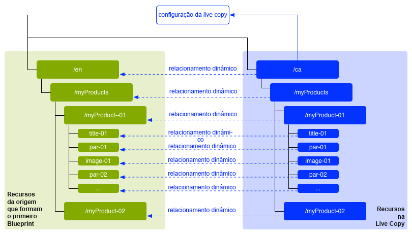
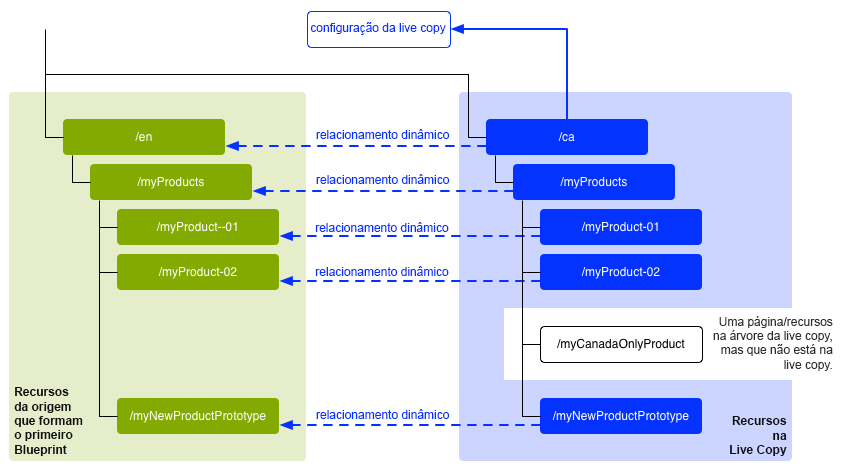
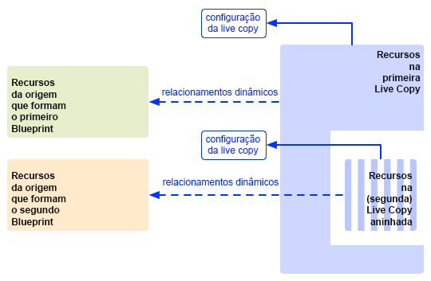
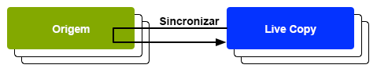

# Reutilizar conteúdo: Gerenciador multisite e Live Copy {#multi-site-manager-and-live-copy}

O Gerenciador de vários sites (MSM) permite utilizar o mesmo conteúdo de site em vários locais. O MSM usa a funcionalidade de Live Copy para alcançar isso.

* Com o MSM é possível:
   * Criar um conteúdo uma vez e
   * Reutilizar esse conteúdo em outras áreas (por meio das [Live Copies](#live-copies)) do mesmo site ou de outros sites.
* O MSM mantém os relacionamentos dinâmicos entre o conteúdo original e suas Live Copies, de modo que:
   * Quando você altera o conteúdo original, ele e as Live Copies são sincronizados.
   * É possível fazer ajustes somente no conteúdo das Live Copies, desconectando o relacionamento dinâmico de subpáginas e/ou componentes individuais.

Esta página fornece uma visão geral da reutilização de conteúdo com o MSM. As páginas a seguir abordam os problemas relacionados detalhadamente.

* [Criação e sincronização de Live Copies](creating-live-copies.md)
* [Visão geral do console da Live Copy](live-copy-overview.md)
* [Configurar a sincronização da Live Copy](live-copy-sync-config.md)
* [Conflitos de implantação do MSM](rollout-conflicts.md)
* [Práticas recomendadas do MSM](best-practices.md)

>[!NOTE]
>
>O MSM também pode ser usado para ativos, inclusive fragmentos de conteúdo. Consulte [Reutilizar fragmentos de conteúdo usando o MSM para Assets](/help/assets/reuse-assets-using-msm.md) (disponível somente por meio do console do Assets).

## Cenários possíveis {#possible-scenarios}

Há muitos casos de uso para o MSM e as Live Copies. Alguns cenários incluem:

* **Multinacionais - da empresa global para a local**

  Um caso de uso típico que o MSM permite é a reutilização de conteúdo em vários sites multinacionais de mesmo idioma. Isto permite reutilizar o conteúdo principal, ao mesmo tempo possibilitando variações nacionais.

  Por exemplo, a seção em inglês da [amostra de tutorial WKND](/help/implementing/developing/introduction/develop-wknd-tutorial.md) é criada para clientes nos EUA. A maior parte do conteúdo deste site também pode ser usado para outros sites WKND que atendem clientes que falam inglês de diferentes países e culturas. O conteúdo principal permanece o mesmo em todos os sites, enquanto ajustes regionais podem ser feitos.

  A estrutura a seguir pode ser usada para sites dos Estados Unidos e Canadá. Observe como o nó `language-masters` mantém a cópia principal do conteúdo não apenas em inglês, mas em outros idiomas. Esse conteúdo pode ser usado como a base para conteúdo adicional em língua regional, juntamente com o inglês.

  ```xml
  /content
      |- wknd
          |- language-masters
              |- en
              |- es
              |- fr
          |- us
              |- en
              |- es
          |- ca
              |- en
              |- fr
  ```

  >[!NOTE]
  >
  >O MSM não traduz o conteúdo. Ele é usado para criar a estrutura necessária e implantar o conteúdo.
  >
  >
  >Consulte [Tradução de conteúdo para sites multilíngues](/help/sites-cloud/administering/translation/overview.md) para obter um exemplo.

* **Nacional - da sede para as divisões regionais**

  Alternativamente, uma empresa com uma rede de revendedores pode querer sites distintos para as suas concessionárias individuais, onde cada um deles seria uma variação do site principal fornecido pela sede. Pode ser uma única empresa com vários escritórios regionais ou um sistema nacional de franquias composto por um franqueador central e por vários franqueados locais.

  A sede pode fornecer as informações principais, enquanto as entidades regionais podem adicionar informações locais, como detalhes de contato, horários de abertura e eventos.

  ```xml
  /content
      |- head-office-berlin
      |- branch-hamburg
      |- branch-stuttgart
      |- branch-munich
      |- branch-frankfurt
  ```

* **Várias versões**

  O MSM pode criar versões de uma sub-ramificação específica. Por exemplo, um subsite de apoio pode conter detalhes das diferentes versões de um produto específico, onde as informações básicas permanecem constantes e apenas os recursos atualizados precisam ser alterados:

  ```xml
  /content
      |- game-support
          |- polybius
              |- v5.0
              |- v4.0
              |- v3.0
              |- v2.0
              |- v1.0
  ```

  >[!TIP]
  >
  >Em tal cenário, trata-se da escolha entre fazer uma cópia simples ou usar as Live Copies, o que envolve um equilíbrio entre:
  >
  >* Quanto do conteúdo principal precisa ser atualizado em várias versões.
  >
  >Contra:
  >
  >* Quantas cópias individuais devem ser ajustadas.

## MSM a partir da interface {#msm-from-the-ui}

O MSM é diretamente acessível por meio da interface usando várias opções do console apropriado.

* **Criar Site** (**Sites**)

   * O MSM ajuda você a gerenciar vários sites que compartilham conteúdo em comum. Por exemplo, sites geralmente são fornecidos para públicos-alvos internacionais, de modo que a maioria do conteúdo é comum em todos os países, com um subconjunto de conteúdo específico para cada país. O MSM permite [criar Live Copies que atualizam automaticamente um ou mais sites com base no seu site de origem](creating-live-copies.md#creating-a-live-copy-of-a-site-from-a-blueprint-configuration). Isso também ajuda a impor uma estrutura básica comum, usar o conteúdo em comum nos vários sites, manter uma aparência semelhante e concentrar os esforços no gerenciamento do conteúdo que realmente difere entre os sites. Criar um site dessa maneira:
      * Requer uma configuração de blueprint predefinida para especificar a origem.
      * Cria uma Live Copy do conteúdo original (predefinido).
      * Fornece ao usuário o botão **Implantação**.

* **Criar Live Copy** (**Sites**)

   * O MSM permite [criar uma Live Copy ad-hoc (única) de uma página individual ou sub-ramificação de um site](creating-live-copies.md#creating-a-live-copy-of-a-page). Por exemplo, duplicar uma sub-ramificação para fornecer informações sobre uma versão nova/atualizada de um produto. Criar uma Live Copy dessa maneira:
      * Cria uma Live Copy ad-hoc (nenhuma configuração do blueprint é necessária).
      * Pode ser usado para criar (imediatamente) uma Live Copy de qualquer página/ramificação.
      * Requer **sincronização** (não fornece o botão **Implantação**).

* **Visualizar propriedades** (**Sites**)

   * Quando apropriado, essa opção ajuda você a [monitorar sua Live Copy](creating-live-copies.md#monitoring-your-live-copy), fornecendo informações sobre a **Live Copy** ou **Blueprint** relacionados.

* **Referências** (**Sites**)

   * O painel [Referências](/help/sites-cloud/authoring/basic-handling.md#references) fornece informações sobre **Live Copies**, juntamente com o acesso às ações adequadas.

* **Visão geral da Live Copy** (**Sites**)

   * Este console permite que você [exiba e gerencie seu blueprint e suas Live Copies](live-copy-overview.md).

* **Blueprints** (**Ferramentas** - **Sites**)

   * Este console permite [criar e gerenciar as configurações do blueprint](creating-live-copies.md#creating-a-blueprint-configuration).

>[!NOTE]
>
>O MSM pode ser usado com páginas e [Fragmentos de experiência](/help/sites-cloud/authoring/fragments/experience-fragments.md), pois esses fragmentos fazem parte de uma experiência (página).

>[!NOTE]
>
>Alguns aspectos da funcionalidade do MSM são usados em vários outros recursos do AEM, como inicializações. Nesses casos, a Live Copy é gerenciada por esse recurso.

### Termos usados {#terms-used}

Como introdução, a tabela a seguir fornece uma visão geral dos principais termos usados com o MSM. Eles serão abordados com mais detalhes nas seções e páginas subsequentes.

| Termo | Definição | Mais detalhes |
|---|---|---|
| Origem | As páginas originais usadas como base para Live Copies | Sinônimo de Blueprints e/ou páginas do Blueprint |
| Live Copy | A cópia (do original) mantida pelas ações de sincronização, conforme definido pelas configurações de implantação |  |
| Configuração da Live Copy | Definição dos detalhes de configuração de uma Live Copy |  |
| Relacionamento dinâmico | Definição efetiva da herança para um determinado recurso, ou seja, as conexões entre a origem e as Live Copies | Garante que as alterações no conteúdo original possam ser sincronizadas com a Live Copy |
| Blueprint | Sinônimo de Origem | Pode ser definido por uma configuração do blueprint |
| Configuração do blueprint | Configuração predefinida especificando um caminho de origem | Quando uma página do blueprint é referenciada em uma configuração do blueprint, o comando Implantação fica disponível |
| Capítulo | As seções do blueprint a serem incluídas na Live Copy | Geralmente, essas são subpáginas da raiz |
| Sincronização | O termo genérico para a sincronização de conteúdo entre o conteúdo original e as Live Copies (através das opções de **Implantação** e **Sincronização**) |  |
| Implantação | Sincroniza desde o original até a Live Copy | Pode ser acionado por um autor (em uma página de blueprint) ou por um evento do sistema (conforme definido pela configuração de implantação) |
| Configuração de implantação | Regras que determinam como, quando e quais propriedades serão sincronizadas |  |
| Sincronizar | Uma solicitação manual de sincronização, feita a partir das páginas da Live Copy |  |
| Herança | Uma página/componente da Live Copy herda o conteúdo de sua página/componente original quando a sincronização ocorre |  |
| Suspender | Remove temporariamente o relacionamento dinâmico entre uma Live Copy e sua página de blueprint |  |
| Desconectar | Remove permanentemente o relacionamento dinâmico entre uma Live Copy e sua página de blueprint |  |
| Redefinir | Redefina uma página de Live Copy para remover todos os cancelamentos de herança e retornar a página ao mesmo estado da página original | A redefinição afeta todas as alterações feitas nas propriedades da página, no sistema de parágrafo e nos componentes. |
| Superficial | Uma Live Copy de uma única página |  |
| Profundo | Uma Live Copy de uma página, junto com suas páginas filhas |  |

>[!TIP]
>
>Consulte [Estendendo o Gerenciador de Vários Sites](/help/implementing/developing/extending/msm.md#overview-of-the-java-api) para obter os nomes dos objetos.

## Live Copies {#live-copies}

Uma Live Copy do MSM é uma cópia do conteúdo específico do site para o qual é mantido um relacionamento dinâmico com o conteúdo original.

* A Live Copy herda conteúdo de sua origem.
* A sincronização executa a transferência real do conteúdo quando alterações são feitas no conteúdo original.
* Uma Live Copy pode ser considerada como:
   * Superficial: uma página única
   * Profunda: a página, junto com suas páginas filhas
* As regras de sincronização, chamadas de configurações de implantação, determinam quais propriedades são sincronizadas e quando a sincronização ocorre.

No exemplo anterior, `/content/wknd/language-masters/en` é o site principal global em inglês. Para reutilizar o conteúdo deste site, são criadas Live Copies do MSM:

* O conteúdo abaixo de `/content/wknd/language-masters/en` é a origem.
* O conteúdo abaixo de `/content/wknd/language-masters/en` é copiado abaixo dos nós `/content/wknd/us/en/` e `/content/wknd/ca/en`. Estas são as Live Copies.
* Os autores alteram as páginas abaixo de `/content/wknd/language-masters/en`.
* Quando acionado, o MSM sincroniza essas alterações nas Live Copies.

### Live Copies - Composição {#live-copies-composition}

>[!NOTE]
>
>Os diagramas e descrições nesta seção representam instantâneos de possíveis Live Copies. Eles não são abrangentes, mas fornecem uma visão geral e destacam características específicas.

Inicialmente, ao criar uma Live Copy, as páginas originais selecionadas são refletidas em uma base de 1:1 na Live Copy. Depois disso, novos recursos (páginas e/ou parágrafos) também podem ser criados diretamente na Live Copy. Portanto, é útil estar ciente dessas variações e de como elas afetam a sincronização. As possíveis composições incluem:

* [Live Copy com páginas que não são da Live Copy](#live-copy-with-non-live-copy-pages)
* [Live Copies aninhadas](#nested-live-copies)

A forma básica da Live Copy contém:

* Páginas de Live Copy que refletem as páginas originais selecionadas com base em 1:1.
* Uma definição de configuração.
* Um relacionamento dinâmico definido para cada recurso:
   * Vincular o recurso de Live Copy ao seu blueprint/origem.
   * São usados ao realizar a herança e a implantação.

As alterações podem ser [sincronizadas](creating-live-copies.md#synchronizing-your-live-copy) de acordo com os requisitos.



#### Live Copy com páginas que não são da Live Copy {#live-copy-with-non-live-copy-pages}

Ao criar uma Live Copy no AEM, você pode visualizar e navegar pela ramificação da Live Copy e usar funcionalidades normais do AEM nela. Isso significa que você (ou um processo) pode criar novos recursos (páginas e/ou parágrafos) dentro da Live Copy. Por exemplo, um produto para uma determinada região ou país.

* Esses recursos não têm um relacionamento dinâmico com as páginas de origem/blueprints e não são sincronizados.
* Podem ocorrer alguns cenários que o MSM trata como casos especiais. Por exemplo, quando você (ou um processo) cria uma página com a mesma posição e nome nas ramificações da origem/blueprint e da Live Copy. Para essas situações, consulte [Conflitos de implantação do MSM](rollout-conflicts.md) para obter mais informações.



#### Live Copies aninhadas {#nested-live-copies}

Quando você (ou um processo) cria uma [nova página em uma Live Copy existente](#live-copy-with-non-live-copy-pages), esta nova página também pode ser configurada como uma Live Copy de um blueprint diferente. Isso é conhecido como Live Copy aninhada. Em Live Copies aninhadas, o comportamento da segunda Live Copy (ou Live Copy interna) é afetado pela primeira Live Copy (ou Live Copy externa) das seguintes maneiras:

* Uma implantação profunda, que é acionada para a Live Copy de nível superior, pode continuar na Live Copy aninhada.
* Qualquer link entre as origens será reescrito dentro das Live Copies.

Por exemplo, os links que apontam do segundo para o primeiro blueprint serão reescritos como links que apontam da segunda Live Copy/Live copy aninhada para a primeira.



>[!NOTE]
>
>Se você mover ou renomear uma página na ramificação da Live Copy, ela será tratada como uma Live Copy aninhada para permitir que o AEM rastreie as relações.

#### Live Copies empilhadas {#stacked-live-copies}

Uma Live Copy é considerada uma Live Copy empilhada quando é criada como secundária de uma Live Copy superficial. Ela se comporta da mesma forma que uma [Live Copy aninhada](#nested-live-copies).

### Origem, blueprints e configurações do blueprint {#source-blueprints-and-blueprint-configurations}

Qualquer página ou ramificação de páginas pode ser usada como origem de uma Live Copy. No entanto, o MSM também permite definir uma configuração de blueprint que especifique um caminho de origem. Os benefícios de usar uma configuração do blueprint são:

* Permite que o autor use a opção **Implantação** em um blueprint. Isto é, para enviar modificações explicitamente para as Live Copies que herdam deste blueprint.
* Permite que o autor use a função **Criar Site**. Isso permite que o usuário selecione idiomas facilmente e configure a estrutura da Live Copy.
* Definir uma configuração de implantação padrão para Live Copies que tenham uma relação com o blueprint.

A origem de uma Live Copy pode ser páginas regulares ou páginas alteradas por uma configuração de blueprint. Ambos são casos de uso válidos.

A origem forma o blueprint para a Live Copy. O blueprint é definido quando você:

* [Cria uma configuração de blueprint](creating-live-copies.md#creating-a-blueprint-configuration) - a configuração define com antecedência as páginas que serão usadas para criar a Live Copy.
* [Cria uma Live Copy de uma página](creating-live-copies.md#creating-a-live-copy-of-a-page) - as páginas usadas para criar a Live Copy (páginas de origem) são as páginas do blueprint. A página de origem pode ou não ser referenciada em uma configuração de blueprint.

### Implantação e sincronização {#rollout-and-synchronize}

Uma implantação é a ação central do MSM que sincroniza Live Copies com suas origens. É possível executar implantações manualmente ou elas podem ocorrer automaticamente.

* A [configuração de implantação](#rollout-configurations) pode ser definida para que [eventos](live-copy-sync-config.md#rollout-triggers) específicos ocasionem uma implantação automaticamente.
* Ao criar uma página de blueprint, é possível usar o comando **[Implantação](creating-live-copies.md#rolling-out-a-blueprint)** para enviar alterações para a Live Copy.
   * O comando **Implantação** está disponível em uma página de blueprint referenciada em uma configuração de blueprint.

  

* Ao criar uma página de Live Copy, é possível usar o comando **[Sincronizar](creating-live-copies.md#synchronizing-a-live-copy)** para trazer as alterações da origem para a Live Copy.
   * O comando **Sincronizar** está sempre disponível na página da Live Copy, independentemente da página de origem/blueprint ser alterada por uma configuração de blueprint.

  

### Configurações de implantação {#rollout-configurations}

Uma configuração de implantação define quando e como uma Live Copy é sincronizada com o conteúdo original. Uma configuração de implantação consiste em um acionador e uma ou mais ações de sincronização:

* **Acionador** - um acionador é um evento que ocasiona a sincronização da ação dinâmica, como a ativação de uma página de origem. O MSM define os acionadores que você pode usar.
* **Ações de sincronização** - as ações de sincronização são executadas na Live Copy para sincronizá-la com a origem. Exemplos de ações são: copiar o conteúdo, ordenar nós filhos e ativar a página da Live Copy. O MSM fornece várias ações de sincronização.

>[!NOTE]
>
>É possível criar ações personalizadas para sua instância usando a API do Java.

As configurações de implantação podem ser reutilizadas, de maneira que mais de uma Live Copy pode usar a mesma configuração. Várias [configurações de implantação](live-copy-sync-config.md#installed-rollout-configurations) estão inclusas em uma instalação padrão.

### Conflitos de implantação {#rollout-conflicts}

As implantações podem se tornar complicadas, especialmente quando os autores estão editando tanto o conteúdo original quanto a Live Copy. Portanto, é útil estar ciente de como o AEM trata quaisquer [conflitos que possam ocorrer durante a implantação](rollout-conflicts.md).

### Suspensão e cancelamento de herança e sincronização {#suspending-and-cancelling-inheritance-and-synchronization}

Cada página e componente em uma Live Copy é associado à página/componente de origem por meio de um relacionamento dinâmico. O relacionamento dinâmico define a sincronização do conteúdo da Live Copy a partir da origem.

É possível **suspender** a herança da Live Copy para uma página de Live Copy, de modo que seja possível alterar as propriedades e os componentes da página. Ao suspender a herança, as propriedades e os componentes da página não são mais sincronizados com a origem.

Ao editar uma página individual, os autores podem **cancelar a herança** de um componente. Quando a herança é cancelada, o relacionamento dinâmico é suspenso e a sincronização não ocorre para esse componente. Cancelar a herança e a sincronização são opções úteis quando subseções do conteúdo devem ser personalizadas.

### Desconectar uma Live Copy {#detaching-a-live-copy}

Também é possível [desconectar uma Live Copy](creating-live-copies.md#detaching-a-live-copy) do blueprint para remover todas as conexões.

>[!CAUTION]
>
>A ação Desconectar é permanente e irreversível.

A ação Desconectar remove permanentemente o relacionamento dinâmico entre uma Live Copy e sua página de blueprint. Todas as propriedades relevantes ao MSM são removidas da Live Copy e as páginas da Live Copy se tornam uma cópia independente.

>[!TIP]
>
>Consulte [Desconectar uma Live Copy](creating-live-copies.md#detaching-a-live-copy) para obter detalhes completos, incluindo o impacto que essa ação causa em páginas secundárias e principais.

## Etapas padrão para usar o MSM {#standard-steps-for-using-msm}

As etapas a seguir descrevem o procedimento padrão de uso do MSM para reutilizar conteúdo e sincronizar alterações em Live Copies.

1. Desenvolva o conteúdo do site de origem.
1. Determine a configuração de implantação a ser usada.

   1. O MSM [instala várias configurações de implantação](live-copy-sync-config.md#installed-rollout-configurations) que podem atender a vários casos de uso.
   1. Opcionalmente, você pode [criar uma configuração de implantação](live-copy-sync-config.md#creating-a-rollout-configuration), se necessário.

1. Determine onde você precisa [especificar as configurações de implantação a serem usadas](live-copy-sync-config.md#specifying-the-rollout-configurations-to-use) e configure conforme necessário.
1. Se necessário, [crie uma configuração de blueprint](creating-live-copies.md#creating-a-blueprint-configuration) que identifique o conteúdo original da Live Copy.
1. [Criar uma Live Copy](creating-live-copies.md#creating-a-live-copy).
1. Faça alterações no conteúdo original, conforme necessário. Você deve utilizar o processo normal de revisão e aprovação de conteúdo estabelecido pela organização.
1. [Implante](creating-live-copies.md#rolling-out-a-blueprint) o blueprint ou [sincronize a Live Copy](creating-live-copies.md#synchronizing-a-live-copy) com as alterações.

## Personalização do MSM {#customizing-msm}

O MSM fornece ferramentas para que sua implementação possa se adaptar às complexidades excepcionais que podem existir ao compartilhar conteúdo.

* **Configurações de implantação personalizadas** - [crie uma configuração de implantação](live-copy-sync-config.md#creating-a-rollout-configuration) quando as configurações instaladas não atenderem aos seus requisitos. Você pode usar qualquer acionador de implantação e ação de sincronização disponível.

<!--
* **Custom Synchronization Actions** - [Create a custom synchronization action](/help/sites-developing/extending-msm.md#creating-a-new-synchronization-action) when the installed actions do not meet your specific application requirements. MSM provides a Java API for creating custom synchronization actions.
-->

## Práticas recomendadas {#best-practices}

A página de [Práticas recomendadas do MSM](best-practices.md) contém informações importantes sobre a implementação.
