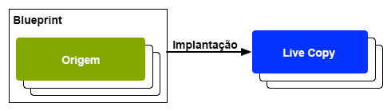

# Reutilizar conteúdo: gerenciador de vários sites e Live Copy {#multi-site-manager-and-live-copy}

O Multi Site Manager (MSM) permite que você use o mesmo conteúdo de site em vários locais. O MSM usa sua funcionalidade de Live Copy para fazer isso.

* Com o MSM você pode:
   * Criar conteúdo uma vez e depois
   * Reutilize esse conteúdo em outras áreas (por meio de [Live Copies](#live-copies)) do mesmo ou de outros sites.
* O MSM mantém os relacionamentos ao vivo entre o seu conteúdo de origem e suas Live Copies, de modo que:
   * Quando você faz alterações no conteúdo de origem, a origem e as Live Copies são sincronizadas.
   * Você pode fazer ajustes somente no conteúdo das Live Copies, desconectando o relacionamento ao vivo de subpáginas e/ou componentes individuais.

Esta página fornece uma visão geral da reutilização de conteúdo com o MSM. As páginas a seguir abordam os problemas relacionados detalhadamente.

* [Criação e sincronização de cópias em tempo real](creating-live-copies.md)
* [Console de Visão Geral da Live Copy](live-copy-overview.md)
* [Configurar a sincronização da Live Copy](live-copy-sync-config.md)
* [Conflitos de implementação do MSM](rollout-conflicts.md)
* [Práticas recomendadas do MSM](best-practices.md)

## Cenários possíveis {#possible-scenarios}

Há muitos casos de uso para MSM e Live Copies. Alguns cenários incluem:

* **Multinacionais - Global para Empresa Local**

   Um caso de uso típico que o MSM suporta é o reuso de conteúdo em vários sites multinacionais de mesmo idioma. Isto permite reutilizar o conteúdo de base, permitindo também variações nacionais.

   Por exemplo, a seção em inglês da amostra de tutorial [WKND](/help/implementing/developing/introduction/develop-wknd-tutorial.md) é criada para clientes nos EUA. A maior parte do conteúdo deste site também pode ser usada para outros sites WKND que atendem clientes que falam inglês de diferentes países e culturas. O conteúdo principal permanece o mesmo em todos os sites, enquanto os ajustes regionais podem ser feitos.

   A seguinte estrutura pode ser usada para sites dos Estados Unidos e Canadá. Observe como o nó `language-masters` mantém a cópia principal não apenas do inglês, mas de outro conteúdo de idioma. Esse conteúdo pode ser usado como a base para o conteúdo adicional em língua regional, ao lado do inglês.

   ```xml
   /content
       |- wknd
           |- language-masters
               |- en
               |- es
               |- fr
           |- us
               |- en
               |- es
           |- ca
               |- en
               |- fr
   ```

   >[!NOTE]
   >
   >O MSM não traduz o conteúdo. Ele é usado para criar a estrutura necessária e implantar o conteúdo.
   >
   >
   >Consulte [Tradução de conteúdo para sites multilíngues](/help/sites-cloud/administering/translation/overview.md) para obter esse exemplo.

* **Serviço Nacional - Chefe das Sucursais Regionais**

   Em alternativa, uma empresa com uma rede de concessionários pode querer sítios Web distintos para as suas concessionárias individuais, cada uma delas uma variação do sítio principal fornecido pela sede. Pode ser uma única empresa com vários escritórios regionais ou um sistema nacional de franquia composto por um franqueador central e por várias franqueias locais.

   A sede pode fornecer as informações principais, enquanto as entidades regionais podem adicionar informações locais, como detalhes de contato, horários de abertura e eventos.

   ```xml
   /content
       |- head-office-berlin
       |- branch-hamburg
       |- branch-stuttgart
       |- branch-munich
       |- branch-frankfurt
   ```

* **Várias versões**

   O MSM pode criar versões de uma subramificação específica. Por exemplo, um subsite de suporte pode conter detalhes das diferentes versões de um produto específico, onde as informações básicas permanecem constantes e apenas os recursos atualizados precisam ser alterados:

   ```xml
   /content
       |- game-support
           |- polybius
               |- v5.0
               |- v4.0
               |- v3.0
               |- v2.0
               |- v1.0
   ```

   >[!TIP]
   >
   >Em tal cenário, trata-se de saber se deve fazer uma cópia simples ou usar cópias em tempo real, o que corresponde a um saldo de:
   >
   >* Quanto do conteúdo principal precisa ser atualizado em várias versões.
   >
   >Contra:
   >
   >* Quantas cópias individuais precisam ser ajustadas.


## MSM da interface do usuário {#msm-from-the-ui}

O MSM é diretamente acessível na interface do usuário usando várias opções do console apropriado.

* **Criar site**  (**Sites**)

   * O MSM ajuda você a gerenciar vários sites que compartilham conteúdo comum. Por exemplo, os sites geralmente são fornecidos para públicos internacionais, de modo que a maioria do conteúdo é comum em todos os países, com um subconjunto do conteúdo específico para cada país. O MSM permite [criar Live Copies que atualizam automaticamente um ou mais sites com base no site de origem](creating-live-copies.md#creating-a-live-copy-of-a-site-from-a-blueprint-configuration). Isso também ajuda a impor uma estrutura básica comum, usar o conteúdo comum em vários sites, manter uma aparência comum e concentrar esforços no gerenciamento de conteúdo que realmente difere entre os sites. Criando um site dessa maneira:
      * Requer uma configuração predefinida do blueprint para especificar a origem.
      * Cria uma Live Copy da fonte (predefinida).
      * Fornece ao usuário o botão **Rollout**.

* **Criar Live Copy**  (**Sites**)

   * O MSM permite que você [crie uma Live Copy ad-hoc (one-off) de uma página individual ou subramificação de um site.](creating-live-copies.md#creating-a-live-copy-of-a-page) Por exemplo, duplicar uma subramificação para fornecer informações sobre uma versão nova/atualizada de um produto. Criando uma Live Copy dessa maneira:
      * Cria uma Live Copy ad-hoc (nenhuma configuração do blueprint é necessária).
      * Pode ser usado para (imediatamente) criar uma Live Copy de qualquer página/ramificação.
      * Requer **Sincronizar** (não fornece o botão **Implantação**).

* **Propriedades da exibição**  (**Sites**)

   * Quando apropriado, essa opção o ajuda a [monitorar sua Live Copy](creating-live-copies.md#monitoring-your-live-copy) fornecendo informações sobre a **Live Copy** ou **Blueprint** relacionada.

* **Referências**  (**Sites**)

   * O painel [Referências](/help/sites-cloud/authoring/getting-started/basic-handling.md#references) fornece informações sobre **Live Copies** junto com acesso às ações apropriadas.

* **Visão geral da Live Copy**  (**Sites**)

   * Esse console permite [visualizar e gerenciar seu blueprint e suas Live Copies.](live-copy-overview.md)

* **Blueprints**  (**Ferramentas**  -  **Sites**)

   * Esse console permite [criar e gerenciar as configurações do blueprint.](creating-live-copies.md#creating-a-blueprint-configuration)

>[!NOTE]
>
>Os aspectos da funcionalidade MSM são usados em vários outros recursos AEM, como Inicializações. Nesses casos, a Live Copy é gerenciada por esse recurso.

### Termos usados {#terms-used}

Como introdução, a tabela a seguir fornece uma visão geral dos principais termos usados com o MSM. Elas serão abordadas com mais detalhes nas seções e páginas subsequentes.

| Termo | Definição | Mais detalhes |
|---|---|---|
| Origem | As páginas originais usadas como base para cópias em tempo real | Sinônimo de páginas do Blueprints e/ou do Blueprint |
| Live Copy  | A cópia (da origem), mantida pelas ações de sincronização, conforme definido pelas configurações de implementação |  |
| Configuração da Live Copy | Definição dos detalhes de configuração para uma Live Copy |  |
| Relacionamento ao vivo | Definição efetiva da herança para um determinado recurso, ou seja, a(s) conexão(ões) entre a origem e as Live Copies | Garante que as alterações na origem possam ser sincronizadas com a Live Copy |
| Blueprint | Sinônimo com Origem | Pode ser definido por uma configuração do blueprint |
| Configuração do Blueprint | Configuração predefinida especificando um caminho de origem | Quando uma página do blueprint é referenciada em uma configuração do blueprint, o comando Rollout fica disponível |
| Capítulo | As seções do blueprint a serem incluídas na Live Copy | Geralmente, essas são subpáginas da raiz |
| Sincronização | O termo genérico para a sincronização do conteúdo entre a origem e as Live Copies (pelas opções **Rollout** e **Synchronize**) |  |
| Implantação | Sincroniza da origem para a Live Copy | Pode ser acionado por um autor (em uma página de blueprint) ou por um evento do sistema (conforme definido pela configuração de implementação) |
| Configuração de implantação | Regras que determinam quais propriedades serão sincronizadas, como e quando |  |
| Sincronizar | Uma solicitação manual de sincronização, feita das páginas da Live Copy |  |
| Herança | Uma página/componente da Live Copy herda o conteúdo de sua página/componente de origem quando a sincronização ocorre |  |
| Suspender | Remove temporariamente o relacionamento dinâmico entre uma Live Copy e sua página de blueprint |  |
| Destacar | Remove permanentemente a relação ativa entre uma Live Copy e sua página de blueprint |  |
| Redefinir | Redefinir uma página de Live Copy para remover todos os cancelamentos de herança e retornar a página ao mesmo estado que a página de origem | A redefinição afeta todas as alterações feitas nas propriedades da página, no sistema de parágrafo e nos componentes. |
| Suave | Uma Live Copy de uma única página |  |
| Profundo | Uma Live Copy de uma página, junto com suas páginas filhas |  |

<!--
>[!TIP]
>
>See [Overview of the Java API](/help/sites-developing/extending-msm.md#overview-of-the-java-api) for the object names.
-->

## Live Copies {#live-copies}

Uma Live Copy do MSM é uma cópia do conteúdo específico do site para o qual é mantido um relacionamento dinâmico com a fonte original:

* A Live Copy herda conteúdo de sua origem.
* A sincronização executa a transferência real do conteúdo quando as alterações são feitas na fonte.
* Uma Live Copy pode ser considerada como:
   * Superficial: uma página única
   * Profundo: a página, junto com suas páginas secundárias
* As regras de sincronização, chamadas de configurações de implementação, determinam quais propriedades são sincronizadas e quando a sincronização ocorre.

No exemplo anterior, `/content/wknd/language-masters/en` é o site principal global em inglês. Para reutilizar o conteúdo deste site, as Live Copies do MSM são criadas:

* O conteúdo abaixo `/content/wknd/language-masters/en` é a fonte.
* O conteúdo abaixo `/content/wknd/language-masters/en` é copiado abaixo dos nós `/content/wknd/us/en/` e `/content/wknd/ca/en`. Estas são as Live Copies.
* Os autores fazem alterações nas páginas abaixo `/content/wknd/language-masters/en`.
* Quando acionado, o MSM sincroniza essas alterações nas Live Copies.

### Live Copies - Composição {#live-copies-composition}

>[!NOTE]
>
>Os diagramas e descrições nesta seção representam instantâneos de possíveis Live Copies. Não são abrangentes, mas fornecem uma visão geral para destacar características específicas.

Ao criar inicialmente uma Live Copy, as páginas de origem selecionadas são refletidas em uma base 1:1 na Live Copy. Depois disso, novos recursos (páginas e/ou parágrafos) também poderão ser criados diretamente na Live Copy, portanto, é útil estar ciente dessas variações e como elas afetam a sincronização. As possíveis composições incluem:

* [Live Copy com páginas que não são da Live Copy](#live-copy-with-non-live-copy-pages)
* [Cópias online aninhadas](#nested-live-copies)

A forma básica da Live Copy tem:

* Páginas de Live Copy que refletem as páginas de origem selecionadas em uma base 1:1.
* Uma definição de configuração.
* Um relacionamento dinâmico definido para cada recurso:
   * Vincule o recurso Live Copy ao blueprint/origem.
   * São usados ao realizar a herança e a implantação.

As alterações podem ser [sincronizadas](creating-live-copies.md#synchronizing-your-live-copy) de acordo com os requisitos.


#### Live Copy com páginas que não são da Live Copy {#live-copy-with-non-live-copy-pages}

Ao criar uma Live Copy no AEM, você pode ver e navegar pela ramificação Live Copy e usar a funcionalidade AEM normal na ramificação Live Copy. Isso significa que você (ou um processo) pode criar novos recursos (páginas e/ou parágrafos) dentro da Live Copy. Por exemplo, um produto para uma determinada região ou país.

* Esses recursos não têm relacionamento dinâmico com as páginas de origem/blueprint e não são sincronizados.
* Podem ocorrer cenários que o MSM lida como casos especiais. Por exemplo, quando você (ou um processo) cria uma página com a mesma posição e nome nas ramificações de origem/blueprint e Live Copy. Para essas situações, consulte [Conflitos de implementação MSM](rollout-conflicts.md) para obter mais informações.


#### Cópias online aninhadas {#nested-live-copies}

Quando você (ou um processo) cria uma [nova página em uma Live Copy existente](#live-copy-with-non-live-copy-pages) essa nova página também pode ser configurada como uma Live Copy de um blueprint diferente. Isso é conhecido como Live Copy aninhada. Em Live Copies aninhadas, o comportamento da segunda ou da Live Copy interna é afetado pela primeira ou pela Live Copy externa das seguintes maneiras:

* Uma implantação profunda acionada para a Live Copy de nível superior pode ser continuada na Live Copy aninhada.
* Qualquer link entre as fontes será reescrito dentro das Live Copies.

Por exemplo, os links que apontam do segundo ao primeiro blueprint serão reescritos como links que apontam da segunda/aninhada Live Copy para a primeira Live Copy.


>[!NOTE]
>
>Se você mover ou renomear uma página na ramificação Live Copy, ela será tratada como uma Live Copy aninhada para permitir que o AEM rastreie os relacionamentos.

#### Cópias online empilhadas {#stacked-live-copies}

Uma Live Copy é conhecida como Live Copy empilhada quando é criada como filho de uma Live Copy superficial. Ele se comporta da mesma maneira que uma [Live Copy aninhada](#nested-live-copies).

### Origem, Blueprints e configurações do Blueprint {#source-blueprints-and-blueprint-configurations}

Qualquer página ou ramificação de páginas pode ser usada como a fonte de uma Live Copy. No entanto, o MSM também permite definir uma configuração do blueprint que especifica um caminho de origem. Os benefícios de usar uma configuração do blueprint são:

* Permita que o autor use a opção **Rollout** em um blueprint. Ou seja, para enviar modificações explicitamente para as Live Copies que herdam deste blueprint.
* Permitir que o autor use **Criar Site**. Isso permite que o usuário selecione idiomas facilmente e configure a estrutura da Live Copy.
* Defina uma configuração de implementação padrão para Live Copies que tenham uma relação com o blueprint.

A origem de uma Live Copy pode ser páginas regulares ou páginas cobertas por uma configuração de blueprint. Ambos são casos de uso válidos.

A origem forma o blueprint para a Live Copy. O blueprint é definido quando você:

* [Criar uma configuração do Blueprint](creating-live-copies.md#creating-a-blueprint-configuration)  - A configuração define com antecedência as páginas a serem usadas para criar a Live Copy.
* [Criar uma Live Copy de uma Página](creating-live-copies.md#creating-a-live-copy-of-a-page)  - As páginas usadas para criar a Live Copy (as páginas de origem) são as páginas do blueprint. A página de origem pode ou não ser referenciada por uma configuração do blueprint.

### Implantação e sincronização {#rollout-and-synchronize}

Uma implantação é a ação MSM central que sincroniza Live Copies com suas fontes. Você pode executar implantações manualmente ou elas podem ocorrer automaticamente.

* Uma [configuração de implementação](#rollout-configurations) pode ser definida para que [events](live-copy-sync-config.md#rollout-triggers) específicos possam fazer com que uma implementação ocorra automaticamente.
* Ao criar uma página do blueprint, você pode usar o comando **[Rollout](creating-live-copies.md#rolling-out-a-blueprint)** para enviar alterações para a Live Copy.
   * O comando **Rollout** está disponível em uma página de blueprint referenciada por uma configuração de blueprint.

   

* Ao criar uma página de Live Copy, você pode usar o comando **[Sincronizar](creating-live-copies.md#synchronizing-a-live-copy)** para extrair as alterações da origem para a Live Copy.
   * O comando **Synchronize** está sempre disponível na página Live Copy, independentemente de a página fonte/blueprint ser incluída por uma configuração do blueprint.

   

### Configurações de implementação {#rollout-configurations}

Uma configuração de implementação define quando e como uma Live Copy é sincronizada com o conteúdo de origem. Uma configuração de implementação consiste em um acionador e uma ou mais ações de sincronização:

* **Acionador**  - Um acionador é um evento que faz com que a sincronização da ação ao vivo ocorra, como a ativação de uma página de origem. O MSM define os acionadores que você pode usar.
* **Ações de sincronização**  - As ações de sincronização são executadas na Live Copy para sincronizá-las com a fonte. Os exemplos de ações são copiar o conteúdo, ordenar nós filhos e ativar a página Live Copy. O MSM fornece várias ações de sincronização.

>[!NOTE]
>
>Você pode criar ações personalizadas para sua instância usando a API do Java.

As configurações de implantação podem ser reutilizadas, de modo que mais de uma Live Copy possa usar a mesma configuração de implantação. Várias [configurações de implementação](live-copy-sync-config.md#installed-rollout-configurations) estão incluídas em uma instalação padrão.

### Conflitos de implementação {#rollout-conflicts}

As implantações podem se tornar complicadas, especialmente quando os autores estão editando o conteúdo na origem e na Live Copy. Portanto, é útil estar ciente de como o AEM lida com qualquer conflito [que possa ocorrer durante a implantação.](rollout-conflicts.md)

### Suspensão e cancelamento de herança e sincronização {#suspending-and-cancelling-inheritance-and-synchronization}

Cada página e componente em uma Live Copy é associado à página e ao componente de origem por meio de um relacionamento dinâmico. O relacionamento ao vivo configura a sincronização do conteúdo da Live Copy da origem.

Você pode **Suspender** a herança da Live Copy para uma página de Live Copy, para que possa alterar as propriedades e os componentes da página. Quando você suspende a herança, as propriedades e os componentes da página não são mais sincronizados com a fonte.

Ao editar uma página individual, os autores podem **Cancelar herança** para um componente. Quando a herança é cancelada, o relacionamento ao vivo é suspenso e a sincronização não ocorre para esse componente. Cancelar a herança e a sincronização são úteis quando as subseções do conteúdo precisam ser personalizadas.

### Desanexar uma Live Copy {#detaching-a-live-copy}

Você também pode [desconectar uma Live Copy](creating-live-copies.md#detaching-a-live-copy) de seu blueprint para remover todas as conexões.

>[!CAUTION]
>
>A ação Desanexar é permanente e não reversível.

A ação de desanexar remove permanentemente o relacionamento em tempo real entre uma Live Copy e sua página de blueprint. Todas as propriedades relevantes ao MSM são removidas da Live Copy e as páginas da Live Copy se tornam uma cópia independente.

>[!TIP]
>
>Consulte [Desanexar uma Live Copy](creating-live-copies.md#detaching-a-live-copy) para obter detalhes completos, incluindo o impacto relacionado em páginas secundárias e principais.

## Etapas padrão para usar o MSM {#standard-steps-for-using-msm}

As etapas a seguir descrevem o procedimento padrão para usar o MSM para reutilizar conteúdo e sincronizar alterações em Live Copies.

1. Desenvolver o conteúdo do site de origem.
1. Determine a configuração de implementação a ser usada.

   1. O MSM [instala várias configurações de implementação](live-copy-sync-config.md#installed-rollout-configurations) que podem atender a vários casos de uso.
   1. Opcionalmente, você pode [criar uma configuração de implementação](live-copy-sync-config.md#creating-a-rollout-configuration), se necessário.

1. Determine onde você precisa [especificar as configurações de implementação a serem usadas](live-copy-sync-config.md#specifying-the-rollout-configurations-to-use) e configurar conforme necessário.
1. Se necessário, [crie uma configuração de blueprint](creating-live-copies.md#creating-a-blueprint-configuration) que identifique o conteúdo de origem da Live Copy.
1. [Criar uma Live Copy.](creating-live-copies.md#creating-a-live-copy)
1. Faça alterações no conteúdo de origem, conforme necessário. Você deve utilizar o processo normal de revisão e aprovação de conteúdo estabelecido pela organização.
1. [Implante ](creating-live-copies.md#rolling-out-a-blueprint) o blueprint ou  [sincronize a Live ](creating-live-copies.md#synchronizing-a-live-copy) Copy com as alterações.

## Personalização do MSM {#customizing-msm}

O MSM fornece ferramentas para que sua implementação possa se adaptar às complexidades excepcionais que podem existir ao compartilhar conteúdo.

* **Configurações personalizadas de implementação**  -  [Crie uma ](live-copy-sync-config.md#creating-a-rollout-configuration) configuração de implementação quando as configurações de implementação instaladas não atenderem aos seus requisitos. Você pode usar qualquer acionador de implementação e ação de sincronização disponível.

<!--
* **Custom Synchronization Actions** - [Create a custom synchronization action](/help/sites-developing/extending-msm.md#creating-a-new-synchronization-action) when the installed actions do not meet your specific application requirements. MSM provides a Java API for creating custom synchronization actions.
-->

## Práticas recomendadas     {#best-practices}

A página [Práticas recomendadas do MSM](best-practices.md) contém informações importantes sobre sua implementação.
