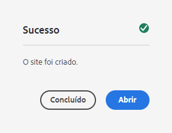

# Criação de um site {#creating-site}

Saiba como usar o AEM para criar um site usando modelos de site para definir o estilo e a estrutura de seu site.

## Visão geral {#overview}

Antes que os autores de conteúdo possam criar páginas com conteúdo, o site deve ser criado primeiro. Isso geralmente é feito por um administrador do AEM que define a estrutura inicial do site. Usar modelos de site torna a criação de sites rápida e flexível.

A ferramenta de Criação rápida de sites do AEM permite que não desenvolvedores criem rapidamente um novo site do zero, usando modelos de site.

Depois de criada, a ferramenta de Criação rápida de sites também permite a personalização rápida do tema e estilo do site do AEM (JavaScript, CSS e recursos estáticos). Isso permite que o desenvolvedor de front-end, que não precisa ter nenhum conhecimento sobre o AEM, funcione separadamente e em paralelo aos criadores de conteúdo. O administrador do AEM simplesmente baixa o tema do site e o fornece ao desenvolvedor de front-end, que o personaliza usando suas ferramentas favoritas e, em seguida, confirma as alterações no repositório de código do AEM, que é então implantado.

Este documento se concentra na criação de sites usando a ferramenta de Criação rápida de sites. Se deseja ter uma visão geral do fluxo de trabalho de criação e personalização de sites, consulte a [Jornada de Criação rápida de sites do AEM](/help/journey-sites/quick-site/overview.md)

## Planejamento da estrutura do site {#structure}

Reserve tempo para considerar a finalidade do site e o conteúdo planejado com bastante antecedência. Isso conduzirá a maneira como você desenha a estrutura do site. Uma boa estrutura de site permite uma fácil navegação e descoberta de conteúdo pelos visitantes do site, além de ser compatível com vários recursos do AEM, como [gerenciamento multisite e tradução.](/help/sites-cloud/administering/msm-and-translation.md)

>[!TIP]
>
>[O site de referência do WKND](https://wknd.site) fornece uma implementação de práticas recomendadas para um site de marca de experiências externas totalmente funcional. Explore-o para ver como um site do AEM bem construído é estruturado.

## Modelos de site {#site-templates}

Como a estrutura do site é muito importante para o sucesso dele, é conveniente ter estruturas predefinidas disponíveis para implantar rapidamente um novo site com base em um conjunto de padrões existentes. Os modelos de site são uma maneira de combinar conteúdos básicos de sites em um pacote conveniente e reutilizável.

Os modelos de site geralmente contêm o conteúdo básico e a estrutura do site, bem como informações de estilo para iniciar o novo site rapidamente. Esses modelos são bastante eficientes, pois podem ser reutilizados e personalizados. E como é possível ter vários modelos disponíveis na sua instância do AEM, você tem a flexibilidade de criar sites diferentes para atender a várias necessidades comerciais.

>[!TIP]
>
>Para obter mais detalhes sobre modelos de site, consulte o artigo [Modelos de site](site-templates.md).

>[!NOTE]
>
>O modelo de site não deve ser confundido com modelos de página. Os modelos de site definem a estrutura geral de um site. Um modelo de página define a estrutura e o conteúdo inicial de uma página individual.

## Criação de um site {#create-site}

É simples usar um modelo para criar um site.

1. Faça logon no ambiente de criação do AEM e navegue até o console de sites

   * `https://<your-author-environment>.adobeaemcloud.com/sites.html/content`

1. Toque ou clique em **Criar** no canto superior direito da tela e, no menu suspenso, selecione **Site a partir de modelo**.

   

1. No assistente Criar site, toque ou clique em um modelo existente no painel esquerdo ou em **Importar** na parte superior da coluna à esquerda para importar um novo modelo.

   

   1. Se optar por importar, no navegador de arquivos, localize o modelo que deseja usar e toque ou clique em **Fazer upload**.

   1. Depois que o upload for concluído, ele aparece na lista de modelos disponíveis.

1. Ao selecionar um modelo, informações sobre ele são reveladas na coluna da direita. Com o modelo desejado selecionado, toque ou clique em **Próximo**.

   

1. Forneça um título para o site. Um nome de site pode ser fornecido ou gerado a partir do título, caso seja omitido.

   * O título do site aparece na barra de título dos navegadores.
   * O nome do site se torna parte do URL.
   * O nome do site deve estar em conformidade com as [Convenções de nomenclatura de páginas do AEM.](/help/sites-cloud/authoring/fundamentals/organizing-pages.md#page-name-restrictions-and-best-practices)

1. Toque ou clique em **Criar** e o site é criado a partir do modelo de site.

   

1. Na caixa de diálogo de confirmação exibida, toque ou clique em **Concluído**.

   

1. No console do Sites, o novo site é visível e pode ser navegado para explorar sua estrutura básica, conforme definido pelo modelo.

   

Os autores de conteúdo agora podem começar a criar!

## Personalização do site {#site-customization}

Se o site requer personalização para além dos modelos disponíveis, existem várias opções.

* Se a estrutura do site ou o conteúdo inicial precisar ser ajustado, [o modelo de site pode ser personalizado para atender às suas necessidades.](site-templates.md)
* Se o estilo do site precisar ser ajustado, [o tema do site pode ser baixado e personalizado.](/help/journey-sites/quick-site/overview.md)
* Se a funcionalidade do site precisar ser ajustada, [o site pode ser totalmente personalizado.](/help/implementing/developing/introduction/develop-wknd-tutorial.md)

Qualquer personalização deve ser realizada com o apoio de uma equipe de desenvolvimento.
