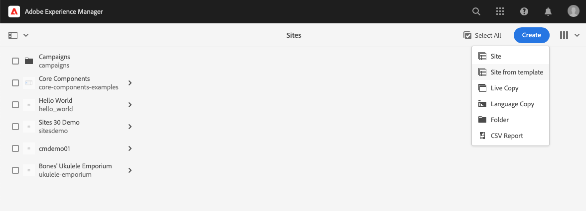

# Modelos de site {#site-templates}

{{traditional-aem}}

Saiba como os modelos de site do AEM podem ser usados para predefinir a estrutura do site e o conteúdo inicial para permitir que você crie sites rapidamente.

## Visão geral {#overview}

É conveniente ter estruturas predefinidas disponíveis para implantar rapidamente um novo site com base em um conjunto de padrões existentes. Os modelos de site são uma maneira de combinar conteúdos básicos de sites em um pacote conveniente e reutilizável.

Os modelos de site geralmente contêm o conteúdo básico do site e informações sobre a estrutura e o estilo do site, conhecidas como [tema do site](site-themes.md), para iniciar um novo site rapidamente. Os administradores selecionam um modelo de site no qual basearão o site [durante o processo de criação do site](create-site.md).

Esses modelos são bastante eficientes pois podem ser reutilizados e personalizados. E como é possível ter vários modelos disponíveis na sua instância do AEM, você tem a flexibilidade de criar sites diferentes para atender a várias necessidades comerciais.

>[!NOTE]
>
>Os modelos de site do AEM não devem ser confundidos com os [modelos de página](/help/sites-cloud/authoring/page-editor/templates.md). Os modelos de site definem a estrutura geral de um site. Um modelo de página define a estrutura e o conteúdo inicial de uma página individual.
>
>Os modelos de site do AEM não devem ser confundidos com os [temas de site do AEM](site-themes.md). Os temas de site do AEM contêm apenas as informações de estilo de um site do AEM. Os modelos de site do AEM definem a estrutura do site e o conteúdo inicial, assim como contêm um tema de site do AEM para permitir a [criação rápida de sites](create-site.md).

## Adicionar um modelo de site ao AEM {#adding}

É possível adicionar vários modelos ao AEM, que podem ser usados para [criar sites](create-site.md).

1. Faça logon no ambiente de criação do AEM e navegue até o console de sites

   * `https://<your-author-environment>.adobeaemcloud.com/sites.html/content`

1. Selecione **Criar** no canto superior direito da tela e, no menu suspenso, selecione **Site do modelo**.

   

1. No assistente Criar Site, selecione **Importar** na parte superior da coluna à esquerda.

   

1. No navegador de arquivos, localize o modelo que deseja usar e selecione **Carregar**.

1. Depois que o upload for concluído, ele aparece na lista de modelos disponíveis.

Seu modelo é carregado e pode ser usado para [criar novos sites](create-site.md).

Ao selecionar um modelo existente, informações sobre ele são mostradas na coluna direita.

## Estrutura do modelo de site {#structure}

Os modelos de site são pacotes com uma estrutura lógica que reflete claramente a finalidade do seu conteúdo. Um modelo de site tem a seguinte estrutura.

* `files`: pasta com o kit de interface, arquivo XD e, possivelmente, outros arquivos
* `previews`: pasta com capturas de tela do modelo de site
* `site`: pacote de conteúdo do conteúdo que é copiado para cada site criado a partir deste modelo, como modelos de página, páginas, etc.
* `theme`: Fontes do [tema do site](site-themes.md) para modificar a aparência do site, incluindo CSS, JavaScript e assim por diante.

## Modelo de site padrão {#standard-site-template}

A Adobe fornece um modelo de referência de práticas recomendadas que pode ser usado como base para criar seus próprios modelos. [O Modelo de Site Padrão está disponível no GitHub](https://github.com/adobe/aem-site-template-standard).

[A versão mais recente do modelo de site padrão](https://github.com/adobe/aem-site-template-standard/releases) pode ser baixada e usada para [criar novos sites](create-site.md) diretamente.

## Desenvolvimento de modelos de site {#developing-templates}

A Adobe fornece o Criador de modelos de site do AEM como um conjunto de scripts para criação de novos modelos de site.

[O Criador de modelos de site do AEM está disponível no GitHub, junto com a documentação de uso](https://github.com/adobe/aem-site-template-builder). É necessária experiência em desenvolvimento front-end para personalizar o [tema do site](site-themes.md) e conhecimento em desenvolvimento no AEM para personalizar a estrutura e o conteúdo do site.
