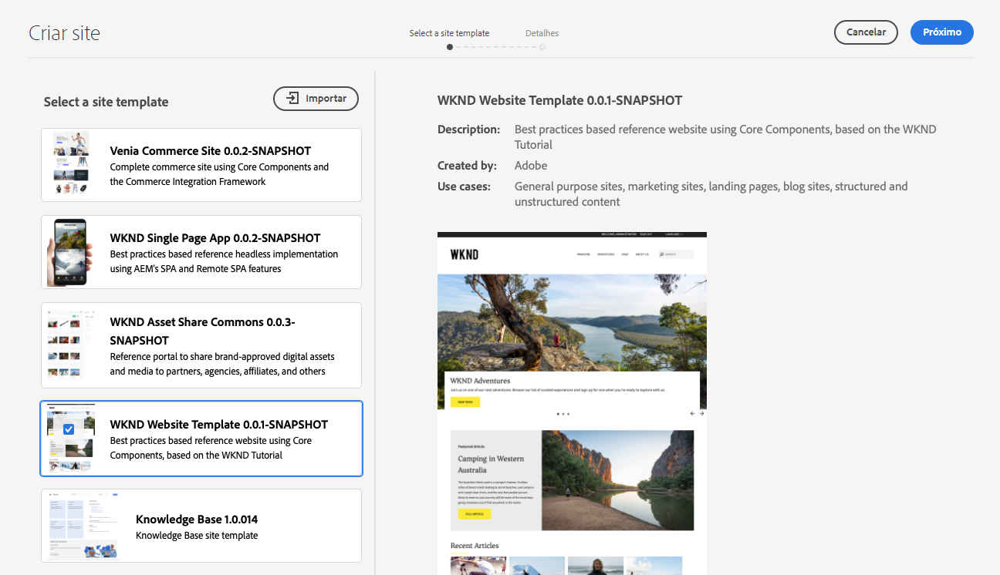

# Modelos de site {#site-templates}

Saiba como AEM modelos de site podem ser usados para predefinir a estrutura do site e o conteúdo inicial para permitir que você crie sites rapidamente.

## Visão geral {#overview}

É conveniente ter estruturas predefinidas disponíveis para implantar rapidamente um novo site com base em um conjunto de padrões existentes. Os modelos de site são uma maneira de combinar conteúdo básico do site em um pacote conveniente e reutilizável.

Os modelos de site geralmente contêm conteúdo base e estrutura do site, bem como informações de estilo do site, conhecidas como [tema do site,](site-themes.md) para iniciar um novo site rapidamente. Os administradores selecionam um modelo de site no qual basear o site [durante o processo de criação do site.](create-site.md)

Os modelos são poderosos porque são reutilizáveis e personalizáveis. E como você pode ter vários modelos disponíveis na sua instalação do AEM, você tem a flexibilidade de criar sites diferentes para atender a várias necessidades comerciais.

>[!NOTE]
>
>Os modelos de site AEM não devem ser confundidos com [modelos de página.](/help/sites-cloud/authoring/features/templates.md) Os modelos de site definem a estrutura geral de um site. Um modelo de página define a estrutura e o conteúdo inicial de uma página individual.
>
>Os modelos de site AEM não devem ser confundidos com [AEM temas do site.](site-themes.md) AEM temas do site contêm apenas as informações de estilo de um site AEM. AEM modelos de site definem a estrutura do site e o conteúdo inicial, bem como contêm um tema de site AEM para permitir [criação rápida do site.](create-site.md)

## Adicionar um modelo de site ao AEM {#adding}

É possível adicionar vários modelos ao AEM, que pode ser usado para [criar sites.](create-site.md)

1. Faça logon no ambiente de criação do AEM e navegue até o console Sites

   * `https://<your-author-environment>.adobeaemcloud.com/sites.html/content`

1. Toque ou clique **Criar** no canto superior direito do ecrã e, no menu suspenso, selecione **Site a partir do modelo**.

   

1. No assistente Criar site , toque ou clique em **Importar** na parte superior da coluna à esquerda.

   

1. No navegador de arquivos, localize o modelo que deseja usar e toque ou clique em **Upload**.

1. Depois de carregado, ele aparece na lista de modelos disponíveis.

Seu modelo é carregado e pode ser usado para [criar novos sites.](create-site.md)

Ao selecionar um template existente, ele revela informações sobre o template na coluna direita.

## Estrutura do modelo do site {#structure}

Os modelos de site são simplesmente pacotes com uma estrutura lógica que reflete claramente a finalidade do conteúdo do pacote. Um modelo de site tem a seguinte estrutura.

* `files`: Pasta com o kit de interface do usuário, XD arquivo e possivelmente outros arquivos
* `previews`: Pasta com capturas de tela do modelo de site
* `site`: Pacote de conteúdo do conteúdo que é copiado para cada site criado a partir deste modelo, como modelos de página, páginas, etc.
* `theme`: Fontes do [tema do site](site-themes.md) para modificar a aparência do site, incluindo CSS, JavaScript, etc.

## Modelo de site padrão {#standard-site-template}

O Adobe fornece um modelo de referência de práticas recomendadas que pode ser usado como base para criar seus próprios modelos. [O Modelo de site padrão está disponível no GitHub.](https://github.com/adobe/aem-site-template-standard)

[A versão mais recente do Modelo de site padrão](https://github.com/adobe/aem-site-template-standard/releases) pode ser baixada e usada diretamente para [criar novos sites.](create-site.md)

## Desenvolvimento de modelos de site {#developing-templates}

O Adobe fornece e AEM o Criador de modelos de site como um conjunto de scripts para criar novos modelos de site.

[O AEM Site Template Builder está disponível junto com a documentação de uso no GitHub.](https://github.com/adobe/aem-site-template-builder) A experiência do desenvolvedor front-end é necessária para personalizar o [tema do site](site-themes.md) e AEM conhecimento do desenvolvedor é necessário para personalizar a estrutura e o conteúdo do site.
