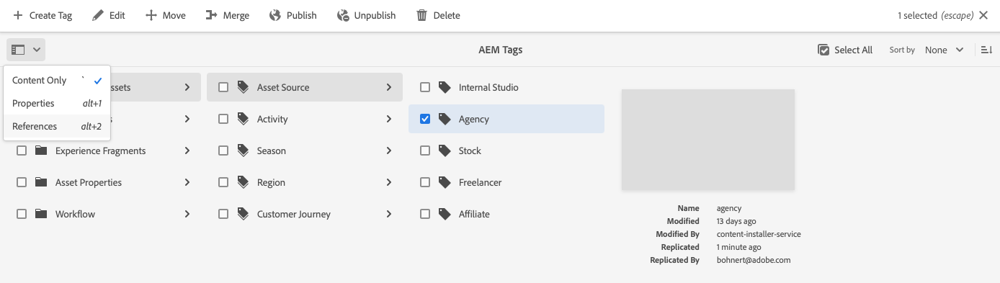

# Administração de tags {#administering-tags}

As tags são um método intuitivo de classificar o conteúdo. Elas podem ser consideradas palavras-chave ou rótulos (metadados) que permitem que o conteúdo seja encontrado mais rapidamente.

No Adobe Experience Manager (AEM), uma tag pode ser uma propriedade de:

* Um nó de conteúdo para uma página
   * Consulte o documento [Usando Tags](/help/sites-cloud/authoring/sites-console/tags.md) para obter mais informações.
* Um nó de metadados de um ativo
   * Consulte o documento [Gerenciamento de metadados para Assets digital](/help/assets/manage-metadata.md) para obter mais informações.

>[!TIP]
>
>É uma prática recomendada minimizar o número de tags relacionadas às mesmas ideias. Por exemplo, se você estiver gerenciando conteúdo para uma loja de suprimentos para ambientes externos, provavelmente não precisará de uma tag para **calçados** e **sapatos**.

## Recursos de tag {#tag-features}

As tags oferecem recursos robustos para organização e gerenciamento de conteúdo.

* As tags podem ser agrupadas em vários namespaces.
   * Os namespaces podem ser considerados hierarquias que permitem a criação de taxonomias.
   * Essas taxonomias são globais por todo o AEM.
* As tags podem ser aplicadas por autores e usadas por visitantes do site.
* Independentemente do criador, todas as formas de tags são disponibilizadas para seleção, tanto ao atribuir a uma página quanto ao pesquisar.
* As marcas são usadas pelo [Componente de Lista](https://experienceleague.adobe.com/docs/experience-manager-core-components/using/wcm-components/list.html) para gerar listas dinâmicas com base nas marcas selecionadas.

## Requisitos da tag {#requirements}

Existem alguns detalhes técnicos que devem ser considerados ao criar e gerenciar tags.

* As tags devem ser exclusivas em um namespace específico.
* O nome de uma tag não pode incluir delimitadores de tag:
   * Dois pontos (`:`) - Delimita a marca de namespace
   * Barra (`/`) - Delimita subtags
* Se o título de uma tag incluir delimitadores de tag, eles serão suprimidos na interface do.
* As marcas podem ser criadas e sua taxonomia pode ser modificada por membros do grupo `tag-administrators` e por membros que têm direitos de modificação para `/content/cq:tags`.
   * Uma tag que contém tags secundárias é chamada de tag container.
   * Uma tag que não é uma tag container é chamada de tag folha.
   * Um namespace de tag pode ser uma tag folha ou container.

Para obter mais detalhes técnicos sobre como as tags funcionam, consulte [Estrutura de Marcação de AEM](/help/implementing/developing/introduction/tagging-framework.md).

## Console de marcação {#tagging-console}

O console de marcação é usado para criar e gerenciar tags e suas taxonomias. Você pode usar o console de marcação para gerenciar as tags ao:

* Agrupá-los em namespaces.
* Analisar o uso de tags existentes antes de criar novas.
* Reorganização das tags sem desconectar a tag do conteúdo referenciado no momento.

Para acessar o console de marcação:

1. Faça logon em um ambiente de criação com privilégios administrativos.
1. No menu de navegação global, selecione **`Tools`** > **`General`** >
   **`Tagging`**.

## Criação de novas tags {#creating-new-tags}

Há várias etapas para criar e usar tags para organizar seu conteúdo.

1. [Crie um namespace para suas marcas](#creating-namespaces) (ou escolha uma existente para reutilizar).
1. [Crie uma nova tag.](#creating-tags)
1. [Publish a tag.](#publishing-tags)

### Criação de namespaces {#creating-namespaces}

Um namespace é usado para organizar outras tags. Ela pode ser considerada a tag de nível mais baixo e geralmente é usada para agrupar outras tags.

1. Para criar um namespace, abra o [console de marcação](#tagging-console) e selecione o botão **Criar** na barra de ferramentas e **Criar Namespace**.

   

1. Forneça as informações necessárias.

   * **Título** - Um título para o namespace exibido ao usuário na interface do usuário (opcional)
   * **Nome** - Se um nome não for especificado, um nome de nó válido será criado a partir do **Título**. Consulte o documento [Estrutura de Marcação com AEM](/help/implementing/developing/introduction/tagging-framework.md#tagid) para obter mais informações.
   * **Descrição** - Uma descrição do namespace (opcional)

1. Depois de inserir as informações necessárias, selecione **Criar**.

O namespace é criado. No console de marcação, os namespaces estão no nível mais baixo (na extremidade esquerda do console) e são representados por ícones de pasta, refletindo sua natureza como um &quot;contêiner&quot; ou agrupamento de outras tags.

Agora você pode [criar novas marcas](#creating-tags) neste namespace ou [gerenciar marcas existentes.](#managing-tags)

Um namespace não precisa conter subtags. Como o namespace é, em si, uma tag, ele pode ser usado para organizar o conteúdo como qualquer outra tag. No entanto, para continuar criando uma taxonomia de marcação estruturada, você pode [criar subtags](#creating-tags) nesse namespace com base nos requisitos do projeto.

### Criação de tags {#creating-tags}

As tags geralmente são adicionadas a namespaces.

1. Para criar uma marca, abra o [console de marcação.](#tagging-console)

1. Selecione o namespace em que deseja criar a tag. Ou selecione outra tag para criar uma subtag abaixo dela.

1. Selecione o botão **Criar** na barra de ferramentas e depois **Criar tag**.

1. A caixa de diálogo **Criar Marca** é aberta. Forneça as informações necessárias para a nova tag.

   * **Título** - Um título de exibição para a marca (obrigatório)
   * **Nome** - Um nome para a marca (obrigatório). Se não for especificado, um nome de nó válido será criado a partir do **Título**. Consulte [TagID](/help/implementing/developing/introduction/tagging-framework.md#tagid).
   * **Descrição** - Uma descrição da marca
   * **Caminho da Marca** - O padrão é o namespace (ou marca) selecionado no console de marcação. Isso pode ser atualizado manualmente tocando ou clicando no ícone do seletor de caminho.

   

1. Selecione **Enviar**.

A tag é criada e o console é atualizado para mostrar a nova tag.

As tags permitem a criação flexível de sua própria taxonomia com base nas necessidades organizacionais.

* Você pode criar tags secundárias de tags existentes selecionando a tag principal no console antes de criar a nova tag.
* Se você criar uma tag sem selecionar um namespace ou outra tag, você efetivamente cria um namespace.

### Publicação de tags {#publishing-tags}

Assim como ocorre com a criação de qualquer outro conteúdo no AEM, depois de criar uma tag (ou namespace), ela só existe no ambiente de criação. Para que suas tags estejam disponíveis para os usuários, você deve publicá-las.

1. Para publicar uma marca, abra o [console de marcação.](#tagging-console)

1. Selecione a(s) tag(s) que deseja publicar e, na barra de ferramentas, selecione **Publish**.

   

1. A caixa de diálogo **Marca Publish** solicita uma confirmação para publicar as marcas selecionadas. Selecione **Publicar**.

   

1. A ação de publicação foi confirmada com uma caixa de diálogo **Sucesso**.

   

As tags selecionadas são colocadas em fila para publicação. Semelhante ao conteúdo da página, somente as tags selecionadas são publicadas, independentemente de terem ou não subtags.

Para publicar uma taxonomia inteira (um namespace e subtags), a prática recomendada é criar um [pacote](/help/implementing/developing/tools/package-manager.md) do namespace (consulte [Nó Raiz de Taxonomia](/help/implementing/developing/introduction/tagging-framework.md#taxonomy-root-node)).

<!--
Be sure to [apply permissions](#setting-tag-permissions) to the namespace before creating the package.
-->

## Gerenciamento de tags {#managing-tags}

Há várias ações que você pode realizar nas tags e nos namespaces existentes para gerenciá-los e organizá-los. Basta selecionar uma marca ou um namespace no [console de marcação](#tagging-console) para revelar as ações disponíveis na barra de ferramentas.

* [Propriedades da exibição](#viewing-tag-properties)
* [Editar](#editing-tags)
* [Desfazer publicação](#unpublishing-tags)
* [Referências](#viewing-tag-references)
* [Mover](#moving-tags)
* [Mesclar](#merging-tags)
* [Excluir](#deleting-tags)

Quando não há espaço suficiente disponível na barra de ferramentas, opções adicionais ficam disponíveis atrás do ícone de reticências.

### Exibição das propriedades da tag {#viewing-tag-properties}

Quando uma única tag, um namespace ou outra tag é selecionada no console de marcação, os detalhes básicos da tag selecionada, como a hora da última edição e a última publicação, são mostrados na coluna à esquerda da coluna de tag.

Você pode exibir mais detalhes sobre a marca, incluindo quem a publicou pela última vez e quando, alternando o console para a exibição **Propriedades**.

1. Para exibir as propriedades de uma marca, abra o [console de marcação.](#tagging-console)

1. Selecione a marca cujas propriedades você deseja exibir e, no painel esquerdo, selecione **Propriedades**.

   

1. As propriedades detalhadas da tag selecionada são exibidas no painel esquerdo.

   

Para obter mais detalhes sobre a seleção dos modos de exibição e do painel, consulte [Manuseio básico](/help/sites-cloud/authoring/basic-handling.md#rail-selector).

### Edição de tags {#editing-tags}

Tags e namespaces podem ser editados após a criação.

1. Para editar uma marca, abra o [console de marcação.](#tagging-console)

1. Selecione a tag que deseja editar e, na barra de ferramentas, selecione **Editar**.

1. Faça as alterações desejadas. É possível alterar o:

   * **Título**
   * **Descrição**
   * [**Localização**](#managing-tags-in-different-languages)

1. Depois de fazer as edições, selecione **Enviar**.

Para obter detalhes sobre como adicionar traduções de idioma, consulte a seção em [Gerenciando Tags em Diferentes Idiomas](#managing-tags-in-different-languages).

Se as alterações feitas foram para uma tag já publicada, talvez você queira [republicar.](#publishing-tags)

### Desfazer publicação de tags {#unpublishing-tags}

Para desativar a tag na instância do autor e removê-la da instância de publicação, você pode desfazer a publicação.

1. Para desfazer a publicação de uma marca, abra o [console de marcação.](#tagging-console)

1. Selecione a(s) tag(s) que deseja cancelar a publicação e, na barra de ferramentas, selecione **Cancelar publicação**.

   

1. A caixa de diálogo **Cancelar Publicação da Marca** solicita uma confirmação para publicar as marcas selecionadas. Selecione **Publicar**.

   

1. A ação de cancelamento da publicação foi confirmada com uma caixa de diálogo **Sucesso**.

   

As tags selecionadas são colocadas em fila para cancelamento da publicação. Se a tag selecionada for uma tag container, todas as tags secundárias serão desativadas no ambiente de criação e removidas do ambiente de publicação.

### Exibindo referências de tag {#viewing-tag-references}

Pode ser útil ver a qual conteúdo uma tag específica é aplicada. Você pode fazer isso usando a exibição **Referências** no console de marcação.

1. Para exibir as referências de uma marca, abra o [console de marcação.](#tagging-console)

1. Selecione a marca cujas referências você deseja exibir e, no painel esquerdo, selecione **Referências**.

   

1. O número total de referências para a tag selecionada é exibido no painel esquerdo.

   

1. Selecione o número de referências à tag para exibir a lista detalhada do conteúdo atribuído à tag.

   

Passe o mouse ou selecione um conteúdo de referência na lista para revelar o caminho completo do conteúdo.

Para obter mais detalhes sobre a seleção dos modos de exibição e do painel, consulte [Manuseio básico](/help/sites-cloud/authoring/basic-handling.md#rail-selector).

### Mover tags {#moving-tags}

Pode ser necessário limpar ou reorganizar sua taxonomia de tags movendo uma tag para um novo local ou renomeando-a.

>[!TIP]
>
>É prática recomendada que somente os administradores tenham permissão para mover e renomear tags.

1. Para mover ou renomear uma marca, abra o [console de marcação.](#tagging-console)

1. Selecione a marca que você deseja mover ou renomear e selecione **Mover** na barra de ferramentas.

1. Na caixa de diálogo **Mover Marca**, especifique qual propriedade você deseja alterar.

   * **Renomear para** - O novo nome que você deseja dar à marca
      * Este campo é pré-preenchido com o nome atual da tag.
      * Deixe inalterado se desejar mover somente a tag e não renomeá-la.
   * **Mover para** - Para onde deseja mover a marca
      * Este campo é pré-preenchido com o local atual da tag.
      * Deixe inalterado se quiser apenas renomear a tag e não movê-la.

   

1. Selecione **Enviar**.

A tag é renomeada e/ou movida para seu novo local. Quando a tag selecionada for uma tag container, movê-la também moverá todas as tags secundárias.

### Mesclar tags {#merging-tags}

Se sua taxonomia de tags tiver duplicatas ou tags semelhantes, pode ser útil mesclar essas tags. Quando a marca `A` é mesclada com a marca `B`, todas as páginas marcadas com a marca `A` se tornam marcadas com a marca `B` e a marca `A` não está mais disponível para os autores.

1. Para mesclar duas marcas, abra o [console de marcação.](#tagging-console)

1. Selecione a marca que você deseja mesclar com outra marca e selecione **Mesclar** na barra de ferramentas.

1. Na caixa de diálogo **Mesclar Marca**, selecione o ícone **Procurar** do campo **Mesclar para** para especificar em qual marca você deseja mesclar a marca selecionada.

   

1. Selecione **Enviar**.

A tag selecionada no console é mesclada à tag especificada na caixa de diálogo. Quando uma tag referenciada é movida ou mesclada, a tag não é fisicamente excluída, de modo que é possível manter referências. Consulte [Estrutura de Marcação AEM](/help/implementing/developing/introduction/tagging-framework.md#moving-and-merging-tags) para obter mais informações.

### Exclusão de tags {#deleting-tags}

Se a taxonomia de marcação for alterada e uma tag ou um namespace for desnecessário, ele poderá ser excluído.

1. Para excluir uma marca, abra o [console de marcação.](#tagging-console)

1. Selecione a marca que você deseja excluir e selecione **Excluir** na barra de ferramentas.

1. A caixa de diálogo **Excluir Marca** solicita uma confirmação para excluir as marcas selecionadas. Selecione **Excluir**.

   

1. O AEM verifica se a tag não está sendo referenciada.

   1. Se nenhuma referência for encontrada, o AEM solicitará a confirmação final para excluir. Selecionar **Excluir**

      

   1. Se as referências forem encontradas, o AEM as apresentará e solicitará a confirmação final para excluí-las.

      

As tags selecionadas são excluídas e removidas permanentemente do ambiente de criação. Se a tag tiver sido publicada, ela também será removida do ambiente de publicação. Se a tag selecionada for uma tag container, todas as tags secundárias também serão removidas.

<!--

## Setting Tag Permissions {#setting-tag-permissions}

Tag permissions are ['secure (by default)'](/help/sites-administering/production-ready.md); a best practice for the publish environment that requires read permission to be explicitly allowed for tags. Bascially, this is done by creating a package of the Tag Namespace after permissions have been set on author, and installing the package on all publish instances.

* on author instance

    * sign in with administrative privileges
    * access the [Security Console](/help/sites-administering/security.md#accessing-user-administration-with-the-security-console),

        * for example, browse to http://localhost:4502/useradmin

    * in the left pane, select the group (or user) for which [read permission](/help/sites-administering/security.md#permissions) is to be granted
    * in the right pane, locate the **Path **to the Tag Namespace

        * for example, `/content/cq:tags/mycommunity`

    * select the `checkbox`in the **Read** column
    * select **Save**

* ensure all publish instances have same permissions

    * one approach is to [create a package](/help/sites-administering/package-manager.md#package-manager) of the namespace on author

        * on `Advanced` tab, for `AC Handling` select `Overwrite`

    * replicate the package

        * choose `Replicate` from package manager

-->

## Gerenciamento de tags em diferentes idiomas {#managing-tags-in-different-languages}

A propriedade `title` de uma marca pode ser traduzida em vários idiomas. Depois de traduzido, o título da tag apropriado pode ser exibido de acordo com o idioma do usuário ou do conteúdo.

Vamos supor que tenhamos uma tag chamada `Animals` que queremos traduzir para alemão e francês.

1. Abra o console de marcação [.](#tagging-console)

1. Selecione a tag que deseja traduzir e selecione **Editar** na barra de ferramentas.

1. Na caixa de diálogo **Editar Marca**, na coluna **Localização**, selecione o idioma de destino, por exemplo, alemão.

1. No campo **Alemão** exibido, forneça o título traduzido.

1. Repita as duas etapas anteriores para francês.

   

1. Selecione **Enviar**.

Para páginas de conteúdo, o idioma escolhido para a tag é obtido do idioma da página, quando disponível.

No entanto, no ambiente de criação, o AEM usa a configuração de idioma do usuário. Portanto, no console de marcação, para a marca `Animals`, `Animaux` será exibido para um usuário que define o idioma como francês em suas propriedades de usuário.

Para adicionar um novo idioma à caixa de diálogo, consulte o documento [Criando Marcação em Aplicativos AEM](/help/implementing/developing/introduction/tagging-applications.md#adding-a-new-language-to-the-edit-tag-dialog)

>[!TIP]
>
>Se quiser saber mais sobre os recursos de localização do AEM, consulte [Tradução de conteúdo para sites multilíngues](/help/sites-cloud/administering/translation/overview.md).
