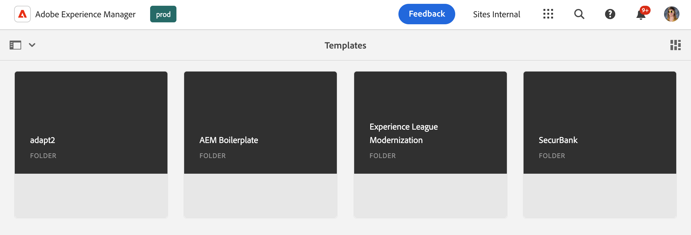

# O console Modelos {#templates-console}

Saiba como o console de modelos serve como local central para exibir e gerenciar os modelos de página.

## Visão geral {#overview}

Ao criar uma página, é necessário selecionar um modelo. O modelo de página é usado como a base da nova página. [os modelos editáveis do AEM](/help/implementing/developing/components/templates.md) podem definir a estrutura da página resultante, qualquer conteúdo inicial e os componentes que podem ser usados (propriedades de design).

Os autores de conteúdo recebem uma seleção de modelos disponíveis quando [criam novas páginas no console de sites](/help/sites-cloud/authoring/sites-console/creating-pages.md). Os modelos podem ser usados para criar páginas editáveis com:

* [O Editor de Página](/help/sites-cloud/authoring/page-editor/templates.md) ou
* [O Editor universal](/help/sites-cloud/authoring/universal-editor/templates.md)

O console de modelos permite que um administrador visualize e gerencie todos os modelos de página em um local central.

## Acesso ao console Modelos {#accessing}

1. Faça logon no AEM as a Cloud Service.
1. Abra a navegação global e selecione o painel **Ferramentas** e depois **Geral** -> **Modelos**.

## Orientação {#orientation}

O console de modelos está organizado em pastas com uma pasta por [configuração](/help/implementing/developing/introduction/configurations.md) onde modelos editáveis foram ativados para a configuração.

[A exibição padrão](/help/sites-cloud/authoring/quick-start.md) do console é a exibição de cartões. Toque ou clique em uma pasta para explorar seu conteúdo.

Selecione um modelo para revelar as opções disponíveis na barra de ferramentas.

* [Editar](#edit-edit)
* [Propriedades](#properties)
* [Desativar/Ativar](#enable-disable)
* [Publicação](#publish)
* [Copiar](#copy)
* [Excluir](#delete)

## Editar {#edit}

Editar um modelo abre o editor usado para criar o modelo. Ou:

* [O Editor de modelos](/help/sites-cloud/authoring/page-editor/templates.md)
* [O Editor universal](/help/sites-cloud/authoring/universal-editor/templates.md)

Usando qualquer editor, é possível fazer as alterações necessárias no modelo. Observe que a edição de um template em uso pode afetar seus autores.

* Para modelos criados com o Editor de modelos, as alterações feitas podem afetar as páginas ativas baseadas no modelo selecionado.
* Para modelos criados com o Editor universal, as alterações feitas afetam somente as novas páginas que os autores criam com base no modelo selecionado.

Se um autor iniciar em um modelo criado com o editor de modelo que já foi ativado, um aviso será exibido.

>[!TIP]
>
>Depois de selecionar um modelo no console, use a tecla de atalho `e` para editar o modelo selecionado.

## Propriedades {#properties}

Você pode editar as [propriedades do modelo](/help/sites-cloud/authoring/page-editor/templates.md) da mesma forma que pode [editar as propriedades da página.As propriedades do modelo &#x200B;](/help/sites-cloud/authoring/sites-console/edit-page-properties.md) incluem:

* Título do modelo
* Descrição
* Imagem

>[!TIP]
>
>Depois de selecionar um modelo no console, use a tecla de atalho `p` para abrir as propriedades do modelo selecionado.

## Ativando e desativando {#enable-disable}

Um modelo pode ter um destes três estados:

* **Rascunho** - O modelo ainda está sendo criado e não está disponível para criar novas páginas.
* **Habilitado** - O modelo está completo e disponível para a criação de novas páginas.
* **Desabilitado** - O modelo está concluído, mas não está disponível para a criação de novas páginas.

Quando um modelo é criado, ele fica no estado **Rascunho** (para modelos criados com o [Editor de Modelos](/help/sites-cloud/authoring/page-editor/templates.md)) ou **Habilitado** (para modelos criados com o [Editor Universal](/help/sites-cloud/authoring/universal-editor/templates.md)) por padrão.

Um modelo deve ser ativado antes de poder ser usado por autores de conteúdo para criar páginas. Se um modelo não for mais necessário, ele poderá ser desativado para que não seja mais exibido no assistente de criação de páginas.

* Selecione o modelo e clique em **Desabilitar** para desabilitá-lo.
* Selecione o modelo e clique em **Habilitar** para habilitá-lo.

## Publicação {#publish}

Um modelo criado com o editor de modelo só poderá ser usado após a publicação. Selecione o modelo e clique em **Publicar** para publicar.

Os modelos criados com o Universal Editor não precisam ser publicados para serem usados.

## Copiando {#copy}

Se houver várias páginas com estrutura semelhante, você poderá usar o botão **Copiar** para criar um escopo de um modelo e variar a cópia de acordo com suas necessidades. Isso também é útil se você quiser usar um modelo em outro site.

1. Selecione o modelo e toque ou clique em **Copiar** para criar uma cópia.
1. Navegue até o local em que deseja criar a cópia.
1. Toque ou clique em **Colar** na barra de ferramentas.

Depois de colado, você pode:

* [Edite o modelo](#edit) para ajustá-lo conforme necessário.
* [Use a janela de propriedades](#properties) para atualizar o título do modelo.
* [Habilite o modelo](#enable-disable) para que ele possa ser usado para criar a página.
* [Publicar o modelo](#publish), se necessário.

>[!TIP]
>
>Depois de selecionar um modelo no console, use a tecla de atalho `Command+c` ou `ctrl+c` para copiar o modelo selecionado.

## Excluindo {#delete}

Se um modelo não for mais necessário, ele poderá ser excluído desde que não seja referenciado por nenhuma página.

Selecione o modelo e toque ou clique em **Excluir** para excluí-lo.

>[!TIP]
>
>Depois de selecionar um modelo no console, use a tecla de atalho `Backspace` para excluir o modelo selecionado.

## Criação de modelos {#create}

Use o botão **Criar** no console para criar um novo modelo no local atual. Para obter detalhes sobre como criar um modelo, consulte o documento [Modelos para criar páginas editáveis com o editor de páginas](/help/sites-cloud/authoring/page-editor/templates.md).

O botão **Criar** é usado apenas para criar modelos que são editáveis com o Editor de Páginas. Consulte o documento [Modelos para Criar Páginas Editáveis com o Editor Universal](/help/sites-cloud/authoring/universal-editor/templates.md) para saber mais sobre como criar modelos com base em páginas criadas com o Editor Universal.
