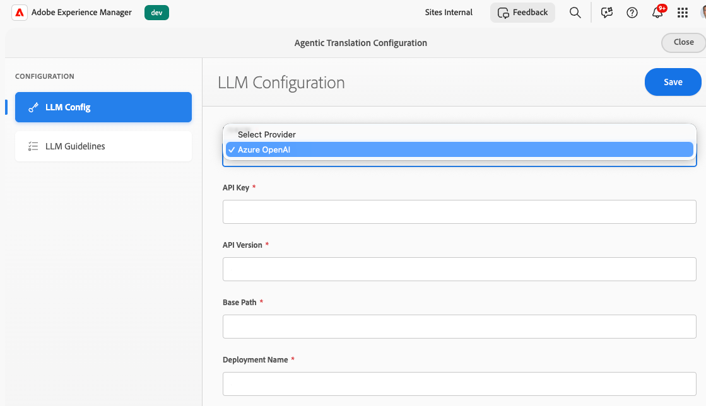

# Configuração da integração de tradução de IA {#ai-translation-integration}

A integração de tradução com a IA permite usar um **modelo de idioma grande (LLM)** como um serviço de tradução para o conteúdo que você cria no Adobe Experience Manager. Você conecta o AEM ao seu provedor LLM (começando com o Microsoft Azure OpenAI), reutiliza os mesmos [fluxos de trabalho de tradução](/help/sites-cloud/administering/translation/overview.md) de outros conectores e, opcionalmente, carrega os **guias de estilo de tradução** para que o AEM possa gerar regras que mantenham o tom, a terminologia e o idioma da marca consistentes entre as localidades.

Para obter informações sobre projetos de tradução, configurações de nuvem e a estrutura de integração de tradução, consulte [Tradução de conteúdo para sites multilíngues](overview.md) e [Configuração da estrutura de integração de tradução](integration-framework.md).

## Como a tradução de IA se encaixa no AEM {#how-ai-translation-fits-in-aem}

Modelos de linguagem grandes podem traduzir passagens completas com atenção ao contexto, tom e expressões idiomáticas em vez de substituição literal palavra por palavra. Ao configurar a integração de tradução de IA, o LLM atua como um **serviço de tradução de terceiros**, da mesma forma que outros provedores conectados por meio do AEM. Você fornece sua **própria licença e credenciais** para o serviço LLM.

O suporte inicial conecta o AEM ao **Azure OpenAI**. A Adobe planeja adicionar suporte para provedores adicionais em uma versão posterior.

Você configura a conexão LLM e os guias de estilo opcionais no **Serviços de tradução em nuvem**, juntamente com suas outras configurações de tradução. Você pode usar diferentes serviços de tradução para diferentes [configurações de nuvem](/help/sites-cloud/administering/translation/integration-framework.md#creating-a-translation-integration-configuration); por exemplo, uma configuração pode usar a tradução de IA, enquanto outra usa um conector de tradução automática tradicional.

## Configuração dos serviços de tradução em nuvem {#configure-translation-cloud-services}

Defina a tradução de IA na mesma área em que você gerencia outras configurações da nuvem de tradução.

1. No [menu de navegação global](/help/sites-cloud/authoring/basic-handling.md#global-navigation), selecione **Ferramentas** > **Serviços em Nuvem** > **Serviços de Tradução em Nuvem**.
1. Abra ou crie a configuração em que deseja habilitar a tradução de IA (incluindo `/conf/global`, se o recurso precisar ser aplicado amplamente).

## Configuração da conexão do LLM {#configure-the-llm-connection}

A experiência **Configuração de Tradução Agênica** inclui uma seção **Configuração LLM** na qual você conecta seu provedor.

1. Abra a configuração de tradução da IA para sua entrada de Serviços de tradução em nuvem.
1. Selecione **[!UICONTROL LLM Config]**.
1. Escolha seu provedor (por exemplo, **Azure OpenAI**).
1. Insira as credenciais e os detalhes do ponto de extremidade necessários para sua assinatura (**Chave de API**, **Versão da API**, **Caminho Base**, **Nome de Implantação** e quaisquer outros campos exigidos por seu provedor).
1. Salve a configuração.

## Adicionar guias de estilo de tradução e regras geradas {#add-translation-style-guides-and-generated-rules}

Você pode carregar **guia de estilo de tradução** documentos (normalmente um por idioma de destino). O AEM analisa cada guia e gera **regras de tradução** para alinhar a saída às suas expectativas linguísticas e de marca.

1. Em **Configuração de Conversão Agêntica**, selecione **[!UICONTROL Diretrizes de LLM]**.
1. Escolha uma localidade e use **[!UICONTROL Carregar]** para adicionar um documento de guia de estilo para esse idioma.
1. Enquanto o AEM processa um guia, um indicador de status mostra o progresso (**processando**, **concluído** ou **anulado**).
1. Revise ou edite as regras geradas no editor (por exemplo, JSON que captura tom, terminologia e exemplos).

## Definição do método de tradução padrão na estrutura {#set-the-default-translation-method-in-the-framework}

Depois que a configuração da nuvem for salva, registre a **tradução automática** como o comportamento padrão na sua configuração da [estrutura de integração de tradução](integration-framework.md) ao criar projetos de tradução. Você pode alterar o método por projeto, se necessário.

## Execução de projetos de tradução {#run-translation-projects}

Depois que a tradução de IA é configurada e associada às suas páginas, você [cria e executa projetos de tradução](managing-projects.md) da mesma forma que com outros provedores de tradução. O conteúdo de páginas, fragmentos de conteúdo e ativos segue as regras de tradução e as configurações da estrutura.

>[!NOTE]
>
>A integração da tradução de IA está **não** disponível no [Assistente de IA na interface de chat do Adobe Experience Manager](/help/implementing/cloud-manager/ai-assistant-in-aem.md) ou na interface do Agente de Produção de Experiência. Use os fluxos de trabalho e consoles de tradução descritos neste artigo.

