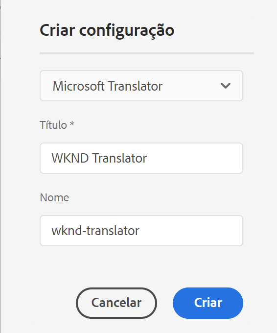
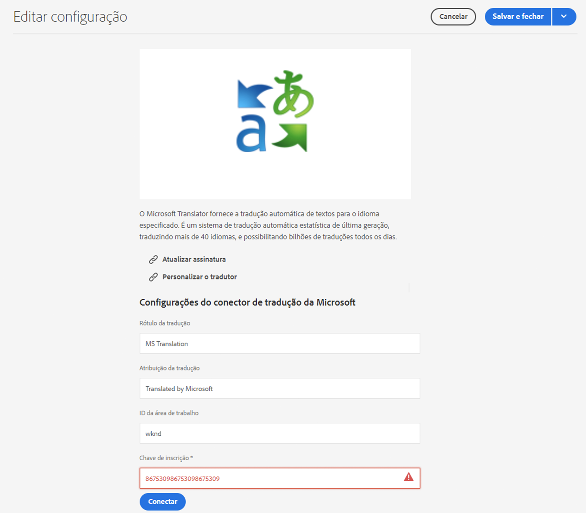

# Conectar ao Microsoft Translator {#connecting-to-microsoft-translator}

Crie uma configuração para o serviço em nuvem [Microsoft Translator](https://www.microsoft.com/pt-br/translator/business/) para usar sua conta do Microsoft Translation para traduzir conteúdos ou ativos de página no AEM.

>[!TIP]
>
>Caso seja novo na tradução de conteúdo, consulte a [Jornada de tradução do Sites](/help/journey-sites/translation/overview.md), que é um caminho guiado pela tradução do seu conteúdo do AEM Sites usando as ferramentas de tradução avançadas do AEM, ideais para quem não tem experiência no AEM ou em tradução.

>[!NOTE]
>
>O AEM fornece uma conta de avaliação do Microsoft Translation, que permite no máximo 2 milhões de caracteres traduzidos gratuitamente por mês. Para obter uma assinatura de conta adequada para sistemas de produção, consulte [Atualização da configuração da licença de avaliação do Microsoft Translator](#upgrading-the-microsoft-translator-trial-license-configuration).

| Propriedade | Descrição |
|---|---|
| Rótulo da tradução | O nome de exibição do serviço de tradução |
| Atribuição da tradução | (Opcional) Para conteúdo gerado pelo usuário, a atribuição que aparece ao lado do texto traduzido, por exemplo, `Translations by Microsoft` |
| ID do espaço de trabalho | (Opcional) A ID do mecanismo personalizado do Microsoft Translator a ser usado |
| Chave de inscrição | Sua chave de assinatura Microsoft para o Microsoft Translator |

Após criar a configuração, é necessário [ativá-la](#activating-the-translator-service-configurations).

O procedimento a seguir cria uma configuração do Microsoft Translator.

1. No [painel de navegação,](/help/sites-cloud/authoring/basic-handling.md#first-steps) selecionar **Ferramentas** > **Cloud Service** > **Cloud Service de tradução**.
1. Navegue até o local em que deseja criar a configuração. Normalmente, isso fica na raiz do site ou pode ser uma configuração global padrão.
1. Selecione o botão **Criar**.
1. Defina sua configuração.
   1. Selecione **Microsoft Translator** no menu suspenso.
   1. Digite um título para sua configuração. O título identifica a configuração no console do Cloud Services bem como nas listas suspensas de propriedades da página.
   1. Opcionalmente, digite um nome a ser usado para o nó do repositório que armazena a configuração.

   

1. Clique em **Criar**.
1. Na janela **Editar configuração**, forneça os valores para o serviço de tradução descrito na tabela anterior.

   

1. Selecionar **Conectar** para verificar a conexão.
1. Selecionar **Salvar e fechar**.

## Atualização da configuração da licença de avaliação do Microsoft Translator {#upgrading-the-microsoft-translator-trial-license-configuration}

As páginas de configuração do Microsoft Translation fornecem um link para o site da Microsoft, onde é possível obter uma assinatura de conta adequada para sistemas de produção.

1. No [painel de navegação,](/help/sites-cloud/authoring/basic-handling.md#first-steps) selecionar **Ferramentas** > **Cloud Service** > **Cloud Service de tradução**.
1. Selecione sua configuração existente do Microsoft Translator.
1. Selecione **Editar**.
1. No **Editar configuração** selecione **Atualizar Assinatura**. Uma página web da Microsoft, com mais detalhes sobre o serviço, é aberta.

## Personalizar o mecanismo do Microsoft Translator {#customizing-your-microsoft-translator-engine}

As páginas de configuração do Microsoft Translation fornecem um link para o site da Microsoft, onde é possível personalizar o mecanismo do Microsoft Translator.

1. No [painel de navegação,](/help/sites-cloud/authoring/basic-handling.md#first-steps) selecionar **Ferramentas** > **Cloud Service** > **Cloud Service de tradução**.
1. Selecione sua configuração existente do Microsoft Translator.
1. Selecione **Editar**.
1. No **Editar configuração** selecione **Personalizar tradutor**. Use a página da web da Microsoft que é aberta para personalizar o serviço.

## Ativar as configurações do serviço de tradução {#activating-the-translator-service-configurations}

É necessário ativar as configurações do Cloud Service para oferecer compatibilidade com o conteúdo traduzido que é replicado para a instância de publicação. Use o método de [publicar uma árvore](/help/sites-cloud/authoring/sites-console/publishing-pages.md#publishing-and-unpublishing-a-tree) para ativar os nós do repositório que armazenam as configurações do Microsoft Translator. Os nós estão localizados abaixo dos seguintes nós principais:

* `/libs/settings/cloudconfigs/translation/msft-translation`
