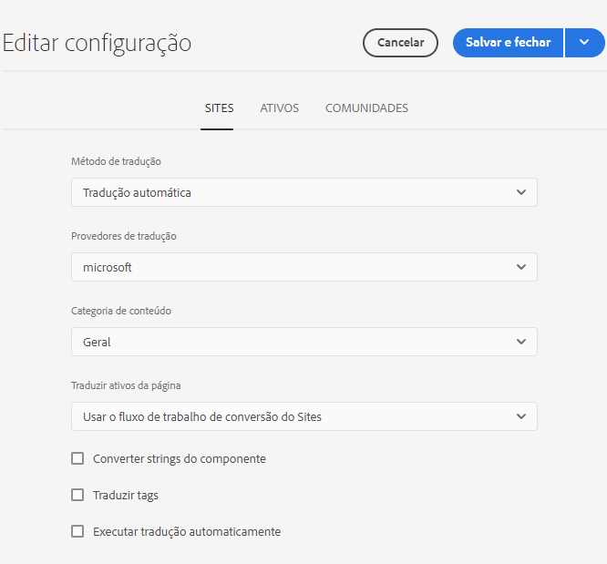
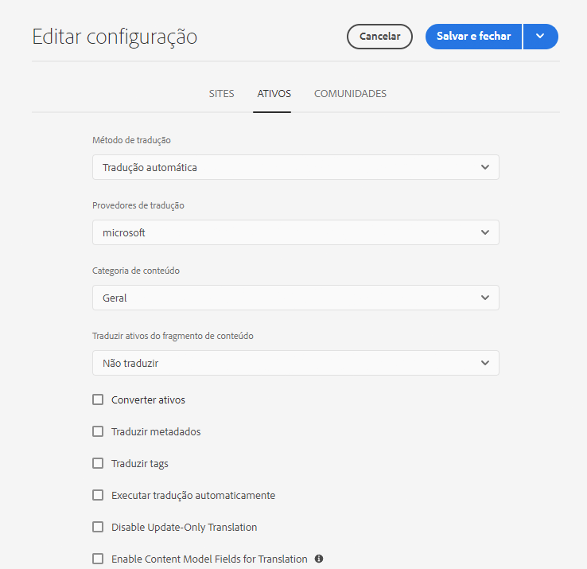

# Configuração da estrutura de integração de tradução {#configuring-the-translation-integration-framework}

A estrutura de integração de tradução integra-se aos serviços de tradução de terceiros para orquestrar a tradução de conteúdo do AEM. Isso envolve três etapas básicas.

1. [Conectar ao provedor de serviços de tradução.](#connecting-to-a-translation-service-provider)
1. [Criar uma configuração da estrutura de integração de tradução.](#creating-a-translation-integration-configuration)
1. [Associe as configurações de nuvem às suas páginas.](#configuring-pages-for-translation)

Para obter uma visão geral dos recursos de tradução de conteúdo do AEM, consulte [Tradução de conteúdo para sites multilíngues](overview.md).

>[!TIP]
>
>Caso seja novo na tradução de conteúdo, consulte a [Jornada de tradução do Sites](/help/journey-sites/translation/overview.md), que é um caminho guiado pela tradução do seu conteúdo do AEM Sites usando as ferramentas de tradução avançadas do AEM, ideais para quem não tem experiência no AEM ou em tradução.

## Conexão com um provedor de serviços de tradução {#connecting-to-a-translation-service-provider}

Crie uma configuração de nuvem que conecte o AEM ao seu provedor de serviços de tradução. O AEM inclui a capacidade de [conectar-se ao Microsoft Translator](connect-ms-translator.md) por padrão.

Os seguintes fornecedores de tradução oferecem uma implementação da API do AEM para projetos de tradução.

* [Microsoft Translator](connect-ms-translator.md)
* [Translations.com](https://exchange.adobe.com/experiencecloud.details.90104.globallink-connect-plus-for-aem.html) (Adobe Exchange Premier Partner)
* [Clay Tablet Technologies](https://exchange.adobe.com/experiencecloud.details.90064.clay-tablet-translation-for-experience-manager.html)
* [Lionbridge](https://exchange.adobe.com/experiencecloud.details.100064.lionbridge-connector-for-experience-manager-63.html)
* [Memsource](https://exchange.adobe.com/experiencecloud.details.103166.memsource-connector-for-adobe-experience-manager.html)
* [Cloudwords](https://exchange.adobe.com/experiencecloud.details.90019.html)
* [XTM Cloud](https://exchange.adobe.com/experiencecloud.details.105037.xtm-connect-for-adobe-experience-manager.html)
* [Lingotek](https://exchange.adobe.com/experiencecloud.details.90088.lingotek-collaborative-translation-platform.html)
* [RWS](https://partners.adobe.com/exchangeprogram/experiencecloud/exchange.details.108277.html)
* [Smartling](https://www.smartling.com/software/integrations/adobe-experience-manager/)
* [Systran](https://exchange.adobe.com/experiencecloud.details.90233.systran-for-adobe-experience-manager.html)

Depois de instalar um pacote de conectores, é possível criar uma configuração de nuvem para o conector. Normalmente, você precisará fornecer suas credenciais para autenticação com o serviço de tradução. Para obter informações sobre como adicionar uma configuração de nuvem para o conector do Microsoft Translator, consulte [Integração com o Microsoft Translator](connect-ms-translator.md).

Você pode criar várias configurações de nuvem para o mesmo conector, se necessário. Por exemplo, crie uma configuração para cada conta ou projeto que você tem com o mesmo fornecedor.

Após configurar uma conexão, é possível criar a configuração da estrutura de integração de tradução que a utiliza.

## Criar uma configuração de integração de tradução {#creating-a-translation-integration-configuration}

Crie uma configuração de estrutura de integração de tradução para especificar como traduzir o conteúdo. A configuração inclui as seguintes informações:

* Qual provedor de serviços de tradução usar
* Se deve ser realizada tradução humana ou automática
* Se outro conteúdo associado a uma página ou ativo, como tags, será ou não traduzido

Após criar uma configuração de estrutura, associe a configuração de nuvem às páginas que deseja traduzir de acordo com a configuração. Quando o processo de tradução é iniciado, o fluxo de trabalho de tradução continua de acordo com a configuração de estrutura associada.

Quando diferentes seções do seu site tiverem diferentes requisitos de tradução, crie várias configurações de estrutura de acordo. Por exemplo, um site multilíngue pode incluir cópias em inglês, espanhol e japonês. O proprietário do site usa dois provedores de serviços de tradução diferentes para traduções em espanhol e japonês. Portanto, duas configurações da estrutura são definidas. Cada configuração usa um provedor de serviço de tradução diferente.

Após configurar uma estrutura de integração de tradução, é possível [associá-la às páginas](preparation.md) que a utilizam.

>[!TIP]
>
>Para obter uma visão geral dos recursos de tradução de conteúdo do AEM, consulte [Tradução de conteúdo para sites multilíngues](overview.md).

Uma única configuração da estrutura controla como o conteúdo e os ativos da página são traduzidos. Para criar uma configuração de tradução:

1. No [menu de navegação global,](/help/sites-cloud/authoring/getting-started/basic-handling.md#global-navigation) selecionar **Ferramentas > Cloud Service e Cloud Service de tradução**.
1. Navegue até o local em que deseja criar a configuração na estrutura de conteúdo. Isso é geralmente baseado em um site específico, mas pode ser global.
1. Forneça as seguintes informações nos campos e selecione **Criar**.:
   1. Selecione o **Tipo de configuração** no menu suspenso.
   1. Insira um **Título** para sua configuração. O **Título** identifica a configuração no console dos **Cloud Services**, bem como nas listas suspensas de propriedades da página.
   1. Opcionalmente, insira um **Nome** para o nó do repositório que armazena a configuração.
1. No **Editar configuração** , configure as propriedades no campo **Sites** e **Assets** e selecione **Salvar e fechar**.

### Propriedades de configuração de sites {#sites-configuration-properties}

A guia **Sites** controla como a tradução do conteúdo da página é realizada.

| Propriedade | Descrição |
|---|---|
| Método de tradução | Essa propriedade define o método de tradução executado pela estrutura para o conteúdo do site:  - Tradução automática: o provedor de tradução executa a tradução automática em tempo real. - Tradução humana: o conteúdo é enviado ao provedor de tradução para ser traduzido por tradutores. - Não traduzir: o conteúdo não é enviado para tradução. Isso é para ignorar determinadas ramificações de conteúdo que não seriam traduzidas, mas que poderiam ser atualizadas com o conteúdo mais recente. |
| Provedor de tradução | Essa propriedade define o provedor de tradução que executará a tradução. Um provedor é exibido na lista quando o conector correspondente é instalado. |
| Categoria de conteúdo | (Somente tradução automática) Essa propriedade é uma categoria que descreve o conteúdo que você está traduzindo. A categoria pode afetar a escolha de terminologia e do estilo linguístico na tradução do conteúdo. |
| Traduzir tags | Essa opção permite a tradução de tags associadas à página. |
| Traduzir ativos da página | Essa propriedade define como traduzir ativos que são adicionados a componentes a partir do sistema de arquivos ou que são referenciados a partir de ativos: - Não traduzir: os ativos da página não são traduzidos. - Uso do fluxo de trabalho de tradução de sites: os ativos são tratados de acordo com as propriedades configuradas na guia **Sites**. - Uso do fluxo de trabalho de tradução de ativos: os ativos são tratados de acordo com as propriedades configuradas na guia **Ativos**. |
| Executar a tradução automaticamente | Habilite essa propriedade para executar trabalhos de tradução automaticamente após a criação de projetos de tradução. Você não terá a oportunidade de revisar e analisar o trabalho de tradução ao selecionar essa opção. |
| Desabilitar tradução somente de atualização | Quando essa opção estiver marcada, a atualização do projeto de tradução enviará todos os campos traduzíveis para tradução, e não apenas os alterados desde a última tradução. |

### Propriedades de configuração de ativos {#assets-configuration-properties}

As propriedades de ativos controlam como configurar ativos. Para obter mais informações sobre a tradução de ativos, consulte [Criação de cópias de idioma para ativos](/help/assets/translate-assets.md).

| Propriedade | Descrição |
|---|---|
| Método de tradução | Essa propriedade seleciona o tipo de tradução que a estrutura executa para os ativos: - Tradução automática: o provedor de tradução executa a tradução imediatamente por meio da tradução automática. - Tradução humana: o conteúdo é enviado automaticamente ao provedor de tradução para ser traduzido manualmente. - Não traduzir: os ativos não são enviados para tradução. |
| Provedor de tradução | Essa propriedade define o provedor de tradução que executará a tradução. Um provedor é exibido na lista quando o conector correspondente é instalado. |
| Categoria de conteúdo | (Somente tradução automática) Essa propriedade descreve o conteúdo que você está traduzindo. A categoria pode afetar a escolha de terminologia e do estilo linguístico na tradução do conteúdo. |
| Traduzir ativos | Ative essa propriedade para incluir ativos no projeto de tradução. |
| Traduzir metadados | Ative essa propriedade para traduzir metadados de ativos. |
| Traduzir tags | Ative essa propriedade para traduzir tags associadas ao ativo. |
| Executar a tradução automaticamente | Selecione essa propriedade para executar trabalhos de tradução automaticamente após a criação de projetos de tradução. Você não terá a oportunidade de revisar ou analisar o trabalho de tradução ao selecionar essa opção. |
| Desabilitar tradução somente de atualização | Quando essa opção estiver marcada, a atualização do projeto de tradução enviará todos os campos traduzíveis para tradução, e não apenas os alterados desde a última tradução. |
| Habilitar campos do modelo de conteúdo para tradução | Habilitar essa opção fará com que o campo **Traduzível** nos [Modelos de fragmentos de conteúdo](/help/sites-cloud/administering/content-fragments/content-fragment-models.md#properties) seja usado para determinar se o campo será traduzido e criará [regras de tradução](rules.md) apropriadas automaticamente. Essa opção substitui todas as regras de tradução criadas por você. |

## Configuração de páginas para tradução {#configuring-pages-for-translation}

Para configurar a tradução das páginas de origem para outros idiomas, associe-as com as seguintes configurações de nuvem:

* A configuração de nuvem que conecta o AEM ao seu provedor de tradução.
* A estrutura de integração de tradução que configura os detalhes da tradução.

A configuração da nuvem da estrutura de integração de tradução identifica a configuração da nuvem a ser usada para a conexão com o provedor de serviços. Quando você associa uma página de origem a uma configuração de nuvem da estrutura, a página deve ser associada à configuração de nuvem do provedor de serviços definido na configuração da estrutura.

Quando você associa uma página a uma configuração de nuvem, os descendentes da página herdam a associação. Por exemplo, se você associar a página `/content/wknd/language-masters/en/magazine` a uma estrutura de integração de tradução, a página `magazine` e as páginas secundárias abaixo dela serão traduzidas de acordo com a estrutura.

Quando necessário, é possível sobrepor a associação em uma página descendente. Por exemplo, o conteúdo de um site é principalmente sobre viagens e estilo de vida. No entanto, uma ramificação de páginas descreve a empresa. Nesse caso, a página raiz do site poderia estar associada a uma estrutura de integração de tradução que especifica o uso da tradução automática na categoria Estilo de vida, enquanto a ramificação que descreve a empresa usaria uma estrutura que executa a tradução automática usando a categoria Geral.

### Associar uma página a um provedor de tradução {#associating-a-page-with-a-translation-provider}

Associe uma página ao provedor de tradução que você está usando para traduzir a página e suas páginas descendentes.

1. No console Sites, selecione a página que deseja configurar e selecione **Propriedades da exibição**.
1. Selecione a guia **Cloud Services**.
1. No **Adicionar configuração** selecione a configuração.
1. Selecionar **Salvar e fechar**.

### Associar páginas a uma estrutura de integração de tradução {#associating-pages-with-a-translation-integration-framework}

Associe uma página à estrutura de integração de tradução que define como você deseja executar a tradução da página e de suas páginas descendentes.

1. No console Sites, selecione a página que deseja configurar e selecione **Propriedades da exibição**.
1. Selecione a guia **Cloud Services**.
1. No **Adicionar configuração** selecione a configuração.
1. Selecionar **Salvar e fechar**.
