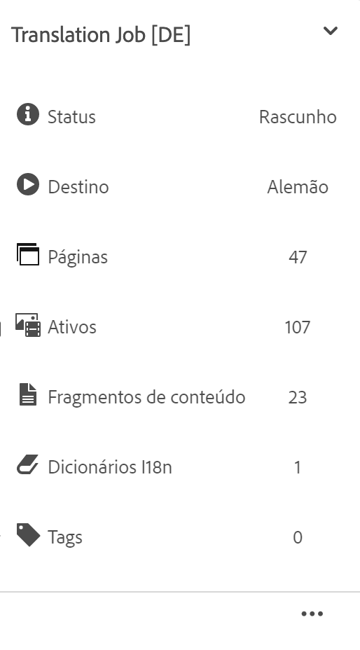

# Gerenciamento de projetos de tradução {#managing-translation-projects}

Os projetos de tradução permitem gerenciar a tradução de conteúdo do AEM. Um projeto de tradução é um tipo de [projeto](/help/sites-cloud/authoring/projects/overview.md) do AEM que contém recursos a serem traduzidos para outras línguas. Esses recursos são as páginas e os ativos das [cópias de idioma](preparation.md) que são criadas a partir do idioma principal.

>[!TIP]
>
>Se você é novo na tradução de conteúdo, consulte nossa [Jornada de tradução de sites,](/help/journey-sites/translation/overview.md) que é um caminho guiado pela tradução de conteúdo do AEM Sites usando ferramentas de tradução poderosas do AEM, ideais para aqueles sem experiência com o AEM ou com tradução.

Quando os recursos são adicionados a um projeto de tradução, um trabalho de tradução é criado para eles. Os trabalhos fornecem comandos e informações de status que são usados para gerenciar os fluxos de trabalho de tradução humana e tradução automática que são executados nos recursos.

Os projetos de tradução são itens de longa duração, definidos pelo idioma e pelo método/provedor de tradução para entrar em conformidade com a governança organizacional no sentido da globalização. Eles devem ser iniciados uma vez, durante a tradução inicial ou manualmente, e devem permanecer em vigor durante as atividades de atualização de conteúdo e tradução.

Os projetos e os trabalhos de tradução são criados com fluxos de trabalho de preparação de tradução. Esses fluxos de trabalho têm três opções, tanto para a tradução inicial (Criar e traduzir) quanto para as atualizações (Atualizar tradução):

1. [Criar novo projeto](#creating-translation-projects-using-the-references-panel)
1. [Adicionar a um projeto existente](#adding-pages-to-a-translation-project)
1. [Somente a estrutura de conteúdo](#creating-the-structure-of-a-language-copy)

O AEM detecta se um projeto de tradução está sendo criado para a tradução inicial do conteúdo ou para atualizar cópias de idioma já traduzidas. Ao criar um projeto de tradução para uma página e indicar as cópias de idioma para as quais você está traduzindo, o AEM detecta se a página de origem já existe nas cópias de idioma escolhidas:

* **A cópia de idioma não inclui a página:** o AEM trata essa situação como a tradução inicial. A página é copiada imediatamente para a cópia de idioma e incluída no projeto. Quando a página traduzida é importada para o AEM, ele a copia diretamente para a cópia de idioma.
* **A cópia de idioma já inclui a página:** o AEM trata essa situação como uma tradução atualizada. Uma inicialização é criada, uma cópia da página é adicionada a ela e incluída no projeto. Inicializações permitem revisar as traduções atualizadas antes de confirmá-las na cópia de idioma:

   * Quando a página traduzida é importada para o AEM, ela substitui a página na inicialização.
   * A página traduzida substitui a cópia de idioma somente quando a inicialização é promovida.

Por exemplo, a raiz de idioma `/content/wknd/fr` é criada para a tradução em francês do idioma principal `/content/wknd/en`. Não há outras páginas na cópia de idioma em francês.

* Um projeto de tradução é criado para a página `/content/wknd/en/products` e todas as páginas secundárias, direcionado para a cópia de idioma em francês. Visto que a cópia de idioma não inclui a página `/content/wknd/fr/products`, o AEM copia imediatamente a página `/content/wknd/en/products` e todas as páginas secundárias para a cópia de idioma em francês. As cópias também são incluídas no projeto de tradução.
* Um projeto de tradução é criado para a página `/content/wknd/en` e todas as páginas secundárias, direcionado para a cópia de idioma em francês. Como a cópia de idioma inclui a página que corresponde à página `/content/wknd/en` (a raiz de idioma), o AEM copia a página `/content/wknd/en` e todas as páginas secundárias e as adiciona a uma inicialização. As cópias também são incluídas no projeto de tradução.

## Tradução a partir do console Sites {#performing-initial-translations-and-updating-existing-translations}

Os projetos de tradução podem ser criados ou atualizados diretamente do console de sites.

### Criação de projetos de tradução usando o painel de Referências {#creating-translation-projects-using-the-references-panel}

Crie projetos de tradução para poder executar e gerenciar o fluxo de trabalho de tradução dos recursos do seu idioma principal. Ao criar projetos, você especifica a página no idioma principal que está traduzindo e as cópias de idioma para as quais está executando a tradução:

* A configuração da nuvem da estrutura de integração de tradução associada à página selecionada determina muitas propriedades dos projetos de tradução, como o fluxo de trabalho de tradução a ser usado.
* Um projeto é criado para cada cópia de idioma selecionada.
* Uma cópia da página selecionada e dos ativos associados é criada e adicionada a cada projeto. Essas cópias são enviadas posteriormente ao provedor para tradução.

É possível especificar que as páginas secundárias da página selecionada também sejam selecionadas. Neste caso, cópias das páginas secundárias também são adicionadas a cada projeto para serem traduzidas. Quando qualquer página secundária é associada a diferentes configurações da estrutura de integração de tradução, o AEM cria projetos adicionais.

Também é possível [criar projetos de tradução manualmente](#creating-a-translation-project-using-the-projects-console).

>[!NOTE]
>
>Para criar um projeto, sua conta deve ser membro do grupo `project-administrators`.

### Traduções iniciais e atualização de traduções {#initial-and-updating}

O painel de Referências indica se você está atualizando cópias de idioma existentes ou criando a primeira versão das cópias de idioma. Quando existe uma cópia de idioma para a página selecionada, a guia Atualizar cópias de idioma aparece para fornecer acesso aos comandos relacionados ao projeto.

Depois de traduzir, é possível [revisar a tradução](#reviewing-and-promoting-updated-content) antes de substituir a cópia de idioma por ela. Quando não existe uma cópia de idioma para a página selecionada, a guia Criar e traduzir aparece para fornecer acesso aos comandos relacionados ao projeto.

### Criar projetos de tradução para uma nova cópia de idioma {#create-translation-projects-for-a-new-language-copy}

1. Use o console de sites para selecionar a página que você está adicionando aos projetos de tradução.

1. Na barra de ferramentas, abra o painel de **Referências**.

   

1. Selecione **Cópias de idioma** e, em seguida, selecione as cópias de idioma para as quais você está traduzindo as páginas de origem.
1. Clique ou toque em **Criar e traduzir** e configure o trabalho de tradução:

   * Use a lista suspensa **Idiomas** para selecionar uma cópia de idioma para a qual deseja traduzir. Selecione idiomas adicionais, conforme necessário. Os idiomas exibidos na lista correspondem às [raízes de idioma que você criou](preparation.md#creating-a-language-root).
      * Selecionar vários idiomas cria um projeto com um trabalho de tradução para cada idioma.
   * Para traduzir a página selecionada e todas as páginas secundárias, selecione **Selecionar todas as subpáginas**. Para traduzir apenas a página selecionada, desmarque a opção.
   * Em **Projeto**, selecione **Criar projeto(s) de tradução**.
   * Opcionalmente para o **Projeto principal**, selecione um projeto do qual herdar funções e permissões de usuário.
   * Em **Título**, digite um nome para o projeto.

   

1. Clique ou toque em **Criar**.

### Criar projetos de tradução para uma cópia de idioma existente {#create-translation-projects-for-an-existing-language-copy}

1. Use o console de sites para selecionar a página que você está adicionando aos projetos de tradução.

1. Na barra de ferramentas, abra o painel de **Referências**.

   

1. Selecione **Cópias de idioma** e, em seguida, selecione as cópias de idioma para as quais você está traduzindo as páginas de origem.
1. Clique ou toque em **Atualizar cópias de idioma** e configure o trabalho de tradução:

   * Para traduzir a página selecionada e todas as páginas secundárias, selecione **Selecionar todas as subpáginas**. Para traduzir apenas a página selecionada, desmarque a opção.
   * Em **Projeto**, selecione **Criar projeto(s) de tradução**.
   * Opcionalmente para o **Projeto principal**, selecione um projeto do qual herdar funções e permissões de usuário.
   * Em **Título**, digite um nome para o projeto.

   

1. Clique ou toque em **Criar**.

### Adicionar páginas a um projeto de tradução {#adding-pages-to-a-translation-project}

Depois de criar um projeto de tradução, é possível usar o painel de **Recursos** para adicionar páginas ao projeto. Adicionar páginas é útil quando você está incluindo páginas de diferentes ramificações no mesmo projeto.

Ao adicionar páginas a um projeto de tradução, elas são incluídas em um novo trabalho de tradução. Também é possível [adicionar páginas a um trabalho existente](#adding-pages-assets-to-a-translation-job).

Assim como ao criar um novo projeto, ao adicionar páginas, cópias das páginas são adicionadas a uma inicialização quando necessário, para evitar a substituição de cópias de idioma existentes. (Consulte [Criação de projetos de tradução para cópias de idioma existentes](#performing-initial-translations-and-updating-existing-translations).)

1. Use o console de sites para selecionar a página que você está adicionando ao projeto de tradução.

1. Na barra de ferramentas, abra o painel de **Referências**.

   

1. Selecione **Cópias de idioma** e, em seguida, selecione as cópias de idioma para as quais você está traduzindo as páginas de origem.

   

1. Clique ou toque em **Atualizar cópias de idioma** e configure as propriedades:

   * Para traduzir a página selecionada e todas as páginas secundárias, selecione **Selecionar todas as subpáginas**. Para traduzir apenas a página selecionada, desmarque a opção.
   * Em **Projeto**, selecione **Adicionar a um projeto de tradução existente**.
   * Selecione o projeto em **Projeto de tradução existente**.

   >[!NOTE]
   >
   >O idioma de destino definido no projeto de tradução deve corresponder ao caminho da cópia de idioma, conforme mostrado no painel de Referências.

1. Clique ou toque em **Atualizar**.

### Criar a estrutura de uma cópia de idioma {#creating-the-structure-of-a-language-copy}

É possível criar apenas a estrutura da cópia de idioma, permitindo copiar o conteúdo e as alterações estruturais no idioma principal para as cópias de idioma (não traduzidas). Isso não está relacionado a um trabalho ou projeto de tradução. Você pode usar isso para manter seus idiomas principais em sincronia, mesmo sem tradução.

Preencha sua cópia de idioma para que ela tenha conteúdo do idioma principal que você está traduzindo. Antes de preencher a cópia de idioma, é necessário ter [criado a raiz de idioma](preparation.md#creating-a-language-root) da cópia do idioma.

1. Use o console Sites para selecionar a raiz do idioma principal que você está usando como a origem.
1. Abra o painel de referências clicando ou tocando em **Referências** na barra de ferramentas.

   

1. Selecionar **Cópias de idioma**, e em seguida, selecione as cópias de idioma que você deseja preencher.

   

1. Clique ou toque em **Atualizar cópias de idioma** para revelar as ferramentas de tradução e configurar as propriedades:

   * Selecione a opção **Selecionar todas as subpáginas**.
   * Para **Projeto**, selecione **Criar apenas estrutura**.

   

1. Clique ou toque em **Atualizar**.

### Atualização da memória de tradução {#updating-translation-memory}

As edições manuais de conteúdo traduzido podem ser sincronizadas com o Sistema de gerenciamento de tradução (TMS) para treinar a memória de tradução.

1. No console Sites, depois de atualizar o conteúdo do texto em uma página traduzida, selecione **Atualizar memória de tradução**.
1. Uma exibição de lista mostra uma comparação lado a lado da origem e da tradução para cada componente de texto que foi editado. Selecione quais atualizações de tradução devem ser sincronizadas com a memória de tradução e selecione **Atualizar memória**.

O AEM atualiza a tradução dos segmentos existentes na memória de tradução do TMS configurado.

* A ação atualiza a tradução dos segmentos existentes na memória de tradução do TMS configurado.
* Isso não cria novos trabalhos de tradução.
* As traduções são enviadas de volta para o TMS, por meio da API de tradução do AEM (veja abaixo).

Para usar este recurso:

* Um TMS deve ser configurado para uso com o AEM.
* O conector precisa implementar o método [`storeTranslation`](https://developer.adobe.com/experience-manager/reference-materials/cloud-service/javadoc/com/adobe/granite/translation/api/TranslationService.html).
   * O código desse método determina o que acontece com a solicitação de atualização da memória de tradução.
   * A estrutura de tradução do AEM envia os pares de valores do segmento (tradução original e atualizada) para o TMS por meio da implementação desse método.

As atualizações da memória de tradução podem ser interceptadas e enviadas a um destino personalizado, nos casos em que uma memória de tradução própria for usada.

### Verificação do status de tradução de uma página {#check-translation-status}

Uma propriedade pode ser selecionada na exibição de lista do console de sites que mostra se uma página foi traduzida, está em tradução ou ainda não foi traduzida.

1. No console do site, alterne para [exibição em lista.](/help/sites-cloud/authoring/getting-started/basic-handling.md#viewing-and-selecting-resources)
1. Toque ou clique em **Exibir configurações** no menu suspenso exibição.
1. Na caixa de diálogo, marque a propriedade **Traduzido** e toque ou clique em **Atualizar**.

O console Sites agora exibe a coluna **Traduzido** mostrando o status de tradução das páginas listadas.

## Gerenciamento de projetos de tradução no Console do projeto

Muitas tarefas de tradução e opções avançadas podem ser acessadas no console de projetos.

### Noções básicas sobre o Console de projetos

Os projetos de tradução no AEM usam o padrão [console de projetos AEM.](/help/sites-cloud/authoring/projects/overview.md) Se você não estiver familiarizado com os Projetos AEM, leia essa documentação.

Como qualquer outro projeto, um projeto de tradução é composto de blocos que apresentam uma visão geral das tarefas do projeto.

* **Resumo** - Uma visão geral do projeto
* **Tarefas** - Uma ou mais tarefas de tradução
* **Equipe** - Usuários colaborando no projeto de tradução
* **Tarefas** - Itens que precisam ser preenchidos como parte do esforço de tradução

Use os comandos e botões de reticências na parte superior e inferior dos blocos (respectivamente) para acessar controles e opções para os vários blocos.

### Criação de um projeto de tradução usando o Console de projetos {#creating-a-translation-project-using-the-projects-console}

Você pode criar manualmente um projeto de tradução se preferir usar o console de projetos em vez do console de sites.

>[!NOTE]
>
>Para criar um projeto, sua conta deve ser membro do grupo `project-administrators`.

Ao criar manualmente um projeto de tradução, você deve fornecer valores para as seguintes propriedades relacionadas à tradução, além das [propriedades básicas](/help/sites-cloud/authoring/projects/managing.md#creating-a-project):

* **Nome:** Nome do projeto
* **Idioma de origem:** O idioma do conteúdo de origem
* **Idioma de destino:** O idioma ou idiomas em que o conteúdo está sendo traduzido
   * Se vários idiomas forem selecionados, uma tarefa será criada para cada idioma no projeto.
* **Método de tradução:** Selecione **Tradução humana** para indicar que a tradução deve ser executada manualmente.

1. Na barra de ferramentas do console de projetos, clique ou toque em **Criar**.
1. Selecione o modelo **Projeto de tradução** e clique ou toque em **Próximo**.
1. Insira valores na guia de propriedades **Básico**.
1. Clique ou toque em **Avançado** e forneça valores para as propriedades relacionadas à tradução.
1. Clique ou toque em **Criar**. Na caixa de confirmação, clique ou toque em **Concluído** para retornar ao console de projetos, ou em **Abrir projeto** para abrir e começar a gerenciar o projeto.

### Adicionar páginas e ativos a um trabalho de tradução {#adding-pages-assets-to-a-translation-job}

É possível adicionar páginas, ativos ou tags ao trabalho de tradução do seu projeto de tradução. Para adicionar páginas ou ativos:

1. Na parte inferior do bloco do trabalho de tradução do seu projeto, clique ou toque nas reticências.

   

1. Na próxima janela, clique ou toque no botão **Adicionar** na barra de ferramentas e selecione **Ativos/páginas**.

   

1. Na janela modal, selecione o item na extremidade superior da ramificação que deseja adicionar e clique ou toque no ícone de marca de seleção. A seleção múltipla está habilitada nesta janela.

   

1. Como alternativa, é possível selecionar o ícone de pesquisa para procurar facilmente por páginas ou ativos que deseja adicionar ao seu trabalho de tradução.

   

1. Depois de selecionado, toque ou clique em **Selecionar**. Suas páginas e/ou ativos são adicionados ao trabalho de tradução.

>[!TIP]
>
>Esse método adiciona páginas/ativos e seus secundários ao projeto. Selecione **Ativo/página (sem secundários)** se quiser apenas adicionar os principais.

### Adicionar tags a um trabalho de tradução {#adding-tags-to-a-translation-job}

É possível adicionar tags a um projeto de tradução de maneira semelhante a [como você adiciona ativos e páginas a um projeto.](#adding-pages-assets-to-a-translation-job) Basta selecionar **Tags** no menu **Adicionar** e, em seguida, siga as mesmas etapas.

### Visualizar detalhes do projeto de tradução {#seeing-translation-project-details}

As propriedades do projeto de tradução estão acessíveis por meio do botão de reticências do bloco de resumo do projeto. Além das [informações do projeto](/help/sites-cloud/authoring/projects/overview.md#project-info) genéricas, as propriedades do projeto de tradução contêm informações específicas da tradução.

No seu projeto de tradução, clique ou toque nas reticências na parte inferior do bloco Resumo da tradução. A maioria das propriedades específicas do projeto está na guia **Avançado**.

* **Idioma de origem:** o idioma das páginas que estão sendo traduzidas
* **Idioma de destino:** o idioma, ou idiomas, para o qual as páginas estão sendo traduzidas
* **Configuração da nuvem:** a configuração da nuvem para o conector do serviço de tradução usado no projeto
* **Método de tradução:** o fluxo de trabalho de tradução, seja **Tradução humana** ou **Tradução automática**
* **Provedor de tradução:** o provedor de serviços de tradução que está executando a tradução
* **Categoria de conteúdo:** (tradução automática) a categoria de conteúdo usada para tradução
* **Credencial do provedor de tradução:** as credenciais para fazer logon no provedor
* **Promover automaticamente inicializações de tradução:** depois de receber conteúdo traduzido, as inicializações de tradução são promovidas automaticamente
   * **Excluir inicialização após promoção:** se as inicializações de tradução forem promovidas automaticamente, isso excluirá a inicialização após a promoção
* **Aprovar traduções automaticamente:** depois de receber conteúdo traduzido, os trabalhos de tradução são aprovados automaticamente
* **Repetir tradução:** configure a execução recorrente de um projeto de tradução selecionando a frequência com que o projeto criará e executará automaticamente os trabalhos de tradução

Quando um projeto é criado usando o painel de Referências de uma página, essas propriedades são configuradas automaticamente com base nas propriedades da página de origem.

### Monitorar o status de um trabalho de tradução {#monitoring-the-status-of-a-translation-job}

O bloco do trabalho de tradução de um projeto fornece o status de um trabalho, bem como o número de páginas e ativos no trabalho.

A tabela a seguir descreve cada status que um trabalho ou um item no trabalho podem ter:

| Status | Descrição |
|---|---|
| **Rascunho** | O trabalho de tradução não foi iniciado. Os trabalhos de tradução estão em **Rascunho** quando forem criadas. |
| **Enviado** | Os arquivos no trabalho de tradução têm esse status quando são enviados com sucesso para o serviço de tradução. Esse status pode ser ativado após os comandos **Escopo da solicitação** ou **Iniciar** serem executados. |
| **Escopo solicitado** | Para o fluxo de trabalho de tradução humana, os arquivos no trabalho são enviados ao fornecedor de tradução para definição do escopo. Este status aparece após o comando **Solicitar escopo** ser executado.  |
| **Escopo concluído** | O fornecedor definiu o escopo do trabalho de tradução. |
| **Enviado para tradução** | O proprietário do projeto aceitou o escopo. Esse status indica que o fornecedor de tradução deve começar a traduzir os arquivos na tarefa. |
| **Tradução em andamento** | Para uma tarefa, a tradução de um ou mais arquivos ainda não foi concluída. Para um item na tarefa, o item está sendo traduzido. |
| **Traduzido** | Para uma tarefa, a tradução de todos os arquivos está concluída. Para um item na tarefa, o item é traduzido. |
| **Pronto para revisão** | O item na tarefa é traduzido e o arquivo foi importado para o AEM. |
| **Concluir** | O proprietário do projeto indicou que o contrato de tradução está concluído. |
| **Cancelar** | Indica que o fornecedor de tradução deve parar de trabalhar em um trabalho de tradução. |
| **Atualização de erro** | Ocorreu um erro ao transferir arquivos entre o AEM e o serviço de tradução. |
| **Estado desconhecido** | Ocorreu um erro desconhecido. |

Para ver o status de cada arquivo no trabalho, clique ou toque nas reticências na parte inferior do bloco.

### Definir a data de vencimento dos trabalhos de tradução {#setting-the-due-date-of-translation-jobs}

Especifique a data antes da qual seu fornecedor de tradução precisa retornar os arquivos traduzidos. A configuração da data de vencimento funciona corretamente somente quando o fornecedor de tradução que você está usando aceita esse recurso.

1. Clique ou toque nas reticências na parte inferior do bloco de resumo da tradução.

   

1. Na guia **Básico**, use o seletor de datas da propriedade **Data de vencimento** para selecionar a data de vencimento.

   

1. Clique ou toque em **Salvar &amp; Fechar**.

### Escopo de um trabalho de tradução {#scoping-a-translation-job}

Determine o escopo de um trabalho de tradução para obter uma estimativa do custo da tradução do seu provedor de serviços de tradução. Ao determinar o escopo de um trabalho, os arquivos de origem são enviados ao fornecedor de tradução que compara o texto ao pool de traduções armazenadas (memória de tradução). Normalmente, o escopo é o número de palavras que exigem tradução.

Para obter mais informações sobre os resultados do escopo, entre em contato com seu fornecedor de tradução.

>[!NOTE]
>
>O escopo é opcional e se aplica somente à tradução humana. Você pode iniciar um trabalho de tradução sem determinar o escopo.

Ao determinar o escopo de um trabalho de tradução, o status do trabalho é **Escopo solicitado**. Quando o fornecedor de tradução retorna o escopo, o status é alterado para **Escopo concluído**. Quando o escopo for concluído, você poderá usar o comando **Mostrar escopo** para analisar os resultados do escopo.

O escopo funciona corretamente somente quando o fornecedor de tradução que você está usando aceita esse recurso.

1. No console de projetos, abra o projeto de tradução.
1. No título do trabalho de tradução, toque ou clique no menu de comandos e, em seguida, toque ou clique em **Solicitar escopo**.
1. Quando o status do trabalho for alterado para **Escopo concluído**, clique ou toque no menu de comandos e, em seguida, clique ou toque em **Mostrar escopo**.

### Iniciar trabalhos de tradução {#starting-translation-jobs}

Inicie um trabalho de tradução para traduzir as páginas de origem para o idioma de destino. A tradução é executada de acordo com os valores de propriedade do bloco de resumo da tradução.

Você pode iniciar um trabalho individual dentro do projeto.

1. No console de projetos, abra o projeto de tradução.
1. No bloco do trabalho de tradução, clique ou toque no menu de comandos e, em seguida, clique ou toque em **Iniciar**.
1. Na caixa de diálogo de ação que confirma o início da tradução, clique ou toque em **Fechar**.

Depois de iniciar o trabalho de tradução, o bloco de trabalho de tradução mostra a tradução com o status **Em progresso**.

Você também pode iniciar todos os trabalhos de tradução de um projeto.

1. No console de projetos, selecione o projeto de tradução.
1. Na barra de ferramentas, toque ou clique em **Iniciar trabalho de tradução**.
1. Na caixa de diálogo, revise a lista de tarefas iniciadas e confirme com **Início** ou abortar com **Cancelar**.

### Cancelar um trabalho de tradução {#canceling-a-translation-job}

Cancele um trabalho de tradução para interromper o processo e impedir que o fornecedor realize mais traduções. Você pode cancelar um trabalho quando ele tiver o status **Enviado para tradução** ou **Tradução em andamento**.

1. No console de projetos, abra o projeto de tradução.
1. No bloco do trabalho de tradução, clique ou toque no menu de comandos e, em seguida, em **Cancelar**.
1. Na caixa de diálogo da ação que confirma o cancelamento da tradução, clique ou toque em **OK**.

### Aceitar e rejeitar fluxo de trabalho {#accept-reject-workflow}

Quando o conteúdo retorna após a tradução e está com o status **Pronto para revisão**, é possível acessar o trabalho de tradução e aceitar/rejeitar o conteúdo.

Ao selecionar **Rejeitar tradução**, você terá a opção de adicionar um comentário.

Rejeitar o conteúdo o envia de volta ao fornecedor de tradução, onde ele pode ver o comentário.

### Concluir e arquivar trabalhos de tradução {#completing-and-archiving-translation-jobs}

Conclua um trabalho de tradução depois de ter revisado os arquivos traduzidos do fornecedor.

1. No console de projetos, abra o projeto de tradução.
1. No bloco do trabalho de tradução, clique ou toque no menu de comandos e, em seguida, em **Concluído**.
1. O trabalho agora está com o status **Concluído**.

Para fluxos de trabalho de tradução humana, concluir uma tradução indica ao fornecedor que o contrato de tradução foi cumprido e que ele deve salvar a tradução na sua memória de tradução.

Arquive um trabalho de tradução depois que ele estiver concluído e você não precisar mais ver os detalhes de status.

1. No console de projetos, abra o projeto de tradução.
1. No bloco do trabalho de tradução, clique ou toque no menu de comandos e, em seguida, em **Arquivar**.

Ao arquivar o trabalho, o bloco do trabalho de tradução é removido do projeto.

## Revisar e usar conteúdo traduzido {#reviewing-and-promoting-updated-content}

É possível usar o console de sites para revisar o conteúdo, comparar cópias de idioma e ativar o conteúdo.

### Promover conteúdo atualizado {#promoting-updated-content}

Quando o conteúdo for traduzido para uma cópia de idioma existente, revise as traduções, faça alterações se necessário e promova as traduções para movê-lo para a cópia de idioma. É possível revisar arquivos traduzidos quando o trabalho de tradução mostra o status **Pronto para revisão**.

1. Selecione a página no idioma principal, clique ou toque em **Referências** e, em seguida, em **Cópias de idioma**.
1. Clique ou toque na cópia do idioma a ser revisado.

   

1. Clique ou toque em **Inicialização** para revelar os comandos relacionados à inicialização.

   

1. Para abrir a cópia de inicialização da página com o objetivo de revisar e editar o conteúdo, clique em **Abrir página**.
1. Para promover a cópia de inicialização após ter revisado o conteúdo e feito as alterações necessárias, clique em **Promover**.
1. Na página **Promover inicialização**, especifique quais páginas serão promovidas e clique ou toque em **Promover**.

### Comparação de cópias de idioma {#comparing-language-copies}

Para comparar cópias de idioma ao idioma principal:

1. No console de sites, navegue até a cópia de idioma que deseja comparar.
1. Abra o [painel de Referências.](/help/sites-cloud/authoring/getting-started/basic-handling.md#references)
1. No cabeçalho de **Cópias**, selecione **Cópias de idioma.**
1. Selecione a cópia de idioma específica e, em seguida, clique em **Comparar ao principal** ou **Comparar com anterior**, se aplicável.

   

1. As duas páginas (lançamento e origem) são abertas lado a lado.
   * Para obter informações completas sobre como usar esse recurso, consulte [Diferença de página](/help/sites-cloud/authoring/features/page-diff.md).

## Mover ou renomear uma página de origem {#move-source}

Se uma página de origem já traduzida precisar ser [renomeada ou movida](/help/sites-cloud/authoring/fundamentals/organizing-pages.md#moving-or-renaming-a-page), traduzir a página novamente após a movimentação criará uma nova cópia de idioma com base no novo nome/local da página. A cópia de idioma antiga baseada no nome/local anterior ainda estará lá.

A prática recomendada neste cenário é seguir este procedimento:
1. Cancele a publicação das cópias de idioma associadas à página de origem que você deseja mover.
1. Exclua essas cópias.
1. Crie novas cópias de idioma a partir da página de origem recém-movida.
1. Publique as cópias de idioma recém-criadas.

## Importar e exportar trabalhos de tradução {#import-export}

Embora o AEM ofereça várias soluções e interfaces de tradução, também é possível importar e exportar manualmente as informações do trabalho de tradução.

### Exportar um trabalho de tradução {#exporting-a-translation-job}

É possível baixar o conteúdo de um trabalho de tradução, por exemplo, para enviar a um provedor de tradução que não esteja integrado ao AEM por meio de um conector ou para revisar o conteúdo.

1. No menu suspenso do bloco do trabalho de tradução, clique ou toque em **Exportar**.
1. Na caixa de diálogo, clique ou toque em **Baixar arquivo exportado** e, se necessário, use a caixa de diálogo do navegador da Web para salvar o arquivo.
1. Na caixa de diálogo, clique ou toque em **Fechar**.

### Importar um trabalho de tradução {#importing-a-translation-job}

Você pode importar conteúdo traduzido para o AEM, por exemplo, quando seu provedor de tradução o envia para você porque não está integrado ao AEM por meio de um conector.

1. No menu suspenso do bloco do trabalho de tradução, clique ou toque em **Importar**.
1. Use a caixa de diálogo do navegador da web para selecionar o arquivo a ser importado.
1. Na caixa de diálogo, clique ou toque em **Fechar**.
