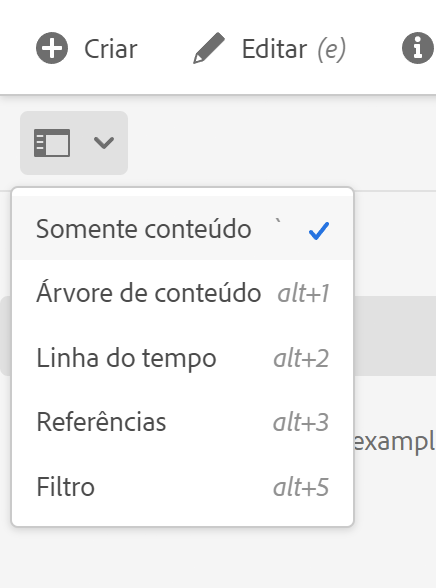

# Preparação de conteúdo para tradução {#preparing-content-for-translation}

Sites multilíngues geralmente fornecem alguma quantidade de conteúdo em vários idiomas. O site é criado em um idioma e depois traduzido para outros idiomas. Geralmente, sites multilíngues consistem em ramificações de páginas, onde cada ramificação contém as páginas do site em um idioma diferente.

>[!TIP]
>
>Se você é novo na tradução de conteúdo, consulte nossa [Jornada de tradução de sites,](/help/journey-sites/translation/overview.md) que oferece um guia para a tradução de conteúdo do AEM Sites usando as ferramentas de tradução avançadas do AEM, ideais para aqueles sem experiência com o AEM ou tradução.

O [site do tutorial do WKND](/help/implementing/developing/introduction/develop-wknd-tutorial.md) inclui várias ramificações de idioma e usa a seguinte estrutura:

```text
/content
    |- wknd
        |- language-masters
            |- en
            |- de
            |- es
            |- fr
            |- it
        |- us
            |- en
            |- es
        |- ca
            |- en
            |- fr
        |- ch
            |- de
            |- fr
            |- it
        |- de
            |- de
        |- fr
            |- fr
        |- es
            |- es
        |- it
            |- it
```

A cópia de idioma para a qual você criou originalmente o conteúdo do site é o idioma principal. O idioma principal é a fonte, que é traduzida para outros idiomas.

Cada ramificação de idioma de um site é chamada de cópia de idioma. A página raiz de uma cópia de idioma, conhecida como raiz de idioma, identifica o idioma do conteúdo na cópia de idioma. Por exemplo, `/content/wknd/fr` é a raiz de idioma para a cópia em francês. As cópias de idioma devem usar uma [raiz de idioma configurada corretamente](preparation.md#creating-a-language-root) para que o idioma correto seja escolhido quando as traduções de um site de origem forem executadas.

Use as seguintes etapas para preparar seu site para tradução:

1. Crie a raiz de idioma do idioma principal. Por exemplo, a raiz de idioma do site de demonstração do WKND em inglês é `/content/wknd/language-masters/en`. Verifique se a raiz do idioma está configurada corretamente de acordo com as informações em [Criar uma raiz de idioma](preparation.md#creating-a-language-root).
1. Crie o conteúdo do seu idioma principal.
1. Crie a raiz de idioma de cada cópia de idioma para o site. Por exemplo, a cópia do idioma em francês do site de amostra do WKND é `/content/wknd/language-masters/fr`.

Depois de preparar o conteúdo para tradução, é possível criar automaticamente as páginas ausentes em suas cópias de idioma e projetos de tradução associados. (Consulte [Criação de um projeto de tradução](managing-projects.md).) Para obter uma visão geral do processo de tradução de conteúdo no AEM, consulte [Tradução de conteúdo para sites multilíngues](overview.md).

## Criar uma raiz de idioma {#creating-a-language-root}

Crie uma raiz de idioma como a página raiz de uma cópia de idioma que identifica o idioma do conteúdo. Depois de criar a raiz do idioma, você pode criar projetos de tradução que incluem a cópia de idioma.

Para criar a raiz do idioma, crie uma página e use um código de idioma ISO como o valor da propriedade **Nome**. O código de idioma deve estar em um dos seguintes formatos:

* `<language-code>` - O código de idioma compatível é um código de duas letras, conforme definido pela ISO-639-1, como por exemplo `en`.
* `<language-code>_<country-code>` ou `<language-code>-<country-code>` - O código do país compatível é um código de duas letras em minúsculas ou maiúsculas, conforme definido pela norma ISO 3166, como por exemplo `en_US`, `en_us`, `en_GB`, `en-gb`.

É possível usar qualquer um dos formatos, de acordo com a estrutura escolhida para o site global. Por exemplo, a página raiz da cópia em francês do site do WKND tem `fr` como a propriedade **Nome**. Observe que a propriedade **Nome** é usada como o nome do nó da página no repositório e, portanto, determina o caminho da página (`http://<host>:<4502>/content/wknd/language-masters/fr.html`).

1. Navegue até Sites.
1. Clique ou toque no site para o qual deseja criar uma cópia de idioma.
1. Clique ou toque em **Criar** e, em seguida, clique ou toque em **Página**.

   

1. Selecione o modelo de página e clique ou toque em **Próximo**.
1. No campo **Nome**, digite o código do país no formato de `<language-code>` ou `<language-code>_<country-code>`, como por exemplo `en`, `en_US`, `en_us`, `en_GB`, `en_gb`. Digite um título para a página.

   

1. Clique ou toque em **Criar**. Na caixa de diálogo de confirmação, clique ou toque em **Concluído** para retornar ao console de Sites ou **Abrir** para abrir a cópia de idioma.

## Ver o status das raízes de idioma {#seeing-the-status-of-language-roots}

O AEM fornece um painel de **Referências** que mostra uma lista de raízes de idioma que foram criadas.


Use o procedimento a seguir para exibir as cópias de idioma de uma página usando o [seletor do painel.](/help/sites-cloud/authoring/getting-started/basic-handling.md#rail-selector)

1. No console de Sites, selecione uma página do site e clique ou toque em **Referências**.

   

1. No painel de referências, clique ou toque em **Cópias de idioma**. O painel mostra as cópias de idioma do site.

## Cópias de idioma em vários níveis {#multiple-levels}

As raízes de idioma também podem ser agrupadas em nós, como por exemplo, por região, enquanto ainda são reconhecidas como raízes de cópias de idioma.

```text
/content
    |- wknd
        |- language-masters
            |- europe
                |- de
                |- fr
                |- it
                |- es
                ]- pt
            |- americas
                |- en
                |- es
                |- fr
                |- pt
            |- asia
                |- ...
            |- africa
                |- ...
            |- oceania
                |- ...
        |- europe
        |- americas
        |- asia
        |- africa
        |- oceania            
```

>[!NOTE]
>
>Somente um nível é permitido. Por exemplo, o seguinte não permitirá a página `es` para resolver para uma cópia de idioma:
>
>* `/content/wknd/language-masters/en`
>* `/content/wknd/language-masters/americas/central-america/es`
>
> Essa cópia de idioma do `es` não será detectada, pois tem 2 níveis (`americas/central-america`) longe do nó `en`.

>[!TIP]
>
>Nessa configuração, as raízes de idioma podem ter qualquer nome de página, em vez de apenas o código ISO do idioma. O AEM sempre verificará o caminho e o nome primeiro, mas se o nome da página não identificar um idioma, o AEM verificará a propriedade `cq:language` da página para a identificação do idioma.
