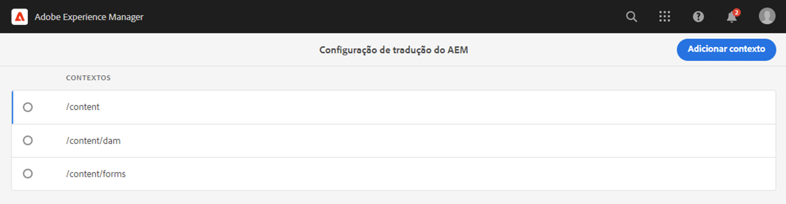
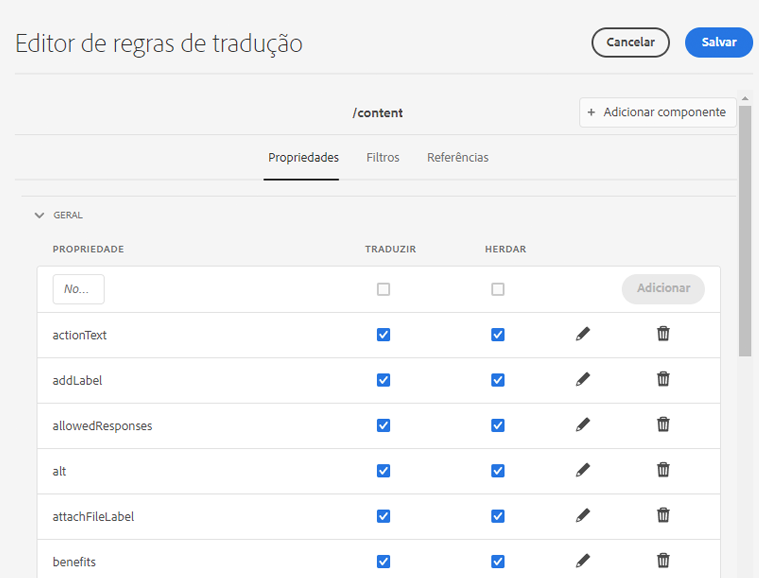
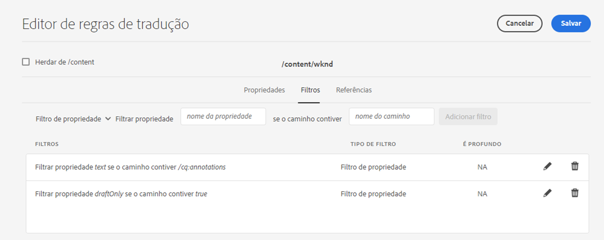
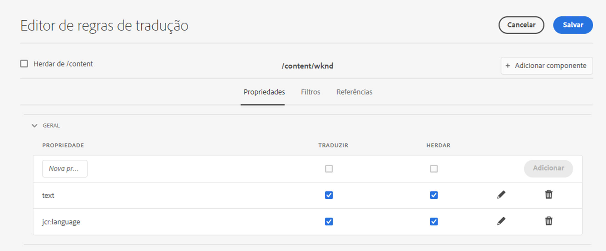

# Identificação de conteúdo a ser traduzido {#identifying-content-to-translate}

As regras de tradução identificam o conteúdo a ser traduzido para páginas, componentes e ativos que estão incluídos ou excluídos de projetos de tradução. Quando uma página ou ativo está sendo traduzido, o AEM extrai esse conteúdo para que ele possa ser enviado ao serviço de tradução.

>[!TIP]
>
>Se você é novo na tradução de conteúdo, consulte [Jornada de tradução de sites,](/help/journey-sites/translation/overview.md) que é um caminho guiado pela tradução de conteúdo do AEM Sites usando ferramentas de tradução poderosas do AEM, ideais para aqueles sem experiência com o AEM ou com tradução.

## Fragmentos de conteúdo e regras de tradução {#content-fragments}

As regras de tradução descritas neste documento se aplicam aos fragmentos de conteúdo somente se a opção **Habilitar campos do modelo de conteúdo para tradução** não foi ativada no [nível de configuração da estrutura de integração de tradução.](integration-framework.md#assets-configuration-properties)

Se a opção **Habilitar campos do modelo de conteúdo para tradução** estiver ativa, o AEM usará o campo **Traduzível** nos [Modelos de fragmentos de conteúdo](/help/sites-cloud/administering/content-fragments/content-fragments-models.md#properties) para determinar se o campo deve ser traduzido e criará as devidas regras de tradução automaticamente. Essa opção substitui qualquer regra de tradução criada e não requer nenhuma intervenção ou etapas adicionais.

Se você quiser usar regras de tradução para traduzir os fragmentos de conteúdo, a opção **Habilitar campos do modelo de conteúdo para tradução** na configuração da estrutura de integração de tradução deve estar desativada, e você precisa seguir as etapas descritas abaixo para criar suas regras.

## Visão geral {#overview}

As páginas e os ativos são representados como nós no repositório JCR. O conteúdo extraído é um ou mais valores de propriedade dos nós. As regras de tradução identificam as propriedades que contêm o conteúdo a ser extraído.

As regras de tradução são expressas em formato XML e armazenadas nesses locais possíveis:

* `/libs/settings/translation/rules/translation_rules.xml`
* `/apps/settings/translation/rules/translation_rules.xml`
* `/conf/global/settings/translation/rules/translation_rules.xml`

O arquivo se aplica a todos os projetos de tradução.

As regras incluem as seguintes informações:

* O caminho do nó ao qual a regra se aplica
   * A regra também se aplica aos descendentes do nó.
* Os nomes das propriedades do nó que contêm o conteúdo a ser traduzido
   * A propriedade pode ser específica a um tipo de recurso específico ou a todos os tipos de recurso.

Por exemplo, você pode criar uma regra que traduza o conteúdo que os autores adicionam a todos os componentes de texto nas suas páginas. A regra pode identificar o nó `/content` e a propriedade `text` do componente `core/wcm/components/text/v2/text`.

Existe um [console](#translation-rules-ui) que foi adicionado para configurar regras de tradução. As definições na interface preencherão o arquivo para você.

Para obter uma visão geral dos recursos de tradução de conteúdo no AEM, consulte [Tradução de conteúdo para sites multilíngues](overview.md).

>[!NOTE]
>
>O AEM é compatível com mapeamento de um para um entre os tipos de recursos e atributos de referência para a tradução de conteúdo referenciado em uma página.

## Sintaxe de regra para páginas, componentes e ativos {#rule-syntax-for-pages-components-and-assets}

Uma regra é um elemento `node` com um ou mais elementos `property` secundários e zero ou mais elementos `node` secundários:

```xml
<node path="content path">
          <property name="property name" [translate="false"]/>
          <node resourceType="component path" >
               <property name="property name" [translate="false"]/>
          </node>
</node>
```

Cada um desses elementos `node` têm as seguintes características:

* O atributo `path` contém o caminho para o nó raiz da ramificação à qual as regras se aplicam.
* Os elementos `property` secundários identificam as propriedades do nó a serem traduzidas para todos os tipos de recursos:
   * O atributo `name` contém o nome da propriedade.
   * O atributo opcional `translate` é igual a `false` se a propriedade não for traduzida. Por padrão, o valor é `true`. Esse atributo é útil ao substituir regras anteriores.
* Os elementos `node` secundários identificam as propriedades do nó a serem traduzidas para tipos de recursos específicos:
   * O atributo `resourceType` contém o caminho que é resolvido para o componente que implementa o tipo de recurso.
   * Os elementos `property` secundários identificam a propriedade do nó a ser traduzida. Use este nó da mesma forma que os elementos `property` secundários para regras de nó.

A seguinte regra de exemplo faz com que o conteúdo de todas as propriedades `text` seja traduzido para todas as páginas abaixo do nó `/content`. A regra é válida para qualquer componente que armazene conteúdo em uma propriedade `text`, como o componente de texto.

```xml
<node path="/content">
          <property name="text"/>
</node>
```

O exemplo a seguir traduz o conteúdo de todas as propriedades `text` e também traduz outras propriedades do componente de imagem. Se outros componentes tiverem propriedades com o mesmo nome, a regra não se aplica a eles.

```xml
<node path="/content">
      <property name="text"/>
      <node resourceType="core/wcm/components/image/v2/image">
         <property name="image/alt"/>
         <property name="image/jcr:description"/>
         <property name="image/jcr:title"/>
      </node>
</node>
```

## Sintaxe de regra para extração de ativos de páginas  {#rule-syntax-for-extracting-assets-from-pages}

Use a sintaxe de regra a seguir para incluir ativos incorporados ou referenciados de componentes:

```xml
<assetNode resourceType="path to component" assetReferenceAttribute="property that stores asset"/>
```

Cada elemento `assetNode` tem as seguintes características:

* Um atributo `resourceType` que é igual ao caminho que é resolvido para o componente
* Um atributo `assetReferenceAttribute` que é igual ao nome da propriedade que armazena o binário do ativo (para ativos incorporados) ou o caminho para o ativo referenciado

O exemplo a seguir extrai imagens do componente de imagem:

```xml
<assetNode resourceType="core/wcm/components/image/v2/image" assetReferenceAttribute="fileReference"/>
```

## Substituição de regras {#overriding-rules}

O arquivo `translation_rules.xml` consiste de um elemento `nodelist` com vários elementos `node` secundários. O AEM lê a lista de nós de cima para baixo. Quando várias regras têm como alvo o mesmo nó, a regra que está mais abaixo no arquivo é usada. Por exemplo, as seguintes regras fazem com que todo o conteúdo das propriedades `text` seja traduzido, exceto para a ramificação `/content/mysite/en` de páginas:

```xml
<nodelist>
     <node path="/content">
           <property name="text" />
     </node>
     <node path="/content/mysite/en">
          <property name="text" translate="false" />
     </node>
<nodelist>
```

## Propriedades de filtro {#filtering-properties}

Você pode filtrar nós que têm uma propriedade específica usando um elemento `filter`.

Por exemplo, as seguintes regras fazem com que todo o conteúdo das propriedades `text` seja traduzido, exceto para os nós que têm a propriedade `draft` definida como `true`.

```xml
<nodelist>
    <node path="/content">
     <filter>
   <node containsProperty="draft" propertyValue="true" />
     </filter>
        <property name="text" />
    </node>
<nodelist>
```

## Interface das regras de tradução {#translation-rules-ui}

Um console também está disponível para configurar regras de tradução.

Para acessá-lo:

1. Navegue até **Ferramentas** e, em seguida, até **Geral**.

1. Selecione **Configurações de tradução**.

Na interface das regras de tradução, é possível:

1. **Adicionar contexto**, que permite adicionar um caminho.

   

1. Use o navegador de caminho para selecionar o contexto necessário e toque ou clique no botão **Confirmar** para salvar.

   

1. Em seguida, é necessário selecionar o contexto e clicar em **Editar**. Isso abrirá o Editor de regras de tradução.

   

Há quatro atributos que você pode alterar por meio da interface:

* `isDeep`
* `inherit`
* `translate`
* `updateDestinationLanguage`

### isDeep {#isdeep}

**`isDeep`** é aplicável em filtros de nó e é verdadeiro por padrão. Ele verifica se o nó (ou seus antecessores) contém essa propriedade com o valor da propriedade especificado no filtro. Se for falso, ele só verifica o nó atual.

Por exemplo, nós secundários são adicionados a um trabalho de tradução mesmo quando o nó principal tem a propriedade `draftOnly` defina como true para sinalizar conteúdo de rascunho. Aqui, o atributo `isDeep` entra em ação e verifica se os nós principais têm a propriedade `draftOnly` definida como verdadeira e exclui os nós secundários.

No editor, você pode marcar/desmarcar **isDeep** na guia **Filtros**.



Este é um exemplo do XML resultante quando **isDeep** está desmarcado na interface:

```xml
 <filter>
    <node containsProperty="draftOnly" isDeep="false" propertyValue="true"/>
</filter>
```

### herdar {#inherit}

**`inherit`** é aplicável às propriedades. Por padrão, todas as propriedades são herdadas, mas se você quiser que alguma propriedade não seja herdada pelo nó secundário, poderá marcá-la como falsa para que seja aplicada somente a esse nó específico.

Na interface, você pode marcar/desmarcar **Herdar** na guia **Propriedades**.

### traduzir {#translate}

**`translate`** é usado apenas para especificar se uma propriedade deve ser traduzida ou não.

Na interface, você pode marcar/desmarcar **Traduzir** na guia **Propriedades**.

### updateDestinationLanguage {#updatedestinationlanguage}

**`updateDestinationLanguage`** é usado para propriedades que não têm texto, e sim códigos de idioma. Por exemplo: `jcr:language`. O usuário não está traduzindo o texto, e sim convertendo a localidade do idioma da origem para o destino. Essas propriedades não são enviadas para tradução.

Na interface, você pode marcar/desmarcar **Traduzir** na guia **Propriedades** para modificar esse valor para as propriedades específicas que têm códigos de idioma como valor.

Para ajudar a esclarecer a diferença entre `updateDestinationLanguage` e `translate`, veja um exemplo simples de um contexto com apenas duas regras:



O resultado no XML terá esta aparência:

```xml
<property inherit="true" name="text" translate="true" updateDestinationLanguage="false"/>
<property inherit="true" name="jcr:language" translate="false" updateDestinationLanguage="true"/>
```

## Editar o arquivo de regras manualmente {#editing-the-rules-file-manually}

O arquivo `translation_rules.xml` instalado com o AEM contém um conjunto padrão de regras de tradução. Você pode editar o arquivo para atender aos requisitos dos seus projetos de tradução. Por exemplo, você pode adicionar regras para que o conteúdo dos componentes personalizados seja traduzido.

Se você editar o arquivo `translation_rules.xml`, mantenha uma cópia de backup em um pacote de conteúdo. A reinstalação de determinados pacotes do AEM pode substituir o arquivo `translation_rules.xml` atual pelo original. Para restaurar as regras nessa situação, você pode instalar o pacote que contém a cópia de backup.

>[!NOTE]
>
>Após criar o pacote de conteúdo, recrie-o sempre que editar o arquivo.

## Exemplo de arquivo de regras de tradução {#example-translation-rules-file}

```xml
<?xml version="1.0" encoding="UTF-8"?><nodelist>
  <node path="/content">
    <property name="addLabel"/>
    <property name="allowedResponses"/>
    <property name="alt"/>
    <property name="attachFileLabel"/>
    <property name="benefits"/>
    <property name="buttonLabel"/>
    <property name="chartAlt"/>
    <property name="confirmationMessageToggle"/>
    <property name="confirmationMessageUntoggle"/>
    <property name="constraintMessage"/>
    <property name="contentLabel"/>
    <property name="denyText"/>
    <property name="detailDescription"/>
    <property name="emptyText"/>
    <property name="helpMessage"/>
    <property name="image/alt"/>
    <property name="image/jcr:description"/>
    <property name="image/jcr:title"/>
    <property name="jcr:description"/>
    <property name="jcr:title"/>
    <property name="heading"/>
    <property name="label"/>
    <property name="main"/>
    <property name="listLabel"/>
    <property name="moreText"/>
    <property name="pageTitle"/>
    <property name="placeholder"/>
    <property name="requiredMessage"/>
    <property name="resetTitle"/>
    <property name="subjectLabel"/>
    <property name="subtitle"/>
    <property name="tableData"/>
    <property name="text"/>
    <property name="title"/>
    <property name="navTitle"/>
    <property name="titleDivContent"/>
    <property name="toggleLabel"/>
    <property name="transitionLabel"/>
    <property name="untoggleLabel"/>
    <property name="name"/>
    <property name="occupations"/>
    <property name="greetingLabel"/>
    <property name="signInLabel"/>
    <property name="signOutLabel"/>
    <property name="pretitle"/>
    <property name="cq:panelTitle"/>
    <property name="actionText"/>
    <property name="cq:language" updateDestinationLanguage="true"/>
    <node pathContains="/cq:annotations">
      <property name="text" translate="false"/>
    </node>
    <node path="/content/wknd"/>
  </node>
  <node path="/content/forms">
    <property name="text" translate="false"/>
  </node>
  <node path="/content/dam">
    <property name="dc:description"/>
    <property name="dc:rights"/>
    <property name="dc:subject"/>
    <property name="dc:title"/>
    <property name="defaultContent"/>
    <property name="jcr:description"/>
    <property name="jcr:title"/>
    <property name="pdf:Title"/>
    <property name="xmpRights:UsageTerms"/>
    <property name="main"/>
    <property name="adventureActivity"/>
    <property name="adventureDescription"/>
    <property name="adventureDifficulty"/>
    <property name="adventureGearList"/>
    <property name="adventureGroupSize"/>
    <property name="adventureItinerary"/>
    <property name="adventurePrice"/>
    <property name="adventureTitle"/>
    <property name="adventureTripLength"/>
    <property name="adventureType"/>
    <node pathContains="/jcr:content/metadata/predictedTags">
      <property name="name"/>
    </node>
  </node>
  <assetNode assetReferenceAttribute="fragmentPath" resourceType="cq/experience-fragments/editor/components/experiencefragment"/>
  <assetNode assetReferenceAttribute="fragmentVariationPath" resourceType="core/wcm/components/experiencefragment/v1/experiencefragment"/>
  <assetNode assetReferenceAttribute="fileReference" resourceType="dam/cfm/components/contentfragment"/>
  <assetNode resourceType="docs/components/download"/>
  <assetNode resourceType="docs/components/image"/>
  <assetNode assetReferenceAttribute="fileReference" resourceType="foundation/components/image"/>
  <assetNode assetReferenceAttribute="asset" resourceType="foundation/components/video"/>
  <assetNode assetReferenceAttribute="fileReference" resourceType="foundation/components/download"/>
  <assetNode assetReferenceAttribute="fileReference" resourceType="core/wcm/components/download/v1/download"/>
  <assetNode assetReferenceAttribute="fileReference" resourceType="wcm/foundation/components/image"/>
  <assetNode assetReferenceAttribute="fragmentPath" resourceType="core/wcm/components/contentfragment/v1/contentfragment"/>
  <assetNode assetReferenceAttribute="fileReference" resourceType="core/wcm/components/image/v2/image"/>
</nodelist>
```
