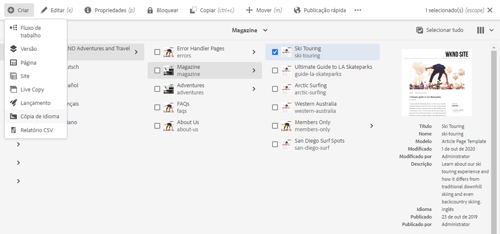
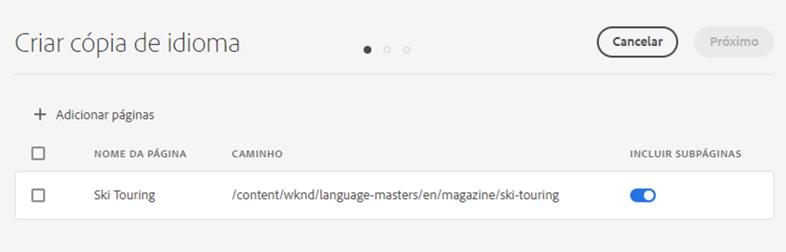
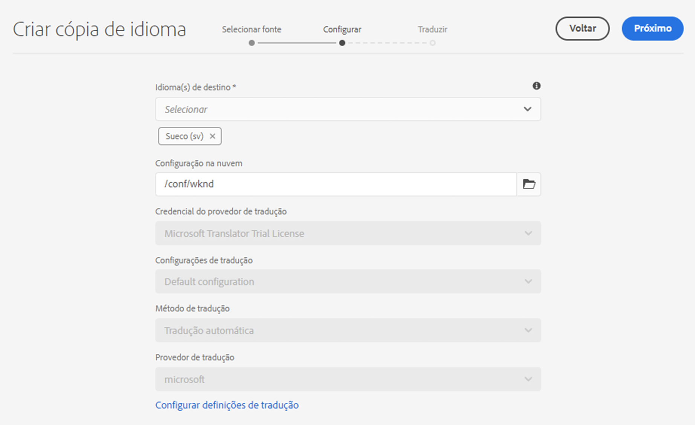
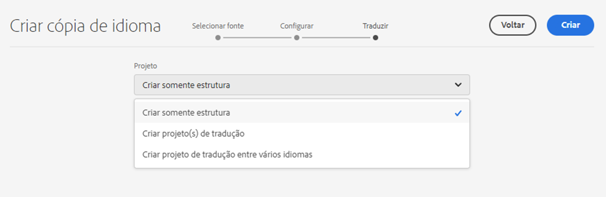
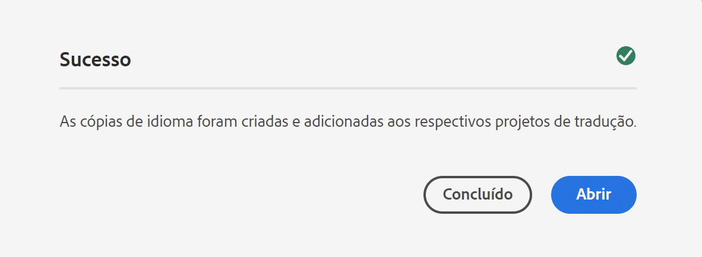

# Assistente de cópia de Idioma {#language-copy-wizard}

O Assistente de cópia de idioma é uma experiência guiada para criar e instrumentar a estrutura de conteúdo multilíngue. O assistente simplifica e agiliza a criação de uma cópia de idioma.

>[!TIP]
>
>Caso seja novo na tradução de conteúdo, consulte a [Jornada de tradução do Sites](/help/journey-sites/translation/overview.md), que é um caminho guiado pela tradução do seu conteúdo do AEM Sites usando as ferramentas de tradução avançadas do AEM, ideais para quem não tem experiência no AEM ou em tradução.

>[!NOTE]
>
>O usuário deve ser membro do `project-administrators` grupo para criar uma cópia de idioma de um site.

Para acessar o assistente:

1. No console Sites, selecione uma página e **Criar** e selecione **Cópia de idioma**.

   

1. O assistente é aberto na janela **Selecionar fonte** etapa que permite adicionar/remover páginas. Também há a opção de incluir ou excluir as subpáginas. Selecione as páginas que deseja incluir e selecione **Próxima**.

   

1. A variável **Configurar** a etapa do assistente permite adicionar/remover idiomas e selecionar o método de tradução. Selecione **Próximo**.

   

   >[!NOTE]
   >
   >Por padrão, há apenas uma configuração de tradução. Para poder selecionar outras configurações, é necessário definir as configurações de nuvem primeiro. Consulte [Configuração da estrutura de integração de tradução](integration-framework.md).

1. No **Traduza** etapa do assistente, é possível escolher entre criar somente a estrutura, criar um projeto de tradução ou adicionar a um projeto de tradução existente.

   >[!NOTE]
   >
   >Se você selecionou vários idiomas na etapa anterior, vários projetos de tradução serão criados.

   

1. O botão **Criar** encerra o assistente. Selecionar **Concluído** para fechar o assistente ou **Abertura** para exibir o projeto de tradução resultante.

   
