# Criação de informativos da campanha com o AEM {#creating-newsletters}

Neste documento, você aprenderá a usar AEM as a Cloud Service para criar informativos que podem ser enviados com o Adobe Campaign Classic.

Ao aproveitar a integração entre AEM as a Cloud Service e o Adobe Campaign Classic, você pode criar informativos usando AEM ferramentas de criação poderosas. Em seguida, quando estiver pronto para enviar o boletim informativo, poderá usar os recursos de gestão e distribuição de recipients do Campaign para enviá-lo.

## Pré-requisitos {#prerequisites}

Antes de criar um informativo com o AEM e enviá-lo com o Campaign, primeiro você deve [integre o Adobe Campaign Classic e AEM as a Cloud Service.](/help/sites-cloud/integrating/integrating-campaign-classic.md)

## Criar estrutura de informativo {#create-structure}

O conteúdo do informativo é gerenciado AEM maneira que você gerenciaria o conteúdo do site. Você começa criando um &quot;site&quot; para conter seu conteúdo. Neste &quot;site&quot;, você pode coletar seus boletins informativos por marca.

1. Faça logon na instância do autor do AEM.

1. Na página de navegação principal, abra o **Sites** console.

1. Em uma instalação padrão de AEM, haverá um **Campanha** pasta. Selecione-o e clique no botão **Criar** e depois **Página**.

   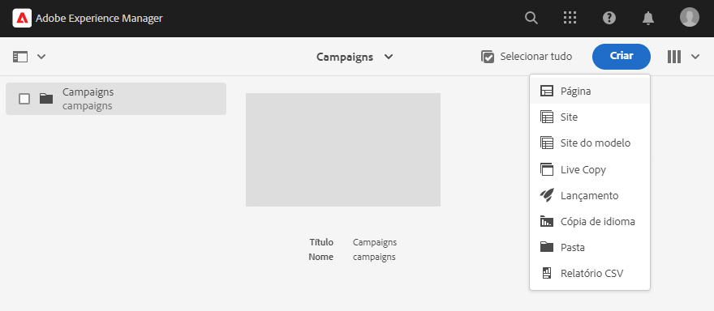

1. Selecionar **Marca** como modelo do site e clique em **Próximo**.

   

1. Insira um **Título** e clique em **Criar** e depois **Concluído**.

   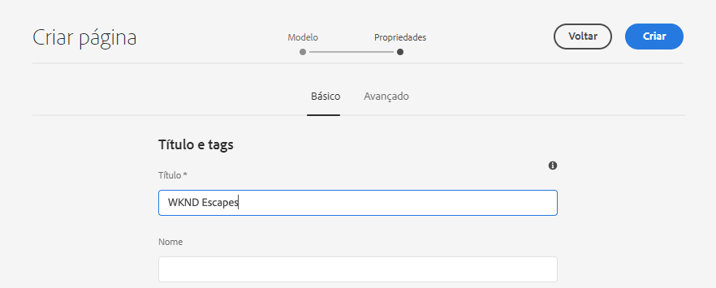

Agora você tem uma estrutura básica de conteúdo para criar suas campanhas.

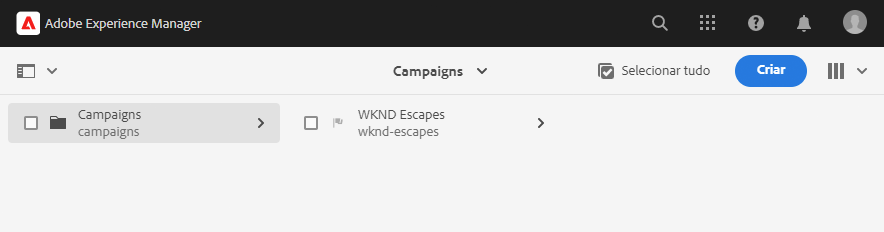

## Criando uma campanha {#create-campaign}

Agora que você tem uma estrutura básica de conteúdo para sua campanha, você pode criar a própria campanha. A campanha será usada para organizar possivelmente vários boletins informativos.

1. Usando [exibição de coluna](/help/sites-cloud/authoring/getting-started/basic-handling.md#viewing-and-selecting-resources) no console sites, selecione a marca criada anteriormente (nesse caso, **WKND Escapes**) e depois selecione **Área principal**, que foi criada automaticamente para você e clique no botão **Criar** e depois **Página**.

   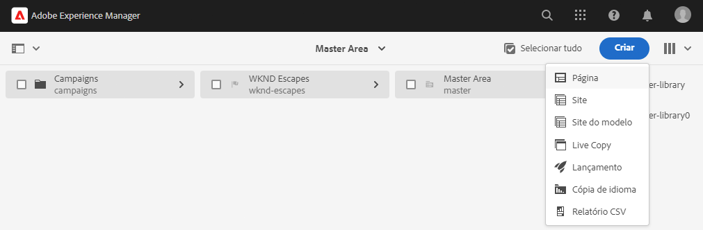

1. Selecionar **Campanha** como modelo e clique em **Próximo** e **Concluído**.

   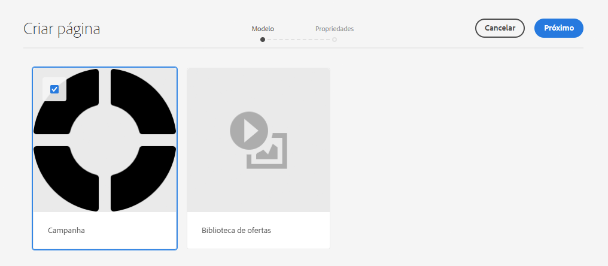

1. Insira um **Título** para a campanha e clique em **Criar** e **Concluído**.

   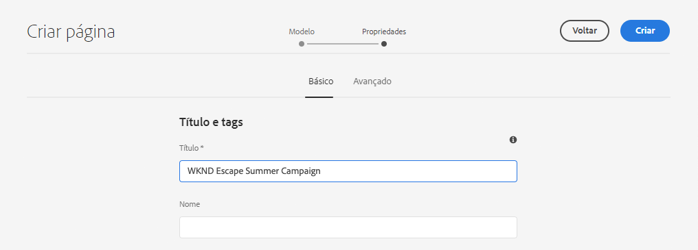

Agora você tem uma campanha onde pode criar seus boletins informativos.

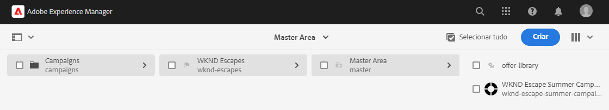

## Selecionar configuração da campanha {#campaign-configuration}

AEM pode suportar várias configurações de integração. Para sua nova campanha, você deve definir quais configurações usar para enviar o conteúdo do informativo.

1. Usando [exibição de coluna](/help/sites-cloud/authoring/getting-started/basic-handling.md#viewing-and-selecting-resources) no console sites, localize a campanha criada anteriormente (nesse caso, **Campanha de verão de escape WKND**), depois selecione-o usando a caixa de seleção e clique no botão **Propriedades** na barra de ferramentas.

   

1. No **Propriedades** selecione a **Cloud Service** para definir a integração a ser usada com esta campanha.

   * Selecionar **Adobe Campaign** do **Configurações de Cloud Service** lista suspensa.
   * Selecione a configuração de integração do Adobe Campaign desejada no **Adobe Campaign** lista suspensa.
   * Clique em **Salvar e fechar**.

   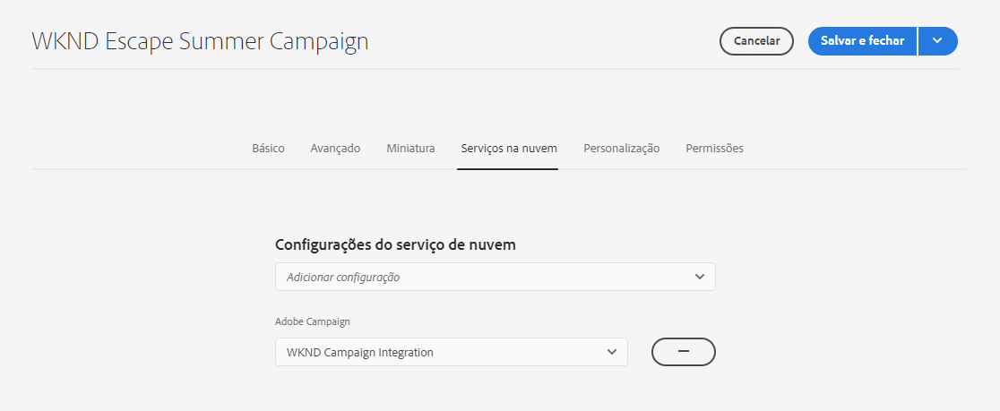

Sua campanha agora está vinculada à integração do Adobe Campaign. Você está pronto para criar um informativo no AEM e enviá-lo com o Adobe Campaign.

## Criar um informativo {#create-newsletter}

Crie e gerencie seus informativos na estrutura de conteúdo da campanha que você já criou e configurou.

1. Usando [exibição de coluna](/help/sites-cloud/authoring/getting-started/basic-handling.md#viewing-and-selecting-resources) no console sites, localize a campanha configurada anteriormente (nesse caso, **Campanha de verão de escape WKND**), selecione-o e clique no botão **Criar** e depois **Página**.

   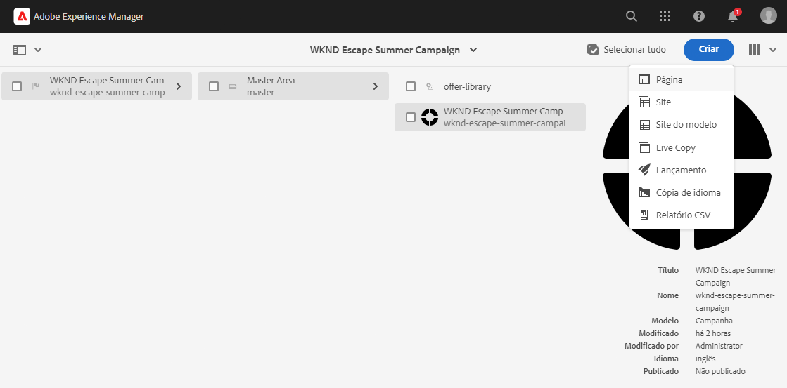

1. No assistente para criar página, selecione o **Email do Adobe Campaign (AC 6.1)** modelo e clique em **Próximo**.

   

1. Para o **Propriedades** do assistente, insira o **Título** para o boletim informativo, clique em **Criar** e **Abrir**.

   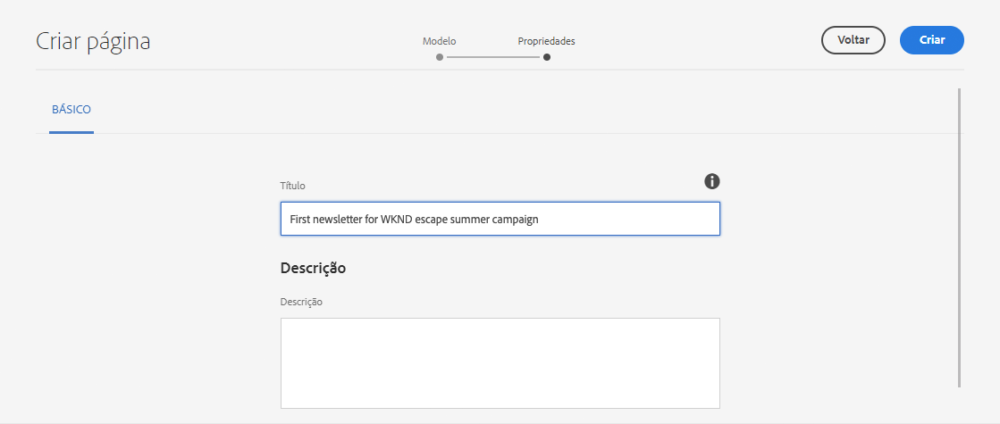

1. Edite a página do informativo como faria com qualquer outra página de conteúdo AEM para atender às suas necessidades.

Agora você tem um informativo pronto para enviar com o Adobe Campaign.

## Publicar seu informativo {#publishing-newsletter}

Você deve publicar seu informativo para disponibilizá-lo ao Adobe Campaign para envio.

1. Usando [exibição de coluna](/help/sites-cloud/authoring/getting-started/basic-handling.md#viewing-and-selecting-resources) no console sites, localize o boletim informativo criado anteriormente (nesse caso, **Primeiro boletim informativo para a campanha de escape WKND no verão**), selecione-o e clique no botão **Informações da página** no canto superior esquerdo e clique em **Publicar página**.

1. Selecione as configurações para as quais a página deve ser publicada e clique em **Publicar**.

   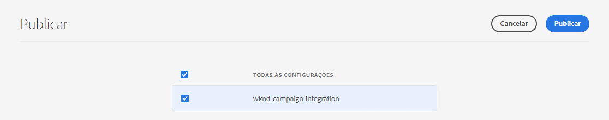

A página do informativo agora é publicada na instância de publicação do AEM e está visível no Adobe Campaign Classic. Para poder selecioná-lo no Adobe Campaign, ele deve ser aprovado.

1. Clique no botão **Informações da página** para o boletim informativo mais uma vez e selecione **Iniciar fluxo de trabalho**.

1. Selecionar **Aprovar para Adobe Campaign** como o modelo de fluxo de trabalho (fornecendo uma descrição opcionalmente) e clique no botão **Iniciar fluxo de trabalho** botão.

   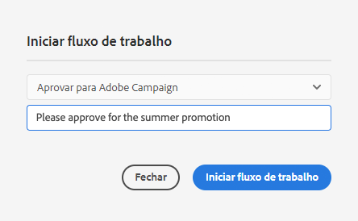

1. Um banner é exibido na parte superior do editor de páginas do informativo, fornecendo as próximas etapas do processo de aprovação. Clique em **Concluído**.

   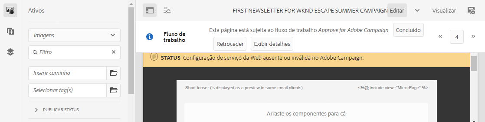

1. No **Item de Trabalho Concluído** , selecione **Revisão do boletim informativo (Administrador)** no **Próxima etapa** e clique no botão **OK** botão.

   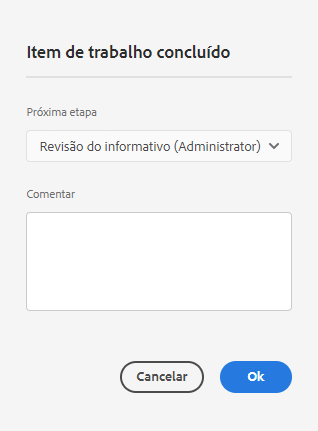

1. No banner exibido na parte superior do editor de página do boletim informativo, clique novamente em **Concluído**.

1. No **Item de Trabalho Concluído** , selecione **Aprovação de boletim informativo** no **Próxima etapa** e clique no botão **OK** botão.

   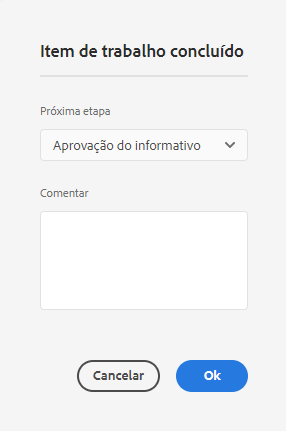

1. Quando a caixa de diálogo é fechada, o banner exibido na parte superior do editor de páginas do boletim informativo desaparece porque o fluxo de trabalho de aprovação está concluído.

O informativo agora é publicado no AEM e aprovado para uso no Adobe Campaign.

>[!TIP]
>
>As etapas do fluxo de trabalho descritas estão simplificadas aqui para ilustrar o processo. Em um fluxo de trabalho normal, criar e aprovar o boletim informativo normalmente tem diferentes funções
>
>Consulte o documento [Trabalhar com fluxos de trabalho](/help/sites-cloud/authoring/workflows/overview.md) para obter mais detalhes sobre o uso de fluxos de trabalho.

## Criação de um destinatário {#creating-recipient}

Para enviar o boletim informativo criado no AEM, primeiro defina os destinatários no Adobe Campaign Classic.

1. Faça logon no Adobe Campaign Classic usando o console do cliente.

1. Selecionar **Ferramentas** -> **Explorer** na barra de menus.

1. No explorador, navegue até o **Perfis e metas** -> **Recipients** nó .

   

1. Clique em **Novo** na barra de ferramentas e forneça os detalhes do recipient.

   * Nome
   * Sobrenome
   * Endereço de e-mail

1. Clique em **Salvar**.

Agora você tem um recipient para quem pode enviar seu boletim informativo usando o Adobe Campaign Classic.

## Criação de um delivery de email {#create-delivery}

A etapa final é enviar o informativo criado no AEM ao destinatário adicionado ao Adobe Campaign Classic.

1. Faça logon no Adobe Campaign Classic usando o console do cliente.

1. Selecionar **Ferramentas** -> **Explorer** na barra de menus.

1. No explorador, navegue até o **Campaign Management** -> **Deliveries** e clique em **Novo**.

   

1. No **Delivery** , selecione **Entrega de email com conteúdo AEM** como **Modelo de delivery** na lista suspensa e clique em **Continuar**.

   

1. No **Parâmetros de email** clique no botão **De** , insira as informações do remetente e clique em **OK**.

   * Endereço do remetente
   * Campo De

   

1. No **Parâmetros de email** clique no botão **Para** para abrir o **Selecionar destino** e clique em **Adicionar**.

   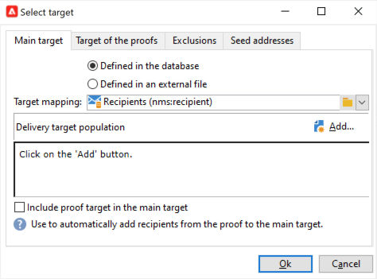

1. No **Selecionar elemento de destino** , selecione **Um recipient** e clique em **Próximo**.

   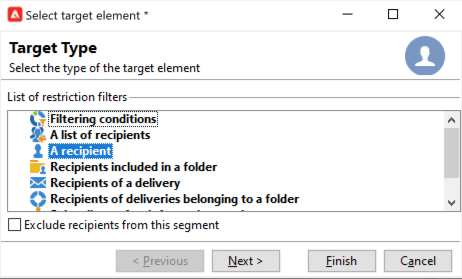

1. Usando os filtros, selecione o recipient que você [criado anteriormente](#creating-recipient) e clique em **Concluir**.

   

1. De volta ao **Selecionar destino** , clique em **OK**.

1. Na janela do delivery, clique em **Sincronizar**.

   

1. No **Sincronizar com AEM conteúdo** , selecione o boletim informativo criado anteriormente na lista e clique em **OK**.

1. O conteúdo do email do Adobe Campaign é sincronizado com o conteúdo do informativo criado no AEM.

   * Clique em **Atualizar conteúdo** se o conteúdo não for carregado automaticamente.

1. Clique em **Enviar** para enviar o email.

1. No **Enviar para o target do delivery principal** , selecione **Enviar delivery assim que possível** e, em seguida, clique em **Analisar**.

   

1. A etapa de análise cria o delivery, combinando o conteúdo com os recipients. Agora que o delivery tiver sido criado, clique em **Confirmar entrega** para enviar o email. Clique em **Sim** para confirmar.

1. O delivery foi iniciado. Clique em **Fechar**.

   

1. Clique em **Salvar** para salvar o delivery.

Seu informativo foi enviado!

>[!TIP]
>
>Este exemplo mostrou um delivery simplificado de enviar um boletim informativo a um único recipient. É claro que um delivery normal conteria muitos recipients diferentes, o que a Adobe Campaign facilita o gerenciamento. Consulte a [Documentação do Adobe Campaign Classic](https://experienceleague.adobe.com/docs/campaign-classic.html) para obter mais detalhes sobre delivery e gestão de recipients.
