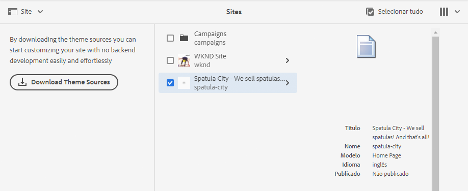

# Manuseio básico {#basic-handling}

Este documento foi criado para apresentar uma visão geral do manuseio básico ao usar um ambiente de criação do AEM. Usa o console **Sites** como base.

>[!NOTE]
>
>* Algumas funcionalidades podem ou não estar disponíveis dependendo do console. Informações específicas sobre os consoles individuais e suas funcionalidades relacionadas são abordadas com mais detalhes em outras páginas.
>* Os atalhos de teclado estão disponíveis em todo o AEM, principalmente ao [usar páginas de console](/help/sites-cloud/authoring/getting-started/keyboard-shortcuts.md) e [de edição](/help/sites-cloud/authoring/fundamentals/keyboard-shortcuts.md).

## Uma interface de usuário habilitada para toque {#a-touch-enabled-ui}

A interface do usuário do AEM é habilitada para toque. Uma interface habilitada para toque permite que você use toques para interagir com o software por meio de gestos, como tocar, tocar e segurar e deslizar o dedo. Como a interface do usuário do AEM é habilitada para toque, você pode usar os gestos de toque nos dispositivos de toque, como celular ou tablet. No entanto, as ações do mouse em um dispositivo de desktop tradicional também estão disponíveis, o que proporciona flexibilidade na maneira como você escolhe criar conteúdo.

## Primeiras etapas {#first-steps}

Logo após o logon, você acessa o [painel de Navegação](#navigation-panel). Selecionar uma das opções abre o respectivo console.

Para obter uma boa compreensão do uso básico do AEM, este documento se baseia no console de **Sites.** Clique ou toque em **Sites** para começar.

## Navegação do produto   {#product-navigation}

Sempre que um usuário acessa um console pela primeira vez, um tutorial de navegação de produto é iniciado. Reserve um minuto para mexer no programa para obter uma boa visão geral do manuseio básico do AEM.

Clique ou toque em **Avançar** para avançar para a próxima página da visão geral. Clique ou toque em **Fechar** ou fora da caixa de diálogo de visão geral para fechar.

A visão geral será reiniciada na próxima vez que você acessar um console a menos que visualize todos os slides ou marque a opção **Não mostrar esta mensagem novamente**.

## Navegação global {#global-navigation}

É possível navegar entre os consoles usando o painel de navegação global. Ele acionado como uma lista suspensa de tela cheia ao clicar ou tocar no link do Adobe Experience Manager na parte superior esquerda da tela.

Você pode fechar o painel de navegação global clicando ou tocando em **Fechar** para retornar ao seu local anterior.

A navegação global possui dois painéis, representados por ícones na margem esquerda da tela:

* **[Navegação](#navigation-panel)** - Representado por uma bússola   e o painel padrão ao fazer logon no AEM
* **[Ferramentas](#tools-panel)**: representadas por um martelo

As opções disponíveis nesses painéis estão descritas abaixo.

### Painel Navegação   {#navigation-panel}

O painel de Navegação:

O título da guia do navegador será atualizado para refletir sua localização à medida que você navega pelos consoles e conteúdo.

Em Navegação, os consoles disponíveis são:

| Console | Propósito |
|---|---|
| Projetos | O console Projetos concede acesso direto aos projetos. [Projetos são painéis virtuais](/help/sites-cloud/authoring/projects/overview.md) que podem ser usados para criar uma equipe. Você pode conceder a essa equipe acesso a recursos, fluxos de trabalho e tarefas, permitindo que as pessoas trabalhem por um objetivo comum. |
| Sites | O console Sites permite [criar, exibir e gerenciar sites](/help/sites-cloud/authoring/fundamentals/organizing-pages.md) em execução na sua instância do AEM. Por meio desse console, você pode criar, copiar, mover e excluir páginas, iniciar fluxos de trabalho e publicar páginas. |
| Fragmentos de experiência | Um [Fragmento de experiência](/help/sites-cloud/authoring/fundamentals/experience-fragments.md) é uma experiência independente que pode ser reutilizada em vários canais e que apresenta variações, evitando o trabalho de copiar e colar repetidamente as experiências ou partes das experiências. |
| Ativos | O console de Ativos permite importar e gerenciar [ativos digitais como imagens, vídeos, documentos e arquivos de áudio. ](/help/assets/overview.md) Esses ativos podem ser usados por um site em execução na mesma instância do AEM. Também é possível criar e gerenciar [Fragmentos de conteúdo](/help/assets/content-fragments/content-fragments.md) no console de Ativos. |
| Personalização | Esse console fornece uma estrutura de ferramentas para a [criação de conteúdo direcionado e a apresentação de experiências personalizadas](/help/sites-cloud/authoring/personalization/overview.md). |
| Fragmentos de conteúdo | [Os fragmentos de conteúdo](/help/sites-cloud/administering/content-fragments/overview.md) permitem projetar, criar, preparar e publicar conteúdo independente de página. Eles permitem preparar conteúdo estruturado pronto para uso em vários locais/canais e são ideais para a criação de páginas e entrega headless. |

## Painel Ferramentas {#tools-panel}

No painel Ferramentas, há um painel lateral que contém um intervalo de categorias que agrupa consoles de Ferramentas semelhantes. Os consoles Ferramentas fornecem acesso a uma série de ferramentas e consoles especializados que ajudam a administrar seus sites, ativos digitais e outros aspectos do seu repositório de conteúdo. <!--The [Tools consoles](/help/sites-administering/tools-consoles.md) provide access to a number of specialized tools and consoles that help you administer your websites, digital assets, and other aspects of your content repository.-->

## O Cabeçalho {#the-header}

O cabeçalho está sempre presente na parte superior da tela. Embora a maioria das opções no cabeçalho permaneça a mesma, independentemente de onde você esteja no sistema, algumas são específicas do contexto.

* [Navegação global](#global-navigation)

  Selecione o link do **Adobe Experience Manager** para navegar entre consoles.

  

* [Pesquisar](/help/sites-cloud/authoring/getting-started/search.md)

  

  Você também pode usar a [tecla de atalho](/help/sites-cloud/authoring/getting-started/keyboard-shortcuts.md) `/` (barra) para invocar a pesquisa em qualquer console.

* [Soluções](https://www.adobe.com/br/experience-cloud.html)

  

* [Ajuda](#accessing-help)

  

* [Notificações](/help/sites-cloud/authoring/getting-started/inbox.md)

  

  Esse ícone é marcado com o número de notificações incompletas atribuídas no momento.

* [Propriedades do usuário](/help/sites-cloud/authoring/getting-started/account-environment.md)

  

* [Seletor de painéis](#rail-selector)

  

  As opções apresentadas dependem do seu console atual. Por exemplo, em **Sites**, é possível selecionar somente o conteúdo (o padrão), a linha do tempo, as referências ou o painel lateral de filtros.

  

* Navegações estruturais

  

  Situadas no meio do painel e sempre mostrando a descrição do item atualmente selecionado, as navegações estruturais permitem que você navegue dentro de um console específico. No console **Sites**, você pode navegar pelos níveis do seu site.

  Basta clicar no texto da navegação estrutural para exibir uma lista suspensa com os níveis da hierarquia do item selecionado no momento. Clique em uma entrada para ir para esse local.

  

* Botão **Criar**

  

  Uma vez clicado, as opções exibidas são adequadas ao console/contexto.

* [Exibições](#viewing-and-selecting-resources)

  O ícone de exibição está na extrema direita da barra de ferramentas do AEM. Como também indica a exibição atual, ele muda. Por exemplo, no modo de exibição padrão, e **Exibição de coluna** ele aparece da seguinte forma:

  

  É possível alternar entre o modo de exibição de coluna, exibição de cartão e exibição de lista. No modo de exibição de lista também mostra as configurações de exibição.

  

  >[!NOTE]
  >
  >A opção **Configurações de exibição** só está disponível no modo **Exibição de lista**.

* Navegação pelo teclado

  Você pode navegar por um site usando apenas o teclado. Isso usa a funcionalidade padrão do navegador da tecla **TAB** (ou **OPT+TAB**) para que você possa percorrer os elementos na página que são focalizáveis.

  No console do **Sites** há a opção adicionada para **Ir para o conteúdo principal**. Isso se torna visível à medida que você navega pelas opções de cabeçalho e acelera a navegação, possibilitando ignorar os elementos padrão na barra de ferramentas (produto) e acessar diretamente o conteúdo principal.

  

## Acessar ajuda   {#accessing-help}

Há vários recursos de ajuda disponíveis:

* **Barra de ferramentas do console**

  Dependendo da sua localização, o ícone de **Ajuda** abrirá os recursos apropriados:

  

* **Navegação**

  Na primeira vez que você navega pelo sistema, [uma série de slides apresenta a navegação no AEM](#product-navigation).

  

* **Editor de página**

  Na primeira vez que você edita uma página, uma série de slides apresenta o editor de páginas.

  

  Navegue por essa visão geral como faria com a [visão geral de navegação do produto](#product-navigation) ao acessar qualquer console pela primeira vez.

  No menu [**Informações da página,** é possível selecionar **Ajuda**](/help/sites-cloud/authoring/fundamentals/environment-tools.md#accessing-help) para exibir isso novamente, a qualquer momento.

* **Console de ferramentas**

  No console **Ferramentas** é possível acessar os **Recursos** externos:

   * **Documentação** - exibir a documentação do Adobe® Experience Manager
   * **Recursos do desenvolvedor** - recursos e downloads do desenvolvedor

  >[!NOTE]
  >
  >É possível acessar uma visão geral das teclas de atalho disponíveis a qualquer momento, usando a tecla de atalho `?` (ponto de interrogação) em um console.
  >
  >Para obter uma visão geral de todos os atalhos de teclado, consulte a seguinte documentação:
  >
  >* [Atalhos de teclado para editar páginas](/help/sites-cloud/authoring/fundamentals/keyboard-shortcuts.md)
  >* [Atalhos de teclado para os consoles](/help/sites-cloud/authoring/getting-started/keyboard-shortcuts.md)

## Barra de ferramentas de Ações {#actions-toolbar}

Sempre que um recurso é selecionado (por exemplo, uma página ou um ativo), várias ações são indicadas por ícones com texto explicativo na barra de ferramentas. Essas ações dependem do seguinte:

* Do console atual
* Do contexto atual
* Se você estiver no [modo de seleção](#viewing-and-selecting-resources)

A ação disponível na barra de ferramentas muda para refletir as ações que você pode realizar nos itens específicos selecionados.

A forma como você [seleciona um recurso](#viewing-and-selecting-resources) depende da exibição.

Devido às restrições de espaço em algumas janelas, a barra de ferramentas pode tornar-se rapidamente maior do que o espaço disponível. Quando isso acontecer, opções adicionais serão exibidas. Clicar ou tocar nas reticências (os três pontos ou **...**) abre um seletor suspenso com todas as ações restantes. Por exemplo, após selecionar uma página no console **Sites**:

>[!NOTE]
>
>Os ícones individuais disponíveis são documentados em relação ao console/recurso/cenário apropriado.

## Ações rápidas {#quick-actions}

Na [Exibição de cartão](#card-view) determinadas ações estão disponíveis como ícones de ação rápida e na barra de ferramentas. Os ícones de ação rápida estão disponíveis para um único item de cada vez e eliminam a necessidade de pré-seleção.

As ações rápidas ficam visíveis quando você passa o mouse (desktop) sobre um cartão de recursos. As ações rápidas disponíveis podem depender do console e do contexto. Por exemplo, estas são as ações rápidas para uma página no console **Sites**:

## Visualização e seleção de recursos {#viewing-and-selecting-resources}

Visualizar, navegar e selecionar são conceitualmente iguais em todas as exibições, mas têm pequenas variações de manuseio, dependendo da exibição usada.

É possível visualizar, navegar e selecionar (para novas ações) os recursos com qualquer uma das exibições disponíveis, que podem ser selecionadas por meio do ícone no canto superior direito:

* [Exibição de coluna](#column-view)
* [Exibição de cartão](#card-view)
* [Exibição de lista](#list-view)

>[!NOTE]
>
>Por padrão, o AEM Assets não exibe as representações originais de ativos na interface como miniaturas em nenhuma das exibições. Se você for um administrador, poderá usar sobreposições para configurar o AEM Assets e exibir representações originais como miniaturas.

### Seleção de recursos   {#selecting-resources}

Selecionar um recurso específico depende de uma combinação da exibição e do dispositivo:

| Exibir | Selecionar toque | Selecionar desktop | Desmarcar toque | Desmarcar desktop |
|---|---|---|---|---|
| Coluna | Toque na miniatura | Clique na miniatura | Toque na miniatura | Clique na miniatura |
| Cartão | Toque e segure o cartão | Passe o mouse sobre ele e use a ação rápida da marca de seleção | Toque no cartão | Clique no cartão |
| Lista | Toque na miniatura | Clique na miniatura | Toque na miniatura | Clique na miniatura |

#### Selecionar tudo {#select-all}

É possível selecionar todos os itens em qualquer exibição clicando em **Selecionar tudo** no canto superior direito do console.

* Na **Exibição de cartão** todos os cartões serão selecionados.
* Na **Exibição de lista**, todos os itens na lista são selecionados.
* Na **Exibição de coluna**, todos os itens na coluna mais à esquerda são selecionados.

#### Desmarcar tudo {#deselecting-all}

Em todos os casos, ao selecionar itens, a contagem dos itens selecionados é exibida na parte superior direita da barra de ferramentas.

Você pode desmarcar todos os itens e sair do modo de seleção ao:

* Clicar ou tocar no **X** ao lado da contagem
* Usar a tecla **escape**

Em todas as visualizações, todos os itens podem ser desmarcados. Para isso, pressione a tecla Escape no teclado se você estiver usando um computador desktop.

#### Exemplo de seleção {#selecting-example}

1. Por exemplo, na exibição de cartão:

   

1. Após selecionar um recurso, o cabeçalho superior é coberto pela [barra de ferramentas das ações](#actions-toolbar), que fornece acesso às ações atualmente aplicáveis ao recurso selecionado.

   Para sair do modo de seleção, selecione o **X** no canto superior direito, ou use a tecla **escape**.

### Exibição de coluna {#column-view}

A exibição de coluna permite uma navegação visual de uma árvore de conteúdo por uma série de colunas em cascata. Essa visualização permite visualizar e percorrer a estrutura de árvore do site.

Selecionar um recurso na coluna mais à esquerda exibirá os recursos secundários em uma coluna à direita. Selecionar um recurso na coluna à direita exibirá os recursos secundários em outra coluna à direita e assim por diante.

* É possível navegar para cima e para baixo na árvore tocando ou clicando no nome do recurso ou na divisa à direita do nome do recurso.

   * O nome e a divisa do recurso são realçados quando tocados ou clicados.
   * Os secundários do recurso clicado/tocado são exibidos na coluna à direita do recurso clicado/tocado.
   * Se você tocar ou clicar em um nome de recurso que não tenha secundários, seus detalhes serão exibidos na coluna final.

* Tocar ou clicar na miniatura seleciona o recurso.

   * Ao selecionar, uma marca de seleção será sobreposta à miniatura, e o nome do recurso também será destacado.
   * Os detalhes do recurso selecionado serão mostrados na coluna final.
   * A barra de ferramentas de ações ficará disponível.

  Quando uma página é selecionada na exibição de coluna, a página selecionada é exibida na coluna final junto com os seguintes detalhes:

   * Título da página
   * Nome da página (parte do URL da página)
   * Modelo no qual a página se baseia
   * Detalhes da modificação
   * Idioma da página
   * Publicação e detalhes da visualização

### Exibição de cartão {#card-view}

* A exibição de cartão mostra cartões de informação para cada item no nível atual. Eles fornecem informações como:

   * Uma representação visual do conteúdo da página
   * O título da página
   * Datas importantes (como a última edição/publicação)
   * Se a página estiver bloqueada, oculta ou fizer parte de uma live copy
   * Se for o caso, quando for necessário tomar medidas como parte de um fluxo de trabalho
      * Marcadores que indicam ações necessárias podem estar relacionados a itens em sua [caixa de entrada](/help/sites-cloud/authoring/getting-started/inbox.md).

* [Ações rápidas](#quick-actions) também estão disponíveis nessa visualização, como recursos de seleção e ações comuns, como “Editar”.

  

* É possível navegar para baixo na árvore tocando/clicando em cartões (com cautela para evitar as ações rápidas) ou para cima novamente usando a [navegação estrutural no cabeçalho](#the-header).

### Exibição de lista {#list-view}

* A exibição de lista apresenta informações para cada recurso no nível atual.
* É possível navegar para baixo na árvore tocando/clicando no nome do recurso e fazer backup usando a [navegação estrutural no cabeçalho](#the-header).
* Para selecionar facilmente todos os itens na lista, use a caixa de seleção no canto superior esquerdo da lista.

  

   * Quando todos os itens da lista forem selecionados, essa caixa de seleção aparecerá marcada.

      * Clique ou toque na caixa de seleção para desmarcar tudo.

   * Quando apenas alguns itens são selecionados, ela aparece com um sinal de menos.

      * Clique ou toque na caixa de seleção para selecionar tudo.
      * Clique ou toque novamente na caixa de seleção para desmarcar tudo.

* Selecione as colunas a serem mostradas usando a opção **Configurações de exibição**, localizada abaixo do botão Visualizações. As seguintes colunas estão disponíveis para exibição:

   * **Nome**: o nome da página, que pode ser útil em um ambiente de criação multilíngue, pois faz parte do URL da página e não é alterado independentemente do idioma
   * **Modificado**: a última data de modificação e último usuário que modificou
   * **Publicado**: o status da publicação
   * **Visualizar** - Status da visualização
   * **Modelo** - Modelo no qual a página se baseia
   * **Fluxo de trabalho**: o fluxo de trabalho atualmente aplicado à página. Mais informações estão disponíveis ao passar o mouse ou abrir a Linha do tempo.
   * **Análise de página**
   * **Visitantes únicos**
   * **Tempo na página**

     

  Por padrão, é exibida a coluna **Nome**, que faz parte do URL da página. Em alguns casos, o autor pode precisar acessar páginas que estão em um idioma diferente, e ver o nome da página (que normalmente é imutável) pode ser de grande ajuda quando ele não conhece o idioma.

* Altere a ordem dos itens usando a barra vertical pontilhada na extremidade direita de cada item da lista.

  >[!NOTE]
  >
  >Alterar a ordem funciona somente em uma pasta ordenável que tenha o valor `jcr:primaryType` como `sling:OrderedFolder`.

  

  Clique ou toque na barra de seleção vertical e arraste o item até uma nova posição na lista.

  

## Seletor de painéis {#rail-selector}

O **Seletor de painéis** está disponível no canto superior esquerdo da janela e exibe opções dependendo dos seus consoles atuais.

Por exemplo, no console de **Sites**, é possível selecionar somente conteúdo (padrão), árvore de conteúdo, linha do tempo, referências, detalhes do site ou o painel lateral de filtro.

Se somente conteúdo for selecionado, apenas o ícone do painel será exibido. Se qualquer outra opção for selecionada, o nome da opção aparecerá ao lado do ícone do painel.

>[!NOTE]
>
>[Atalhos de teclado](/help/sites-cloud/authoring/getting-started/keyboard-shortcuts.md) estão disponíveis para alternar rapidamente entre as opções de exibição do painel.

### Árvore de conteúdo {#content-tree}

A árvore de conteúdo pode ser usada para navegar rapidamente pela hierarquia do site no painel lateral e exibir muitas informações sobre as páginas na pasta atual.

Usando o painel lateral da árvore de conteúdo em conjunto com uma exibição de lista ou de cartões, é possível ver facilmente a estrutura hierárquica do projeto e navegar pela estrutura de conteúdo com o painel lateral, além de ver informações de página detalhadas na exibição de lista.

>[!NOTE]
>
>Depois que uma entrada da exibição hierárquica é selecionada, as teclas de seta podem ser usadas para navegar rapidamente pela hierarquia.
>
>Consulte os [atalhos de teclado](/help/sites-cloud/authoring/getting-started/keyboard-shortcuts.md) para obter mais informações.

### Linha do tempo {#timeline}

A linha do tempo pode ser usada para exibir e/ou iniciar eventos que ocorreram no recurso selecionado. Para abrir a coluna da linha do tempo use o seletor do painel:

A coluna de linha do tempo permite:

* Exibir vários eventos relacionados a um item selecionado.

   * Os tipos de eventos podem ser selecionados na lista suspensa:

      * Comentários
      * [Anotações](/help/sites-cloud/authoring/fundamentals/annotations.md)
      * [Atividades](/help/sites-cloud/authoring/personalization/activities.md)
      * [Lançamentos](/help/sites-cloud/authoring/launches/overview.md)
      * [Versões](/help/sites-cloud/authoring/features/page-versions.md)
      * [Fluxos de trabalhos](/help/sites-cloud/authoring/workflows/overview.md)
         * Com exceção de fluxos de trabalho transitórios pois nenhuma informação de histórico é salva para eles <!--With the exception of [transient workflows](/help/sites-developing/workflows.md#transient-workflows) as no history information is saved for these-->
      * Exibir todos

* Adicionar/exibir comentários sobre o item selecionado. A caixa **Comentário** é exibida na parte inferior da lista de eventos. Inserir um comentário seguido por Retornar registrará esse comentário. Ele será mostrado quando a opção **Comentários** ou **Exibir todos** estiver selecionada.

* Os consoles específicos têm funcionalidade adicional. Por exemplo, no console Sites é possível:

   * [Salvar uma versão](/help/sites-cloud/authoring/features/page-versions.md)
   * [Iniciar um fluxo de trabalho](/help/sites-cloud/authoring/workflows/applying.md)

Essas opções podem ser acessadas por meio da divisa ao lado do campo **Comentário**.

### Referências {#references}

As **referências** mostram todas as conexões com o recurso selecionado. Por exemplo, no console **Sites**, são mostradas [referências](/help/sites-cloud/authoring/fundamentals/environment-tools.md#references) para as páginas:

* [Lançamentos](/help/sites-cloud/authoring/launches/overview.md#launches-in-references-sites-console)
* [Live copies](/help/sites-cloud/administering/msm/overview.md#openingthelivecopyoverviewfromreferences)
* [Cópias de idioma](/help/sites-cloud/administering/translation/preparation.md#seeing-the-status-of-language-roots)
* Referência de conteúdo:

   * Links de outras páginas para a página selecionada
   * Conteúdo emprestado de e/ou concedido à página selecionada pelo componente Referência

### Site {#site}

**Site** mostra detalhes de sites [criados usando um modelo de site](/help/sites-cloud/administering/site-creation/create-site.md).

Consulte o documento [Usar o painel do site para gerenciar o tema do site](/help/sites-cloud/administering/site-creation/site-rail.md) para obter mais detalhes sobre como usar o painel para gerenciar o [tema do seu site](/help/sites-cloud/administering/site-creation/site-themes.md).

>[!TIP]
>
>Uma descrição completa do processo de criação de um novo site a partir de um modelo e personalização de seu tema pode ser encontrada na [Jornada de criação rápida de sites](/help/journey-sites/quick-site/overview.md).

### Filtro {#filter}

Isso abrirá um painel semelhante para [pesquisar](/help/sites-cloud/authoring/getting-started/search.md) usando os filtros de localização apropriados já definidos, que permitem filtrar ainda mais o conteúdo que você deseja exibir.

