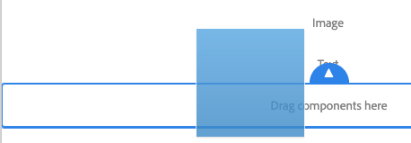
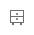

# Editar conteúdo da página com o editor de páginas AEM {#edit-content}

O editor de páginas AEM é uma ferramenta poderosa para criar o conteúdo de uma página. Saiba como usá-lo para arrastar e soltar conteúdo e editar conteúdo no local.

## Visão geral {#overview}

Há três ações básicas que você pode realizar no editor de páginas para editar seu conteúdo:

1. [Adicionando novos componentes](#adding-components) arrastando-os e soltando-os na página.
1. [Adicionando novos ativos](#adding-asset) arrastando-os e soltando-os na página.
1. [Editando componentes no local](#edit-in-place) que já existem na página.

O editor de página do AEM fornece uma interface intuitiva para executar essas tarefas, além de fornecer acesso a recursos mais avançados.

Além disso, o editor permite organizar o conteúdo existente na sua página, permitindo que você

* [Mover componentes](#moving-components)
* [Editar layout de componente](#editing-component-layout)
* [Editar herança de componente](#inherited-components)

## Como adicionar componentes {#adding-components}

Você pode arrastar e soltar novos componentes em sua página selecionando-os no [navegador de componentes no painel lateral](/help/sites-cloud/authoring/page-editor/editor-side-panel.md#components-browser) e soltando-os em um espaço reservado para componente.

### Espaço reservado do componente {#component-placeholder}

O placeholder do componente é um indicador para mostrar onde um componente será posicionado ao soltá-lo. Tem duas aparências.

* Ao adicionar um novo componente à página (arrastar do navegador de componentes), ele aparecerá como uma caixa cinza com detalhes do componente que você está inserindo.

  

* Ao [mover um componente existente](#movging-components), ele aparecerá como um quadrado azul.

  

Em ambos os casos, o destino selecionado aparecerá como um contorno azul abaixo do componente que você está arrastando. O destino se o componente for colocado quando você o liberar.

### Adicionar um componente do navegador de componentes {#adding-a-component-from-the-components-browser}

É possível adicionar um novo componente, usando o [navegador de componentes](/help/sites-cloud/authoring/page-editor/editor-side-panel.md#components-browser). O [espaço reservado do componente](#component-placeholder) mostra onde você está posicionando o componente.

1. Verifique se o editor de página está no modo [**Editar**](/help/sites-cloud/authoring/page-editor/introduction.md#mode-selector).
1. Abra o [navegador de componentes](/help/sites-cloud/authoring/page-editor/editor-side-panel.md#components-browser).
1. Arraste o componente para a [posição necessária](#component-placeholder) e solte-o.
1. [Editar](#edit-content) o componente recém-colocado.

>[!NOTE]
>
>Em um dispositivo móvel, o navegador de componentes preencherá a tela inteira. Depois de começar a arrastar um componente, o navegador será fechado para mostrar a página novamente, para que você possa colocá-lo.

### Adicionar um componente do Sistema de parágrafos {#adding-a-component-from-the-paragraph-system}

Você pode adicionar um novo componente usando o espaço reservado **Arraste componentes aqui** do sistema de parágrafo:

1. Verifique se o editor de página está no modo [**Editar**](/help/sites-cloud/authoring/page-editor/introduction.md#mode-selector).
1. Há duas maneiras de selecionar e adicionar um novo componente a partir do sistema de parágrafos:

   * Selecione a opção **Inserir componente** (+) seja na barra de ferramentas de um componente já existente ou na caixa **Arraste componentes aqui**.

     

   * Se você estiver em um dispositivo de desktop, clique duas vezes na caixa **Arraste componentes aqui**.

1. A caixa de diálogo **Inserir novo componente** é aberta para permitir que você selecione o componente necessário. Toque ou clique no componente que deseja adicionar.

   * Use os filtros de pesquisa para encontrar seu componente.
   * Use o ícone de informações ao lado dos nomes dos componentes para saber mais sobre o componente.

   

1. O componente selecionado é adicionado ao destino selecionado. [Edite-o](#edit-content), conforme necessário.

## Adicionar um ativo {#adding-asset}

Também é possível adicionar um novo componente à página arrastando um ativo do [navegador de ativos](/help/sites-cloud/authoring/page-editor/editor-side-panel.md#assets-browser). Isso cria automaticamente um componente do tipo apropriado (e que contém o ativo).

Esse comportamento pode ser configurado para a instalação. Consulte o documento [Guia de Referência de Componentes](/help/implementing/developing/components/reference.md#component-placeholders) para obter mais detalhes.

Para criar um componente arrastando um dos tipos de ativos acima:

1. Certifique-se de que a página está no modo de [**edição**](/help/sites-cloud/authoring/page-editor/introduction.md#mode-selector).
1. Abra o [navegador de ativos](/help/sites-cloud/authoring/page-editor/editor-side-panel.md#assets-browser).
1. Arraste o ativo desejado para a posição desejada. O [espaço reservado do componente](#component-placeholder) mostra onde o componente está posicionado e um destino será mostrado onde ele será inserido.
1. Solte o ativo no target. Um componente, apropriado para o tipo de ativo, é criado no local necessário que contém o ativo selecionado.
1. [Edite](#edit-content) o componente, se necessário.

>[!NOTE]
>
>Em um dispositivo móvel, o navegador de ativos preencherá a tela inteira. Depois de começar a arrastar um ativo, o navegador será fechado para mostrar a página novamente, para que você possa colocá-lo.

Se, durante a navegação pelos ativos, você perceber que precisa fazer uma alteração rápida em um, é possível iniciar o [editor de ativos](/help/assets/manage-digital-assets.md) diretamente do navegador, clicando no ícone de edição ao lado do nome do ativo.

## Edição de componentes no local {#edit-in-place}

Selecionar um componente abre a barra de ferramentas do componente. Isso fornece acesso a várias ações que podem ser executadas no componente.

As ações disponíveis na barra de ferramentas do componente são apropriadas para o componente selecionado. Você pode ver mais ou menos, dependendo do componente selecionado, e eles podem ou não estar descritos aqui.

* **Editar** permite modificar o conteúdo do componente, geralmente no local. Seu comportamento depende do componente.

  

* **Configurar** permite que você altere alguns parâmetros do componente que não estão diretamente relacionados ao seu conteúdo, normalmente em uma caixa de diálogo. Seu comportamento depende do componente.

  

* **Copiar** copia o componente para a área de transferência para colar em outro lugar. O componente original permanece inalterado.

  

* **Recortar** copia o componente para a área de transferência. O componente original é removido.

  

* **Excluir** exclui o componente da página com sua confirmação.

  

* **Inserir componente** abre a caixa de diálogo para [adicionar um novo componente](#adding-a-component-from-the-paragraph-system).

  

* **Colar** cola o componente da área de transferência na página. Se o original permanece, depende se você usou **Copiar** ou **Recortar**.

   * É possível colar para a mesma página para outra.
   * Se você colar em uma página diferente que já estava aberta antes da operação de recortar/copiar, será necessário atualizar a página para ver o conteúdo colado.
   * O item colado será posicionado acima do item onde você usou a ação de colagem.
   * A ação Colar só será exibida se houver conteúdo na área de transferência.

  

* O **Grupo** permite que você selecione vários componentes de uma só vez. O mesmo pode ser alcançado em um desktop por um **Ctrl+Clique** ou **Command+Clique**.

  

* **Pai** seleciona o componente pai do componente selecionado.

  

* **Layout** permite modificar o [layout](#editing-component-layout) do componente selecionado.

   * Isso se aplica somente ao componente selecionado e não ativa o [Modo de layout](/help/sites-cloud/authoring/page-editor/introduction.md#mode-selector) para a página inteira.

  

* **Converter em uma variação de fragmento de experiência** permite criar um [fragmento de experiência](/help/sites-cloud/authoring/fragments/content-fragments.md) a partir do componente selecionado ou adicioná-lo a um fragmento de experiência existente.

  

### Caixa de diálogo de edição de componente   {#component-edit-dialog}

Alguns componentes oferecem opções de edição adicionais além do que está disponível no local. Você pode abrir a caixa de diálogo de edição de um componente no ícone [Editar (lápis) da barra de ferramentas do componente](#component-toolbar) para acessar opções de configuração adicionais.

As opções de edição exatas dependerão do componente. Para alguns componentes [algumas ações só estarão disponíveis no modo de tela cheia](#edit-content-full-screen-mode). Por exemplo:

* Componente de texto

  

* Componente de imagem

  

### Editar componentes no modo de tela cheia {#edit-content-full-screen-mode}

Muitos componentes oferecem um modo de tela cheia para edição que pode ser acessado com esse botão.

A edição de tela cheia permite exibir mais opções de edição do que o editor local, como para o componente de Imagem.

Use o botão **Minimizar** para existir no modo de tela cheia.

## Movendo componentes {#moving-components}

Para mover um componente:

1. Selecione o componente a ser movido com o toque e segure ou com o clique e segure.
1. Arraste o componente para o novo local.

   * O editor de páginas indica a posição do componente com um [espaço reservado](#component-placeholder) e onde o parágrafo pode ser solto com um destino.

   

1. Solte-o no local desejado.

>[!TIP]
>
>Também é possível usar [Cortar e colar](#component-toolbar) para mover um componente.

## Edição do layout do componente {#editing-component-layout}

Em vez de repetidamente alternar entre os modos de edição e de [layout](/help/sites-cloud/authoring/page-editor/responsive-layout.md) para ajustar um componente, você pode selecionar a ação **Layout** referente a um componente para alterar o layout do componente e poupar tempo, uma vez que não é preciso sair do modo de edição.

1. Quando estiver no modo de **Edição** do console de sites, selecione um componente para exibir a barra de ferramentas do componente.

1. Selecione a ação **Layout** para ajustar o layout do componente.

   

1. Depois que a ação Layout for selecionada, você poderá modificar o layout do componente da mesma maneira que faria em [modo de layout](/help/sites-cloud/authoring/page-editor/responsive-layout.md#defining-layouts-layout-mode).

   * As alças de redimensionamento do componente são exibidas.
   * A barra de ferramentas do emulador é mostrada na parte superior da tela.
   * As ações de Layout em vez das ações de edição padrão são exibidas na barra de ferramentas do componente.

   

1. Depois de fazer as alterações necessárias no layout, toque ou clique no botão **Fechar** no menu de ação de componente para interromper a modificação do layout do componente e a barra de ferramentas do componente retornar ao estado de edição normal.

   

>[!TIP]
>
>O escopo da ação Layout é limitada ao componente selecionado. Por exemplo, se você estiver editando o layout de um componente e, em seguida, clicar em outro componente, a barra de ferramentas de edição padrão (não a barra de ferramentas do layout) será exibida para o componente recém-selecionado, as alças de redimensionamento e a barra de ferramentas do emulador desaparecerão.
>
>Se precisar editar o layout geral da página, afetando vários componentes, alterne para o [modo de layout](/help/sites-cloud/authoring/page-editor/responsive-layout.md).

## Editar herança de componente {#inherited-components}

Herança é o mecanismo no qual o conteúdo pode ser vinculado de modo que a alteração de um altere automaticamente o outro. Componentes herdados podem ser o resultado de vários cenários, incluindo:

* [Gerenciamento de vários sites](/help/sites-cloud/administering/msm/overview.md)
* [Lançamentos](/help/sites-cloud/authoring/launches/overview.md)

Você pode cancelar e reativar a herança. Dependendo do componente, essas opções estarão disponíveis na barra de ferramentas do componente, se ele fizer parte de uma live copy ou inicialização.

* **Cancelar herança**

  

* **Reativar herança** se a herança já estiver cancelada

  

* A **Implantação** também está disponível no blueprint ou na origem da Live Copy

  
