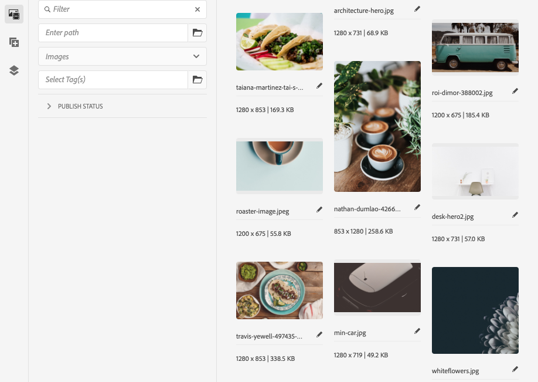

# Painel lateral do Editor de páginas {#side-panel}

Saiba como usar o painel lateral no editor de sites AEM para adicionar componentes e ativos à sua página.

## Modos do painel lateral {#modes}

O painel lateral é sempre acessível no editor de páginas tocando ou clicando no ícone **Alternar painel lateral** na barra de ferramentas do editor de páginas.

Ao abrir o painel lateral, ele deslizará do lado esquerdo e você poderá selecionar entre três guias importantes:

* [O navegador de componentes](#components-browser) para adicionar novo conteúdo à sua página
* [O navegador de ativos](#assets-browser) para adicionar novos ativos à sua página
* [A árvore de conteúdo](#content-tree) para navegar pela estrutura da sua página

## Navegador de componentes   {#components-browser}

[Componentes](/help/implementing/developing/components/overview.md) são os blocos de construção usados para criar conteúdo com o editor de páginas AEM. Você coloca vários componentes em uma página e configura as opções para criar a página de conteúdo.

O navegador de componentes mostra todos os componentes que estão disponíveis para uso em sua página atual. Elas podem ser arrastadas para o local apropriado e, em seguida, editadas para adicionar o conteúdo.

Toque ou clique na guia **Componentes** no painel lateral para acessar o navegador **Componentes**.

A aparência e o manuseio real dependem do tipo de dispositivo usado.

### Dispositivo móvel {#mobile-device-components-browser}

Ao abrir o navegador de componentes em um dispositivo móvel, ele cobre completamente a página que está sendo editada.

Para adicionar um componente à página, selecione e arraste o componente e mova-o para a direita. O navegador de componentes será fechado para mostrar a página novamente, onde você pode posicionar o componente.

>[!NOTE]
>
>Um dispositivo móvel é detectado quando a largura é menor que 1024px.

### Dispositivo de desktop {#desktop-device-components-browser}

Ao abrir o navegador de componentes em um dispositivo desktop, ele é exibido no lado esquerdo da janela.

Para adicionar um componente à página, clique no componente desejado e arraste-o para o local desejado.

### Uso do navegador de componentes {#using-component-browser}

Os componentes no navegador **Componentes** são representados por:

* Nome do componente
* Grupo do componente (em cinza)
* Ícone ou abreviação
   * Os ícones dos componentes padrão são monocromáticos.
   * As abreviações são sempre os dois primeiros caracteres do nome do componente.

Na barra de ferramentas superior, no navegador **Componentes**, é possível:

* Filtrar componentes por nome.
* Limitar a exibição para um grupo específico usando a seleção suspensa.

Para obter uma descrição mais detalhada do componente, você pode selecionar o ícone de informações ao lado do componente no navegador **Componentes** (se disponível). Por exemplo, para o **Fragmento de conteúdo**:

Para obter informações mais detalhadas sobre os componentes disponíveis para você, consulte o [Console de Componentes.](/help/sites-cloud/authoring/components-console.md)

## Navegador de ativos {#assets-browser}

O navegador **Assets** mostra todos os [ativos](/help/assets/overview.md) disponíveis para uso na sua página atual.

Toque ou clique na guia **Assets** no painel lateral para navegar pelos ativos.

A rolagem infinita é usada para expandir a lista de ativos conforme necessário, à medida que você rolar a tela.

A aparência e o manuseio real dependem do tipo de dispositivo usado:

### Dispositivo móvel {#mobile-device-assets-browser}

Ao abrir o navegador de ativos em um dispositivo móvel, ele cobre completamente a página que está sendo editada.

Para adicionar um ativo à página, selecione e arraste o ativo necessário e, em seguida, mova-o para a direita. O navegador de ativos será fechado para mostrar a página novamente, onde é possível adicionar o ativo ao componente necessário.

>[!NOTE]
>
>Um dispositivo móvel é detectado quando a largura é menor que 1024px.

### Dispositivo de desktop {#desktop-device-assets-browser}

Ao abrir o navegador de ativos em um dispositivo desktop, ele é aberto no lado esquerdo da janela.

Para adicionar um ativo à página, selecione o ativo necessário e arraste-o para o componente ou local necessário.

### Uso do navegador Assets {#using-assets-browser}

Para adicionar um ativo à sua página, selecione-o e arraste-o até o local desejado. Pode ser:

* Um componente existente do tipo apropriado.
   * Por exemplo, você pode arrastar um ativo de imagem para um componente de imagem.
* Um [espaço reservado](/help/sites-cloud/authoring/page-editor/edit-content.md#component-placeholder) no sistema de parágrafo para criar um componente do tipo apropriado.
   * Por exemplo, você pode arrastar um ativo de imagem para o sistema de parágrafo para criar um componente de imagem.

>[!NOTE]
>
>Arrastar e soltar ativos está disponível para ativos específicos e tipos de componentes. Consulte [Inserção de um componente usando o Navegador de ativos](/help/sites-cloud/authoring/page-editor/edit-content.md#adding-a-component-from) para obter mais detalhes.

Na barra de ferramentas superior do navegador de ativos, é possível filtrar os ativos por:

* Nome
* Caminho
* Tipo de ativo como imagens, vídeos, documentos, parágrafos, Fragmentos de conteúdo e Fragmentos de experiência
* Características do ativo, como orientação e estilo
   * Disponível somente para certos tipos de ativos

Se você precisar fazer uma alteração rápida em um ativo, pode iniciar o [editor de ativos](/help/assets/manage-digital-assets.md) diretamente do navegador de ativos, clicando no ícone de edição mostrado ao lado do nome do ativo.

## Árvore de conteúdo {#content-tree}

A **Árvore de conteúdo** fornece uma visão geral de todos os componentes da página em uma hierarquia para que você possa ver rapidamente como a página é composta.

>[!NOTE]
>
>A Árvore de conteúdo não ficará disponível se você estiver editando uma página em um dispositivo móvel (se a largura do navegador for menor do que 1024px).

Toque ou clique na guia **Árvore de conteúdo** para acessar a árvore de conteúdo.

Ao abrir, é possível ver uma representação em exibição de árvore da página ou do modelo, para que seja mais fácil entender como o conteúdo está estruturado hierarquicamente. Além disso, em uma página complexa, facilita a alternância entre componentes da página.

Uma página pode ser facilmente composta por vários componentes do mesmo tipo, de modo que a árvore de conteúdo exibe o texto descritivo (em cinza) após o nome do tipo de componente (em preto). O texto descritivo vem das propriedades comuns do componente, como título ou texto.

Os tipos de componentes são mostrados no idioma do usuário, enquanto o texto de descrição do componente vem do idioma da página.

Clicar na divisa ao lado de um componente recolherá ou expandirá esse nível.

Clicar no componente destacará o componente no editor de páginas. As ações disponíveis dependerão do estado da página. Por exemplo:

## Uma página básica {#basic-page}

Os componentes de uma página básica terão as opções normais.

Se o componente que você clicar na árvore for editável, um ícone de chave inglesa aparecerá à direita do nome. Clicar nesse ícone inicia a caixa de diálogo de edição do componente.

### Uma Live Copy {#live-copy}

Uma página que faz parte de uma [livecopy](/help/sites-cloud/administering/msm/overview.md), em que os componentes são herdados de outra página, terá opções diferentes.

## Navegador de conteúdo associado {#associated-content-browser}

Se a página contiver Fragmentos do conteúdo, você também terá acesso ao navegador [para o conteúdo associado.](/help/sites-cloud/authoring/fragments/content-fragments.md#using-associated-content)
