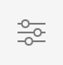

# O editor de páginas AEM {#editing-page-content}

Assim que a página for criada no [**Sites** console,](/help/sites-cloud/authoring/sites-console/introduction.md) é possível editar o conteúdo da página usando o editor de página AEM, uma ferramenta poderosa para a criação de conteúdo.

>[!NOTE]
>
>Ao editar uma página no [**Sites** console,](/help/sites-cloud/authoring/sites-console/introduction.md) o console abrirá o editor apropriado para a página [modelo:](/help/sites-cloud/authoring/sites-console/templates.md) o editor de página descrito neste documento ou a variável [Editor universal.](/help/sites-cloud/authoring/universal-editor/authoring.md)

>[!NOTE]
>
>Sua conta precisa de direitos de acesso apropriados e permissões para editar páginas. Entre em contato com o administrador do sistema se você não tiver permissões.

## Orientação {#orientation}

O editor de páginas do AEM é composto principalmente por três seções:

1. [A barra de ferramentas](#toolbar) - A barra de ferramentas fornece acesso rápido para alterar o modo de página e acessar configurações de página adicionais.
1. [O painel lateral](#side-panel) - O painel lateral fornece acesso aos componentes e ativos da página, bem como a outras ferramentas de criação.
1. [O editor](#editor) - O editor é onde você faz alterações no conteúdo e o visualiza.

O conteúdo é adicionado usando [componentes](/help/sites-cloud/authoring/components-console.md) (apropriado ao tipo de conteúdo) que podem ser arrastados para a página. Estes podem então ser editados no local, movidos ou excluídos. 

### Barra de ferramentas {#page-toolbar}

A barra de ferramentas da página oferece acesso à funcionalidade adequada ao contexto, dependendo da configuração da página.

#### Painel lateral {#side-panel-button}

Isso abre/fecha o [painel lateral,](/help/sites-cloud/authoring/page-editor/editor-side-panel.md) que contém o Navegador de ativos, Navegador de componentes e Árvore de conteúdo.

#### Informações da página {#page-information}

Isso fornece acesso a informações detalhadas da página, incluindo detalhes da página e ações que podem ser executadas na página, incluindo exibição e edição de informações da página, exibição de propriedades da página e publicação/cancelamento de publicação da página.

**Informações da página** abre um menu suspenso que fornece detalhes sobre a última edição e a última publicação da página selecionada. Ações adicionais estão disponíveis dependendo das características da página, de seu site e instância.

* [Abrir propriedades](/help/sites-cloud/authoring/sites-console/page-properties.md)
* [Página de implantação](/help/sites-cloud/administering/msm/overview.md#msm-from-the-ui)
* [Iniciar fluxo de trabalho](/help/sites-cloud/authoring/workflows/applying.md#starting-a-workflow-from-the-page-editor)
* [Bloquear página](/help/sites-cloud/authoring/page-editor/introduction.md#locking-unlocking)
* [Publicar página](/help/sites-cloud/authoring/sites-console/publishing-pages.md#publishing-pages-1)
* [Desfazer a publicação da página](/help/sites-cloud/authoring/sites-console/publishing-pages.md#unpublishing-pages)
* [Editar modelo](/help/sites-cloud/authoring/sites-console/templates.md)
* [Exibir como publicado](/help/sites-cloud/authoring/page-editor/introduction.md#view-as-published)
* [Exibir no admin](/help/sites-cloud/authoring/basic-handling.md#viewing-and-selecting-resources)
* [Ajuda](/help/sites-cloud/authoring/basic-handling.md#accessing-help)
* [Promover lançamento](/help/sites-cloud/authoring/launches/promoting.md) (somente se a página for um lançamento)

Além disso, as **Informações da página** podem fornecer acesso a análises e recomendações, quando apropriado.

#### Emulador {#emulator}

Isso alterna o [barra de ferramentas do emulador](/help/sites-cloud/authoring/page-editor/responsive-layout.md#selecting-a-device-to-emulate), que é usado para emular a aparência da página em outro dispositivo. Isso é ativado automaticamente no modo de layout.

#### ContextHub {#context-hub}

Isso abre o [ContextHub.](/help/sites-cloud/authoring/personalization/contexthub.md) Ele só está disponível em **Visualizar** modo.

#### Título da página {#page-title}

Este é o título da página, renderizado em letras maiúsculas como informação.

#### Seletor de modo {#mode-selector}

O seletor de modo exibe a variável [modo](/help/sites-cloud/authoring/page-editor/introduction.md#mode-selector) e permite selecionar outro modo, como editar, layout, timewarp ou direcionamento.

Há vários modos ao editar uma página o que permite diversas ações:

* [Editar](/help/sites-cloud/authoring/page-editor/edit-content.md) - O modo a ser usado ao editar o conteúdo da página
* [Layout](/help/sites-cloud/authoring/page-editor/responsive-layout.md) - Permite criar e editar o layout responsivo dependente do dispositivo (se a página for baseada em um contêiner de layout)
* [Direcionamento](/help/sites-cloud/authoring/personalization/targeted-content.md) - Melhora a relevância do conteúdo por meio do direcionamento e da medição em todos os canais
* [Timewarp](/help/sites-cloud/authoring/sites-console/page-versions.md#timewarp) - Visualizar um estado de páginas em um momento específico
* [Status da Live Copy](/help/sites-cloud/authoring/page-editor/introduction.md#live-copy-status) - permite uma visão geral rápida do status da live copy e de quais componentes não são herdados
* [Modo de desenvolvedor](/help/implementing/developing/tools/developer-mode.md)
* [Visualizar](/help/sites-cloud/authoring/page-editor/introduction.md#previewing-pages) - Visualizar a página como ela é mostrada no ambiente de publicação; ou navegar usando links no conteúdo
* [Anotar](/help/sites-cloud/authoring/page-editor/annotations.md) - Adicionar ou exibir anotações na página

>[!NOTE]
>
>* Dependendo das características da página, alguns modos podem não estar disponíveis.
>* O acesso a alguns modos exige as permissões/privilégios apropriados.
>* O modo de desenvolvedor não está disponível em dispositivos móveis devido a restrições de espaço.
>* Existe uma [atalho de teclado](/help/sites-cloud/authoring/sites-console/keyboard-shortcuts.md) ( `Ctrl-Shift-M`) para alternar entre **Visualizar** e o modo selecionado no momento (por exemplo, **Editar**, **Layout** e assim por diante).

#### Visualização {#preview}

A variável **Visualizar** botão habilita [modo de visualização.](#preview-mode), exibindo a página como ela será exibida quando publicada.

#### Anotar {#annotate}

**Anotar** permite adicionar [anotações](/help/sites-cloud/authoring/page-editor/annotations.md) à página ao revisar uma página. Após a primeira anotação, o ícone alternará para um número que indica o número de anotações na página.

### Painel lateral {#side-panel}

O painel lateral fornece acesso a três guias diferentes.

* O navegador de componentes para adicionar novo conteúdo à página
* O navegador de ativos para adicionar novos ativos à sua página
* A árvore de conteúdo para navegar pela estrutura da página

Consulte o documento [Painel lateral do Editor de páginas](/help/sites-cloud/authoring/page-editor/editor-side-panel.md) para obter mais informações.

### Editor {#editor}

O editor é onde você faz as alterações diretamente no conteúdo da página. A página é renderizada como você a veria e você pode arrastar e soltar novo conteúdo usando os navegadores de ativos ou componentes no painel lateral, bem como editar conteúdo no local.

## Editar o conteúdo {#editing-content}

Agora que você entende o editor de página, está pronto para editar seu conteúdo.

Consulte o documento [Editar conteúdo com o editor de páginas AEM](/help/sites-cloud/authoring/page-editor/edit-content.md) para obter mais informações.

## Notificação de status {#status-notification}

Se uma página fizer parte de um [fluxo de trabalho](/help/sites-cloud/authoring/workflows/overview.md) Para vários workflows, essas informações são mostradas em uma barra de notificação abaixo da barra de ferramentas ao editar a página.

>[!NOTE]
>
>A barra de status só é visível para contas de usuário com os privilégios apropriados.

A notificação lista o fluxo de trabalho que está sendo executado na página. Se o usuário estiver envolvido na etapa atual do fluxo de trabalho, as opções para [afetar o status do fluxo de trabalho](/help/sites-cloud/authoring/workflows/participating.md) e obter mais informações sobre ele também estarão disponíveis, como:

* **Concluir** - abre a caixa de diálogo **Concluir item de trabalho**
* **Delegar** - abre a caixa de diálogo **Concluir item de trabalho**
* **Exibir detalhes** - abre a janela **Detalhes** do fluxo de trabalho

Concluir e delegar etapas do fluxo de trabalho por meio da barra de notificação funciona da mesma maneira como ao [participar de fluxos de trabalho](/help/sites-cloud/authoring/workflows/participating.md) por meio da caixa de entrada de Notificações.

Se a página estiver sujeita a vários fluxos de trabalho, o número de fluxos de trabalho será exibido na extremidade direita da notificação, junto a botões de seta para permitir que você navegue pelos fluxos de trabalho.

## Status da Live Copy   {#live-copy-status}

A variável **Status da Live Copy** o modo de página fornece uma visão geral rápida do status da live copy e de quais componentes não são herdados:

* Borda verde: herdada
* Borda rosa: a herança foi cancelada

Por exemplo:

## Visualizar páginas   {#previewing-pages}

Existem duas opções para a visualização de uma página:

* [Modo de visualização](#preview-mode) - Uma visualização rápida, no local
* [Exibir como publicado](#view-as-published) - Uma visualização completa que abre a página em uma nova guia

>[!TIP]
>
>* Os links no conteúdo estão visíveis, mas não estão acessíveis no **Editar** modo.
>* Use qualquer uma das opções de visualização, caso deseje navegar usando os links.
>* Use o [atalho de teclado](/help/sites-cloud/authoring/sites-console/keyboard-shortcuts.md) `Ctrl-Shift-M` para alternar entre a visualização e o último modo selecionado.

>[!NOTE]
>
>O cookie do Modo de WCM está definido para ambas as opções de visualização.

### Modo de visualização {#preview-mode}

Ao editar o conteúdo, é possível visualizar a página usando o modo de visualização. Este modo:

* Oculta vários mecanismos de edição para fornecer uma visualização rápida de como a página aparecerá na publicação.
* Permite usar links para navegar.
* **Não** atualiza o conteúdo da página.

Ao criar, o modo de visualização está disponível usando o ícone na parte superior direita do editor de página:

### Exibir como publicado {#view-as-published}

A opção **Exibir como publicado** está disponível no menu [Informações da página](#page-information). Isso abre a página em uma nova guia, atualiza o conteúdo e mostra a página exatamente como ela aparecerá no ambiente de publicação.

## Bloquear e desbloquear uma página {#locking-unlocking}

O AEM permite bloquear uma página para que mais ninguém edite o conteúdo. O bloqueio é útil ao fazer várias edições em uma página específica ou quando é necessário congelar uma página por pouco tempo.

1. Selecione o ícone de **Informações da página** para abrir o menu.
1. Selecione a opção **Bloquear página**.

Uma vez bloqueado, um símbolo de cadeado é exibido na barra de ferramentas do editor de páginas.

Desbloquear uma página é muito semelhante a [bloquear a página](#locking-a-page). Quando a página estiver bloqueada, as opções de bloqueio serão substituídas por ações de desbloqueio.

>[!CAUTION]
>
>* O bloqueio de uma página pode ser executado quando se representa um usuário. No entanto, uma página bloqueada dessa maneira só pode ser desbloqueada (por clientes) usando o usuário que foi representado.
>* Páginas não podem ser desbloqueadas representando o usuário que as bloqueou.
>* Se o usuário que bloqueou a página não estiver disponível para desbloqueá-la, entre em contato com o Suporte ao cliente para avaliar as opções para remover o bloqueio.

## Desfazer e refazer edições de página {#undoing-and-redoing-page-edits}

Os ícones a seguir permitem desfazer ou refazer uma ação. Os seguintes itens são mostrados na barra de ferramentas, quando apropriado: 

>[!TIP]
>
>* O [atalho de teclado](/help/sites-cloud/authoring/sites-console/keyboard-shortcuts.md) `Ctrl-Z` também pode ser usado para desfazer ações de edições em páginas.
>* O atalho de teclado `Ctrl-Y` também pode ser usado para refazer ações de edições em páginas.

>[!NOTE]
>
>Consulte o documento [Limitações de Desfazer e Refazer](/help/sites-cloud/authoring/page-editor/undo-redo.md) para obter todos os detalhes sobre o que é possível fazer ao desfazer e refazer edições de página.
