# Configuração da segmentação com o ContextHub{#configuring-segmentation-with-contexthub}

A segmentação é uma consideração importante ao criar uma campanha. Consulte [Noções sobre segmentação](segmentation.md) para obter informações sobre como a segmentação funciona e os termos principais.

Dependendo das informações que você já coletou sobre os visitantes do seu site e das metas que deseja alcançar, será necessário definir os segmentos e as estratégias necessárias para o seu conteúdo direcionado.

Esses segmentos são usados para fornecer a um visitante conteúdo direcionado especificamente. [Atividades](activities.md) definido aqui pode ser incluído em qualquer página e definir para qual segmento de visitante o conteúdo especializado se aplica.

AEM permite personalizar facilmente as experiências dos usuários. Também permite verificar os resultados das definições de segmento.

## Acesso a segmentos {#accessing-segments}

O [Públicos-alvo](audiences.md) O console é usado para gerenciar segmentos do ContextHub, bem como públicos-alvo da sua conta do Adobe Target. Esta documentação abrange o gerenciamento de segmentos para o ContextHub.

Para acessar seus segmentos, na navegação global, selecione **Navegação > Personalização > Públicos-alvo**.


## Editor do segmento  {#segment-editor}

<!--The **Segment Editor** allows you to easily modify a segment. To edit a segment, select a segment in the [list of segments](/help/sites-administering/segmentation.md#accessing-segments) and click the **Edit** button.-->
O **Editor de segmentos** permite modificar facilmente um segmento. Para editar um segmento, selecione um segmento na lista de segmentos e clique no botão **Editar** botão.

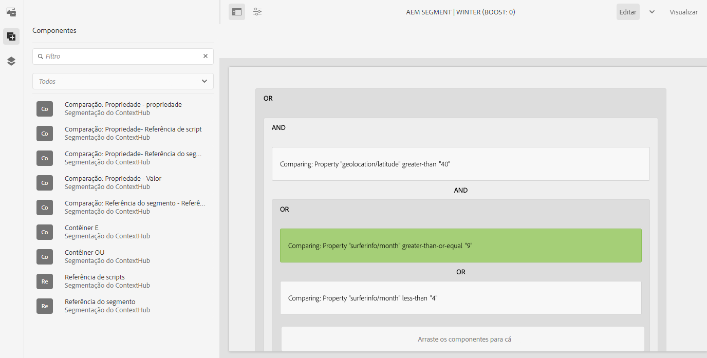

Usando o navegador de componentes, você pode adicionar **E** e **OU** contêineres para definir a lógica do segmento, em seguida, adicionar componentes adicionais para comparar propriedades e valores ou scripts de referência e outros segmentos para definir os critérios de seleção (consulte [Criar um novo segmento](#creating-a-new-segment)) para definir o cenário exato para selecionar o segmento.

Quando a declaração inteira for avaliada como true, o segmento será resolvido. Caso vários segmentos sejam aplicáveis, a variável **Aumento** também é usado. Consulte [Criar um novo segmento](#creating-a-new-segment) para obter detalhes sobre o fator de reforço.

>[!CAUTION]
>
>O editor de segmentos não verifica se há referências circulares. Por exemplo, o segmento A faz referência a outro segmento B, que por sua vez faz referência ao segmento A. Você deve garantir que seus segmentos não contenham referências circulares.

### Contêineres {#containers}

Os seguintes contêineres estão disponíveis prontamente e permitem agrupar comparações e referências para avaliação booleana. Eles podem ser arrastados do navegador de componentes para o editor. Consulte a seguinte seção [Uso de contêineres AND e OR](#using-and-and-or-containers) para obter mais informações.

|  |  |
|---|---|
| Contêiner E | O operador AND booleano |
| Contêiner OU | O operador OR booleano |

### Comparações {#comparisons}

As comparações de segmentos a seguir estão disponíveis prontas para uso para avaliar as propriedades do segmento. Eles podem ser arrastados do navegador de componentes para o editor.

|  |  |
|---|---|
| Valor da propriedade | Compara uma propriedade de uma loja com um valor definido |
| Propriedade | Compara uma propriedade de um armazenamento a outra propriedade |
| Referência do segmento de propriedade | Compara uma propriedade de uma loja com outro segmento referenciado |
| Referência de script de propriedade | Compara uma propriedade de uma loja com os resultados de um script |
| Referência do script de segmento | Compara um segmento referenciado aos resultados de um script |

>[!NOTE]
>
>Ao comparar valores, se o tipo de dados da comparação não estiver definido (ou seja, definido para detecção automática), o mecanismo de segmentação do ContextHub simplesmente comparará os valores como o javascript faria. Não converte valores em seus tipos esperados, o que pode levar a resultados enganosos. Por exemplo:
>
>`null < 30 // will return true`
>
>Portanto, quando [criação de um segmento](#creating-a-new-segment), você deve selecionar uma **tipo de dados** sempre que os tipos de valores comparados forem conhecidos. Por exemplo:
>
>Ao comparar a propriedade `profile/age`, você já sabe que o tipo comparado será **número**, mesmo que `profile/age` não estiver definido, uma comparação `profile/age` menos de 30 retornará **false**, como seria de esperar.

### Referências {#references}

As seguintes referências estão disponíveis prontas para uso para vincular diretamente a um script ou outro segmento. Eles podem ser arrastados do navegador de componentes para o editor.

|  |  |
|---|---|
| Referência do segmento | Avaliar o segmento referenciado |
| Referência de scripts | Avalie o script referenciado. Consulte a seguinte seção [Uso de referências de script](#using-script-references) para obter mais informações. |

## Criar um novo segmento {#creating-a-new-segment}

Para definir seu novo segmento:

1. Depois [acesso aos segmentos](#accessing-segments), [navegue até a pasta](#organizing-segments) onde deseja criar o segmento ou deixá-lo na raiz.

1. Toque ou clique no botão **Criar** e selecione **Criar segmento do ContextHub**.

   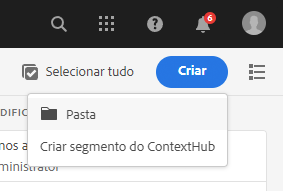

1. No **Novo segmento do ContextHub**, insira um título para o segmento, bem como um valor de reforço, se necessário, e toque ou clique em **Criar**.

   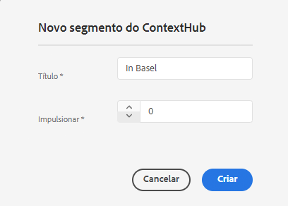

   Cada segmento tem um parâmetro de reforço usado como fator de ponderação. Um número mais alto indica que o segmento será selecionado em detrimento de um segmento com um número menor em instâncias em que vários segmentos são válidos.

   * Valor mínimo: `0`
   * Valor máximo: `1000000`

1. No console segmentos, edite o segmento criado recentemente para abri-lo no editor de segmentos.
1. Arraste uma comparação ou referência para o editor de segmentos que ela aparecerá no contêiner AND padrão.
1. Clique duas vezes em ou toque na opção de configuração da nova referência ou segmento para editar os parâmetros específicos. Neste exemplo, estamos a testar pessoas em Basileia.

   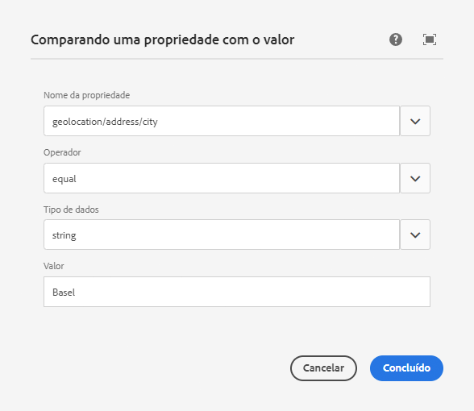

   Sempre defina uma **Tipo de dados** se possível para garantir que suas comparações sejam avaliadas corretamente. Consulte [Comparações](#comparisons) para obter mais informações.

1. Clique em **Concluído** para salvar sua definição:
1. Adicione mais componentes conforme necessário. É possível formular expressões booleanas usando os componentes do contêiner para comparações AND e OR (consulte [Uso de contêineres AND e Or](#using-and-and-or-containers) abaixo). Com o editor de segmentos, é possível excluir componentes que não são mais necessários ou arrastá-los para novas posições na instrução.

### Uso de contêineres AND e OR {#using-and-and-or-containers}

Usando os componentes de contêiner AND e OR, é possível construir segmentos complexos em AEM. Ao fazer isso, é útil estar ciente de alguns pontos básicos:

* O nível superior da definição é sempre o contêiner AND criado inicialmente. Isso não pode ser alterado, mas não afeta o restante da definição de segmento.
* Certifique-se de que o aninhamento do seu contêiner faça sentido. Os contêineres podem ser exibidos como colchetes da expressão booleana.

O exemplo a seguir é usado para selecionar visitantes considerados em nosso grupo alvo suíço:

```text
 People in Basel

 OR

 People in Zürich
```

Você começa colocando um componente de contêiner OR no contêiner AND padrão. No contêiner OR , é possível adicionar a propriedade ou os componentes de referência.

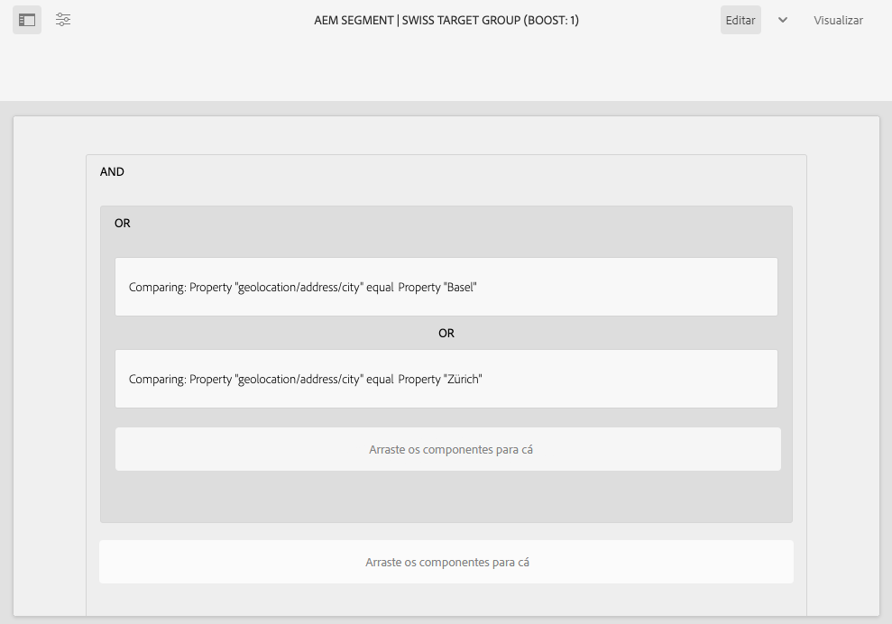

É possível aninhar vários operadores AND e OR, conforme necessário.

### Uso de referências de script {#using-script-references}

Ao usar o componente Referência de script , a avaliação de uma propriedade de segmento pode ser delegada a um script externo. Depois que o script é configurado corretamente, ele pode ser usado como qualquer outro componente de uma condição de segmento.

#### Definição de um script para referência {#defining-a-script-to-reference}

1. Adicionar arquivo a `contexthub.segment-engine.scripts` clientlib.
1. Implemente uma função que retorne um valor. Por exemplo:

   ```javascript
   ContextHub.console.log(ContextHub.Shared.timestamp(), '[loading] contexthub.segment-engine.scripts - script.profile-info.js');
   
   (function() {
       'use strict';
   
       /**
        * Sample script returning profile information. Returns user info if data is available, false otherwise.
        *
        * @returns {Boolean}
        */
       var getProfileInfo = function() {
           /* let the SegmentEngine know when script should be re-run */
           this.dependOn(ContextHub.SegmentEngine.Property('profile/age'));
           this.dependOn(ContextHub.SegmentEngine.Property('profile/givenName'));
   
           /* variables */
           var name = ContextHub.get('profile/givenName');
           var age = ContextHub.get('profile/age');
   
           return name === 'Joe' && age === 123;
       };
   
       /* register function */
       ContextHub.SegmentEngine.ScriptManager.register('getProfileInfo', getProfileInfo);
   
   })();
   ```

1. Registre o script com `ContextHub.SegmentEngine.ScriptManager.register`.

Se o script depender de propriedades adicionais, será necessário chamar `this.dependOn()`. Por exemplo, se o script depender de `profile/age`:

```javascript
this.dependOn(ContextHub.SegmentEngine.Property('profile/age'));
```

#### Referência a um script {#referencing-a-script}

1. Criar segmento do ContextHub.
1. Adicionar **Referência de script** no local desejado do segmento.
1. Abra a caixa de diálogo de edição da **Referência de script** componente. If [configurado adequadamente](#defining-a-script-to-reference), o script deve estar disponível na variável **Nome do script** lista suspensa.

## Organizar segmentos {#organizing-segments}

Se você tiver muitos segmentos, eles podem se tornar difíceis de gerenciar como uma lista simples. Nesses casos, pode ser útil criar pastas para gerenciar seus segmentos.

### Criar uma nova pasta {#create-folder}

1. Depois [acesso aos segmentos](#accessing-segments), clique ou toque no **Criar** e selecione **Pasta**.

   

1. Forneça um **Título** e um **Nome** para sua pasta.
   * O **Título** deve ser descritivo.
   * O **Nome** se tornará o nome do nó no repositório.
      * Ele será gerado automaticamente com base no título e ajustado de acordo com as [convenções de nomenclatura do AEM.](/help/implementing/developing/introduction/naming-conventions.md)
      * Ele pode ser ajustado, se necessário.

   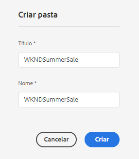

1. Toque ou clique em **Criar**.

   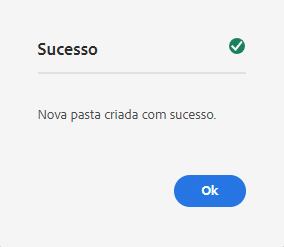

1. A pasta aparecerá na lista de segmentos.
   * A forma como você classifica as colunas afetará onde a nova pasta aparece na lista.
   * Toque ou clique nos cabeçalhos da coluna para ajustar sua classificação.
      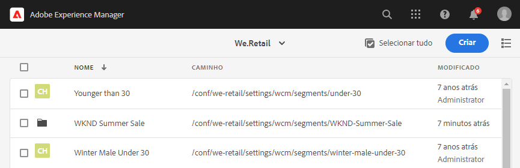

### Modificar pastas existentes {#modify-folders}

1. Depois [acesso aos segmentos](#accessing-segments), clique ou toque na pasta que deseja modificar para selecioná-la.

   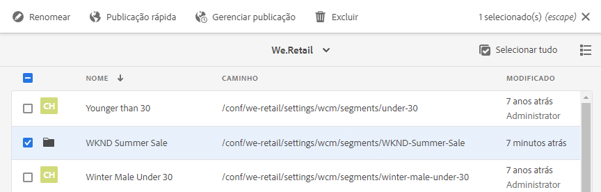

1. Toque ou clique **Renomear** na barra de ferramentas para renomear a pasta.

1. Fornecer um novo **Título da pasta** e toque ou clique **Salvar**.

   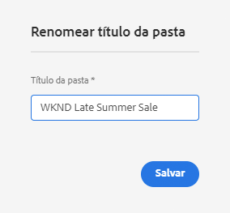

>[!NOTE]
>
>Ao renomear pastas, somente o título pode ser alterado. O nome não pode ser alterado.

### Excluir uma pasta

1. Depois [acesso aos segmentos](#accessing-segments), clique ou toque na pasta que deseja modificar para selecioná-la.

   

1. Toque ou clique **Excluir** na barra de ferramentas para excluir a pasta .

1. Uma caixa de diálogo apresenta uma lista de pastas selecionadas para exclusão.

   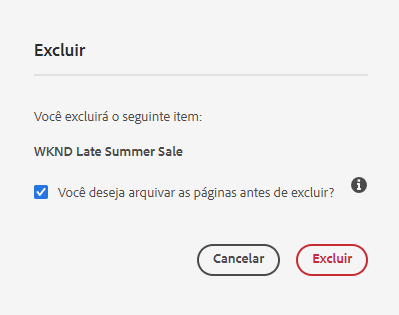

   * Toque ou clique **Excluir** para confirmar.
   * Toque ou clique **Cancelar** para suspender.

1. Se qualquer uma das pastas selecionadas contiver subpastas ou segmentos, sua exclusão deverá ser confirmada.

   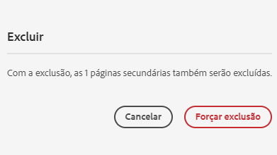

   * Toque ou clique **Forçar exclusão** para confirmar.
   * Toque ou clique **Cancelar** para suspender.

>[!NOTE]
>
> Não é possível mover um segmento de uma pasta para outra.

## Testando a aplicação de um segmento {#testing-the-application-of-a-segment}

Depois que o segmento é definido, os resultados potenciais podem ser testados com o auxílio da **[ContextHub](contexthub.md).**

1. Visualizar uma página
1. Clique no ícone do ContextHub para exibir a barra de ferramentas do ContextHub
1. Selecione uma persona que corresponda ao segmento criado
1. O ContextHub resolverá os segmentos aplicáveis para a persona selecionada

Por exemplo, nossa definição de segmento simples para identificar usuários em Basel é baseada no local do usuário. O carregamento de uma persona específica que corresponde a esses critérios mostra se o segmento foi resolvido com êxito:

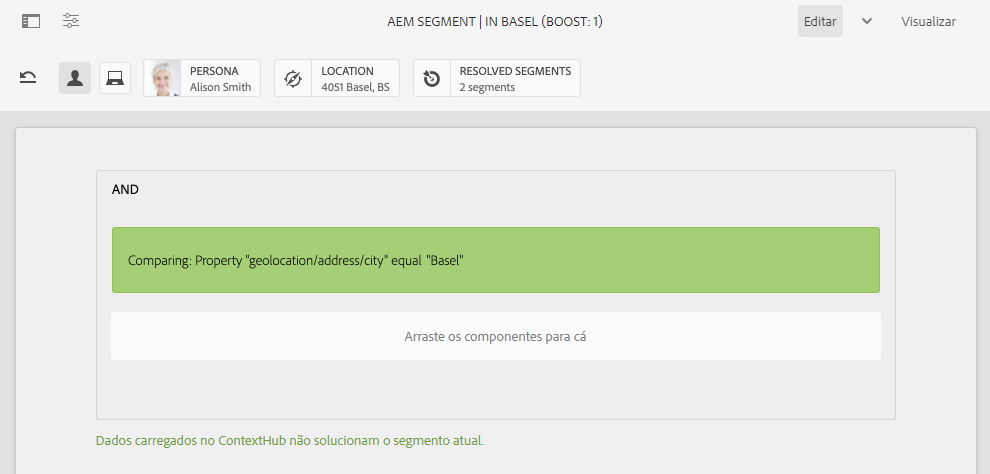

Ou se não for resolvido:


>[!NOTE]
>
>Todas as características são resolvidas imediatamente, embora a maioria das alterações seja alterada somente no recarregamento da página.

Esses testes também podem ser executados em páginas de conteúdo e em combinação com conteúdo direcionado e relacionado **Atividades** e **Experiências**.

Se você configurou uma atividade e uma experiência, é possível testar facilmente seu segmento com a atividade. Para obter detalhes sobre como configurar uma atividade, consulte os [documentação sobre a criação de conteúdo direcionado](targeted-content.md).

1. No modo de edição de uma página em que você configurou o conteúdo direcionado, é possível ver que o conteúdo é direcionado por meio do ícone de seta no conteúdo.
1. Alterne para o modo de visualização e usando o hub de contexto, alterne para uma persona que não corresponda à segmentação configurada para a experiência.
1. Alterne para uma persona que corresponda à segmentação configurada para a experiência e veja que a experiência muda de acordo.

## Usar seu segmento {#using-your-segment}

Os segmentos são usados para controlar o conteúdo real visualizado por públicos-alvo específicos. Consulte [Gerenciamento de públicos-alvo](audiences.md) para obter mais informações sobre públicos-alvo e segmentos e [Criação de conteúdo direcionado](targeted-content.md) sobre o uso de públicos-alvo e segmentos para direcionar conteúdo.
