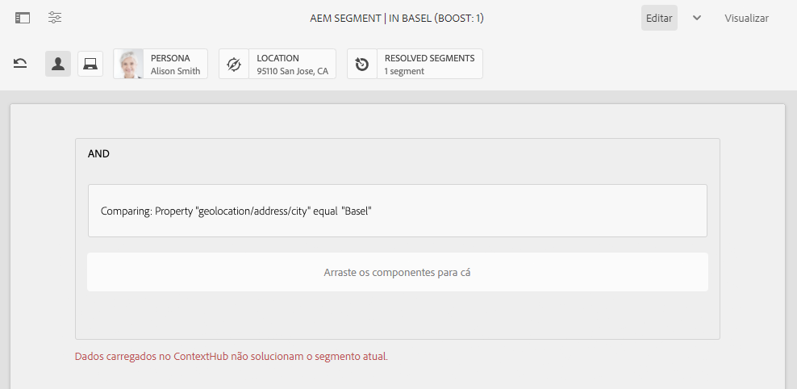

# Configuração da segmentação com o ContextHub{#configuring-segmentation-with-contexthub}

A segmentação é uma consideração importante ao criar uma campanha. Consulte [Compreensão da segmentação](segmentation.md) para obter informações sobre como a segmentação funciona e os termos principais.

Dependendo das informações que você já coletou sobre os visitantes do site e as metas que deseja atingir, será necessário definir os segmentos e as estratégias necessárias para o conteúdo direcionado.

Esses segmentos são então usados para fornecer um visitante com conteúdo direcionado especificamente. [As atividades](activities.md) definidas aqui podem ser incluídas em qualquer página e definir para qual segmento de visitante o conteúdo especializado se aplica.

AEM permite que você personalize facilmente as experiências de seus usuários. Também permite verificar os resultados das definições de segmento.

## Acessar segmentos {#accessing-segments}

O console do [Audiência](audiences.md) é usado para gerenciar segmentos para o ContextHub, bem como o audiência para sua conta do Adobe Target. Esta documentação cobre o gerenciamento de segmentos para o ContextHub.

Para acessar seus segmentos, na navegação global, selecione **Navegação > Personalização > Audiências**.


## Editor do segmento {#segment-editor}

<!--The **Segment Editor** allows you to easily modify a segment. To edit a segment, select a segment in the [list of segments](/help/sites-administering/segmentation.md#accessing-segments) and click the **Edit** button.-->
O Editor **de** segmentos permite que você modifique facilmente um segmento. Para editar um segmento, selecione-o na lista de segmentos e clique no botão **Editar** .


Usando o navegador de componentes, você pode adicionar container **AND** e **OR** para definir a lógica do segmento, em seguida, adicionar componentes adicionais para comparar propriedades e valores ou scripts de referência e outros segmentos para definir os critérios de seleção (consulte [Criação de um novo segmento](#creating-a-new-segment)) para definir o cenário exato para a seleção do segmento.

Quando a declaração inteira for avaliada como true, o segmento será resolvido. No evento de vários segmentos serem aplicáveis, o fator de **aumento** também é usado. Consulte [Criação de um novo segmento](#creating-a-new-segment) para obter detalhes sobre o fator de aumento.

>[!CAUTION]
>
>O editor de segmentos não verifica se há referências circulares. Por exemplo, o segmento A faz referência a outro segmento B, que por sua vez faz referência ao segmento A. É necessário garantir que seus segmentos não contenham referências circulares.

### Containers {#containers}

Os container a seguir estão disponíveis prontamente e permitem agrupar comparações e referências para avaliação booleana. Eles podem ser arrastados do navegador de componentes para o editor. Consulte a seção [Usando Container](#using-and-and-or-containers) AND e OR para obter mais informações.

|  |  |
|---|---|
| Contêiner E | O operador AND booleano |
| Contêiner OU | O operador OR booleano |

### Comparações {#comparisons}

As seguintes comparações de segmentos estão disponíveis prontamente para avaliar as propriedades do segmento. Eles podem ser arrastados do navegador de componentes para o editor.

|  |  |
|---|---|
| Valor da propriedade | Compara uma propriedade de uma loja com um valor definido |
| Propriedade-Propriedade | Compara uma propriedade de uma loja com outra propriedade |
| Referência do segmento de propriedade | Compara uma propriedade de uma loja com outro segmento referenciado |
| Referência do script de propriedade | Compara uma propriedade de uma loja com os resultados de um script |
| Referência do segmento - Referência do script | Compara um segmento referenciado com os resultados de um script |

>[!NOTE]
>
>Ao comparar valores, se o tipo de dados da comparação não estiver definido (isto é, definido para detecção automática), o mecanismo de segmentação do ContextHub simplesmente comparará os valores como javascript faria. Não converte valores em seus tipos esperados, o que pode levar a resultados enganosos. Por exemplo:
>
>`null < 30 // will return true`
>
>Portanto, ao [criar um segmento](#creating-a-new-segment), você deve selecionar um tipo **de** dados sempre que os tipos de valores comparados forem conhecidos. Por exemplo:
>
>Ao comparar a propriedade `profile/age`, você já sabe que o tipo comparado será **número**, portanto, mesmo que não `profile/age` esteja definido, uma comparação `profile/age` menor que 30 retornará **falso**, como você esperaria.

### Referências {#references}

As referências a seguir estão disponíveis prontamente para vinculação direta a um script ou outro segmento. Eles podem ser arrastados do navegador de componentes para o editor.

|  |  |
|---|---|
| Referência do segmento | Avaliar o segmento referenciado |
| Referência de scripts | Avalie o script referenciado. Consulte a seção a seguir [Usando referências](#using-script-references) de script para obter mais informações. |

## Creating a New Segment {#creating-a-new-segment}

Para definir seu novo segmento:

1. Depois de [acessar os segmentos](#accessing-segments), [navegue até a pasta](#organizing-segments) onde deseja criar o segmento ou deixe-o na raiz.

1. Toque ou clique no botão **Criar** e selecione **Criar segmento** do ContextHub.

   

1. No **Novo segmento** ContextHub, digite um título para o segmento, bem como um valor de aumento, se necessário, e toque ou clique em **Criar**.

   

   Cada segmento tem um parâmetro de aumento que é usado como fator de ponderação. Um número mais alto indica que o segmento será selecionado de preferência a um segmento com um número menor em instâncias onde vários segmentos são válidos.

   * Minimum value: `0`
   * Maximum value: `1000000`

1. No console de segmentos, edite seu segmento recém-criado para abri-lo no editor de segmentos.
1. Arraste uma comparação ou referência para o editor de segmentos que aparecerá no container AND padrão.
1. Clique com o duplo ou toque na opção de configuração da nova referência ou segmento para editar os parâmetros específicos. Neste exemplo, estamos a testar pessoas em Basileia.

   

   Sempre defina um Tipo **de** dados, se possível, para garantir que suas comparações sejam avaliadas corretamente. Consulte [Comparações](#comparisons) para obter mais informações.

1. Click **Done** to save your definition:
1. Adicione mais componentes conforme necessário. Você pode formular expressões booleanas usando os componentes do container para comparações E e OU (consulte [Usando Container](#using-and-and-or-containers) E e Ou abaixo). Com o editor de segmentos, é possível excluir componentes que não são mais necessários ou arrastá-los para novas posições na declaração.

### Uso de Container E e OU {#using-and-and-or-containers}

Usando os componentes E e OU do container, é possível construir segmentos complexos em AEM. Ao fazer isso, ajuda a ter em mente alguns pontos básicos:

* O nível superior da definição é sempre o container AND criado inicialmente. Isso não pode ser alterado, mas não afeta o restante da definição do segmento.
* Certifique-se de que o aninhamento do seu container faça sentido. Os container podem ser exibidos como colchetes de sua expressão booleana.

O exemplo a seguir é usado para selecionar visitantes considerados em nosso grupo alvo suíço:

```text
 People in Basel

 OR

 People in Zürich
```

Você start colocando um componente OU container dentro do container AND padrão. No container OR, é possível adicionar a propriedade ou os componentes de referência.


É possível aninhar vários operadores E e OU, conforme necessário.

### Uso de referências de script {#using-script-references}

Usando o componente de Referência de script, a avaliação de uma propriedade de segmento pode ser delegada a um script externo. Depois que o script é configurado corretamente, ele pode ser usado como qualquer outro componente de uma condição de segmento.

#### Definição de um script para referência {#defining-a-script-to-reference}

1. Adicione o arquivo ao `contexthub.segment-engine.scripts` clientlib.
1. Implemente uma função que retorne um valor. Por exemplo:

   ```javascript
   ContextHub.console.log(ContextHub.Shared.timestamp(), '[loading] contexthub.segment-engine.scripts - script.profile-info.js');
   
   (function() {
       'use strict';
   
       /**
        * Sample script returning profile information. Returns user info if data is available, false otherwise.
        *
        * @returns {Boolean}
        */
       var getProfileInfo = function() {
           /* let the SegmentEngine know when script should be re-run */
           this.dependOn(ContextHub.SegmentEngine.Property('profile/age'));
           this.dependOn(ContextHub.SegmentEngine.Property('profile/givenName'));
   
           /* variables */
           var name = ContextHub.get('profile/givenName');
           var age = ContextHub.get('profile/age');
   
           return name === 'Joe' && age === 123;
       };
   
       /* register function */
       ContextHub.SegmentEngine.ScriptManager.register('getProfileInfo', getProfileInfo);
   
   })();
   ```

1. Registre o script com `ContextHub.SegmentEngine.ScriptManager.register`.

Se o script depender de propriedades adicionais, ele deverá chamar `this.dependOn()`. Por exemplo, se o script depender de `profile/age`:

```javascript
this.dependOn(ContextHub.SegmentEngine.Property('profile/age'));
```

#### Referência a um script {#referencing-a-script}

1. Criar segmento ContextHub.
1. Adicione o componente de referência **de** script no local desejado do segmento.
1. Abra a caixa de diálogo de edição do componente de Referência **de** script. Se [corretamente configurado](#defining-a-script-to-reference), o script deverá estar disponível no menu suspenso de nome **do** Script.

## Organização de segmentos {#organizing-segments}

Se você tiver muitos segmentos, eles podem se tornar difíceis de gerenciar como uma lista simples. Nesses casos, pode ser útil criar pastas para gerenciar seus segmentos.

### Create a New Folder {#create-folder}

1. Depois de [acessar os segmentos](#accessing-segments), clique ou toque no botão **Criar** e selecione **Pasta**.

   

1. Forneça um **Título** e um **Nome** para sua pasta.
   * O **Título** deve ser descritivo.
   * O **Nome** se tornará o nome do nó no repositório.
      * Será gerado automaticamente com base no título e ajustado de acordo com as convenções de nomenclatura [AEM.](/help/implementing/developing/introduction/naming-conventions.md)
      * Pode ser ajustado, se necessário.

   

1. Toque ou clique em **Criar**.

   

1. A pasta será exibida na lista de segmentos.
   * A forma como você classifica as colunas afetará o local em que a nova pasta será exibida na lista.
   * Você pode tocar ou clicar nos cabeçalhos das colunas para ajustar sua classificação.
      

### Modificar Pastas Existentes {#modify-folders}

1. Depois de [acessar os segmentos](#accessing-segments), clique ou toque na pasta que deseja modificar para selecioná-la.

   

1. Toque ou clique em **Renomear** na barra de ferramentas para renomear a pasta.

1. Forneça um novo Título **da** pasta e toque ou clique em **Salvar**.

   

>[!NOTE]
>
>Ao renomear pastas, somente o título pode ser alterado. O nome não pode ser alterado.

### Excluir uma pasta

1. Depois de [acessar os segmentos](#accessing-segments), clique ou toque na pasta que deseja modificar para selecioná-la.

   

1. Toque ou clique em **Excluir** na barra de ferramentas para excluir a pasta.

1. Uma caixa de diálogo apresenta uma lista de pastas selecionadas para exclusão.

   

   * Toque ou clique em **Excluir** para confirmar.
   * Toque ou clique em **Cancelar** para abortar.

1. Se alguma das pastas selecionadas contiver subpastas ou segmentos, sua exclusão deverá ser confirmada.

   

   * Toque ou clique em **Forçar exclusão** para confirmar.
   * Toque ou clique em **Cancelar** para abortar.

>[!NOTE]
>
> Não é possível mover um segmento de uma pasta para outra.

## Teste da aplicação de um segmento {#testing-the-application-of-a-segment}

Depois que o segmento é definido, os resultados potenciais podem ser testados com a ajuda do **[ContextHub](contexthub.md).**

1. Pré-visualização de uma página
1. Clique no ícone ContextHub para revelar a barra de ferramentas do ContextHub
1. Selecione uma pessoa que corresponda ao segmento criado
1. O ContextHub resolverá os segmentos aplicáveis para a persona selecionada

Por exemplo, nossa definição de segmento simples para identificar usuários em Basel é baseada na localização do usuário. O carregamento de uma pessoa específica que corresponde a esses critérios mostra se o segmento foi resolvido com êxito:


Ou se não for resolvido:



>[!NOTE]
>
>Todas as características são resolvidas imediatamente, embora a maioria só seja alterada no recarregamento da página.

Esses testes também podem ser executados em páginas de conteúdo e em combinação com conteúdo direcionado e **Atividades** e **experiências** relacionadas.

Se você configurou uma atividade e uma experiência, é possível testar facilmente seu segmento com a atividade. Para obter detalhes sobre como configurar uma atividade, consulte a [documentação relacionada sobre como criar conteúdo](targeted-content.md)direcionado.

1. No modo de edição de uma página onde você configurou o conteúdo direcionado, é possível ver que o conteúdo é direcionado por meio do ícone de seta no conteúdo.
1. Alterne para o modo de pré-visualização e, usando o hub de contexto, alterne para uma pessoa que não corresponde à segmentação configurada para a experiência.
1. Alterne para uma pessoa que não corresponda à segmentação configurada para a experiência e veja se a experiência muda de acordo.

## Usando seu segmento {#using-your-segment}

Os segmentos são usados para controlar o conteúdo real visualizado por audiências de públicos alvos específicas. Consulte [Gerenciamento de Audiências](audiences.md) para obter mais informações sobre audiências e segmentos e [Criação de conteúdo](targeted-content.md) direcionado sobre como usar audiências e segmentos para conteúdo de públicos alvos.
