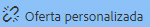
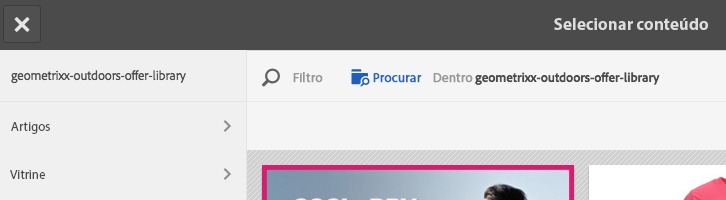
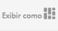
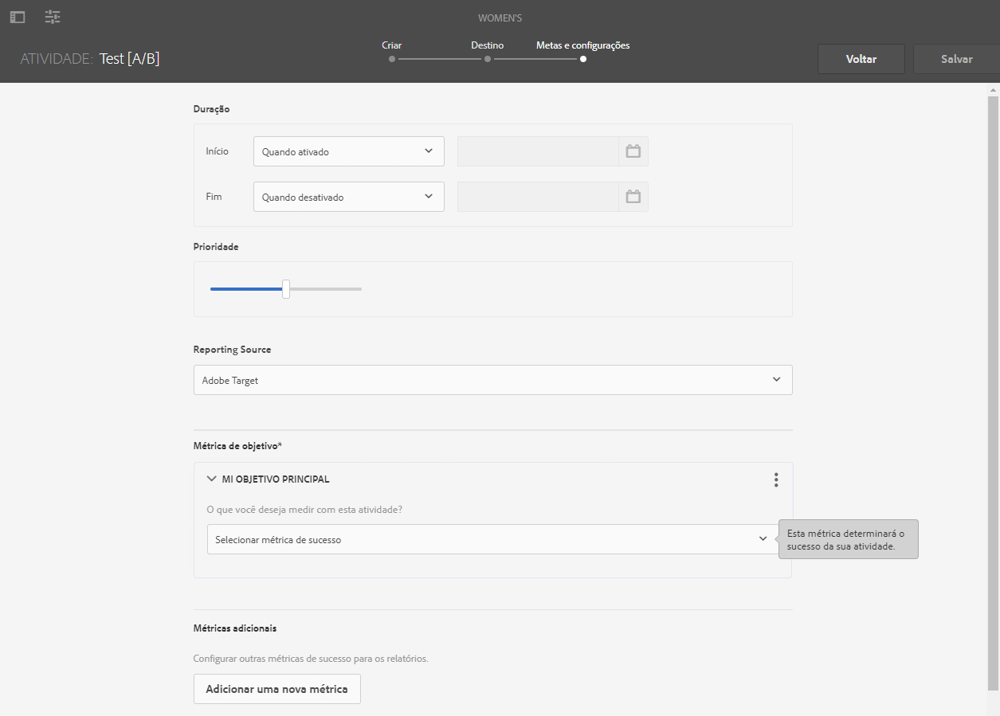
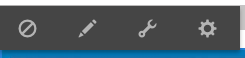
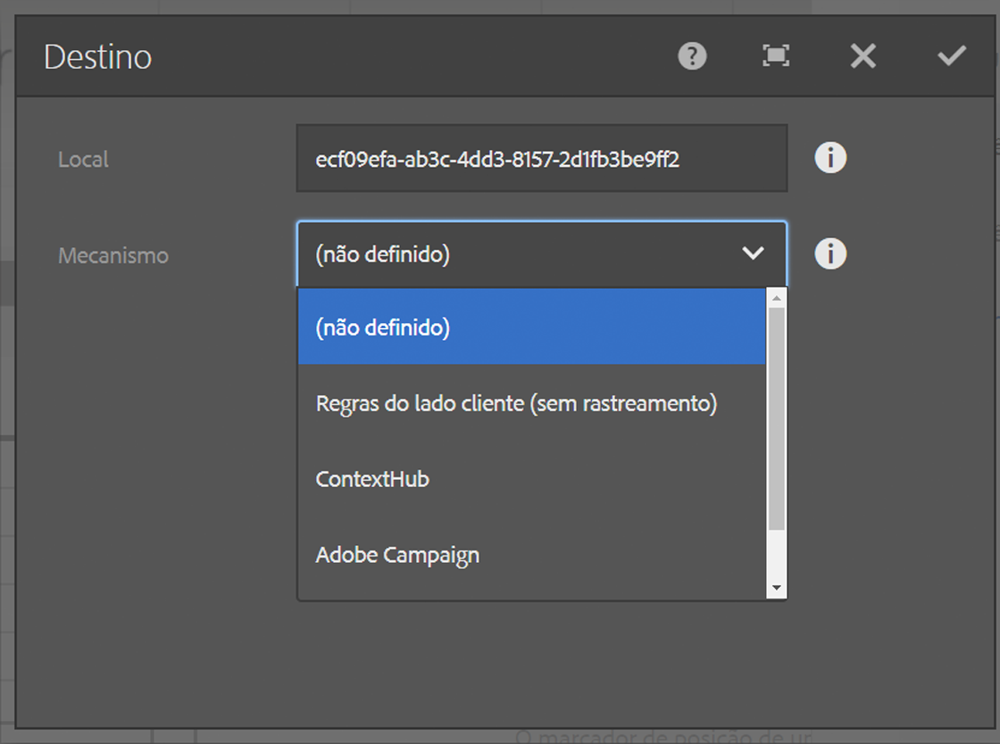

# Criação de conteúdo direcionado usando o modo Direcionar {#authoring-targeted-content-using-targeting-mode}

Crie conteúdo direcionado usando o modo de Direcionamento do AEM. O modo Direcionar e o componente de Direcionamento fornecem ferramentas para criar conteúdo para experiências:

* Reconheça facilmente o conteúdo direcionado que está na página. Uma linha pontilhada forma uma borda ao redor de todo o conteúdo direcionado.
* Selecione uma marca e uma atividade para ver as experiências.
* Adicione experiências a uma atividade ou remova experiências.
* Realizar testes A/B e converter vencedores (somente Adobe Target).
* Adicione ofertas a uma experiência criando ofertas ou usando ofertas de uma biblioteca.
* Configure metas e monitore o desempenho.
* Simular a experiência do usuário.
* Para obter mais personalizações, configure o componente de Direcionamento.

>[!NOTE]
>
>O modo de direcionamento está disponível no Editor de páginas e no Editor de fragmentos de experiência.
>
>A documentação a seguir é aplicável a ambos (já que os dois operam na mesma base), embora tenha sido escrita para o Editor de páginas.

>[!CAUTION]
>
>Ao direcionar no Editor de páginas, somente os componentes do Fragmento de experiência podem ser direcionados.
>
>Outros tipos de componentes podem ser convertidos em um Fragmento de experiência usando o ícone **Converter em variação de fragmento de experiência** na barra de ferramentas do componente.

<!--
>Other component types can be converted to an Experience Fragment using the **Convert to experience fragment variation** icon on the component toolbar:
>
>
-->

Você pode usar AEM ou Adobe Target como mecanismo de direcionamento (é necessário ter uma conta válida do Adobe Target para usar o Adobe Target). Se você estiver usando o Adobe Target, é necessário configurar a integração primeiro. Consulte as [instruções de integração com o Adobe Target](/help/sites-cloud/integrating/integrating-adobe-target.md).

As atividades e experiências que você vê no modo de Direcionamento refletem o [console Atividades](/help/sites-cloud/authoring/personalization/activities.md):

* As alterações feitas nas atividades e experiências usando o modo Direcionamento são refletidas no console Atividades.
* As alterações feitas no console Atividades são refletidas no modo Direcionamento.

>[!NOTE]
>
>Quando você cria uma campanha no Adobe Target, ele atribui uma propriedade chamada `thirdPartyId` a cada campanha. Quando você exclui a campanha no Adobe Target, o thirdPartyId não é excluído. Não é possível reutilizar o `thirdPartyId` para campanhas de tipos diferentes (AB, XT) e ele não pode ser removido manualmente. Para evitar esse problema, dê a cada campanha um nome exclusivo. Por isso, nomes de campanhas não podem ser reutilizados em diferentes tipos de campanha.
>
>Se você usar o mesmo nome no mesmo tipo de campanha, a campanha existente será substituída.
>
>Se, durante a sincronização, você encontrar o erro “A solicitação falhou. `thirdPartyId` já existe”, altere o nome da campanha e sincronize novamente.

>[!NOTE]
>
>Ao direcionar, a combinação de marca e atividade é mantida no nível do usuário, não no nível do canal.

## Mudar para o modo Direcionamento {#switching-to-targeting-mode}

Alterne para o modo Direcionar para acessar as ferramentas de criação de conteúdo direcionado.

Para alternar para o modo de Destino:

1. Abra a página para a qual deseja criar conteúdo direcionado.
1. Na barra de ferramentas, na parte superior da página, clique ou toque no menu suspenso de modo para revelar os tipos disponíveis.

   

1. Clique ou toque em **Direcionamento**. As opções de direcionamento são exibidas na parte superior da página.

   

## Adicionar uma atividade usando o modo de direcionamento {#adding-an-activity-using-targeting-mode}

Use o modo Direcionar para adicionar uma atividade a uma marca. Quando você adiciona uma atividade, ela contém a experiência Padrão. Após adicionar a atividade, inicie o processo de direcionamento de conteúdo para a atividade.

Você também pode criar e gerenciar atividades do Adobe Target a partir do AEM com a opção de selecionar o mecanismo do target - AEM ou Adobe Target - e selecionar o tipo de atividade - Direcionamento de experiência ou Teste A/B.

Além disso, é possível gerenciar metas e métricas para todas as atividades do Adobe Target e gerenciar os públicos-alvo da Adobe Target. Os relatórios de atividades do Adobe Target, incluindo a conversão de vencedores para testes A/B, também estão incluídos.

Quando você adiciona uma atividade, ela também aparece no [Console de atividades](/help/sites-cloud/authoring/personalization/activities.md).

Para adicionar uma atividade:

1. Use o **Marca** para selecionar a marca para a qual deseja criar a atividade.

   >[!NOTE]
   >
   >Recomenda-se [criar marcas por meio do console de atividades](/help/sites-cloud/authoring/personalization/activities.md#creating-a-brand-using-the-activities-console).
   >
   >
   >Se você criar uma marca de qualquer outra maneira, faça com que o nó `/campaigns/<brand>/master` exista ou ocorrerá um erro ao tentar criar uma atividade.

1. Clique ou toque em + ao lado da **Atividade** menu suspenso.
1. Digite um nome para a atividade.

   >[!NOTE]
   >
   >Quando você cria uma nova atividade e tem uma configuração da nuvem do Adobe Target anexada à página ou a uma página principal, o AEM assume automaticamente o Adobe Target como mecanismo.

1. No menu suspenso do mecanismo de **Direcionamento**, selecione o mecanismo direcionamento.

   * Se você selecionar **ContextHub AEM**, os campos restantes estarão esmaecidos e indisponíveis. Clique ou toque em **Criar**.

   * Se você selecionar **Adobe Target**, será possível selecionar uma configuração (por padrão, é a configuração inserida ao configurar a conta) e o tipo de atividade. <!--If you select **Adobe Target**, you can select a configuration (by default, it is the configuration you provided when you [configured the account](/help/sites-administering/opt-in.md)) and Activity Type.-->

1. No menu Atividade, selecione **Direcionamento de experiência** ou **Teste A/B**.

   * Direcionamento de experiência - gerencie as atividades do Adobe Target com AEM.
   * Teste A/B - criar/gerenciar atividades de teste A/B no Adobe Target a partir do AEM.

## O processo de direcionamento: criar, direcionar, metas e configurações {#the-targeting-process-create-target-and-goals-settings}

O modo Direcionar permite configurar vários aspectos de uma atividade. Use o processo de três etapas a seguir para criar conteúdo direcionado para uma atividade de marca:

1. [Criar](#create-authoring-the-experiences): adicione ou remova experiências e adicione ofertas para cada experiência.
1. [Target](#target-configuring-the-audiences): especifique o público-alvo que cada experiência direciona. Você pode direcionar um público-alvo específico e, se estiver usando o teste A/B, decidir qual porcentagem do tráfego vai para qual experiência.
1. [Metas e configurações](#goals-settings-configuring-the-activity-and-setting-goals): agende a atividade e defina a prioridade. Você também pode definir metas de métricas de sucesso.

Use o procedimento a seguir para iniciar o processo de direcionamento de conteúdo para uma atividade.

>[!NOTE]
>
>Para usar o processo de direcionamento, você deve ser membro do grupo de usuários Autores da atividade de direcionamento.

Para adicionar uma atividade:

1. No **Marca** selecione a marca que contém a atividade em que você está trabalhando.
1. No **Atividade** selecione a atividade para a qual você está criando conteúdo direcionado.
1. Para revelar os controles que orientam você pelo processo de direcionamento, clique ou toque em **Iniciar o direcionamento**.

   

   >[!NOTE]
   >
   >Para alterar a atividade com a qual você está trabalhando, clique ou toque **Voltar**.

## Criar: criação das experiências {#create-authoring-the-experiences}

A etapa Criar do direcionamento de conteúdo envolve a criação de experiências. Durante essa etapa, é possível criar ou excluir as experiências da atividade e adicionar ofertas a cada experiência.

### Visualização de ofertas de experiência no modo Direcionamento {#seeing-experience-offers-in-targeting-mode}

Depois que você [iniciar o processo de direcionamento](#the-targeting-process-create-target-and-goals-settings), selecione uma experiência para ver as ofertas fornecidas para ela. Ao selecionar uma experiência, os componentes direcionados na página são alterados para mostrar a oferta dessa experiência.

>[!CAUTION]
>
>Tenha cuidado ao desativar o direcionamento para um componente que já está direcionado na instância do autor. A respectiva atividade é excluída automaticamente da instância de publicação também.

>[!NOTE]
>
>Uma oferta é o conteúdo de um componente direcionado.

As experiências são exibidas no painel Públicos-alvo. No exemplo a seguir, as experiências incluem **Padrão**, **Feminino**, **Feminino acima de 30** e **Feminino abaixo de 30**. Este exemplo mostra a oferta Padrão de um componente de **Imagem** direcionado.

Quando uma experiência diferente é selecionada, o componente de imagem mostra a oferta para essa experiência.

Quando uma experiência é selecionada e o componente de destino não inclui uma oferta para essa experiência, o componente exibe **Adicionar oferta** sobreposta à oferta padrão semitransparente. Quando nenhuma oferta é criada para uma experiência, a oferta **Padrão** é exibida no segmento que está mapeado para a experiência.

A experiência padrão também é exibida quando as propriedades do visitante não correspondem aos segmentos mapeados às experiências. Consulte [Adicionar experiências usando o modo de direcionamento](#adding-and-removing-experiences-using-targeting-mode).

### Ofertas personalizadas e ofertas de biblioteca {#custom-offers-and-library-offers}

Ofertas que são [criado na página](#adding-a-custom-offer) e usados para uma única experiência são chamados de ofertas personalizadas. A imagem a seguir é sobreposta ao conteúdo de uma oferta personalizada:

As ofertas [adicionadas de uma biblioteca de ofertas](#adding-an-offer-from-an-offer-library) são sobrepostas com a seguinte imagem:

É possível salvar ofertas personalizadas em uma biblioteca de ofertas se você decidir reutilizá-la. Você também pode converter uma oferta de biblioteca em uma oferta personalizada se quiser modificar o conteúdo de uma experiência. Após a edição, é possível salvar a oferta novamente na biblioteca.

### Adicionar e remover experiências usando o modo de direcionamento {#adding-and-removing-experiences-using-targeting-mode}

Usando a etapa Criar de [o processo de direcionamento](#the-targeting-process-create-target-and-goals-settings), você pode adicionar e remover experiências. Além disso, você pode duplicar uma experiência e renomeá-la.

#### Adicionar experiências usando o modo de direcionamento {#adding-experiences-using-targeting-mode}

Para adicionar uma experiência:

1. Para adicionar uma experiência, clique ou toque em **+** **Adicionar direcionamento de experiência**, que aparece abaixo das experiências existentes no painel **Públicos**.
1. Selecione e público-alvo. Por padrão, esse nome é o nome da experiência. Você pode digitar outro nome, se desejar. Clique ou toque em **OK**.

#### Remoção de experiências usando o modo Direcionamento {#removing-experiences-using-targeting-mode}

Para excluir uma experiência:

1. Clique ou toque na seta ao lado do nome da experiência.

   

1. Clique em **Excluir**.

#### Renomear experiências usando o modo Direcionamento {#renaming-experiences-using-targeting-mode}

Para renomear experiências usando o Modo de direcionamento:

1. Clique ou toque na seta ao lado do nome da experiência.
1. Clique em **Renomear experiência** e digite o novo nome.
1. Clique ou toque em outro local na tela para salvar as alterações.

#### Edição de públicos-alvo usando o modo de direcionamento {#editing-audiences-using-targeting-mode}

Para editar os públicos usando o modo de direcionamento:

1. Clique ou toque na seta ao lado do nome da experiência.
1. Clique em **Editar público** e selecione um novo público.
1. Clique em **OK**.

#### Duplicação de experiências usando o modo Direcionamento {#duplicating-experiences-using-targeting-mode}

Para copiar experiências usando o modo Direcionamento:

1. Clique ou toque na seta ao lado do nome da experiência.
1. Clique em **Duplicar** e escolha o público.
1. Renomeie a experiência, se desejar, e clique em **OK**.

### Criação de ofertas usando o modo de direcionamento {#creating-offers-using-targeting-mode}

Direcione um componente para criar ofertas de experiências. Os componentes direcionados fornecem o conteúdo usado como ofertas para experiências.

* [Direcionar um componente existente](#creating-a-default-offer-by-targeting-an-existing-component). O conteúdo se torna a oferta da experiência padrão.
* [Adicione um componente de Direcionamento](#creating-an-offer-by-adding-a-target-component) e, em seguida, adicione o conteúdo ao componente.

Depois que um componente for direcionado, você poderá adicionar ofertas para cada experiência:

* [Adicionar ofertas personalizadas](#adding-a-custom-offer).
* [Adicionar ofertas de uma biblioteca](#adding-an-offer-from-an-offer-library).

As seguintes ferramentas estão disponíveis para trabalhar com ofertas:

* [Adicionar uma oferta personalizada a uma biblioteca de ofertas](#adding-a-custom-offer-to-a-library).
* [Converter uma oferta de biblioteca em uma oferta personalizada](#converting-a-library-offer-to-a-custom-library).
* [Abrir uma oferta de biblioteca e editar o conteúdo](#editing-a-library-offer).

#### Criação de uma oferta padrão ao direcionar um componente existente {#creating-a-default-offer-by-targeting-an-existing-component}

Direcione um componente na página para usá-lo como a oferta para a experiência padrão da atividade. Quando você direciona um componente, ele é envolvido em um componente de Direcionamento e seu conteúdo se torna a oferta para a experiência Padrão.

Quando você direciona um componente, somente ele pode ser usado na oferta. Não é possível remover o componente da oferta ou adicionar outros componentes à oferta.

Execute o seguinte procedimento depois de [início do processo de direcionamento](#the-targeting-process-create-target-and-goals-settings).

1. Clique ou toque no componente para direcionar. A barra de ferramentas do componente aparece, semelhante ao exemplo a seguir.

   

1. Clique ou toque no ícone de Direcionamento.

   

   O conteúdo do componente é a oferta para a experiência padrão. Quando um componente é direcionado, seu nó padrão é replicado para cada experiência. Isso é necessário para editar o nó de conteúdo correto durante a criação da experiência. Para essas experiências diferentes do padrão,[ adicione uma oferta personalizada](#adding-a-custom-offer) ou[ adicione uma oferta da biblioteca](#adding-an-offer-from-an-offer-library).

#### Criação de uma oferta adicionando um componente de Direcionamento {#creating-an-offer-by-adding-a-target-component}

Adicione um componente de Direcionamento para criar a oferta para experiência Padrão. O componente de Direcionamento é um contêiner de outros componentes e os componentes incluídos nele tornam-se direcionados. No componente de Direcionamento, é possível adicionar vários componentes para criar uma oferta. Além disso, é possível usar componentes diferentes em cada experiência para criar ofertas diferentes.

Consulte [Configuração das opções do componente de Direcionamento](#configuring-target-component-options) para obter informações sobre como personalizar esse componente.

>[!NOTE]
>
>As ofertas criadas usando o [console Ofertas](/help/sites-cloud/authoring/personalization/offers.md) também podem conter vários componentes. Essas ofertas pertencem a uma biblioteca de ofertas e podem ser usadas para várias experiências.

Como o componente de Direcionamento é um contêiner, ele aparece como uma área de soltar para outros componentes.

No modo Target, o componente de Direcionamento tem uma borda azul, e a mensagem de soltar destino indica a natureza direcionada.

No modo de Edição, o componente de Direcionamento tem um ícone de alvo.

Quando você arrasta os componentes ao componente de Direcionamento, eles se tornam componentes direcionados.

Quando você adiciona um componente ao componente de Direcionamento, ele fornece conteúdo para uma experiência específica. Para especificar a experiência, selecione-a antes de adicionar os componentes.

Você pode adicionar um componente de Direcionamento à página no modo Editar ou no modo Direcionar. Você pode adicionar componentes ao componente de Direcionamento somente no modo de Direcionamento. O componente de Direcionamento pertence ao grupo de componentes de Personalização.

Se estiver editando o conteúdo direcionado, clique ou toque em **Iniciar o direcionamento** antes de fazer isso.

1. Arraste o componente de Direcionamento para a página onde deseja que a oferta apareça.
1. Por padrão, nenhuma ID de localização é definida. Clique ou toque na roda de configuração para definir o local.

   >[!NOTE]
   >
   >Se definido pelo administrador, talvez seja necessário definir explicitamente a localização.
   >
   >Os administradores podem decidir se essa configuração é obrigatória em `https://<host>:<port>/system/console/configMgr/com.day.cq.personalization.impl.servlets.TargetingConfigurationServlet`
   >
   >Para exigir que os usuários insiram um local, marque a caixa de seleção **Forçar local**.

1. Selecione a experiência para a qual deseja criar a oferta.
1. Crie a oferta:

   * Para a experiência padrão, arraste os componentes para área de destino e edite suas propriedades como de costume para criar o conteúdo da oferta.
   * Para experiências diferentes do padrão, [adicionar uma oferta personalizada](#adding-a-custom-offer) ou [adicionar uma oferta de biblioteca](#adding-an-offer-from-an-offer-library).

#### Adicionar uma oferta personalizada {#adding-a-custom-offer}

Crie uma oferta ao criar o conteúdo de um componente direcionado no modo Direcionamento. Quando você cria uma oferta personalizada, ela é usada como a oferta para uma única experiência.

Se decidir que a oferta pode ser usada para outras experiências, poderá criar uma oferta personalizada e [adicioná-la à biblioteca](#adding-a-custom-offer-to-a-library). Para obter informações sobre como usar o console Ofertas para criar uma oferta reutilizável, consulte [Adicionar uma oferta a uma biblioteca de ofertas](/help/sites-cloud/authoring/personalization/offers.md#add-an-offer-to-an-offer-library).

1. Selecione a experiência à qual você está adicionando a oferta.
1. Para exibir o menu de componentes, clique ou toque no componente de destino ao qual você está adicionando a oferta.

   

1. Clique ou toque no ícone +.

   O conteúdo da oferta Padrão é usado como a oferta da experiência atual.

1. Clique ou toque na oferta para revelar o menu de ofertas e, em seguida, clique ou toque no ícone de edição.

   

1. Edite o conteúdo do componente.

#### Adição de uma oferta de uma biblioteca de ofertas {#adding-an-offer-from-an-offer-library}

Adicione uma oferta da [biblioteca de ofertas](/help/sites-cloud/authoring/personalization/offers.md) a uma experiência. É possível adicionar qualquer oferta da biblioteca da marca que você está direcionando.

Não é possível adicionar ofertas de biblioteca à experiência padrão.

1. Selecione a experiência à qual você está adicionando a oferta.
1. Para exibir o menu de componentes, clique ou toque no componente de destino ao qual você está adicionando a oferta.

   

1. Clique ou toque no ícone de pasta.

   

1. Selecione a oferta da biblioteca e clique ou toque no ícone de marca de seleção.

   

   O seletor de ofertas permite procurar ou filtrar ofertas. Ao navegar ou filtrar, você também pode classificar as ofertas e alterar a forma como as visualiza. O número no canto superior direito indica quantas ofertas estão disponíveis na biblioteca atual.

   * Clique ou toque em **Procurar** para navegar para outra pasta. O painel de navegação é aberto e você clica na seta para mostrar o detalhamento das pastas. Clique ou toque novamente em **Procurar** para fechar o painel de navegação.

   

   * Clique ou toque **Filtro** para filtrar as ofertas por palavras-chave ou tags. Digite palavras-chave e selecione tags no menu suspenso. Clique ou toque **Filtro** novamente para fechar o painel de filtragem.

   

   * Altere a forma como você classifica as ofertas clicando ou tocando na seta ao lado de **Do mais novo ao mais antigo**. As ofertas podem ser ordenadas da mais recente para a mais antiga ou da mais antiga para a mais recente.

   

   Clique ou toque no ícone ao lado de **Exibir como** para exibir as ofertas como mosaicos ou como uma lista.

   

#### Adicionar uma oferta personalizada a uma biblioteca {#adding-a-custom-offer-to-a-library}

Adicione uma oferta personalizada ao [biblioteca de ofertas](/help/sites-cloud/authoring/personalization/offers.md) quando quiser reutilizá-la como a oferta para várias experiências. É possível adicionar ofertas à biblioteca da marca atual que você está direcionando.

Para obter informações sobre como usar o console Ofertas para criar uma oferta reutilizável, consulte [Adicionar uma oferta a uma biblioteca de ofertas](/help/sites-cloud/authoring/personalization/offers.md#add-an-offer-to-an-offer-library).

1. Selecione a experiência para revelar a oferta personalizada.
1. Clique ou toque na oferta personalizada para revelar o menu de ofertas e, em seguida, clique ou toque na **Salvar oferta na biblioteca de ofertas** ícone.

   

1. Digite um nome para a oferta e selecione a biblioteca à qual está adicionando a oferta e clique ou toque no ícone de marca de seleção.

#### Conversão de uma oferta de biblioteca em uma biblioteca personalizada {#converting-a-library-offer-to-a-custom-library}

Converta uma oferta da biblioteca em uma oferta personalizada para alterar a oferta da experiência atual e sem alterar a oferta em outras experiências.

1. Selecione a experiência para revelar a oferta da biblioteca.
1. Clique ou toque na oferta da biblioteca para revelar o menu de ofertas e, em seguida, clique ou toque no ícone Converter em oferta em linha.

   

#### Editar uma oferta de biblioteca {#editing-a-library-offer}

Abra uma oferta de biblioteca de uma experiência no modo Direcionado para editar a oferta. As alterações feitas aparecem em todas as experiências que usam a oferta.

1. Selecione a experiência para revelar a oferta da biblioteca.
1. Converta a oferta da biblioteca em uma oferta local/personalizada. Consulte [Converter uma oferta de biblioteca a uma biblioteca personalizada](#converting-a-library-offer-to-a-custom-library).
1. Edite o conteúdo da oferta.

1. Salve na biblioteca. Consulte [Adicionar uma oferta personalizada a uma biblioteca](#adding-a-custom-offer-to-a-library).

## Target: configuração dos públicos-alvo {#target-configuring-the-audiences}

A etapa do Target de [o processo de direcionamento](#the-targeting-process-create-target-and-goals-settings) O envolve mapear públicos-alvo com as experiências com as quais você trabalhou na etapa Criar. A página Target mostra os públicos-alvo que são direcionados por cada experiência. Você pode especificar ou alterar o público de cada experiência. Se você estiver usando o Adobe Target, também poderá criar testes A/B que permitem direcionar a porcentagem do tráfego de um público-alvo para uma experiência específica.

### Se estiver usando o direcionamento do AEM ou o Adobe Target (direcionamento de experiência) {#if-you-are-using-aem-targeting-or-adobe-target-experience-targeting}

Os públicos são exibidos no lado esquerdo do diagrama de mapeamento e as experiências, no lado direito.

Defina um público usando um segmento. A configuração da nuvem para a página determina os segmentos que estão disponíveis para você. Quando a página não está associada a uma configuração de nuvem do Adobe Target, os segmentos de AEM estão disponíveis para definir públicos. Quando a página é associada a uma configuração de nuvem do Adobe Target, você usa segmentos do Target.

Para obter informações sobre mecanismos de direcionamento, consulte [Mecanismo de direcionamento](/help/sites-cloud/authoring/personalization/overview.md#targeting-engine).

Um público-alvo não deve ser usado por mais de uma experiência. Um símbolo de aviso é exibido ao lado de uma experiência quando é mapeado para um público-alvo que está mapeado para outra experiência.

### Associação de experiências com públicos (AEM ou Adobe Target) {#associating-experiences-with-audiences-aem-or-adobe-target}

Use o procedimento a seguir para associar uma experiência a um público-alvo ao usar o direcionamento por AEM (ou direcionamento de experiência do Adobe Target):

1. Clique ou toque na seta suspensa ao lado na caixa de público-alvo mapeada para a experiência.
1. (Opcional) Clique ou toque em **Editar** e digite uma palavra-chave para pesquisar pelo segmento desejado.
1. Na lista de públicos, selecione o público e clique ou toque em **OK**.

### Se estiver usando o Teste A/B (Adobe Target) {#if-you-are-using-a-b-testing-adobe-target}

Se você tiver uma atividade de teste A/B, os públicos-alvo estarão à esquerda, a porcentagem de visualização de cada experiência estará no meio e as experiências estarão à direita.

É possível alterar as porcentagens desde que elas somem até 100%. Um público-alvo pode ser usado por várias experiências no teste A/B.

### Associação de públicos e porcentagens de tráfego ao teste A/B {#associating-audiences-and-traffic-percentages-with-a-b-testing}

1. Clique ou toque na caixa suspensa ao lado do público-alvo mapeado para a experiência.
1. (Opcional) Clique em **Editar**, em seguida, digite uma palavra-chave para pesquisar pelo segmento desejado.
1. Clique ou toque em **OK.**
1. Insira porcentagens para configurar como o tráfego de público-alvo é roteado para cada experiência. O número total deve ser 100.
1. (Opcional) Edite o nome da experiência clicando no menu suspenso ao lado do nome da experiência.

## Metas e configurações: configuração da atividade e definição de metas {#goals-settings-configuring-the-activity-and-setting-goals}

A etapa Metas e configurações do [processo de direcionamento](#the-targeting-process-create-target-and-goals-settings) envolve a configuração do comportamento da atividade da marca. Especifique quando a atividade começa e termina, bem como a prioridade da atividade. Além disso, você também rastreia metas. Especificamente, você pode decidir o que deseja medir com suas atividades.

As Métricas de meta só estarão disponíveis se você usar o Adobe Target no mecanismo de direcionamento. Você deve definir pelo menos uma métrica de meta. Se o Adobe Analytics estiver configurado e tiver uma configuração de nuvem A4T do Analytics, você poderá selecionar se deseja que a fonte de relatórios seja o Adobe Target ou o Adobe Analytics.

As métricas de meta são medidas apenas para a campanha publicada.

Se estiver usando o AEM como mecanismo de direcionamento:

Se estiver usando o Adobe Target como mecanismo de direcionamento:

Se estiver usando o Adobe Target como mecanismo de direcionamento e tiver o A4T Analytics configurado para a conta, terá um menu suspenso **Fonte de relatórios** adicional:

As seguintes métricas de sucesso estão disponíveis (usadas somente para publicação):

| Métrica | Descrição | Opções |
|---|---|---|
| Conversão | A porcentagem de visitantes que clicaram em qualquer parte da experiência que está sendo testada. Uma conversão pode ser contada uma vez por visitante ou cada vez que um visitante conclui uma conversão. A métrica de conversão é definida como uma das seguintes opções | Visualizou uma página — é possível definir qual página o público visualizou selecionando “URL é” e, em seguida, definindo o URL ou vários URLs, ou selecionando “URL contém” e adicionando um caminho ou palavra-chave. Visualizou uma mbox — é possível definir a mbox visualizada pelo público inserindo o nome da mbox. É possível inserir várias mboxes clicando em Adicionar uma mbox. |
| Receita | Receita gerada pela visita. Você pode escolher entre as métricas de receita listadas. Para qualquer uma dessas opções, a visualização de uma mbox indica que a meta foi atingida. É possível definir a mbox ou várias mboxes. | Receita por visitante (RPV), Valor médio de pedido (AOV), Vendas totais, Pedidos |
| Envolvimento | Você pode medir três tipos de envolvimento | Exibições de página, Pontuação personalizada, Tempo no site |

Além disso, há configurações avançadas que permitem determinar como contar as métricas de sucesso. As opções incluem contar a métrica por impressão ou uma vez por visitante e escolher se deseja manter o usuário na atividade ou removê-lo.

Use as configurações avançadas para determinar o que acontece **após** um usuário encontra a métrica de meta. A tabela a seguir mostra as opções disponíveis.

| Após um usuário encontrar essa métrica de meta... | Você seleciona o seguinte para acontecer... |
|---|---|
| Incrementar contagem e manter usuário em atividade | Especifica como a contagem é incrementada: uma vez por participante, em cada impressão, excluindo atualizações de página, em cada impressão |
| Incrementar contagem, liberar usuário e permitir reentrada | Selecione a experiência que o visitante vê ao entrar na atividade novamente: mesma experiência, experiência aleatória, experiência inédita |
| Incrementar contagem, liberar usuário e reentrada de barra | Determina o que o usuário vê em vez do conteúdo da atividade: mesma experiência, sem rastreamento, conteúdo padrão ou outro conteúdo de atividade |

Consulte [Documentação do Adobe Target](https://experienceleague.adobe.com/docs/target/using/activities/success-metrics/success-metrics.html?lang=pt-BR) para obter mais informações sobre métricas de sucesso.

### Definição de configurações (direcionamento por AEM) {#configuring-settings-aem-targeting}

Para definir as configurações se estiver usando o direcionamento por AEM:

1. Para especificar quando a atividade será iniciada, use o **Início** para selecionar um dos seguintes valores:

   * **Quando ativado**: a atividade começa quando a página que contém o conteúdo direcionado é ativada.
   * **Data e hora especificada**: um horário específico. Ao selecionar essa opção, clique ou toque no ícone de calendário, selecione uma data e especifique a hora para iniciar a atividade.

1. Para especificar quando a atividade termina, use o **Fim** para selecionar um dos seguintes valores:

   * **Quando desativado**: a atividade termina quando a página que contém o conteúdo direcionado é desativada.
   * **Data e hora especificada**: um horário específico. Ao selecionar essa opção, clique ou toque no ícone de calendário, selecione uma data e especifique a hora para encerrar a atividade.

1. Para especificar uma prioridade para a atividade, use o controle deslizante para selecionar **Baixa**, **Normal** ou **Alta**.

### Definição de metas e configurações (Adobe Target) {#configuring-goals-settings-adobe-target}

Para definir metas e configurações se estiver usando o Adobe Target:

1. Para especificar quando a atividade será iniciada, use o **Início** para selecionar um dos seguintes valores:

   * **Quando ativado**: a atividade começa quando a página que contém o conteúdo direcionado é ativada.
   * **Data e hora especificada**: um horário específico. Ao selecionar essa opção, clique ou toque no ícone de calendário, selecione uma data e especifique a hora para iniciar a atividade.

1. Para especificar quando a atividade termina, use o **Fim** para selecionar um dos seguintes valores:

   * **Quando desativado**: a atividade termina quando a página que contém o conteúdo direcionado é desativada.
   * **Data e hora especificada**: um horário específico. Ao selecionar essa opção, clique ou toque no ícone de calendário, selecione uma data e especifique a hora para encerrar a atividade.

1. Para especificar uma prioridade para a atividade, use o controle deslizante para selecionar **Baixa**, **Normal** ou **Alta**.
1. Se você tiver configurado o Adobe Analytics com sua conta do Adobe Target, verá o menu suspenso **Fonte de relatórios**. Selecione **Adobe Target** ou **Adobe Analytics** como a fonte.

   Se você selecionar **Adobe Analytics**, selecione a empresa e o conjunto de relatórios. Se você selecionar **Adobe Target**, nenhuma ação é necessária.

   

1. Na área **Métrica de meta**, em **Meu objetivo principal**, selecione a métrica de sucesso que deseja rastrear - Conversão, Receita, Participação - e insira como essa métrica é medida (ou que ação o público-alvo executa para indicar que um objetivo foi atingido). Consulte a definição das métricas de objetivo na tabela anterior e consulte a [documentação do Adobe Target](https://experienceleague.adobe.com/docs/target/using/activities/success-metrics/success-metrics.html?lang=pt-BR) sobre métricas de sucesso.

   Você pode renomear a meta ao clicar nos três pontos no canto superior direito e selecionar **Renomear**.

   Se precisar limpar todos os campos, clique nos três pontos no canto superior direito e selecione **Limpar todos os campos**.

   Todas as métricas também têm configurações avançadas que podem ser definidas. Selecionar **Configurações avançadas** para acessá-las. Consulte a definição de como as métricas de sucesso são contadas na tabela anterior, bem como a [documentação do Adobe Target](https://experienceleague.adobe.com/docs/target/using/activities/success-metrics/success-metrics.html?lang=pt-BR).

   >[!NOTE]
   >
   >Você deve ter, pelo menos, uma meta definida.

   

   >[!NOTE]
   >
   >Se houver informações ausentes em sua métrica, uma linha vermelha circunda a métrica.

1. Clique em **Adicionar uma nova métrica** para configurar métricas de sucesso adicionais.

   

   >[!NOTE]
   >
   >Você pode remover metas adicionais clicando ou tocando nos três pontos e clicando ou tocando **Excluir**. O AEM exige que você tenha pelo menos um objetivo definido.

1. Se quiser ter mais controle sobre como as métricas de sucesso são contadas, clique ou toque em **Configurações avançadas** para acessá-las.
1. Clique em **Salvar**.

Após a configuração, é possível [visualizar o desempenho de suas atividades](/help/sites-cloud/authoring/personalization/activities.md#viewing-performance-and-converting-winning-experiences-a-b-test) que usam Adobe Target (experiência ou direcionamento de teste A/B). Além disso, com o direcionamento de teste A/B, é possível [converta os vencedores.](/help/sites-cloud/authoring/personalization/activities.md#viewing-performance-and-converting-winning-experiences-a-b-test)

## Simulação de uma experiência {#simulating-an-experience}

Simule a experiência de um visitante para verificar se o conteúdo da página aparece como esperado de acordo com o design do seu conteúdo direcionado. Ao simular, carregue perfis de usuário diferentes e veja o conteúdo direcionado para esse usuário.

Os critérios a seguir determinam o conteúdo que aparece ao simular a experiência de um visitante:

* Os dados no armazenamento de sessão do usuário (via Context Hub).
* A variável [Atividades que estão Ativadas](/help/sites-cloud/authoring/personalization/activities.md).
* A variável [regras que definem os segmentos](/help/sites-cloud/authoring/personalization/segmentation.md).
* O conteúdo das experiências nos componentes do Target.
* A variável [configuração do mecanismo de direcionamento](/help/sites-cloud/authoring/personalization/activities.md).

Se conteúdo inesperado aparecer na página ao carregar um perfil, verifique a configuração de cada item nesta lista.

>[!NOTE]
>
>Se estiver usando o teste A/B, ao simular as experiências, elas serão mostradas com base na porcentagem de tráfego. Isso é controlado pela Adobe Target, o que pode levar a resultados inesperados para os autores. (A atividade _author é sincronizada com configurações específicas que permitem a reavaliação durante a simulação.) Os autores podem precisar atualizar para ver as outras experiências com base em suas configurações de tráfego.

Para simular a experiência do visitante, use as seguintes ferramentas:

* A simulação da Atividade no modo Direcionamento: a página exibe as ofertas do usuário que está selecionado no Context Hub. É possível editar as ofertas direcionadas ao usuário.
* Modo de visualização: use o Context Hub para selecionar os usuários e locais que atendem aos critérios dos segmentos nos quais suas experiências se baseiam. Quando suas seleções do Context Hub são alteradas, o conteúdo direcionado é alterado de acordo.

1. Para alternar para o modo de Visualização, clique ou toque em **Visualização** na barra de ferramentas.
1. Na barra de ferramentas, clique ou toque no ícone do Context Hub.

   

1. Use o Context Hub para alterar as propriedades do contexto. Por exemplo, clique ou toque na propriedade Persona para selecionar um usuário diferente.

   

   A página é alterada para mostrar o conteúdo que é direcionado para o contexto atual.

1. Para fazer alterações nas ofertas exibidas, alterne para o modo Direcionamento. Com a atividade de simulação selecionada, edite as ofertas para o contexto que você configurou no modo Visualização.

## Configuração das opções do componente de Direcionamento {#configuring-target-component-options}

Você pode personalizar o componente de Direcionamento acessando as opções do componente de uma das duas formas a seguir:

1. Depois de direcionar o componente, no componente de Direcionamento, clique ou toque no componente e no ícone de configurações (roda dentada).

   

   O AEM exibe a janela de opções do componente de Direcionamento.

   

1. Como alternativa, para acessar essas configurações no modo de tela cheia, na janela de opções do componente de Direcionamento, clique ou toque no ícone de tela cheia.

   

   O AEM exibe a janela de opções do componente de Direcionamento em tela cheia.

   

1. Defina as configurações do componente de Direcionamento conforme descrito nas tabelas a seguir.

| Opção | Descrição |
|---|---|
| Local | O local é uma sequência de caracteres que dá um nome ao local do conteúdo direcionado e conecta ofertas a lugares (ou locais ou componentes) na página onde essas ofertas devem ser colocadas. Este campo é um valor genérico. Se você adicionar uma oferta a um componente, ela se lembrará da ID de localização. Quando a página é executada, o mecanismo avalia os segmentos do usuário e, com base nisso, ele resolve as experiências das campanhas ativas que devem ser exibidas. Em seguida, ele verifica as IDs de local na página e tenta corresponder as ofertas das IDs de local a elas. |
| Mecanismo | Selecione entre Regras do lado do cliente (sem rastreamento), Adobe Target, ContextHub e Adobe Campaign, dependendo do mecanismo que deseja usar. |

Se você selecionar Adobe Target como mecanismo:

| Opção | Descrição |
|---|---|
| Destinação exata | Habilitar o direcionamento preciso informa ao componente para esperar que os dados do contexto do cliente ou do hub de contexto estejam disponíveis antes de enviar a solicitação para o Adobe Target. Pode aumentar o tempo de carregamento. Ao criar, o direcionamento preciso está sempre ativado. Se você marcar a caixa de seleção de Direcionamento preciso, a mbox executará primeiro um mboxDefine e depois um mboxUpdate, o que resultará em uma solicitação de Ajax quando os dados estiverem disponíveis. Se você não marcar a caixa de seleção de Direcionamento preciso, a mbox executará um mboxCreate, que resultará em uma solicitação síncrona de imediato (neste caso, nem todos os dados de contexto podem estar disponíveis). Observação: ativar ou desativar o direcionamento preciso em um componente específico não afeta as configurações definidas globalmente. Sempre é possível substituir as configurações globais selecionando Direcionamento preciso no componente. |
| Incluir segmentos resolvidos | Selecionar essa caixa de seleção inclui todos os segmentos resolvidos na chamada da mbox e quaisquer parâmetros configurados na página e na estrutura. Somente funciona em situações com a API XML na qual você está sincronizando os segmentos do AEM. Se tiver segmentos no AEM que não são manipulados pelo Adobe Target (como segmentos de script), essa opção permite resolver o segmento no AEM e enviar informações para o Adobe Target de que o segmento está ativo. |
| Parâmetros herdados de contexto | Lista os parâmetros de contexto herdados da estrutura do Adobe Target, se houver, associados à página selecionada. |
| Parâmetros de contexto | Clique ou toque em Adicionar campo para configurar parâmetros de contexto adicionais (mesma opção disponível na estrutura do Target). Os parâmetros de contexto adicionados ao componente se aplicam somente a ele, não a outros componentes, como ocorre ao adicionar parâmetros de contexto diretamente à estrutura. |
| Parâmetros estáticos | Clique ou toque em Adicionar campo para configurar parâmetros estáticos adicionais (mesma opção disponível na estrutura do Target). Os parâmetros estáticos adicionados ao componente se aplicam somente a ele, não a outros componentes, como ocorre ao adicionar parâmetros estáticos diretamente à estrutura. Os parâmetros estáticos não provêm do contexto (contexto do cliente do content hub). |

>[!NOTE]
>
>Quando você seleciona um componente e o torna compatível com o público-alvo, o AEM também substitui o componente e injeta um componente do Adobe Target. (O componente do Adobe Target não é usado apenas ao adicioná-lo manualmente à página, mas também quando você direciona a um componente existente.)
>
>Selecione **Adobe Campaign** como mecanismo se estiver integrando o AEM com o Adobe Campaign. Consulte Integrar o AEM com o Adobe Campaign para obter mais informações.
>
>Selecione **ContextHub** como mecanismo se estiver usando o ContextHub para o direcionamento. Consulte Configurar o ContextHub para obter mais informações.
<!--You select **Adobe Campaign** as the engine if you are integrating AEM with Adobe Campaign. See [Integrating AEM with Adobe Campaign](/help/sites-administering/campaign.md) for more information.-->
<!--Select **ContextHub** as the engine if you are using ContextHub for targeting. See [Configuring ContextHub.](/help/sites-administering/contexthub-config.md)-->
