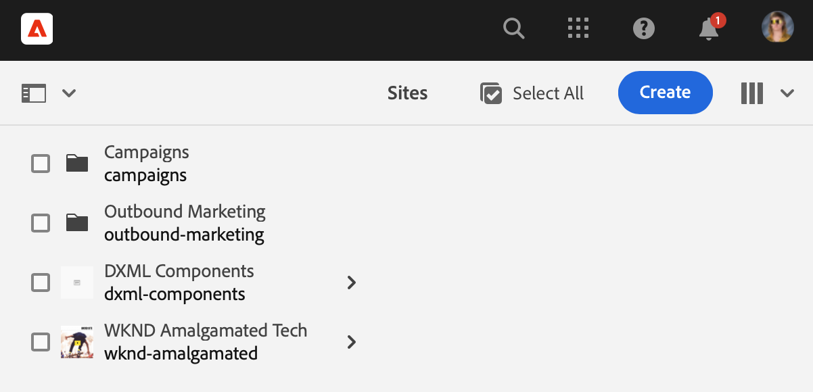
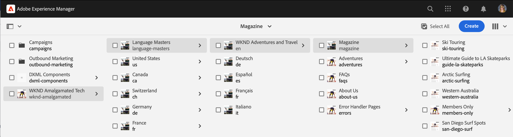

# Guia de início rápido para criação {#quick-guide-to-authoring}

Comece aqui para obter um guia rápido de alto nível para começar a criar conteúdo usando o **Sites** console.

>[!TIP]
>
>Este guia de início rápido se concentra na criação de Sites, no entanto, a maioria dos conceitos é amplamente aplicável a outros consoles.

## Tudo começa no console Sites. {#sites-console}

Se você deseja criar novo conteúdo ou visualizar e gerenciar seu conteúdo existente, a visão geral central é a **Sites** console.

Ao fazer logon pela primeira vez no AEM, você chega à tela de navegação global. Basta tocar ou clicar em **Sites** para abrir o **Sites** console.

Para acessar a navegação global de qualquer outro local no AEM, toque ou clique no link **Adobe Experience Manager** na parte superior esquerda de qualquer tela AEM, o que abre uma sobreposição suspensa da navegação global.

Uma vez no **Sites** console, seu conteúdo é simples de navegar e é apresentado em uma exibição de coluna por padrão.

## Exibições {#views}

Por padrão, a variável **Sites** o console abre em **Coluna** exibição. Cada nível de hierarquia é exibido como uma coluna, que se presta bem ao conteúdo organizado hierarquicamente com base na Web.

Toque ou clique em uma entrada em uma coluna para selecioná-la ou abrir o próximo nível abaixo na hierarquia. Um item selecionado é indicado com uma marca de verificação.

Há duas exibições adicionais disponíveis:

* **Exibição de cartão** - Essa visualização apresenta cada entrada como um cartão facilmente manipulável, tornando as opções adicionais facilmente acessíveis.
* **Exibição de lista** - Isso apresenta um único nível de uma hierarquia como uma única lista, fornecendo mais detalhes sobre os itens individuais.

Use o alternador de exibições no canto superior esquerdo da tela para alternar entre exibições. Este documento usa a exibição de colunas padrão.

## Navegar pelo conteúdo {#navigating}

**Exibição de coluna** O apresenta o conteúdo como uma série de colunas em cascata. Selecionar um item na coluna atual mostra seus detalhes na próxima coluna à direita, se for um documento, ou mostra o conteúdo do próximo nível de hierarquia, se for uma pasta.

Dessa forma, você pode percorrer para cima e para baixo sua estrutura de conteúdo.

Para saltar rapidamente entre níveis, você pode usar a navegação estrutural na parte superior da página.

A qualquer momento, você também pode usar o ícone de pesquisa na parte superior direita da tela para localizar um conteúdo específico.

A pesquisa aparece como uma sobreposição suspensa em todo o console. Insira seus termos de pesquisa para encontrar seu conteúdo.

## Criação de conteúdo {#creating}

Para criar uma nova página, basta navegar até o local em que deseja que ela esteja na hierarquia de conteúdo e tocar ou clicar no **Criar** na barra de ferramentas.

As opções disponíveis dependem do contexto. Se estiver na raiz da estrutura de conteúdo, você terá a capacidade de criar um site totalmente novo. Caso contrário, você pode criar novas páginas ou outro conteúdo relacionado à página.

Dependendo do que você selecionar para criar, o assistente apropriado começará a orientá-lo pelo processo de criação.

## Editar conteúdo {#editing}

Para editar uma página, toque ou clique para selecionar a página no **Sites** console. Em seguida, na barra de ferramentas exibida, toque ou clique no **Editar** ícone.

Isso abrirá a página no editor apropriada ao conteúdo.

Se desejar apenas atualizar as propriedades de uma página, como tags ou seu nome, toque ou clique no link **Propriedades** na barra de ferramentas.

## Organizar conteúdo {#organizing}

Para mover ou copiar uma página, selecione a página no console e, na barra de ferramentas, toque ou clique em **Mover** ou **Copiar**. Isso inicia um assistente para orientá-lo pelas etapas de movimentação ou cópia, definindo o nome e o local da página resultante.

## Publicar conteúdo {#publishing}

Quando terminar de fazer as alterações desejadas no conteúdo usando o **Sites** console, você poderá publicar o conteúdo. Selecione o conteúdo que deseja publicar e toque ou clique no **Publicação rápida** na barra de ferramentas.

Confirme a publicação com outro toque ou clique em **Publish** na caixa de diálogo.

## Recursos adicionais {#additional-resources}

Esta é apenas uma breve introdução ao poder de criação de conteúdo de sites e, como tal, não abrange todos os tópicos ou todas as opções.

Estes são mais alguns recursos que detalham todos os recursos do console, além de discutirem tópicos sobre a criação de conteúdo em geral.

* [Manuseio básico](/help/sites-cloud/authoring/basic-handling.md)
* [Conceitos de criação](/help/sites-cloud/authoring/author-publish.md)
* [Console do Sites](/help/sites-cloud/authoring/sites-console/introduction.md)
* [Editor de página](/help/sites-cloud/authoring/page-editor/introduction.md)
* [Publicar páginas](/help/sites-cloud/authoring/sites-console/publishing-pages.md)
