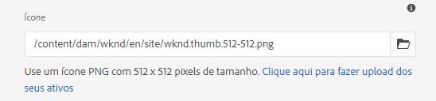
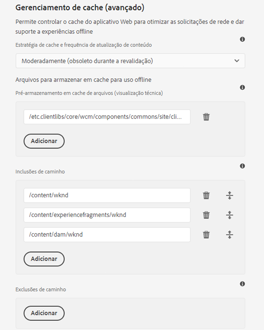

# Ativação de recursos do aplicativo web progressivo {#enabling-pwa}

Por meio de uma configuração simples, um autor de conteúdo agora pode ativar recursos do aplicativo web progressivo (PWA) para experiências criadas no AEM Sites.

>[!CAUTION]
>
>Este é um recurso avançado que requer:
>
>* Conhecimento sobre PWAs
>* Conhecimento do seu site e estrutura de conteúdo
>* Noções básicas sobre estratégias de armazenamento em cache
>* Suporte da sua equipe de desenvolvimento
>
>Antes de usar esse recurso, a Adobe recomenda discutir isso com a equipe de desenvolvimento para definir a melhor maneira de usá-lo para o seu projeto.

{{pwa-deprecation}}

## Introdução {#introduction}

Os [Aplicativos web progressivos (PWAs)](https://developer.mozilla.org/pt-BR/docs/Web/Progressive_web_apps) habilitam experiências imersivas semelhantes a aplicativos no AEM Sites, permitindo que eles sejam armazenados localmente no computador de um usuário e acessíveis offline. Um usuário pode navegar em um site de qualquer lugar, mesmo sem conexão com a Internet. Os PWAs permitem uma experiência perfeita, mesmo que a rede esteja perdida ou instável.

Em vez de exigir qualquer gravação do site, um autor de conteúdo pode configurar as propriedades do PWA como uma guia adicional nas [propriedades de página](/help/sites-cloud/authoring/sites-console/page-properties.md) de um site.

* Quando salva ou publicada, esta configuração aciona um manipulador de eventos que grava os [arquivos manifest](https://developer.mozilla.org/pt-BR/docs/Web/Manifest) e um [service worker](https://developer.mozilla.org/pt-BR/docs/Web/API/Service_Worker_API) que habilita os recursos do PWA no site.
* Os mapeamentos Sling também são mantidos, para garantir que o service worker seja disponibilizado a partir da raiz do aplicativo e ative o conteúdo de proxy, permitindo recursos offline no aplicativo.

Com o PWA, o usuário tem uma cópia local do site, dando uma experiência semelhante a um aplicativo mesmo sem conexão com a Internet.

>[!NOTE]
>
>Aplicativos Web progressivos são uma tecnologia em evolução, e o suporte para instalação de aplicativos locais e outros recursos [&#x200B; depende do navegador usado](https://developer.mozilla.org/en-US/docs/Web/Progressive_web_apps/Tutorials/js13kGames/Installable_PWAs#summary).

## Pré-requisitos {#prerequisites}

Para poder usar os recursos de PWA no seu site, há dois requisitos para o ambiente do projeto:

1. [Usar componentes principais](#adjust-components) para aproveitar esse recurso
1. [Ajuste as regras do Dispatcher](#adjust-dispatcher) para expor os arquivos necessários

Essas são etapas técnicas que o autor deve coordenar com a equipe de desenvolvimento. Elas são necessárias apenas uma vez em cada site.

### Usar componentes principais {#adjust-components}

Os Componentes principais versões 2.15.0 e posteriores são compatíveis com os recursos de PWA do AEM Sites. Como o AEMaaCS sempre inclui a versão mais recente dos Componentes principais, você pode utilizar os recursos do PWA prontos para uso. Seu projeto AEMaaCS atende automaticamente a esse requisito.

>[!NOTE]
>
>A Adobe não recomenda usar os recursos do PWA em componentes personalizados ou componentes que não [foram estendidos dos Componentes Principais](https://experienceleague.adobe.com/docs/experience-manager-core-components/using/developing/customizing.html?lang=pt-BR).
<!--
Your components need to include the [manifest files](https://developer.mozilla.org/en-US/docs/Web/Manifest) and [service worker](https://developer.mozilla.org/en-US/docs/Web/API/Service_Worker_API), which supports the PWA features.

 To do this, the developer adds the following link to the `customheaderlibs.html` file of your page component.

```xml
<link rel="manifest" href="/content/<projectName>/manifest.webmanifest" crossorigin="use-credentials"/>
```

The developer also adds the following link to the `customfooterlibs.html` file of your page component.

```xml
<script>
        // Check that service workers are supported
        if ('serviceWorker' in navigator) {
            // Use the window load event to make sure the page load performs well
            window.addEventListener('load', () => {
                let serviceWorker = '/<projectName>sw.js';
                navigator.serviceWorker.register(serviceWorker);
            });
        }
</script>
```
-->

### Ajustar seu Dispatcher {#adjust-dispatcher}

O recurso PWA gera e usa arquivos `/content/<sitename>/manifest.webmanifest`. Por padrão, [o Dispatcher](/help/implementing/dispatcher/overview.md) não expõe esses arquivos. Para expor esses arquivos, o desenvolvedor deve adicionar a seguinte configuração ao projeto do site.

```text
File location: [project directory]/dispatcher/src/conf.dispatcher.d/filters/filters.any >

# Allow webmanifest files
/0102 { /type "allow" /extension "webmanifest" /path "/content/*/manifest" }
```

Dependendo do seu projeto, talvez você queira incluir diferentes tipos de extensões para as regras de regravação. Pode ser útil incluir a extensão `webmanifest` nas condições de regravação quando você introduz uma regra que oculta e redireciona solicitações para `/content/<projectName>`.

```text
RewriteCond %{REQUEST_URI} (.html|.jpe?g|.png|.svg|.webmanifest)$
```

## Ativar o PWA no seu site {#enabling-pwa-for-your-site}

Com [os pré-requisitos](#prerequisites) atendidos, é fácil para um autor de conteúdo habilitar os recursos do PWA em um site. Veja a seguir um esboço básico de como fazer isso. As opções individuais são detalhadas na seção [Opções Detalhadas](#detailed-options).

1. Faça logon no AEM.
1. No menu principal, selecione **Navegação** > **Sites**.
1. Selecione o projeto do seu site e selecione [**Propriedades**](/help/sites-cloud/authoring/sites-console/page-properties.md) ou use a tecla de atalho `p`.
1. Selecione a guia **Aplicativo web progressivo** e configure as propriedades aplicáveis. No mínimo, você deseja:
   1. Selecionar a opção **Ativar o PWA**.
   1. Definir o **URL de inicialização**.

      

   1. Faça upload de um ícone PNG de 512x512 no DAM e faça referência a ele como o ícone do aplicativo.

      

   1. Configure os caminhos que você deseja que o service worker use offline. Os caminhos típicos são:
      * `/content/<sitename>`
      * `/content/experiencefragements/<sitename>`
      * `/content/dam/<sitename>`
      * Qualquer referência de fonte de terceiros
      * `/etc/clientlibs/<sitename>`

      

1. Selecione **Salvar e fechar**.

Seu site agora está configurado e você pode [instalá-lo como um aplicativo local](#using-pwa-enabled-site).

## Usar seu site habilitado para PWA {#using-pwa-enabled-site}

Agora que você configurou o [site para oferecer suporte ao PWA](#enabling-pwa-for-your-site), você pode experimentá-lo por conta própria.

1. Acesse o site em um [navegador com suporte](https://developer.mozilla.org/en-US/docs/Web/Progressive_web_apps/Tutorials/js13kGames/Installable_PWAs#summary).
1. Você vê um novo ícone na barra de endereços do navegador, indicando que o site pode ser instalado como um aplicativo local.
   * Dependendo do navegador, o ícone pode variar e o navegador também pode exibir uma notificação (como um banner ou caixa de diálogo), indicando que é possível instalá-lo como um aplicativo local.
1. Instale o aplicativo.
1. O aplicativo é instalado na tela inicial do seu dispositivo.
1. Abra o aplicativo, navegue um pouco e veja se as páginas estão disponíveis offline.

## Opções detalhadas {#detailed-options}

A seção a seguir fornece mais detalhes sobre as opções disponíveis ao [configurar o site para o PWA](#enabling-pwa-for-your-site).

### Configurar experiência instalável {#configure-installable-experience}

Essas configurações permitem que o site se comporte como um aplicativo nativo, tornando-o instalável na tela inicial dos visitantes e disponível offline.

* **Habilitar PWA** - Este é o principal botão de alternância para habilitar PWA para o site.
* **URL de inicialização** - Esta é a [URL inicial preferencial](https://developer.mozilla.org/en-US/docs/Web/Manifest/start_url) que o aplicativo abre quando o usuário carrega o aplicativo instalado localmente.
   * Pode ser qualquer caminho na estrutura do conteúdo.
   * Não precisa ser a raiz e geralmente é uma página de boas-vindas dedicada do aplicativo.
   * Se esse URL for relativo, o URL do manifest será usado como URL base para resolvê-lo.
   * Quando deixado em branco, o recurso usa o endereço da página da Web da qual o aplicativo foi instalado.
   * É recomendável definir um valor.
* **Modo de exibição** — um aplicativo habilitado para PWA ainda é um site do AEM fornecido por um navegador. [Essas opções de exibição](https://developer.mozilla.org/en-US/docs/Web/Manifest/display) definem como o navegador deve ser oculto ou apresentado ao usuário no dispositivo local.
   * **Independente** - O navegador está oculto do usuário e parece ser um aplicativo nativo. Este é o valor padrão.
      * Com essa opção, a navegação do aplicativo deve ser totalmente possível por meio do conteúdo, usando links e componentes nas páginas do site, sem usar os controles de navegação do navegador.
   * **Navegador** — o navegador é exibido como normalmente seria ao visitar o site.
   * **Interface mínima** — o navegador é parcialmente escondido, como em um aplicativo nativo, mas os controles básicos de navegação ficam expostos.
   * **Tela cheia** - O navegador fica oculto, como em um aplicativo nativo, mas é renderizado no modo de tela cheia.
      * Com essa opção, a navegação do aplicativo deve ser totalmente possível por meio do conteúdo, usando links e componentes nas páginas do site, sem usar os controles de navegação do navegador.
* **Orientação da tela** - Como um aplicativo local, a PWA deve saber como lidar com as [orientações do dispositivo](https://developer.mozilla.org/en-US/docs/Web/Manifest/orientation).
   * **Qualquer** — o aplicativo se ajusta à orientação do dispositivo do usuário. Este é o valor padrão.
   * **Retrato** — isso força o aplicativo a ser aberto no layout de retrato, independentemente da orientação do dispositivo do usuário.
   * **Paisagem** — isso força o aplicativo a ser aberto no layout paisagem, independentemente da orientação do dispositivo do usuário.
* **Cor do tema** — isso define a [cor do aplicativo](https://developer.mozilla.org/en-US/docs/Web/Manifest/theme_color) que afeta como o sistema operacional do usuário local exibe a barra de ferramentas da interface nativa e os controles de navegação. Dependendo do navegador, isso pode afetar outros elementos de apresentação do aplicativo.
   * Use o pop-up de poço de cores para selecionar uma cor.
   * A cor também pode ser definida por valor hexadecimal ou RGB.
* **Cor do fundo**: isso define a [cor do fundo do aplicativo](https://developer.mozilla.org/en-US/docs/Web/Manifest/background_color), mostrada quando o aplicativo é carregado.
   * Use o pop-up de poço de cores para selecionar uma cor.
   * A cor também pode ser definida por valor hexadecimal ou RGB.
   * Certos navegadores [criam uma tela inicial automaticamente](https://developer.mozilla.org/pt-BR/docs/Web/Manifest#splash_screens) a partir do nome do aplicativo, cor do plano de fundo e ícone.
* **Ícone** — isso define [o ícone](https://developer.mozilla.org/en-US/docs/Web/Manifest/icons) que representa o aplicativo no dispositivo do usuário.
   * O ícone deve ser um arquivo PNG com tamanho de 512x512 pixels.
   * O ícone deve ser [armazenado no DAM](/help/assets/overview.md).

### Gerenciamento de cache (avançado) {#offline-configuration}

Essas configurações disponibilizam partes do site de forma offline e local no dispositivo do visitante. Isso permite controlar o cache do aplicativo web para otimizar as solicitações de rede e dar suporte a experiências offline.

* **Estratégia de armazenamento em cache e frequência de atualização de conteúdo** — essa configuração define o modelo de armazenamento em cache do seu PWA.
   * **Moderadamente** — [esta configuração](https://web.dev/stale-while-revalidate/) é o caso da maioria dos sites e é o valor padrão.
      * Com essa configuração, o conteúdo visualizado pela primeira vez pelo usuário é carregado do cache e, enquanto o usuário está consumindo esse conteúdo, o restante do conteúdo no cache é revalidado.
   * **Frequentemente** - Este é o caso para sites que necessitam de atualizações rápidas, como casas de leilões.
      * Com essa configuração, o aplicativo busca o conteúdo mais recente por meio da rede primeiro e, se não estiver disponível, retorna ao cache local.
   * **Raramente** — esse é o caso para sites quase estáticos, como páginas de referência.
      * Com essa configuração, o aplicativo procura primeiro o conteúdo no cache e, se não estiver disponível, retorna à rede para recuperá-lo.
* **Pré-armazenamento em cache de arquivos**: esses arquivos hospedados no AEM são salvos no cache do navegador local quando o serviço secundário estiver sendo instalado e antes de ser usado. Isso garante que o aplicativo web esteja totalmente funcional quando estiver offline.
* **Inclusões de caminhos** — as solicitações de rede para os caminhos definidos são interceptadas e o conteúdo em cache é retornado de acordo com a **Estratégia de armazenamento em cache e frequência de atualização de conteúdo** configuradas.
* **Exclusões de cache** - Esses arquivos nunca são armazenados em cache, independentemente das configurações em **Pré-armazenamento em cache de arquivos** e **Inclusões de caminho**.

>[!TIP]
>
>Sua equipe de desenvolvedores provavelmente tem informações importantes sobre como a configuração offline deve ser configurada.

## Limitações e recomendações {#limitations-recommendations}

Nem todos os recursos de PWA estão disponíveis para o AEM Sites. Essas são algumas limitações importantes.

* As páginas não são sincronizadas ou atualizadas automaticamente se o usuário não estiver usando o aplicativo.

A Adobe também recomenda o seguinte ao implementar o PWA.

### Minimize o número de recursos para pré-armazenar em cache. {#minimize-precache}

A Adobe aconselha limitar o número de páginas a serem pré-armazenadas em cache.

* Incorpore bibliotecas para que você possa reduzir o número de entradas para gerenciar ao pré-armazenar em cache.
* Limite o número de variações de imagem para pré-armazenar em cache.

### Ative o PWA depois que os scripts do projeto e as folhas de estilos estiverem estabilizados. {#pwa-stabilized}

As bibliotecas de clientes são entregues com a adição de um seletor de cache, observando o seguinte padrão `lc-<checksumHash>-lc`. Toda vez que um dos arquivos (e dependências) que compõem uma biblioteca são alterados, esse seletor é alterado. Se você listou uma biblioteca do cliente para ser pré-armazenada em cache pelo service worker e deseja fazer referência a uma nova versão, recupere e atualize manualmente a entrada. Como resultado, a Adobe recomenda configurar o site como um PWA depois que os scripts do projeto e as folhas de estilos estiverem estabilizados.

### Minimize o número de variações de imagem. {#minimize-variations}

O Componente de imagem dos Componentes principais do AEM determina no front-end a melhor representação para buscar. Esse mecanismo também inclui um carimbo de data e hora que corresponde à hora da última modificação desse recurso. Esse mecanismo complica a configuração do pré-armazenamento em cache do PWA.

Ao configurar o pré-armazenamento em cache, o usuário deve listar todas as variações de caminho que podem ser buscadas. Essas variações são compostas de parâmetros como qualidade e largura. Recomenda-se reduzir o número dessas variações para no máximo três - pequena, média, grande. Você pode fazer isso por meio da caixa de diálogo de política de conteúdo do [Componente de imagem](https://experienceleague.adobe.com/docs/experience-manager-core-components/using/wcm-components/image.html?lang=pt-BR).

Se não for configurado com cuidado, o consumo de memória e de rede podem afetar seriamente o desempenho do seu PWA. Além disso, se você pretende realizar o pré-armazenamento em cache de, por exemplo, 50 imagens, e tiver três larguras por imagem, o usuário que mantém o site tem que manter uma lista de até 150 entradas na seção pré-armazenamento em cache das propriedades da página do PWA.

A Adobe também aconselha configurar o site como um PWA após o uso de imagens do projeto ser estabilizado.
