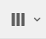
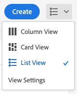
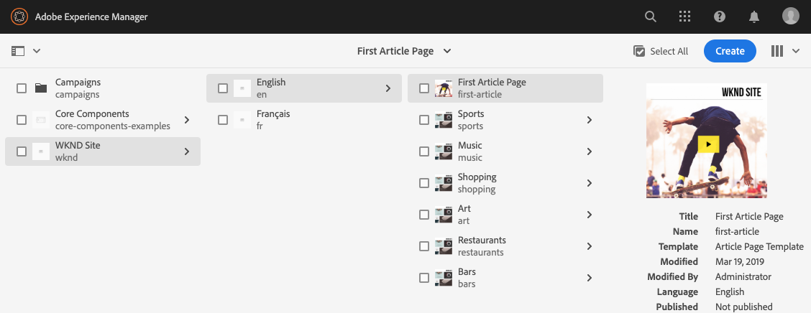
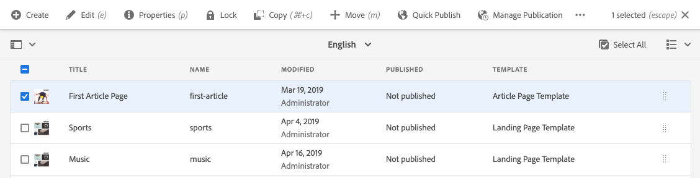

# O console Sites {#sites-console}

Saiba como usar o console **Sites** para gerenciar e organizar suas páginas do AEM.

## Orientação {#orientation}

O console **Sites** permite exibir a hierarquia de páginas.

Ele oferece diferentes exibições e barras de ferramentas para ajudar você a gerenciar e organizar suas páginas.

* [A barra de ferramentas do console](#toolbar) está sempre presente para ajudá-lo a navegar.
* [Três visualizações diferentes](#views) permitem que você localize e selecione facilmente sua página.
* [A barra de ferramentas de ações](#action-toolbar) aparece quando você seleciona um item para executar uma ação sobre ele.
* [O painel lateral](#side-panel) tem várias opções para mostrar informações detalhadas em uma página selecionada.

## Barra de ferramentas do console {#console-toolbar}

A barra de ferramentas do console está sempre presente no console e ajuda a se orientar no conteúdo e a navegar pelo conteúdo.

### Seletor de painel lateral {#side-panel-selector}

O seletor do painel lateral permite mostrar informações adicionais sobre o item selecionado no console.

As opções apresentadas dependem do seu console atual. Por exemplo, em **Sites**, é possível selecionar somente o conteúdo (o padrão), a linha do tempo, as referências ou o painel lateral de filtros.

Para obter mais informações sobre o painel lateral, consulte [Painel Lateral do Console do Sites](/help/sites-cloud/authoring/sites-console/console-side-panel.md).

### Navegações estruturais {#breadcrumbs}

Situadas no meio do painel e sempre mostrando a descrição do item selecionado no momento, as navegações estruturais permitem navegar pelos níveis do site.

Toque ou clique no texto da navegação estrutural para exibir uma lista suspensa com os níveis da hierarquia do item selecionado no momento. Toque ou clique em uma entrada para ir para esse local.

### Selecionar tudo {#select-all}

Tocar ou clicar no botão **Selecionar Tudo** seleciona todos os itens na exibição atual do console.

Quando você seleciona todos os itens, a contagem dos itens selecionados é exibida na parte superior direita da barra de ferramentas, onde o botão **Selecionar tudo** foi exibido.

Você pode desmarcar todos os itens e sair do modo de seleção ao:

* Clicar ou tocar em **X** ao lado da contagem.
* Usando a tecla **escape**.

### Botão Criar {#create-button}

O botão **Criar** permite que você adicione novas páginas ao seu site, bem como crie outros objetos do Sites, como Live Copies ou Inicializações.

Depois de clicadas, as opções exibidas são apropriadas ao console/contexto. Os mais comuns são:

* [Página](/help/sites-cloud/authoring/sites-console/creating-pages.md)
* [Site](/help/sites-cloud/administering/site-creation/create-site.md)
* [Live Copy](/help/sites-cloud/administering/msm/overview.md)
* [Iniciar](/help/sites-cloud/authoring/launches/overview.md)
* [Cópia no idioma de destino](/help/sites-cloud/administering/translation/overview.md)
* [Relatório CSV](/help/sites-cloud/authoring/sites-console/csv-export.md)

Consulte os links para esses recursos para obter detalhes sobre como eles funcionam.

## Visualizações e seleção de páginas {#views}

O console do **Sites** oferece três exibições diferentes da sua hierarquia de conteúdo. É possível visualizar, navegar e selecionar (para novas ações) os recursos com qualquer uma das exibições disponíveis.

* [Exibição de coluna](#column-view)
* [Exibição de cartão](#card-view)
* [Exibição de lista](#list-view)

O ícone **Exibir** na extremidade direita da barra de ferramentas do AEM indica o modo de exibição atual selecionado.

Tocar ou clicar nele permite selecionar uma exibição diferente.

É possível alternar entre o modo de exibição de coluna, exibição de cartão e exibição de lista. No modo de exibição de lista também mostra as configurações de exibição.

>[!NOTE]
>
>A opção **Configurações de exibição** só está disponível no modo **Exibição de lista**.

Visualizar, navegar e selecionar são conceitualmente iguais em todas as exibições, mas têm pequenas variações de manuseio, dependendo da exibição usada.

>[!NOTE]
>
>Por padrão, o AEM Assets não exibe as representações originais de ativos na interface como miniaturas em nenhuma das exibições. Se você for um administrador, poderá usar sobreposições para configurar o AEM Assets e exibir representações originais como miniaturas.

### Seleção de recursos   {#selecting-resources}

Selecionar um recurso específico depende de uma combinação da exibição e do dispositivo:

| Exibir | Selecionar toque | Selecionar desktop | Desmarcar toque | Desmarcar desktop |
|---|---|---|---|---|
| Coluna | Selecione a miniatura | Clique na miniatura | Selecione a miniatura | Clique na miniatura |
| Cartão | Selecione e segure o cartão | Passe o mouse sobre ele e use a ação rápida da marca de seleção | Selecione o cartão | Clique no cartão |
| Lista | Selecione a miniatura | Clique na miniatura | Selecione a miniatura | Clique na miniatura |

#### Exemplo de seleção {#selecting-example}

1. Por exemplo, na exibição de cartão:

   

1. Após selecionar um recurso, o cabeçalho superior é coberto pela [barra de ferramentas das ações](#actions-toolbar), que fornece acesso às ações atualmente aplicáveis ao recurso selecionado.

1. Para sair do modo de seleção, selecione o **X** no canto superior direito, ou use a tecla **escape**.

### Exibição de coluna {#column-view}

A exibição de coluna permite a navegação visual de uma árvore de conteúdo por uma série de colunas em cascata. Essa visualização permite visualizar e percorrer a estrutura de árvore do site.

Selecionar um recurso na coluna mais à esquerda exibirá os recursos filhos em uma coluna à direita. Selecionar um recurso na coluna à direita exibirá os recursos filhos em outra coluna à direita e assim por diante.

* É possível navegar para cima e para baixo na árvore tocando ou clicando no nome do recurso ou na divisa à direita do nome do recurso.

   * O nome e a divisa do recurso são realçados quando tocados ou clicados.
   * Os filhos do recurso clicado/tocado são exibidos na coluna à direita do recurso clicado/tocado.
   * Se você selecionar um nome de recurso que não tenha filhos, seus detalhes serão exibidos na coluna final.

* Tocar ou clicar na miniatura seleciona o recurso.

   * Ao selecionar, uma marca de seleção será sobreposta à miniatura, e o nome do recurso também será destacado.
   * Os detalhes do recurso selecionado serão mostrados na coluna final.
   * A barra de ferramentas de ações ficará disponível.

* Quando uma página é selecionada na exibição de coluna, a página selecionada é exibida na coluna final junto com os seguintes detalhes:

   * Título da página
   * Nome da página (parte do URL da página)
   * Modelo no qual a página se baseia
   * Detalhes da modificação
   * Idioma da página
   * Publicação e detalhes da visualização

### Exibição de cartão {#card-view}

Na exibição de cartão, cada item no nível atual na hierarquia é exibido como um cartão grande.

* Os cartões fornecem informações como:

   * Uma representação visual do conteúdo da página.
   * O título da página.
   * Datas importantes (como a última edição e publicação).
   * Se a página estiver bloqueada, oculta ou fizer parte de uma live copy.
   * Indicadores se você precisa agir no item como parte de um fluxo de trabalho.

A exibição de cartão também oferece [ações rápidas](#quick-actions) para itens como seleção e ações comuns como editar.

É possível navegar para baixo na árvore tocando/clicando em cartões (com cautela para evitar o toque nas ações rápidas) ou para cima novamente usando a [navegação estrutural no cabeçalho](#the-header).

### Exibição de lista {#list-view}

A exibição de lista fornece informações para cada recurso no nível atual de uma lista.

* É possível navegar para baixo na árvore tocando/clicando no nome do recurso e fazer backup usando a [navegação estrutural no cabeçalho](#the-header).
* Para selecionar facilmente todos os itens na lista, use a caixa de seleção [**Selecionar tudo** na barra de ferramentas](#select-all).

* Selecione as colunas a serem mostradas usando a opção **Configurações de exibição**, localizada abaixo do botão Visualizações. As seguintes colunas estão disponíveis para exibição:

   * **Nome**: o nome da página, que pode ser útil em um ambiente de criação multilíngue, pois faz parte do URL da página e não é alterado independentemente do idioma
   * **Modificado**: a última data de modificação e último usuário que modificou
   * **Publicado**: o status da publicação
   * **Visualizar** - Status da visualização
   * **Modelo** - Modelo no qual a página se baseia
   * **Operação**
   * **Fluxo de trabalho**: o fluxo de trabalho atualmente aplicado à página. Mais informações estão disponíveis ao passar o mouse ou abrir a Linha do tempo.
   * **Traduzido**
   * **Exibições de página**
   * **Visitantes únicos**
   * **Tempo na página**

Por padrão, é exibida a coluna **Nome**, que faz parte do URL da página. Em alguns casos, o autor pode precisar acessar páginas que estão em um idioma diferente, e ver o nome da página (que normalmente é imutável) pode ser de grande ajuda quando ele não conhece o idioma.

* Altere a ordem dos itens usando a barra vertical pontilhada na extremidade direita de cada item da lista.

Selecione a barra de seleção vertical e arraste o item para uma nova posição na lista.

>[!NOTE]
>
>Alterar a ordem funciona somente em uma pasta ordenável que tenha o valor `jcr:primaryType` como `sling:OrderedFolder`.

## Barra de ferramentas de Ações {#actions-toolbar}

Sempre que um recurso for selecionado, você poderá realizar várias ações no item selecionado. Essas ações são exibidas na barra de ferramentas de ações.

A barra de ferramentas Ações só aparece quando um recurso é selecionado no console. A ação disponível na barra de ferramentas de ações muda para refletir as ações que você pode realizar nos itens específicos selecionados. As ações mais comuns são:

* [**Criar**](#create-action) - Criar novo conteúdo ou ações relacionadas a conteúdo
* **Editar** - Dependendo de como a página selecionada foi criada, a ação **Editar** abrirá o editor apropriado.
   * [Editor de páginas](/help/sites-cloud/authoring/page-editor/introduction.md) - Para páginas criadas com o Editor de páginas do AEM
   * [Editor Universal](/help/sites-cloud/authoring/universal-editor/authoring.md) - Para páginas criadas com o Editor Universal
* [**Propriedades**](/help/sites-cloud/authoring/sites-console/edit-page-properties.md) - Abre a janela de propriedades da página
* [**Bloquear**](/help/sites-cloud/authoring/sites-console/managing-pages.md#locking-a-page) - Bloquear uma página para impedir que outras pessoas a alterem
* [**Copiar**](/help/sites-cloud/authoring/sites-console/managing-pages.md#copying-and-pasting-a-page) - Copiar uma página
* [**Mover**](/help/sites-cloud/authoring/sites-console/managing-pages.md#moving-or-renaming-a-page) - Mover ou renomear uma página
* [**Publicação rápida**](/help/sites-cloud/authoring/sites-console/publishing-pages.md#quick-publish) - Publicar uma ou mais páginas imediatamente
* [**Gerenciar publicação**](/help/sites-cloud/authoring/sites-console/publishing-pages.md#manage-publication) - Agende uma ou mais páginas para publicação
* [**Restaurar**](/help/sites-cloud/authoring/sites-console/page-versions.md#restore-version) - Restaura uma versão de uma página ou árvore de páginas
* [**Excluir**](/help/sites-cloud/authoring/sites-console/managing-pages.md#deleting-a-page) - Excluir uma ou mais páginas

Devido às restrições de espaço em algumas janelas, a barra de ferramentas pode tornar-se rapidamente maior do que o espaço disponível. Quando isso acontecer, opções adicionais serão exibidas. Clicar ou tocar nas reticências (três pontos ou **...**) abre um seletor suspenso com todas as ações restantes.

### Criar ação {#create-action}

A ação de criação oferece opções semelhantes ao botão [**Criar** da barra de ferramentas](#create-button) para criar novas páginas e itens semelhantes.

Além disso, oferece a capacidade de criar ações relacionadas à página.

* [**Fluxo de trabalho**](/help/sites-cloud/authoring/workflows/overview.md) - Aplicar um fluxo de trabalho a uma página
* [**Versão**](/help/sites-cloud/authoring/sites-console/page-versions.md) - Criar uma versão de uma página

## Modelos

É possível ver em qual modelo a página é baseada ao selecionar a página na [**Exibição de coluna**](/help/sites-cloud/authoring/basic-handling.md#column-view) ou na [**Exibição de lista**](/help/sites-cloud/authoring/basic-handling.md#list-view).

## Assistente de IA no AEM

Para clientes que possuem [critérios de pré-requisito concluídos](/help/implementing/cloud-manager/ai-assistant-in-aem.md#get-access), o Assistente de IA do AEM está disponível para usuários de suas organizações. Consulte [Assistente de IA no AEM](/help/implementing/cloud-manager/ai-assistant-in-aem.md).

