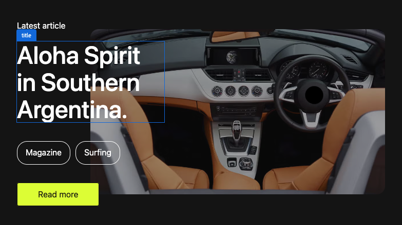
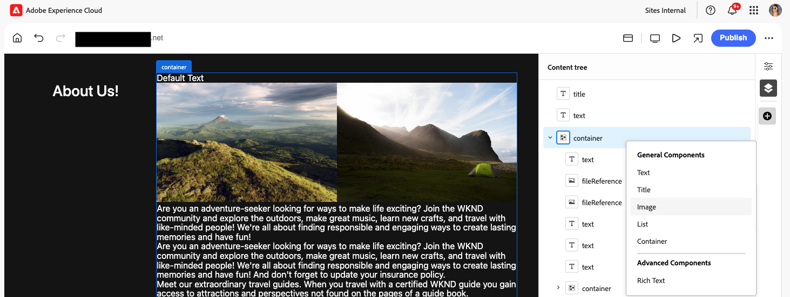
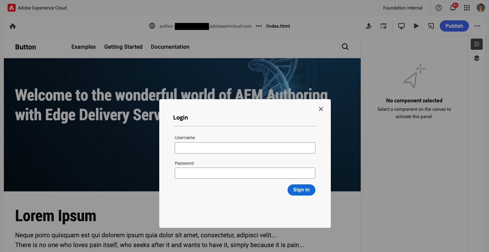

# Criação de conteúdo com o Editor universal {#authoring}

Saiba como é fácil e intuitivo para os autores criarem conteúdo utilizando o Editor universal.

## Introdução {#introduction}

O Editor universal permite editar qualquer aspecto de qualquer conteúdo em qualquer implementação para que você possa fornecer experiências excepcionais e aumentar a velocidade do conteúdo.

Para isso, o editor universal oferece aos autores de conteúdo uma interface intuitiva que exige apenas um treinamento mínimo para que eles possam simplesmente entrar e começar a editar o conteúdo. Este documento descreve a experiência de criação do Editor Universal.

>[!NOTE]
>
>Este documento supõe que você já esteja familiarizado com como acessar e navegar pelo Editor universal. Caso contrário, consulte [Acessando e Navegando no Editor Universal.](/help/sites-cloud/authoring/universal-editor/navigation.md)

>[!TIP]
>
>Para obter uma introdução mais detalhada ao Universal Editor, consulte [Introdução ao Universal Editor.](/help/implementing/universal-editor/introduction.md)

## Editar o conteúdo {#editing-content}

A edição de conteúdo é simples e intuitiva. Ao passar o mouse sobre o conteúdo no editor, o conteúdo editável é realçado com um contorno fino e azul-claro e um selo.

Tocar ou clicar no conteúdo destacado é selecionado e o contorno fino e azul-claro se torna um contorno azul-escuro com um símbolo.

>[!TIP]
>
>Por padrão, tocar ou clicar em um conteúdo o seleciona para edição. Se você deseja navegar pelo seu conteúdo seguindo os links, alterne para o [modo de visualização.](/help/sites-cloud/authoring/universal-editor/navigation.md#preview-mode)

Dependendo do conteúdo selecionado, você pode ter diferentes opções de edição no local, bem como informações e opções adicionais para o conteúdo no painel de propriedades [.](/help/sites-cloud/authoring/universal-editor/navigation.md#properties-rail)

### Menu de contexto {#context-menu}

Cada parte do conteúdo editável está identificada com o tipo de conteúdo.

Você pode clicar neste selo para obter acesso rápido a um menu de contexto com ações de edição. Clicar com o botão direito do mouse em um item editável não selecionado o seleciona automaticamente e também abre o menu de contexto.

### Edição de Texto sem Formatação {#edit-plain-text}

É possível editar o texto no local clicando duas vezes ou tocando duas vezes no componente.

O contorno fino e azul claro se transforma em um contorno azul escuro para indicar a seleção e um cursor é exibido. Faça as alterações e pressione Enter/Return ou selecione fora da caixa de texto para salvar as alterações.

Quando você seleciona o componente de texto, seus detalhes são mostrados no painel de propriedades [.](/help/sites-cloud/authoring/universal-editor/navigation.md#properties-rail) Também é possível editar o texto no painel.

Além disso, os detalhes do seu texto estão disponíveis no painel de propriedades. As alterações são salvas automaticamente quando o foco sai do campo editado no painel de propriedades.

### Edição de Rich Text {#edit-rich-text}

É possível editar o texto no local clicando duas vezes ou tocando duas vezes no componente.

Para sua conveniência, as opções de formatação e os detalhes do texto estão disponíveis em dois lugares.

#### O Menu de Contexto Rich Text {#rich-text-context-menu}

Um menu de contexto é aberto acima do bloco de rich text e oferece opções básicas de formatação no contexto. Devido a limitações de espaço, algumas opções podem estar ocultas atrás do botão de reticências.

As alterações são salvas automaticamente quando o foco sai do campo editado.

#### O painel Propriedades {#properties-rail}

O [painel de propriedades](/help/sites-cloud/authoring/universal-editor/navigation.md#properties-rail) mostra uma entrada para o componente de rich text selecionado.

Toque na entrada para abrir uma caixa de diálogo apresentando uma tela maior para editar o rich text.

Toque ou clique em **Cancelar** ou **Concluído** para descartar ou salvar as alterações, respectivamente. Você também pode pressionar a tecla Escape para salvar as alterações e fechar a caixa de diálogo.

#### Opções de formatação de rich text {#formatting-options}

O editor de rich text (RTE) do Editor universal permite que o autor aplique a formatação de texto padrão. Por padrão, as seguintes opções estão disponíveis.

* **Estilo de parágrafo**
   * Parágrafos, h1-h6, código
* **Negrito**
* **Itálico**
* **Sublinhado**
* **Tachado**
* **Sobrescrito**
* **Subscrito**
* **Lista de marcadores**
   * Use a tecla Tab para recuar, e shift+tab para recuar para a esquerda.
* **Lista ordenada**
   * Use a tecla Tab para recuar, e shift+tab para recuar para a esquerda.
* **Link**
   * Especifique um URL ou use o Navegador de conteúdo para selecionar um caminho no AEM.
* **Desvincular**
   * Remover link do texto selecionado.
* **Imagem**
   * Especifique uma URL ou use o [seletor de ativos](/help/assets/overview-asset-selector.md#using-asset-selector) para selecionar um ativo da AEM.
* **Tabela**
   * Use o menu suspenso para inserir uma nova tabela do número selecionado de colunas e linhas ou inserir e remover novas colunas/linhas.
* **Colar como texto**
   * Remova a formatação do texto na área de transferência antes de colá-lo no Editor Universal.
* **Remover toda a formatação**
   * Remova todas as opções de formatação do texto selecionado.

O RTE pode ser configurado para ocultar opções ou mostrar opções adicionais, dependendo das necessidades dos autores. Consulte o documento [Configurando o RTE para o Editor Universal](/help/implementing/universal-editor/configure-rte.md) para obter mais informações.

### Editando mídia {#edit-media}

Você pode exibir seus detalhes no painel [propriedades.](/help/sites-cloud/authoring/universal-editor/navigation.md#properties-rail)

1. Toque ou clique na visualização da imagem selecionada no painel de propriedades.
1. A janela [seletor de ativos](/help/assets/overview-asset-selector.md#using-asset-selector) é aberta para permitir que você selecione um ativo.
1. Selecione para selecionar um novo ativo.
1. Selecione **Selecionar** para retornar ao painel de propriedades onde o ativo foi substituído.

As alterações são salvas no conteúdo automaticamente.

### Edição de fragmentos de conteúdo {#edit-content-fragment}

Se você selecionar um [Fragmento do conteúdo](/help/sites-cloud/administering/content-fragments/overview.md), poderá editar seus detalhes no painel [propriedades.](/help/sites-cloud/authoring/universal-editor/navigation.md#properties-rail)

Os campos definidos no modelo de conteúdo do fragmento de conteúdo selecionado são exibidos e editáveis no painel de propriedades.

Se você selecionar um campo relacionado a um Fragmento de conteúdo, ele será carregado no painel Componentes e o campo será rolado automaticamente para ele.

As alterações são salvas automaticamente quando o foco sai do campo editado no painel de propriedades.

Se, em vez disso, você quiser editar seu Fragmento de Conteúdo no [editor de Fragmento de Conteúdo](/help/sites-cloud/administering/content-fragments/authoring.md), toque ou clique no botão [**Abrir no Editor de Conteúdo**](/help/sites-cloud/authoring/universal-editor/navigation.md#edit) no painel de propriedades.

>[!TIP]
>
>Use a tecla de atalho `e` para editar o fragmento de conteúdo selecionado no editor de fragmentos de conteúdo.

Dependendo das necessidades do fluxo de trabalho, talvez você queira editar o Fragmento de conteúdo no Editor universal ou diretamente no editor de Fragmento de conteúdo.

>[!NOTE]
>
>O Editor Universal [valida campos de Fragmento de Conteúdo com base em seus modelos](/help/assets/content-fragments/content-fragments-models.md#validation), permitindo que você imponha regras de integridade de dados, como padrões de regex e restrições de exclusividade.
>
>Isso garante que seu conteúdo atenda às necessidades específicas dos negócios antes de ser publicado.

### Adicionar componentes a contêineres {#adding-components}

1. Selecione um componente de contêiner na [árvore de conteúdo](/help/sites-cloud/authoring/universal-editor/navigation.md#content-tree-mode) ou no editor.

   

1. Em seguida, selecione o ícone adicionar no painel de propriedades.

   

1. Se mais de um componente for permitido para o contêiner, selecione aquele que deseja inserir na lista suspensa. Se somente um componente for permitido, ele será inserido automaticamente.

O componente é inserido no container e pode ser editado no editor.

>[!TIP]
>
>Use a tecla de atalho `a` para adicionar um componente ao contêiner selecionado.

### Duplicação de componentes em contêineres {#duplicating-components}

1. Selecione um componente em um container usando a [árvore de conteúdo](/help/sites-cloud/authoring/universal-editor/navigation.md#content-tree-mode) ou o editor.
1. Em seguida, selecione o ícone **Duplicar** no painel de propriedades.

   
1. O componente é duplicado e inserido abaixo do componente selecionado.

O componente é inserido no container e pode ser editado no editor.

### Exclusão de componentes de contêineres {#deleting-components}

1. Selecione um componente de contêiner na [árvore de conteúdo](/help/sites-cloud/authoring/universal-editor/navigation.md#content-tree-mode) ou no editor.
1. Selecione o ícone de divisa do container para expandir seu conteúdo na árvore de conteúdo.
1. Em seguida, na árvore de conteúdo, selecione um componente no contêiner.
1. Selecione o ícone Excluir no painel de propriedades.

   

O componente selecionado foi excluído.

>[!TIP]
>
>Use a tecla de atalho `Shift+Backspace` para excluir o componente selecionado de seu contêiner.

### Reorganização e movimentação de componentes {#reordering-components}

Você pode mover e reordenar componentes usando o menu de contexto ou a árvore de conteúdo.

#### Mover componentes com o menu de contexto {#move-context-menu}

1. Clique com o botão direito em um componente ou clique no selo do componente selecionado para abrir o [menu de contexto.](#context-menu)
1. Selecione a opção de movimentação desejada.
   * Mover para a parte superior
   * Mover para cima
   * Mover para baixo
   * Mover para a parte inferior
     

O componente é movido no editor e na árvore de conteúdo.

>[!TIP]
>
>Use as teclas de atalho `Command-U` ou `Shift-Command-U` para mover para cima ou para cima, respectivamente.
>Use as teclas de atalho `Command-J` ou `Shift-Command-J` para mover para baixo ou para baixo, respectivamente.

>[!NOTE]
>
>As opções do menu de contexto só podem mover componentes em seus contêineres. Se desejar mover componentes entre contêineres, [use a árvore de conteúdo.](#reorder-content-tree)

#### Reordenar componentes com a árvore de conteúdo {#reorder-content-tree}

1. Se ainda não estiver no [modo de árvore de conteúdo](/help/sites-cloud/authoring/universal-editor/navigation.md#content-tree-mode), alterne para ele.
1. Selecione um componente de container na árvore de conteúdo ou no editor.
1. Selecione o ícone de divisa do container para expandir seu conteúdo na árvore de conteúdo.
1. Arraste os ícones de alça ao lado dos componentes dentro do contêiner para mostrar que você pode reorganizá-los. Arraste os componentes para reordená-los no contêiner.

   

1. O componente arrastado fica esmaecido na árvore de conteúdo, enquanto o ponto de inserção é representado por uma linha azul. Libere o componente para colocá-lo em seu novo local.

Os componentes são reordenados na árvore de conteúdo e no editor.

>[!NOTE]
>
>Os componentes só poderão ser movidos entre contêineres se o [filtro de componente](/help/implementing/universal-editor/filtering.md) dos contêineres de destino permitir o componente selecionado.

### Desfazer e refazer {#undo-redo}

Selecione os botões Desfazer ou Refazer para desfazer ou refazer a última edição no editor.

* Desfazer e refazer pode ser executado para edições feitas em contexto, edições feitas por meio do painel Propriedades, bem como adição, duplicação, movimentação e exclusão de blocos.
* Desfazer e refazer estão limitados à sessão atual do navegador.

>[!TIP]
>
>Use a tecla de atalho `Command-Z` ou `Shift-Command-Z` para desfazer ou refazer, respectivamente.

### Copiar e colar {#copy-paste}

Você pode copiar e colar componentes que estão em [&#x200B; contêineres.](/help/implementing/universal-editor/field-types.md#container) Isso só será possível se o contêiner de destino não tiver [filtros configurados](/help/implementing/universal-editor/filtering.md) ou tiver filtros que permitam que o componente seja colado.

Copiar e colar podem estar na mesma guia do navegador ou entre guias do navegador, desde que as guias já estejam abertas. Não é possível copiar um item e abrir uma nova guia do navegador para colá-lo.

1. Selecione um componente no editor ou na árvore de conteúdo.
1. O ícone **Copiar** aparece no painel de propriedades [.](/help/sites-cloud/authoring/universal-editor/navigation.md#properties-panel) Toque ou clique.
1. O ícone **Colar** aparece no painel de propriedades.
1. Selecione o componente _após_ no qual você deseja colar o componente copiado.
1. Toque ou clique em Colar.
1. O componente copiado foi colado _depois_ do componente selecionado.

>[!TIP]
>
>Use a tecla de atalho `Command-C` ou `Command-V` para copiar ou colar, respectivamente.

## Opções de contexto {#context-options}

Ao editar no local, o editor oferecerá opções relevantes ao contexto com um clique com o botão direito do mouse, como duplicação, exclusão ou cópia de componentes.

## Visualização de conteúdo {#previewing-content}

Ao terminar de editar o conteúdo, você geralmente deseja navegar por ele e observar como ele é exibido em outras páginas. No [modo de visualização](/help/sites-cloud/authoring/universal-editor/navigation.md#preview-mode), é possível clicar em links e navegar pelo conteúdo, como um leitor faria. O conteúdo é renderizado no editor como seria publicado.

No modo de visualização, tocar ou clicar em um conteúdo reage como faria com um leitor do conteúdo. Se quiser selecionar o conteúdo para edição, desative o [modo de visualização.](/help/sites-cloud/authoring/universal-editor/navigation.md#preview-mode)

## Editar herança de componente {#inheritance}

Herança é o mecanismo no qual o conteúdo pode ser vinculado de modo que a alteração de um altere automaticamente o outro.

Usando o Editor universal, você pode cancelar a herança de conteúdo simplesmente atualizando o conteúdo. O editor desativa automaticamente a herança de todas as alterações feitas pelos autores nessa página, garantindo que o conteúdo modificado seja retido quando as atualizações forem sincronizadas do blueprint.

Se a **Extensão MSM (Gerenciamento de vários sites) do AEM** estiver habilitada para o seu programa, você terá [opções adicionais de barra de ferramentas](#inheritance-extension) para exibir e alterar o status de herança de um componente individual no Editor Universal.

Para obter mais detalhes sobre como a herança funciona usando o Editor Universal, consulte [Herança de Conteúdo no Editor Universal.](/help/sites-cloud/authoring/universal-editor/inheritance.md)

## Recursos opcionais da barra de ferramentas {#toolbar-options}

Recursos adicionais estão disponíveis como extensões para o Universal Editor para ajudá-lo a gerenciar ainda mais suas páginas e conteúdo. [Essas extensões devem ser habilitadas em seu programa por um administrador](/help/implementing/universal-editor/extending.md) para que você possa vê-las como um autor de conteúdo na [barra de ferramentas do Editor Universal.](/help/sites-cloud/authoring/universal-editor/navigation.md#universal-editor-toolbar)

### Herança {#inheritance-extension}

A **Extensão MSM (Gerenciamento de vários sites) do AEM** exibe o status de herança atual do componente selecionado e permite [interromper ou restabelecer a herança.](/help/sites-cloud/authoring/universal-editor/inheritance.md)

O ícone **Herança Instalada** na barra de ferramentas do Editor Universal mostra que a herança ainda está ativa para o componente selecionado.

Toque ou clique no ícone para interromper a herança do componente selecionado. A herança é automaticamente interrompida se você editar o componente.

O ícone **Herança Interrompida** mostra que a herança foi interrompida para o componente selecionado.

Toque ou clique no ícone para restaurar a herança do componente selecionado. Será necessário recarregar a página para atualizar o conteúdo para mostrar o conteúdo herdado.

Para obter informações sobre como habilitar esta extensão, [consulte a documentação do Extension Manager.](https://developer.adobe.com/uix/docs/extension-manager/feature-highlights/#enablingdisabling-extensions)

>[!NOTE]
>
>Os ícones **Herança Instalada** e **Herança Interrompida** são exibidos somente quando um componente é selecionado e a página é baseada em um blueprint.

>[!NOTE]
>
>A **Extensão MSM (Gerenciamento de vários sites) do AEM** funciona somente para páginas, não para Fragmentos de conteúdo.

### Acesso às propriedades da página {#page-properties}

A **Extensão de Propriedades da Página do AEM** permite acesso rápido à [janela de Propriedades da Página](/help/sites-cloud/authoring/sites-console/page-properties.md) da página que está sendo editada no momento.

Toque ou clique no ícone **Propriedades da página** na barra de ferramentas do Editor Universal para abrir as propriedades da página em uma nova guia do navegador.

Para obter informações sobre como habilitar esta extensão, [consulte a documentação do Extension Manager.](https://developer.adobe.com/uix/docs/extension-manager/feature-highlights/#enablingdisabling-extensions)

>[!NOTE]
>
>A **Extensão de Propriedades de Página do AEM** funciona somente para páginas, não para Fragmentos de Conteúdo.

### Acessar o console Sites {#sites-console}

A **Extensão de Administrador de Site do AEM** permite acesso rápido à página que está sendo editada no [Console de Sites do AEM](/help/sites-cloud/authoring/sites-console/introduction.md), permitindo navegar na árvore do site ou executar ações no nível da página no console.

Toque ou clique no ícone para abrir o Console de sites em uma nova guia do navegador, navegada para a página atualmente no editor.

Para obter informações sobre como habilitar esta extensão, [consulte a documentação do Extension Manager.](https://developer.adobe.com/uix/docs/extension-manager/feature-highlights/#enablingdisabling-extensions)

### Bloquear e desbloquear páginas {#locking-pages}

A **Extensão de Bloqueio de Página do AEM** exibe o status de bloqueio atual da página no editor e permite [bloquear ou desbloquear a página.](/help/sites-cloud/authoring/sites-console/managing-pages.md#locking-a-page)

O ícone **Desbloqueado** na barra de ferramentas do Editor Universal mostra que a página atualmente no editor não está bloqueada.

Toque ou clique no ícone para bloquear a página.

O ícone **Bloqueado** na barra de ferramentas do Editor Universal mostra que a página atualmente no editor está bloqueada. Passe o mouse sobre o ícone para obter uma dica de ferramenta que indica o usuário que bloqueou a página.

Toque ou clique no ícone para desbloquear a página se você for o usuário que a bloqueou.

Para obter informações sobre como habilitar esta extensão, [consulte a documentação do Extension Manager.](https://developer.adobe.com/uix/docs/extension-manager/feature-highlights/#enablingdisabling-extensions)

>[!NOTE]
>
>A **Extensão de Bloqueio de Página do AEM** funciona somente para páginas, não para Fragmentos de Conteúdo.

### Fluxos de trabalhos {#workflows}

A **Extensão de Fluxos de Trabalho do AEM** permite [iniciar um fluxo de trabalho](/help/sites-cloud/authoring/workflows/overview.md) na página atualmente no editor.

Toque ou clique no ícone **Fluxos de trabalho** na barra de ferramentas do Editor Universal para abrir o modal **Iniciar um fluxo de trabalho**. A janela lista o conteúdo possível ao qual você pode aplicar um workflow.

1. Na lista suspensa **Modelo de Fluxo de Trabalho**, selecione o fluxo de trabalho a ser aplicado.
1. Forneça uma descrição para o fluxo de trabalho no campo **Nome**.
1. Na lista **Conteúdo a ser incluído no fluxo de trabalho**, use as caixas de seleção para definir qual conteúdo incluir no fluxo de trabalho.
1. Toque ou clique em **Iniciar Fluxo de Trabalho** para iniciar o fluxo de trabalho ou **Fechar** para anular.

Para obter informações sobre como habilitar esta extensão, [consulte a documentação do Extension Manager.](https://developer.adobe.com/uix/docs/extension-manager/feature-highlights/#enablingdisabling-extensions)

### Logon do desenvolvedor {#developer-login}

A **Extensão de Logon de Desenvolvimento do AEM Universal Editor** é útil para desenvolvedores que estão desenvolvendo localmente, permitindo uma maneira conveniente de autenticar em um AEM SDK local para fins de teste.

Toque ou clique no ícone **Logon do Desenvolvedor** na barra de ferramentas do Editor Universal para fornecer suas credenciais de logon locais para entrar no AEM SDK local.

Para obter informações sobre como habilitar esta extensão, [consulte a documentação do Extension Manager.](https://developer.adobe.com/uix/docs/extension-manager/feature-highlights/#enablingdisabling-extensions)

## Recursos opcionais do painel Propriedades {#properties-panel-options}

Recursos adicionais estão disponíveis como extensões para o Universal Editor para ajudar você a gerenciar ainda mais o conteúdo da página. [Essas extensões devem ser habilitadas em seu programa por um administrador](/help/implementing/universal-editor/extending.md) para que você possa vê-las como um autor de conteúdo no [painel de propriedades do Universal Editor.](/help/sites-cloud/authoring/universal-editor/navigation.md#properties-rail)

### Gerar variações {#generate-variations}

A extensão **Gerar variações** permite usar a inteligência artificial geradora (AI) para criar variações para o seu conteúdo diretamente no painel de propriedades.

Toque ou clique no ícone **Gerar Variações** no painel de propriedades do Universal Editor para receber recomendações e criar variações. Consulte o documento [Gerar variações - Integrado em editores do AEM](/help/generative-ai/generate-variations-integrated-editor.md) para obter mais detalhes sobre como funciona a geração de variações.

Para obter informações sobre como habilitar esta extensão, [consulte a documentação do Extension Manager.](https://developer.adobe.com/uix/docs/extension-manager/feature-highlights/#enablingdisabling-extensions)

## Recursos adicionais {#additional-resources}

Para saber como publicar conteúdo com o editor universal, consulte este documento.

* [Publicando Conteúdo com o Editor Universal](publishing.md) - Saiba como o Editor Universal publica conteúdo e como seus aplicativos podem lidar com o conteúdo publicado.

Para saber mais sobre os detalhes técnicos do Universal Editor, consulte estes documentos do desenvolvedor.

* [Introdução ao Universal Editor](/help/implementing/universal-editor/introduction.md) - Saiba como o Universal Editor permite editar qualquer aspecto de qualquer conteúdo em qualquer implementação para que você possa fornecer experiências excepcionais e aumentar a velocidade do conteúdo.
* [Introdução ao Editor universal no AEM](/help/implementing/universal-editor/getting-started.md): saiba como obter acesso ao Editor universal e começar a instrumentar seu primeiro aplicativo do AEM para utilizá-lo.
* [Arquitetura do Editor universal](/help/implementing/universal-editor/architecture.md): saiba mais sobre a arquitetura do Editor universal e como os dados fluem entre seus serviços e camadas.
* [Atributos e tipos](/help/implementing/universal-editor/attributes-types.md): saiba mais sobre os atributos e tipos de dados exigidos pelo Editor universal.
* [Autenticação do Editor universal](/help/implementing/universal-editor/authentication.md): saiba como funciona a autenticação do Editor universal.
