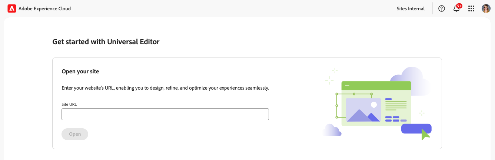

# Acessar e navegar no editor universal {#navigating}

Saiba mais sobre as noções básicas de acesso e navegação no Editor universal.

## Introdução {#introduction}

O Editor universal permite a edição de qualquer aspecto de qualquer conteúdo em qualquer implementação, para que você possa oferecer experiências excepcionais, aumentar a velocidade do conteúdo e proporcionar uma experiência de desenvolvedor de última geração.

Para isso, o editor universal oferece aos autores de conteúdo uma interface intuitiva que exige apenas um treinamento mínimo para que eles possam simplesmente entrar e começar a editar o conteúdo. Este documento descreve como navegar pelo Editor universal.

>[!TIP]
>
>* Para obter detalhes sobre a criação com o Editor Universal, consulte o documento [Criação de Conteúdo com o Editor Universal](/help/sites-cloud/authoring/universal-editor/authoring.md).
>* Para obter uma introdução mais detalhada ao Editor Universal, consulte [Introdução ao Editor Universal](/help/implementing/universal-editor/introduction.md).

## Preparação do aplicativo {#prepare-app}

Para criar conteúdo para um aplicativo usando o editor universal, o aplicativo precisa ser instrumentado por um desenvolvedor para oferecer suporte ao editor.

>[!TIP]
>
>Consulte o documento [Introdução ao Editor universal no AEM](/help/implementing/universal-editor/getting-started.md) para obter um exemplo de como configurar um aplicativo do AEM para funcionar com o Editor universal.

## Acesso ao Editor universal {#accessing}

Depois que o aplicativo é instrumentado para funcionar com o Editor universal, o Editor universal pode ser acessado dentro do AEM as a Cloud Service e diretamente sem acessar o AEM.

### Acesso no AEM as a Cloud Service {#accessing-aem}

1. Faça logon na instância de criação do AEM as a Cloud Service.
1. Use o console [**Sites**](/help/sites-cloud/authoring/sites-console/introduction.md) para navegar até a página criada para uso com o Editor Universal que você deseja editar.
1. Editar a página.
1. O Editor universal é aberto para editar a página selecionada.

>[!NOTE]
>
>Ao editar uma página no console [**Sites**](/help/sites-cloud/authoring/sites-console/introduction.md), o console abrirá o editor apropriado ao [modelo](/help/sites-cloud/authoring/page-editor/templates.md) da página, o Editor Universal descrito neste documento ou o [editor de páginas](/help/sites-cloud/authoring/page-editor/introduction.md).

### Acesso Direto {#accessing-directly}

1. Faça logon no Editor universal. Você precisa de uma Adobe ID para entrar e [ter acesso ao Editor Universal](/help/implementing/universal-editor/getting-started.md#request-access).

1. Depois de entrar, insira a URL da página que deseja editar na [barra de local](#location-bar), para começar a editar conteúdo, como conteúdo de texto ou conteúdo de mídia.

## Noções básicas da interface {#ui}

A interface do usuário do é dividida nessas áreas principais.

* [A barra de navegação superior do Experience Platform](#experience-cloud-header)
* [A barra de ferramentas do Editor universal](#universal-editor-toolbar)
* [O editor](#editor)
* [O painel de propriedades](#properties-rail)

>[!TIP]
>
>O Editor Universal oferece várias [opções de personalização](/help/implementing/universal-editor/customizing.md) e [pontos de extensão](/help/implementing/universal-editor/extending.md) que podem ser modificadas e adicionadas à funcionalidade do editor. Por esse motivo, você pode ver opções diferentes das padrão documentadas aqui.

### Barra de navegação superior do Experience Platform {#experience-cloud-header}

A barra de navegação superior do Experience Platform está sempre presente na parte superior da tela. É uma âncora que informa onde você está na Experience Cloud e o ajuda a navegar por outros aplicativos da Experience Cloud.

Para obter detalhes sobre a barra de navegação superior do Experience Platform, consulte o [guia da interface do usuário do Adobe Experience Platform](https://experienceleague.adobe.com/en/docs/experience-platform/landing/platform-ui/ui-guide#top-navigation-bar)

#### Conta {#user-properties}

Tocar ou clicar no ícone de conta abre um menu com as configurações do usuário.

Para o Editor Universal, sob o título **Configurações do Produto**, há uma opção para alternar entre a versão de produção atual do Editor Universal e a versão de visualização futura.

### A barra de ferramentas do editor universal {#universal-editor-toolbar}

A barra de ferramentas do Editor Universal está sempre presente na parte superior da tela logo abaixo [do cabeçalho do Experience Cloud](#experience-cloud-header). Ele fornece acesso rápido para navegar para outra página para editar e publicar a página atual.

Dependendo da configuração do seu programa, ele também pode apresentar [recursos adicionais que foram habilitados como extensões pelo seu administrador.](#additional-toolbar-buttons)

#### O Botão Início {#home-button}

O botão Home retorna à página inicial do Universal Editor

Na página inicial, você pode inserir o URL do site que deseja editar com o Editor universal.

>[!NOTE]
>
>Qualquer página que você deseja editar com o Editor Universal deve ser [instrumentada para oferecer suporte ao Editor Universal](/help/implementing/universal-editor/getting-started.md).

Uma seção de **Links Rápidos** fornece recursos de ajuda, e uma seção de **Recentes** fornece links para páginas abertas recentemente com o Universal Editor.

#### Barra de localização {#location-bar}

A barra de localização mostra o endereço da página que você está editando. Selecione para inserir o endereço de outra página a ser editada.

>[!TIP]
>
>Use a tecla de atalho `l` (a letra l) para abrir a barra de endereços.

>[!NOTE]
>
>Qualquer página que você deseja editar com o Editor Universal deve ser [instrumentada para oferecer suporte ao Editor Universal](/help/implementing/universal-editor/getting-started.md).

#### Desfazer e refazer {#undo-redo}

Selecione os botões Desfazer ou Refazer para desfazer ou refazer a última edição no editor. Consulte o documento [Criação de Conteúdo com o Editor Universal](/help/sites-cloud/authoring/universal-editor/authoring.md#undo-redo) para obter mais informações.

>[!TIP]
>
>Use a tecla de atalho `Command-Z` ou `Shift-Command-Z` para desfazer ou refazer, respectivamente.

#### Logon do desenvolvedor local {#local-developer-login}

Selecione o ícone de login de desenvolvedor local se precisar autenticar facilmente no seu SDK do AEM local [durante o desenvolvimento local.](/help/implementing/universal-editor/local-dev.md)

#### Modo responsivo {#emulator}

Selecione o ícone de modo responsivo para definir como o Editor universal renderiza a página.

Tocar ou clicar no ícone de modo responsivo revela as opções.

Por padrão, o editor é aberto no layout de desktop, onde a altura e a largura são definidas automaticamente pelo navegador.

Também é possível optar por emular um dispositivo móvel e, no editor universal:

* Definir sua orientação
* Definir largura e altura
* Alterar a orientação

#### Visualização {#preview-mode}

No modo de visualização, a página é renderizada no editor da maneira como seria vista em seu serviço publicado. Isso permite que o autor de conteúdo navegue pelo conteúdo clicando em links e assim por diante.

>[!TIP]
>
>Use a tecla de atalho `p` para alternar de e para o modo de visualização.

#### Abrir página {#open-page}

Selecione o ícone abrir página para abrir a página que você está editando atualmente em sua própria guia do navegador, livre do editor para visualizar seu conteúdo.

>[!TIP]
>
>Use a tecla de atalho `o` (a letra o) para abrir a visualização do aplicativo.

>[!TIP]
>
>A URL de visualização do seu aplicativo [pode ser personalizada](/help/implementing/universal-editor/customizing.md#custom-preview-urls).

>[!NOTE]
>
>O botão Abrir página [pode ser desabilitado](/help/implementing/universal-editor/customizing.md#open-page) e, portanto, pode não aparecer no seu editor.

#### Publicação {#publish}

Selecione o botão publicar para poder publicar as alterações no conteúdo em tempo real para consumo pelos leitores ou em um ambiente de pré-visualização para revisão.

>[!TIP]
>
>Consulte o documento [Publicando Conteúdo com o Universal Editor](publishing.md) para obter mais informações sobre a publicação com o Universal Editor.

>[!NOTE]
>
>O botão de publicação [pode ser desabilitado](/help/implementing/universal-editor/customizing.md#disable-publish) e, portanto, pode não aparecer no seu editor.

#### Reticências {#ellipsis}

Outras opções padrão podem ser acessadas usando o botão de reticências.

Por exemplo, a capacidade de desfazer a publicação de uma página (ou seja, reverter a ação do botão [**Publicar**](#publish)) é acessível por meio do botão de reticências.

#### Botões adicionais {#additional-toolbar-buttons}

O Universal Editor oferece uma experiência de criação personalizável e extensível. Se você vir botões adicionais na barra de ferramentas, o Editor universal foi estendido.

* Para obter detalhes sobre como uma extensão individual funciona, [consulte a documentação de criação do Editor Universal.](/help/sites-cloud/authoring/universal-editor/authoring.md#toolbar-options)
* Para obter detalhes sobre as possibilidades de extensão, consulte a [Extensão do Editor Universal.](/help/implementing/universal-editor/extending.md)
* Para obter detalhes sobre como instalar uma extensão individual, consulte a [documentação do Extension Manager.](https://developer.adobe.com/uix/docs/extension-manager/extension-developed-by-adobe/)

### O editor {#editor}

O editor ocupa a maior parte da janela e é onde a página especificada na [barra de localização](#location-bar) é renderizada.

Se o editor estiver no [modo de visualização](#preview-mode), o conteúdo será navegável e você poderá seguir os links, mas não poderá editar o conteúdo.

### Painel Propriedades {#properties-rail}

O painel de propriedades está sempre presente no lado direito do editor. Dependendo do modo, podem ser exibidos detalhes de um componente selecionado no conteúdo ou na hierarquia do conteúdo da página.

Dependendo da configuração do seu programa, ele também pode apresentar [recursos adicionais que foram habilitados como extensões pelo seu administrador.](#additional-properties-panel-buttons)

#### Modo de propriedades {#properties-mode}

No modo de propriedades, o painel mostra as propriedades do componente atualmente selecionado no editor. Esse é o modo padrão do painel de propriedades quando uma página é carregada.

Dependendo do tipo de componente selecionado, os detalhes podem ser exibidos e modificados no painel de propriedades.

Nem todos os componentes têm detalhes que podem ser mostrados e/ou editados.

>[!TIP]
>
>Use a tecla de atalho `d` para alternar para o modo de propriedades.

#### Modo de árvore de conteúdo {#content-tree-mode}

No modo de árvore de conteúdo, o painel mostra a hierarquia do conteúdo da página.

* Ao selecionar um item na árvore de conteúdo, o editor rola até esse conteúdo e o seleciona.
* Ao clicar duas vezes em um item na árvore de conteúdo, o editor rola até esse conteúdo e o seleciona e também abre as propriedades associadas no modo de propriedades [.](#properties-mode)
* Ao clicar com o botão direito do mouse em um item da árvore, um menu de contexto será aberto com ações apropriadas para o item.

>[!TIP]
>
>Use a tecla de atalho `f` para alternar para o modo de árvore de conteúdo.

##### Abrir no Editor CF {#edit}

Ao editar, as opções do componente selecionado aparecem no painel de propriedades, onde você pode editar o componente selecionado. Se o componente selecionado for um Fragmento de conteúdo, você também poderá selecionar o botão **Abrir no Editor de CF**.

Tocar ou clicar no botão **Abrir no Editor do CF** abre o [editor de Fragmento de Conteúdo](/help/assets/content-fragments/content-fragments-managing.md#opening-the-fragment-editor) em uma nova guia. Isso permite acessar todo o potencial do editor de Fragmento de conteúdo para editar o Fragmento de conteúdo associado.

Dependendo das necessidades do fluxo de trabalho, talvez você queira editar o Fragmento de conteúdo no Editor universal ou diretamente no editor de Fragmento de conteúdo.

>[!TIP]
>
>Use a tecla de atalho `e` para abrir um fragmento de conteúdo selecionado no editor de fragmentos de conteúdo.

##### Adicionar {#add}

Se você selecionar um componente de contêiner na árvore de conteúdo ou no editor, a opção adicionar aparecerá no painel de propriedades.

Tocar ou clicar no botão adicionar abre um menu suspenso de componentes que estão disponíveis para [adicionar ao contêiner selecionado](/help/sites-cloud/authoring/universal-editor/authoring.md#adding-components).

>[!TIP]
>
>Use a tecla de atalho `a` para adicionar um componente a um componente de contêiner selecionado.

##### Duplicado {#duplicate}

Se você selecionar um componente em um componente de contêiner na árvore de conteúdo ou no editor, a opção de duplicação aparece no painel de propriedades.

Tocar ou clicar no botão duplicar [duplica o componente selecionado](/help/sites-cloud/authoring/universal-editor/authoring.md#duplicating-components).

>[!TIP]
>
>Use a tecla de atalho `Command+d` para excluir um componente selecionado de um contêiner.

##### Excluir {#delete}

Se você selecionar um componente em um componente de contêiner na árvore de conteúdo ou no editor, a opção de exclusão aparecerá no painel de propriedades.

Tocar ou clicar no botão Excluir [exclui o componente](/help/sites-cloud/authoring/universal-editor/authoring.md#deleting-components).

>[!TIP]
>
>Use a tecla de atalho `Shift+Backspace` para excluir um componente selecionado de um contêiner.

##### Copiar e colar {#copy-paste}

Você pode copiar e colar componentes que estão em [contêineres.](/help/implementing/universal-editor/field-types.md#container)

>[!TIP]
>
>Use a tecla de atalho `Command-C` ou `Command-V` para copiar ou colar, respectivamente.

Consulte o documento [Criação de Conteúdo com o Editor Universal](/help/sites-cloud/authoring/universal-editor/authoring.md#copy-paste) para obter mais informações.

#### Botões adicionais {#additional-properties-panel-buttons}

O Universal Editor oferece uma experiência de criação personalizável e extensível. Se você vir botões adicionais no painel de propriedades, o Editor universal foi estendido.

* Para obter detalhes sobre como uma extensão individual funciona, [consulte a documentação de criação do Editor Universal.](/help/sites-cloud/authoring/universal-editor/authoring.md#properties-panel-options)
* Para obter detalhes sobre as possibilidades de extensão, consulte a [Extensão do Editor Universal.](/help/implementing/universal-editor/extending.md)
* Para obter detalhes sobre como instalar uma extensão individual, consulte a [documentação do Extension Manager.](https://developer.adobe.com/uix/docs/extension-manager/extension-developed-by-adobe/)

## Próximas etapas {#next-steps}

Agora que você sabe como acessar e navegar no Universal Editor, você está pronto para [criar conteúdo usando-o](/help/sites-cloud/authoring/universal-editor/authoring.md).
