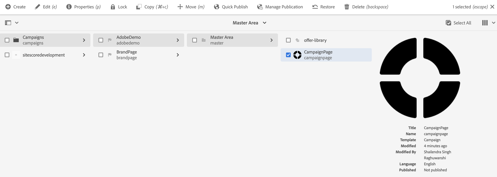

# Criação de um informativo do Adobe Experience Manager {#creating-newsletter}

Antes de executar as etapas apresentadas abaixo, é necessário primeiro [integrar](/help/sites-cloud/integrating/integrating-campaign-classic.md) Adobe Campaign Classic e AEM as a Cloud Service. Depois de configurar o Adobe Campaign Classic e AEM as a Cloud Service, você aprenderá a criar um informativo do Adobe Experience Manager.

1. Na instância do autor do AEM, clique no logotipo do Adobe Experience Manager no lado superior esquerdo da página e selecione **Sites**.
1. Selecione Campanha, clique em **Criar Página**.
   
1. Selecione Marca e clique em **Próximo**.
1. Insira um título e clique em **Criar** e **Concluído**.
1. Para criar uma página do Campaign, acesse **Campanhas: AdobeDemoPrincipal** e clique em **Criar Página**.
   
1. Selecione o modelo de Campanha e clique em **Próximo** e **Concluído**.
1. Insira um título , clique em **Criar** e **Concluído**.
1. Ir para **Campaign: Loja AdobeDemo Principal** e marque a caixa de seleção CampaignPage . Clique em **Propriedades** no canto superior esquerdo.
   
1. Vá para o **Cloud Service** guia :
   * Selecione Adobe Campaign na lista suspensa Cloud Service Configurations .
   * Selecione o nome desejado para a configuração do Adobe Campaign.
   * **Salvar** e **Fechar**.
1. Para criar uma página de email do Adobe Campaign Classic, acesse **Campaign: Por exemplo, AdobeDemo Principal** e clique em **Criar Página**.
1. Selecione o modelo Email do Adobe Campaign (por exemplo, AC 6.1) e clique em **Próximo**.
1. Na página Criar , insira o título do boletim informativo, clique em **Criar** e **Concluído**.
1. Ir para **Campaign: Por exemplo, AdobeDemo Principal**, marque a caixa de seleção Campaign Classic e clique em **Editar** no canto superior esquerdo para abrir a página de email.
1. Edite a página de informativo de email do Adobe Campaign Classic de acordo com suas necessidades.
1. Clique no botão **Informações da página** no canto superior esquerdo e clique em **Publicar página**.
1. Selecione a configuração na qual a página deve ser publicada. Clique em **Publicar**.
   
1. A página do boletim informativo foi publicada na instância de publicação e também na configuração AEM Adobe Campaign Classic.
   * Agora a página do informativo estará visível no Adobe Campaign Classic
1. Clique no botão Informações da página e clique em **Iniciar fluxo de trabalho**.
1. Selecionar **Aprovar para Adobe Campaign** como o modelo de fluxo de trabalho e clique no botão **Iniciar fluxo de trabalho** botão.
1. Um aviso de isenção de responsabilidade é exibido na parte superior da página. Clique em **Concluído** para confirmar a revisão e clique novamente em **OK**.
1. Clique em **Concluído** e selecione **Aprovação de boletim informativo** na lista suspensa Próxima etapa e clique no botão **OK** botão.

## Criação de um destinatário {#creating-recipient}

1. Abra o servidor do Adobe Campaign Classic usando o console do cliente Adobe Campaign Classic.
1. Vá para a visualização do Explorer.
1. Na visualização de árvore, à esquerda, vá para Profiles and Targets e selecione **Recipients**.
   
1. Preencha os Detalhes do recipient.
   * Insira o nome.
   * Insira o Sobrenome.
   * Insira o email.
   * Clique em **Salvar**.

## Criação de um delivery de email no Adobe Campaign Classic {#create-delivery}

1. Abra o servidor do Adobe Campaign Classic usando o console do cliente Adobe Campaign Classic.
1. Vá para a visualização do Explorer.
1. Na visualização de árvore à esquerda, selecione **Campaign Management** e selecione **Deliveries**.
1. No canto superior direito, clique em **Novo**.
1. Selecionar **Entrega de email com conteúdo AEM** na lista suspensa Delivery template e clique em **Continuar**.
1. Clique no link From em Email parameters.
   * Insira o endereço do Remetente.
   * Insira o campo De .
   * Clique em **OK**.
1. Clique em **Para** link e clique em **Adicionar** na tela selecionar destino.
1. Selecionar **Um recipient** e clique em **Próximo**.
   
1. Selecione o recipient criado [before](#creating-recipient) e clique em **Concluir**.
1. O recipient foi selecionado. Clique em **OK**.
1. Clique em **Sincronizar**.
1. Selecione a página de email na lista e clique em **OK**.
1. O template de email é sincronizado. Clique em **Atualizar conteúdo** se não estiver carregado.
1. Clique em **Enviar** para enviar o email.
1. Na próxima tela, selecione **Delivery o mais rápido possível** e, em seguida, clique em **Analisar**.
   
1. Agora que o delivery tiver sido criado, clique em **Confirmar entrega** para começar a enviar o email. Clique em **Sim** para confirmar.
   
1. O delivery foi iniciado. Clique em **Fechar**.
1. Clique em **Salvar** para salvar o delivery.
