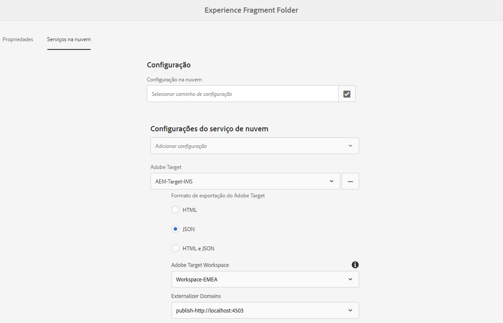
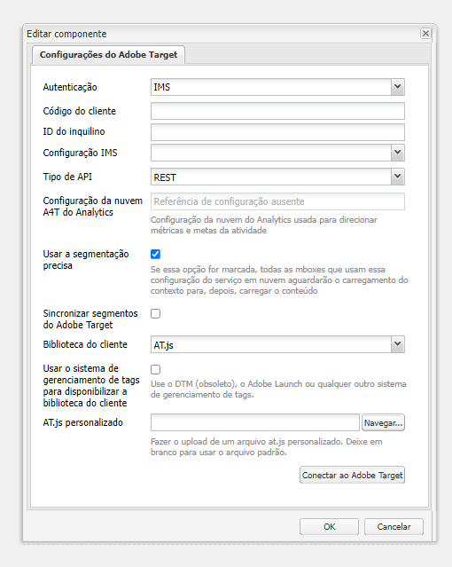

# Exportar fragmentos de experiência para o Adobe Target{#exporting-experience-fragments-to-adobe-target}

>[!CAUTION]
>
>* Os Fragmentos de experiência do AEM são exportados para o espaço de trabalho padrão do Adobe Target.
>* O AEM deve estar integrado ao Adobe Target, de acordo com as instruções na seção [Integração com o Adobe Target](/help/sites-cloud/integrating/integrating-adobe-target.md).

Você pode exportar [fragmentos de experiência](/help/sites-cloud/authoring/fundamentals/experience-fragments.md) criados no Adobe Experience Manager as a Cloud Service (AEM) para o Adobe Target (Target). Eles podem ser usados como ofertas em atividades do Target, para testar e personalizar experiências em escala.

Há três opções disponíveis para exportar um fragmento de experiência para o Adobe Target:

* HTML (padrão): suporte para entrega de conteúdo da Web e híbrido
* JSON: suporte para entrega de conteúdo headless
* HTML e JSON

Para preparar sua instância para exportar fragmentos de experiência do AEM para o Adobe Target, é necessário:

* [Fazer a integração com o Adobe Target](/help/sites-cloud/integrating/integrating-adobe-target.md)
* [Adicionar a configuração da nuvem](#add-the-cloud-configuration)
* [Adicionar a configuração herdada](#add-the-legacy-configuration)

Depois disso, será possível:

* [Exportar um fragmento de experiência para o Adobe Target](#exporting-an-experience-fragment-to-adobe-target)
* [Usar seus fragmentos de experiência no Adobe Target](#using-your-experience-fragments-in-adobe-target)
* E também [Excluir um fragmento de experiência já exportado para o Adobe Target](#deleting-an-experience-fragment-already-exported-to-adobe-target)

Os fragmentos de experiência podem ser exportados para o espaço de trabalho padrão no Adobe Target ou para espaços de trabalho definidos pelo usuário.

>[!NOTE]
>
>Os espaços de trabalho do Adobe Target não existem no próprio Adobe Target. Eles são definidos e gerenciados no Adobe IMS (Identity Management System) e depois selecionados para uso nas soluções que utilizam o console do Adobe Developer.

>[!NOTE]
>
>Os espaços de trabalho do Adobe Target podem ser usados para permitir que membros de uma organização (grupo) criem e gerenciem ofertas e atividades somente para essa organização, sem conceder acesso a outros usuários. Por exemplo, organizações específicas de cada país dentro de uma preocupação global.

>[!NOTE]
>
>Para obter mais informações, consulte também:
>
>* [Desenvolvimento do Adobe Target](https://developers.adobetarget.com/)
>* [Componentes principais - Fragmentos de experiência](https://experienceleague.adobe.com/docs/experience-manager-core-components/using/introduction.html?lang=pt-BR)
>* [Adobe Target - como usar os fragmentos de experiência do Adobe Experience Manager (AEM)?](https://experienceleague.adobe.com/docs/target/using/experiences/offers/aem-experience-fragments.html?lang=pt-BR)
>* [AEM 6.5 - configuração manual da integração com o Adobe Target - criação de uma configuração da nuvem do Target](https://experienceleague.adobe.com/docs/experience-manager-65/administering/integration/target-configuring.html?lang=pt-BR#creating-a-target-cloud-configuration)

## Pré-requisitos {#prerequisites}

Várias ações são necessárias:

1. Você precisa [integrar o AEM ao Adobe Target](/help/sites-cloud/integrating/integrating-adobe-target.md).

1. Os fragmentos de experiência são exportados da instância do autor do AEM, portanto, é necessário [Configurar o Externalizador de links do AEM](/help/implementing/developing/extending/experience-fragments.md#configuring-the-aem-link-externalizer) na instância do autor para garantir que todas as referências do fragmento de experiência sejam externalizadas para entrega na Web.

   >[!NOTE]
   >
   >Para a regravação de links não coberta por padrão, o [Provedor de regravação de link do fragmento de experiência](/help/implementing/developing/extending/experience-fragments.md#the-experience-fragment-link-rewriter-provider-html) está disponível. Com isso, regras personalizadas podem ser desenvolvidas para sua instância.

## Adicionar a configuração da nuvem {#add-the-cloud-configuration}

Antes de exportar um fragmento, é necessário adicionar a **Configuração da nuvem** do **Adobe Target** ao fragmento ou pasta. Isso também permite:

* especificar as opções de formato a serem usadas para a exportação
* selecionar um espaço de trabalho do Target como destino
* selecionar um domínio externalizador para regravação de referências no fragmento de experiência (opcional)

As opções necessárias podem ser selecionadas nas **Propriedades de página** da pasta e/ou fragmento necessários; a especificação será herdada conforme necessário.

1. Navegue até o console **Fragmentos de experiência**.

1. Abra as **Propriedades de página** da pasta ou fragmento apropriado.

   >[!NOTE]
   >
   >Se você adicionar a configuração da nuvem à pasta principal do fragmento de experiência, a configuração será herdada pelas pastas secundárias.
   >
   >Se você adicionar a configuração da nuvem ao próprio fragmento de experiência, a configuração será herdada por todas as variações.

1. Selecione a guia **Cloud Services**.

1. Em **Configuração do Cloud Service**, selecione **Adobe Target** na lista suspensa.

   >[!NOTE]
   >
   >O formato JSON de uma oferta de fragmento de experiência pode ser personalizado. Para fazer isso, defina um componente do fragmento de experiência do cliente e anote como exportar suas propriedades no componente Modelo do Sling.
   >
   >Consulte o componente principal: [Componentes principais - Fragmentos de experiência](https://experienceleague.adobe.com/docs/experience-manager-core-components/using/components/experience-fragment.html?lang=pt-BR)

1. Em **Adobe Target**, selecione:

   * a configuração apropriada
   * a opção de formato exigida
   * um espaço de trabalho do Adobe Target
   * se necessário, o domínio externalizador

   >[!CAUTION]
   >
   >O domínio externalizador é opcional.
   >
   > Um externalizador do AEM é configurado quando você deseja que o conteúdo exportado aponte para um domínio de *publicação* específico. Para obter mais detalhes, consulte [Configurar o Externalizador de links do AEM](/help/implementing/developing/extending/experience-fragments.md#configuring-the-aem-link-externalizer).
   >
   > Observe também que os domínios do externalizador são relevantes somente para o conteúdo do fragmento de experiência que é enviado ao Target, e não para metadados como Visualizar conteúdo da oferta.

   Por exemplo, para uma pasta:

   

1. **Salvar e fechar**.

## Adicionar a configuração herdada {#add-the-legacy-configuration}

<!-- This is effectively the Manually Integrating with Adobe Target {#manually-integrating-with-adobe-target} section from 6.5 -->

>[!IMPORTANT]
>
>Adicionar uma nova configuração herdada é um cenário de caso especial, permitido apenas na exportação de fragmentos de experiência.

Depois de [adicionar a Configuração da nuvem](#add-the-cloud-configuration) para usar a Experience Platform Launch para integrar inicialmente o AEM com o Adobe Target, também é necessário integrar manualmente ao Adobe Target usando uma configuração herdada.

### Criação de uma configuração da nuvem do Target {#creating-a-target-cloud-configuration}

Para permitir que o AEM interaja com o Adobe Target, crie uma configuração da nuvem do Target. Para criar a configuração, forneça o código de cliente do Adobe Target e as credenciais do usuário.

Você precisa criar a configuração da nuvem do Target apenas uma vez, pois é possível associá-la a várias campanhas do AEM. Se você tiver vários códigos de cliente do Adobe Target, crie uma configuração para cada código de cliente.

É possível definir a configuração da nuvem para sincronizar segmentos do Adobe Target. Se você habilitar a sincronização, os segmentos serão importados do Target em segundo plano assim que a configuração da nuvem for salva.

Use o procedimento a seguir para criar uma configuração da nuvem do Target no AEM:

1. Navegue até **Cloud Services herdados** através da **Logotipo do AEM** > **Ferramentas** > **Cloud Services** > **Cloud Services herdados**.
Por exemplo: ([http://localhost:4502/libs/cq/core/content/tools/cloudservices.html](http://localhost:4502/libs/cq/core/content/tools/cloudservices.html))

   A página de visão geral da **Adobe Experience Cloud** é aberta.

1. Na seção **Adobe Target**, clique em **Configurar agora**.
1. Na caixa de diálogo **Criar configuração**:

   1. Forneça um **Título** à configuração.
   1. Selecione o modelo da **Configuração do Adobe Target**.
   1. Clique em **Criar**.

Agora é possível selecionar a nova configuração para edição.

1. A caixa de diálogo de edição é aberta.

   

   <!-- Can this still occur?

   >[!NOTE]
   >
   >When configuring A4T with AEM, you may see a Configuration reference missing entry. To be able to select the analytics framework, do the following:
   >
   >1. Navigate to **Tools** &gt; **General** &gt; **CRXDE Lite**.
   >1. Navigate to **/libs/cq/analytics/components/testandtargetpage/dialog/items/tabs/items/tab1_general/items/a4tAnalyticsConfig**
   >1. Set the property **disable** to **false**.
   >1. Tap or click **Save All**.

   -->

1. Na caixa de diálogo **Configurações do Adobe Target**, forneça valores para essas propriedades.

   * **Autenticação**: o padrão é IMS (o método Credenciais de usuário foi descontinuado)

   * **Código do cliente**: o código do cliente da conta do Target

   * **ID do locatário**: a ID do locatário

   * **Configuração do IMS**: selecione a configuração necessária na lista suspensa

   * **Tipo de API**: o padrão é REST (o XML foi descontinuado)

   * **Configuração da nuvem do A4T Analytics**: selecione a configuração da nuvem do Analytics usada para métricas e metas de atividade do Target. Isso é necessário se estiver usando o Adobe Analytics como fonte de relatórios ao direcionar conteúdo.

      <!-- Is this needed?
     If you do not see your cloud configuration, see note in [Configuring A4T Analytics Cloud Configuration](#configuring-a-t-analytics-cloud-configuration).
     -->

   * **Usar direcionamento preciso:** por padrão, essa caixa de seleção está marcada. Se selecionada, a configuração do Cloud Service aguardará o carregamento do contexto antes de carregar o conteúdo. Veja a observação a seguir.

   * **Sincronizar segmentos do Adobe Target:** selecione essa opção para baixar segmentos definidos no Target e usá-los no AEM. Você deve selecionar essa opção quando a propriedade Tipo de API for REST, pois os segmentos em linha não são compatíveis e você sempre precisa usar segmentos do Target. (Observe que o termo “segmento” do AEM equivale ao termo “público-alvo” do Target.)

   * **Biblioteca do cliente:** o padrão é a AT.js (a mbox.js foi descontinuada)

      >[!NOTE]
      >
      >O arquivo da biblioteca do Target, [AT.JS](https://experienceleague.adobe.com/docs/target/using/implement-target/client-side/implement-target-for-client-side-web.html?lang=pt-BR), é uma nova biblioteca de implementação do Adobe Target, projetada para implementações típicas da Web e aplicativos de página única.
      >
      >A mbox.js foi descontinuada e será removida em um estágio posterior.
      >
      >A Adobe recomenda usar a AT.js como a biblioteca de cliente, em vez da mbox.js.
      >
      >A AT.js oferece várias melhorias em relação à biblioteca mbox.js:
      >
      >* Tempos de carregamento de página aprimorados para implementações da Web
      >* Segurança aprimorada
      >* Melhores opções de implementação para aplicativos de página única
      >* A AT.js contém os componentes que foram incluídos na target.js, portanto, a target.js não é mais chamada
      >
      >É possível selecionar AT.js ou mbox.js no menu suspenso **Biblioteca do cliente**.

   * **Usar o sistema de gerenciamento de tags para fornecer a biblioteca do cliente** - selecione essa opção para usar a biblioteca do cliente do Adobe Launch ou outro sistema de gerenciamento de tags (ou DTM, que foi descontinuado).

   * **AT.js personalizada**: procure e faça upload de sua AT.js personalizada. Deixe em branco para usar a biblioteca padrão.

      >[!NOTE]
      >
      >Por padrão, quando você opta pelo assistente de configuração do Adobe Target, o Direcionamento preciso é ativado.
      >
      >Direcionamento preciso significa que a configuração do Cloud Service aguarda o contexto ser carregado antes de carregar o conteúdo. Como resultado, em termos de desempenho, o direcionamento preciso pode criar um atraso de alguns milissegundos antes de carregar o conteúdo.
      >
      >O direcionamento preciso é sempre ativado na instância do autor. No entanto, na instância de publicação, é possível desativar o direcionamento preciso globalmente, limpando a marca de seleção ao lado de Direcionamento preciso na configuração do Cloud Service (**http://localhost:4502/etc/cloudservices.html**). Você também pode ativar e desativar o direcionamento preciso para componentes individuais, independentemente das suas definições na configuração do Cloud Service.
      >
      >Se você ***já*** tiver criado componentes direcionados e alterar essa configuração, suas alterações não afetarão esses componentes. Você deve alterar esses componentes diretamente.

1. Clique em **Conectar-se ao Adobe Target** para inicializar a conexão com o Target. Se a conexão for bem-sucedida, a mensagem **Conexão bem-sucedida** será exibida. Clique em **OK** na mensagem e, em seguida, em **OK** na caixa de diálogo.

### Adicionar uma estrutura do Target {#adding-a-target-framework}

<!-- Is this section needed? -->

Após definir a configuração da nuvem do Target, adicione uma estrutura do Target. A estrutura identifica os parâmetros padrão enviados para o Adobe Target a partir dos componentes do [ContextHub](/help/implementing/developing/personalization/configuring-contexthub.md) disponíveis. O Target usa os parâmetros para determinar os segmentos que se aplicam ao contexto atual.

Você pode criar várias estruturas para uma única configuração do Target. Várias estruturas são úteis quando você precisa enviar um conjunto de parâmetros diferentes ao Target para diferentes seções do seu site. Crie uma estrutura para cada conjunto de parâmetros que você precisa enviar. Associe cada seção do site à estrutura apropriada. Observe que uma página da Web pode usar somente uma estrutura de cada vez.

1. Na página de configuração do Target, clique no **+** (sinal de adição) ao lado de Configurações disponíveis.

1. Na caixa de diálogo Criar estrutura, especifique um **Título**, selecione a **estrutura do Adobe Target** e clique em **Criar**.

   <!--  -->

   A página de estrutura é aberta. O Sidekick fornece componentes que representam informações do [ContextHub](/help/implementing/developing/personalization/configuring-contexthub.md) que podem ser mapeadas.

   <!--  -->

1. Arraste o componente Contexto do cliente que representa os dados que você deseja usar para mapear até a zona de destino. Como alternativa, arraste o componente de **Armazenamento do ContextHub** para a estrutura.

   >[!NOTE]
   >
   >Ao mapear, os parâmetros são enviados para uma mbox por meio de sequências de caracteres simples. Não é possível mapear matrizes do ContextHub.

   Por exemplo, para usar os **dados de perfil** dos visitantes do seu site para controlar sua campanha do Target, arraste o componente **Dados de perfil** para a página. As variáveis de dados de perfil disponíveis para mapeamento para parâmetros do Target são exibidas.

   <!--  -->

1. Selecione as variáveis que você deseja tornar visíveis para o sistema do Adobe Target marcando a caixa de seleção **Compartilhar** nas colunas apropriadas.

   <!--  -->

   >[!NOTE]
   >
   >A sincronização de parâmetros é uma via de mão única - do AEM para o Adobe Target.

Sua estrutura foi criada. Para replicar a estrutura para a instância de publicação, use a opção **Ativar estrutura** no sidekick.

<!--
### Associating Activities With the Target Cloud Configuration  {#associating-activities-with-the-target-cloud-configuration}

Associate your [AEM activities](/help/sites-cloud/authoring/personalization/activities.md) with your Target cloud configuration so that you can mirror the activities in [Adobe Target](https://experienceleague.adobe.com/docs/target/using/experiences/offers/manage-content.html).

>[!NOTE]
>
>What types of activities are available is determined by the following:
>
>* If the **xt_only** option is enabled on the Adobe Target tenant (clientcode) used on the AEM side to connect to Adobe Target, then you can create **only** XT activities in AEM.
>
>* If the **xt_only** options is **not** enabled on the Adobe Target tenant (clientcode), then you can create **both** XT and A/B activities in AEM.
>
>**Additional note:** **xt_only** options is a setting applied on a certain Target tenant (clientcode) and can only be modified directly in Adobe Target. You cannot enable or disable this option in AEM.
-->

<!--
### Associating the Target Framework With Your Site {#associating-the-target-framework-with-your-site}

After you create a Target framework in AEM, associate your web pages with the framework. The targeted components on the pages send the framework-defined data to Adobe Target for tracking. (See [Content Targeting](/help/sites-cloud/authoring/personalization/targeted-content.md).)

When you associate a page with the framework, the child pages inherit the association.

1. In the **Sites** console, navigate to the site that you want to configure.
1. Using either [quick actions](/help/sites-cloud/authoring/getting-started/basic-handling.md#quick-actions) or [selection mode](/help/sites-cloud/authoring/getting-started/basic-handling.md#selecting-resources), select **View Properties.**
1. Select the **Cloud Services** tab.
1. Tap/click **Edit**.
1. Tap/click **Add Configuration** under **Cloud Service Configurations** and select **Adobe Target**.

  

1. Select the framework you want under **Configuration Reference**.

   >[!NOTE]
   >
   >Make sure that you select the specific **framework** that you created and not the Target cloud configuration under which it was created.

1. Tap/click **Done**.
1. Activate the root page of the website to replicate it to the publish server. (See [How To Publish Pages](/help/sites-cloud/authoring/fundamentals/publishing-pages.md).)

   >[!NOTE]
   >
   >If the framework you attached to the page was not activated yet, a wizard opens which allows you to publish it as well.
-->

## Exportar um fragmento de experiência para o Adobe Target {#exporting-an-experience-fragment-to-adobe-target}

>[!CAUTION]
>
>Para ativos de mídia, como imagens, somente uma referência é exportada para o Target. O ativo em si permanece armazenado no AEM Assets e é entregue a partir da instância de publicação do AEM.
>
>Devido a isso, o fragmento de experiência, com todos os ativos relacionados, precisa ser publicado antes da exportação para o Target.

Para exportar um fragmento de experiência do AEM para o Target (depois de especificar a configuração da nuvem):

1. Navegue até o console Fragmento de experiência.
1. Selecione o fragmento de experiência que deseja exportar para o Target.

   >[!NOTE]
   >
   >Ele deve ser uma variação web do fragmento de experiência.

1. Toque/clique em **Exportar para o Adobe Target**.

   >[!NOTE]
   >
   >Se o fragmento de experiência já tiver sido exportado, selecione **Atualizar no Adobe Target**.

1. Toque/clique em **Exportar sem publicar** ou em **Publicar**, conforme necessário.

   >[!NOTE]
   >
   >Selecionar **Publicar** publicará o fragmento de experiência imediatamente e o enviará para o Target.

1. Toque ou clique em **OK** na caixa de diálogo de confirmação.

   Seu fragmento de experiência agora deve estar no Target.

   >[!NOTE]
   >
   >[Vários detalhes](/help/sites-cloud/authoring/fundamentals/experience-fragments.md#details-of-your-experience-fragment) da exportação podem ser vistos na **Exibição de lista** do console e nas **Propriedades**.

   >[!NOTE]
   >
   >Ao visualizar um fragmento de experiência no Adobe Target, a data da *última modificação* vista é a data em que o fragmento foi modificado pela última vez no AEM, não a data em que o fragmento foi exportado pela última vez para o Adobe Target.

>[!NOTE]
>
>Como alternativa, você pode executar a exportação a partir do editor de páginas, usando comandos comparáveis no menu [Informações da página](/help/sites-cloud/authoring/fundamentals/environment-tools.md#page-information).

## Usar os fragmentos de experiência no Adobe Target {#using-your-experience-fragments-in-adobe-target}

Depois de executar as tarefas anteriores, o fragmento de experiência é exibido na página Ofertas do Target. Consulte a [documentação específica do Target](https://experiencecloud.adobe.com/resources/help/pt_BR/target/target/aem-experience-fragments.html) para saber mais sobre o que você pode realizar lá.

>[!NOTE]
>
>Ao visualizar um fragmento de experiência no Adobe Target, a data da *última modificação* vista é a data em que o fragmento foi modificado pela última vez no AEM, não a data em que o fragmento foi exportado pela última vez para o Adobe Target.

## Excluir um fragmento de experiência já exportado para o Adobe Target {#deleting-an-experience-fragment-already-exported-to-adobe-target}

Excluir um fragmento de experiência que já foi exportado para o Target pode causar problemas se o fragmento já estiver sendo usado em uma oferta no Target. A exclusão do fragmento tornaria a oferta inutilizável, pois o conteúdo do fragmento estaria sendo entregue pelo AEM.

Para evitar essas situações:

* Se o fragmento de experiência não estiver sendo usado atualmente em uma atividade, o AEM permite que o usuário exclua o fragmento sem mostrar uma mensagem de aviso.
* Se o Fragmento de experiência estiver sendo usado atualmente por uma atividade no Target, uma mensagem de erro avisará o usuário do AEM sobre as possíveis consequências que a exclusão do fragmento terá na atividade.

   A mensagem de erro no AEM não proíbe que o usuário exclua (à força) o fragmento de experiência. Se o fragmento de experiência for excluído:

   * A oferta do Target com o fragmento de experiência do AEM pode exibir um comportamento indesejado

      * A oferta provavelmente ainda será renderizada, pois o HTML do fragmento de experiência foi enviado para o Target
      * Qualquer referência no fragmento de experiência pode não funcionar corretamente se os ativos referenciados também tiverem sido excluídos no AEM.
   * É impossível realizar qualquer alteração adicional no fragmento de experiência, pois ele não existe mais no AEM.
