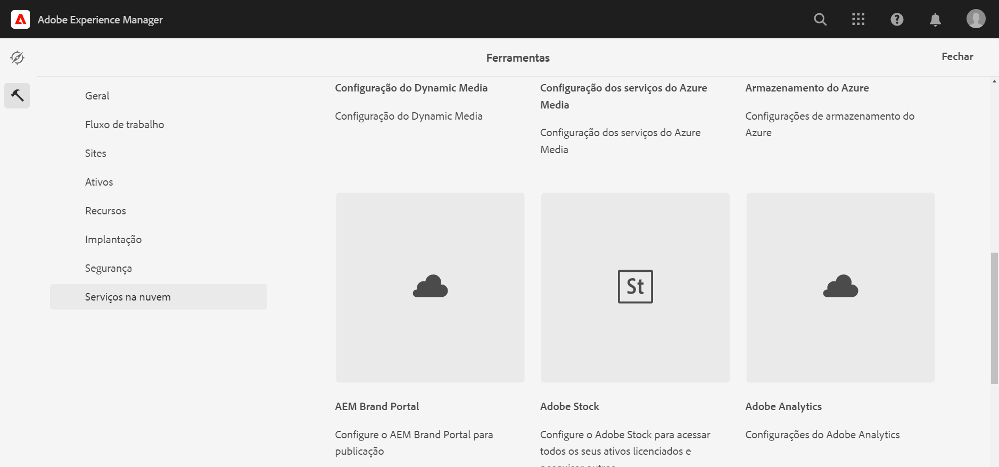
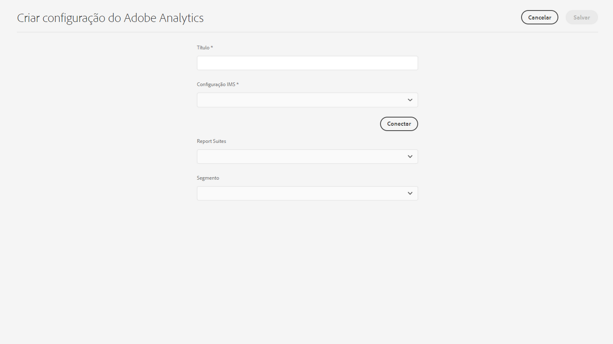

# Integração ao Adobe Analytics{#integrating-with-adobe-analytics}

A integração do Adobe Analytics e do AEM as a Cloud Service permite rastrear a atividade da página da Web. A integração exige:

* usar a interface de toque para criar uma configuração do Analytics no AEM as a Cloud Service. A autenticação IMS é necessária para integrar o Adobe Analytics com o AEM as a Cloud Service.
* adicionar e configurar o Adobe Analytics como uma extensão no [Adobe Launch](#analytics-launch). Para obter mais detalhes sobre o Adobe Launch, consulte [esta página](https://experienceleague.adobe.com/docs/experience-platform/tags/get-started/quick-start.html?lang=pt_BR).

Comparado às versões anteriores do AEM, não há compatibilidade com a estrutura ao configurar o Analytics no AEM as a Cloud Service. Em vez disso, agora é feito por meio do Adobe Launch, que é a ferramenta de fato para instrumentar um site do AEM com recursos do Analytics (bibliotecas JS). No Adobe Launch, uma propriedade é criada, onde a extensão do Adobe Analytics pode ser configurada e as regras são criadas para enviar dados ao Adobe Analytics. O Adobe Launch substituiu a tarefa de análise fornecida pelo SiteCatalyst.

>[!NOTE]
>
>Os clientes do Adobe Experience Manager as a Cloud Service que não têm uma conta existente do Analytics podem solicitar acesso ao Analytics Foundation Pack para Experience Cloud. Este Foundation Pack fornece uso do Analytics limitado por volume.

## Criação da configuração do Adobe Analytics {#analytics-configuration}

1. Navegue até **Ferramentas** → **Serviços em nuvem**.
2. Selecione o **Adobe Analytics**.
   
3. Selecione o botão **Criar**.
4. Preencha os detalhes (veja abaixo) e clique em **Conectar**.

### Parâmetros de configuração {#configuration-parameters}

Os campos presentes na janela de configuração são os seguintes:

| Propriedade | Descrição |
|---|---|
| Título | O nome da configuração |
| Configuração IMS | Selecione a configuração IMS (consulte o capítulo abaixo) |
| Segmento | Opção para usar um segmento do Analytics definido no conjunto de relatórios atual. Os relatórios do Analytics são filtrados com base no segmento. Consulte [esta página](https://experienceleague.adobe.com/docs/analytics/components/segmentation/seg-overview.html?lang=pt_BR) para obter detalhes adicionais. |
| Report Suites | Um repositório para o qual você envia dados e obtém relatórios. Um conjunto de relatórios define o relatório completo e independente de um site específico, um conjunto de sites ou um subconjunto de páginas do site. É possível exibir os relatórios obtidos de um único conjunto de relatórios e editar esse campo em uma configuração a qualquer momento, de acordo com suas necessidades. |

### Adobe Analytics com autenticação IMS {#configuration-parameters-ims}

A integração do Adobe Experience Manager as a Cloud Service (AEMaaCS) com o Adobe Analytics por meio da API do Analytics Standard requer a configuração do Adobe IMS (Identity Management System).

Consulte [Configuração de integrações do IMS para AEM as a Cloud Service](/help/security/setting-up-ims-integrations-for-aem-as-a-cloud-service.md) para saber como criar a configuração do IMS.

>[!NOTE]
>
>[As integrações IMS agora estão configuradas com S2S OAuth](/help/security/setting-up-ims-integrations-for-aem-as-a-cloud-service.md).
>
>Configurações anteriores foram feitas com [Credenciais JWT que agora estão sujeitas a desativação no Adobe Developer Console](/help/security/jwt-credentials-deprecation-in-adobe-developer-console.md).

### Adicionar uma configuração a um site {#add-configuration}

Para aplicar uma configuração da interface de toque a um site, acesse: **Sites** → **Selecionar qualquer página do site** → **Propriedades** → **Avançado** → **Configuração** → selecione o locatário de configuração.

## Integração do Adobe Analytics no AEM Sites usando o Adobe Launch {#analytics-launch}

O Adobe Analytics pode ser adicionado como uma extensão na propriedade do Launch. As regras podem ser definidas para executar o mapeamento e fazer uma chamada de publicação para o Adobe Analytics:

* Veja [este vídeo](https://experienceleague.adobe.com/docs/analytics-learn/tutorials/implementation/via-adobe-launch/basic-configuration-of-the-analytics-launch-extension.html?lang=pt_BR) para saber como configurar a extensão do Analytics no Launch para um site básico.

* Consulte [esta página](https://experienceleague.adobe.com/docs/core-services-learn/implementing-in-websites-with-launch/implement-solutions/analytics.html?lang=pt_BR) para obter detalhes sobre como criar regras e enviar dados para o Adobe Analytics.

>[!NOTE]
>
>A configuração do IMS (contas técnicas) do Launch é pré-configurada no AEM as a Cloud Service. Não é necessário criar essa configuração.

>[!NOTE]
>
>As estruturas existentes (legadas) ainda funcionam, mas não podem ser configuradas na interface de toque. É aconselhável recriar as configurações de mapeamento de variáveis no Launch.
