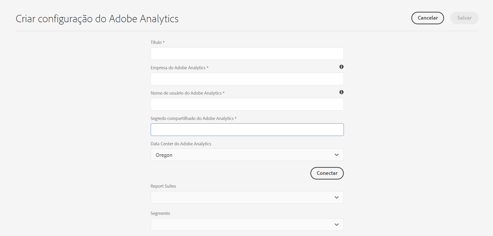

# Integração ao Adobe Analytics{#integrating-with-adobe-analytics}

Integrar o Adobe Analytics e o AEM como um Cloud Service permite rastrear a atividade de sua página da Web. A integração exige:

* usando a interface de usuário para toque para criar uma configuração do Analytics em AEM como um Cloud Service.
* adicionar e configurar o Adobe Analytics como uma extensão no [Adobe Launch](#analytics-launch). Para obter mais detalhes sobre o Adobe Launch, consulte [esta página](https://docs.adobe.com/content/help/en/launch/using/intro/get-started/quick-start.html).

Comparado às versões anteriores do AEM, o suporte à estrutura não é fornecido na Configuração do Analytics em AEM como Cloud Service. Em vez disso, agora é feito por meio do Adobe Launch, que é a ferramenta de fato para instrumentar um site AEM com recursos do Analytics (bibliotecas JS). No Adobe Launch, é criada uma propriedade na qual a extensão Adobe Analytics pode ser configurada e as regras são criadas para enviar dados à Adobe Analytics. O Adobe Launch substituiu a tarefa de análise fornecida pelo SiteCatalyst.

>[!NOTE]
>
>A Adobe Experience Manager como cliente Cloud Service que não tem uma conta do Analytics existente pode solicitar acesso ao Analytics Foundation Pack para Experience Cloud. Este Foundation Pack fornece uso limitado por volume do Analytics.

## Criando a configuração do Adobe Analytics {#analytics-configuration}

1. Navegue até **Ferramentas** → **Cloud Services**.
2. Selecione **Adobe Analytics**.
   
3. Selecione o botão **Criar** .
4. Preencha os detalhes (veja abaixo) e clique em **Conectar**.

### Parâmetros de configuração {#configuration-parameters}

Os campos de configuração presentes na janela Configuração do Adobe Analytics são:

| Propriedade | Descrição |
|---|---|
| Empresa | empresa de login do Adobe Analytics |
| Nome de usuário | Usuário da API do Adobe Analytics |
| Senha | Senha Adobe Analytics usada para autenticação |
| Centro de dados | O data center da Adobe Analytics com o qual sua conta está associada (servidor, por exemplo, San Jose, Londres) |
| Segmento | Opção para usar um segmento do Analytics definido no conjunto de relatórios atual. Os relatórios do Analytics serão filtrados com base no segmento. Consulte [esta página](https://docs.adobe.com/content/help/en/analytics/components/segmentation/seg-overview.html) para obter mais detalhes. |
| Report Suites | Um repositório onde você envia dados e extrai relatórios. Um conjunto de relatórios define o relatórios completo e independente em um site da Web, conjunto de sites ou subconjunto de páginas da Web. Você pode visualização os relatórios obtidos de um único conjunto de relatórios e editar esse campo em uma configuração a qualquer momento, de acordo com suas necessidades. |

### Adicionar uma configuração a um site {#add-configuration}

Para aplicar uma configuração de interface de usuário de toque a um site, vá para: **Sites** → **Selecione qualquer página** do site → **Propriedades** → **Avançado** → **Configuração** → selecione o locatário da configuração.

## Integração da Adobe Analytics em sites AEM usando o Adobe Launch {#analytics-launch}

O Adobe Analytics pode ser adicionado como uma extensão na propriedade Launch. As regras podem ser definidas para executar mapeamento e fazer uma chamada de postagem para o Adobe Analytics:

* Assista a [este vídeo](https://docs.adobe.com/content/help/en/analytics-learn/tutorials/implementation/via-adobe-launch/basic-configuration-of-the-analytics-launch-extension.html) para saber como configurar a extensão do Analytics no Launch para um site básico.

* Consulte [esta página](https://docs.adobe.com/content/help/en/core-services-learn/implementing-in-websites-with-launch/implement-solutions/analytics.html) para obter detalhes sobre como criar regras e enviar dados para a Adobe Analytics.

>[!NOTE]
>
>As estruturas existentes (herdadas) ainda funcionam, mas não podem ser configuradas na interface do usuário para toque. É aconselhável recriar as configurações de mapeamento de variáveis no Launch.

>[!NOTE]
>
>A configuração IMS (contas técnicas) para Launch é pré-configurada em AEM como Cloud Service. Os usuários não precisam criar essa configuração.
