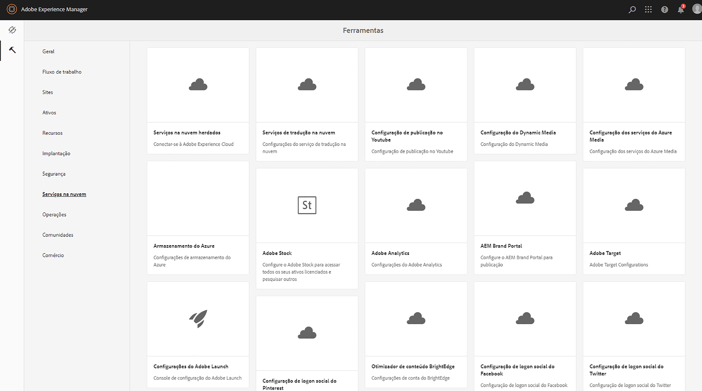
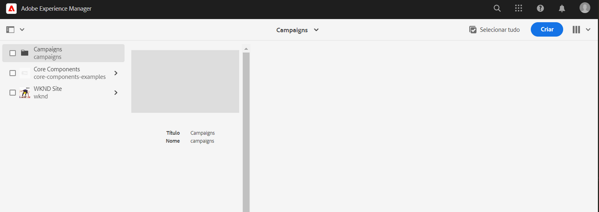
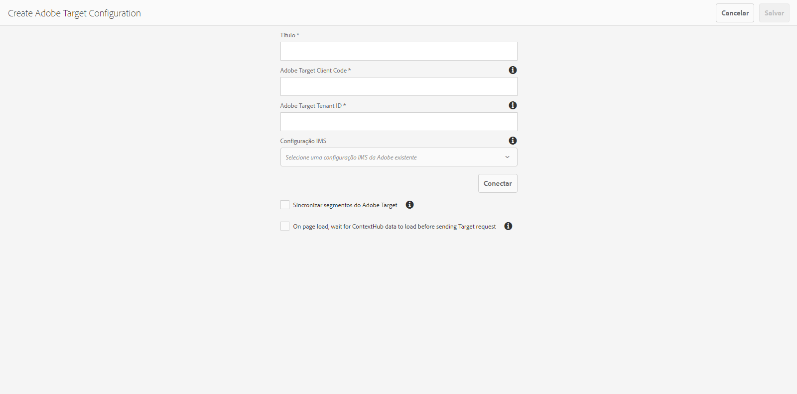
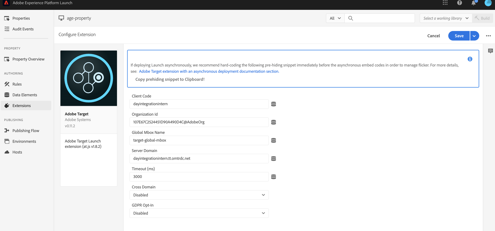

# Integração com o Adobe Target{#integrating-with-adobe-target}

Como parte da Adobe Marketing Cloud, o Adobe Target permite aumentar a relevância do conteúdo por meio do direcionamento e da medição em todos os canais. A integração do Adobe Target e o AEM as a Cloud Service exige:

* usar a interface de toque para criar uma Configuração do Target no AEM as a Cloud Service (configuração IMS necessária).
* adicionar e configurar o Adobe Target como uma extensão no [Adobe Launch](https://experienceleague.adobe.com/docs/experience-platform/tags/get-started/quick-start.html?lang=pt-BR).

O Adobe Launch é necessário para gerenciar propriedades do lado do cliente para o Analytics e o Target em páginas do AEM (bibliotecas/tags JS). Dito isso, a integração com o Launch é necessária para o “direcionamento de experiência”.

Para exportar fragmentos de experiência e/ou fragmentos de conteúdo para o Target, você só precisa da [configuração do Adobe Target e do IMS](/help/sites-cloud/integrating/integration-adobe-target-ims.md).

>[!NOTE]
>
>Os clientes do Adobe Experience Manager as a Cloud Service que não têm uma conta do Target podem solicitar acesso ao Target Foundation Pack para Experience Cloud. O Foundation Pack fornece uso limitado por volume do Target.

## Criação da configuração do Adobe Target {#create-configuration}

1. Navegar para **Ferramentas** → **Cloud Services**.
   
2. Selecione **Adobe Target**.
3. Selecione o botão **Criar**.
   
4. Preencha os detalhes (veja abaixo) e selecione **Conectar**.
   

### Configuração IMS {#ims-configuration}

Uma configuração IMS para o Launch e o Target é necessária para integrar corretamente o Target ao AEM e ao Launch. Embora a configuração do IMS para o Launch seja pré-configurada no AEM as a Cloud Service, a configuração do IMS do Target deve ser criada (após o provisionamento do Target). Consulte [Configuração do IMS para uso na integração com o Adobe Target](/help/sites-cloud/integrating/integration-adobe-target-ims.md) e o vídeo [Integrar o Experience Platform Launch e o AEM](https://experienceleague.adobe.com/docs/experience-manager-learn/sites/integrations/experience-platform-launch/overview.html?lang=pt-BR) para saber como criar a configuração do IMS do Target.

### ID de locatário do Adobe Target e código de cliente do Adobe Target {#tenant-client}

Ao configurar os campos ID de locatário do Adobe Target e Código do cliente do Adobe Target, esteja ciente do seguinte:

1. Para a maioria dos clientes, a ID do locatário e o Código do cliente são iguais. Isso significa que ambos os campos contêm as mesmas informações e são idênticos. Insira a ID do locatário em ambos os campos.
2. Para fins herdados, você também pode inserir valores diferentes nos campos ID do locatário e Código do cliente.

Em ambos os casos, esteja ciente de que:

* Por padrão, o Código do cliente (se adicionado primeiro) também é copiado automaticamente para o campo ID do locatário.
* Você tem a opção de alterar o conjunto padrão de ID de locatário.
* Assim, as chamadas de back-end para o Target serão baseadas na ID do locatário e as chamadas do lado do cliente para o Target serão baseadas no Código do cliente.

Como dito anteriormente, o primeiro caso é o mais comum para o AEM as a Cloud Service. De qualquer maneira, verifique se **ambos** os campos contêm as informações corretas, dependendo de suas necessidades.

>[!NOTE]
>
> Se quiser alterar uma Configuração do Target existente:
>
> 1. Insira novamente a ID do locatário.
> 2. Conecte-se novamente ao Target.
> 3. Salve a configuração.

### Editar a configuração do Target {#edit-target-configuration}

Para editar a configuração do Target, siga estas etapas:

1. Selecione uma configuração existente e clique em **Propriedades**.
2. Editar as propriedades.
3. Selecione **Conectar-se novamente ao Adobe Target**.
4. Selecione **Salvar e fechar**.

### Adicionar uma configuração a um site {#add-configuration}

Para aplicar uma configuração da interface de toque a um site, acesse: **Sites** → **Selecionar qualquer página do site** → **Propriedades** → **Avançado** → **Configuração** → Selecione o locatário da configuração.

## Integração do Adobe Target no AEM Sites usando o Adobe Launch {#integrate-target-launch}

O AEM oferece uma integração pronta para uso com o Experience Platform Launch. Ao adicionar a extensão do Adobe Target ao Experience Platform Launch, é possível usar os recursos do Adobe Target em páginas da web do AEM. As bibliotecas do Target só serão renderizadas usando o Launch.

>[!NOTE]
>
>As estruturas existentes (legadas) ainda funcionam, mas não podem ser configuradas na interface de toque. É aconselhável recriar as configurações de mapeamento de variáveis no Launch.

Como visão geral, as etapas de integração são:

1. Criar uma propriedade do Launch
2. Adicionar as extensões necessárias
3. Criar um elemento de dados (para capturar parâmetros do hub de contexto)
4. Criar uma regra de página
5. Criar e publicar

### Criar uma propriedade do Launch {#create-property}

Uma propriedade é um container preenchido com extensões, regras e elementos de dados.

1. Selecione o botão **Nova propriedade**.
2. Forneça um nome para a propriedade.
3. Como domínio, insira o IP/host no qual deseja carregar a biblioteca do Launch.
4. Selecione o botão **Salvar**.
   

### Adicionar as extensões necessárias {#add-extension}

**Extensões** é o container que gerencia as principais configurações da biblioteca. A extensão do Adobe Target aceita implementações do lado do cliente usando o SDK JavaScript do Target para a web moderna, a at.js. Você deve adicionar ambas as extensões do **Adobe Target** e do **Adobe ContextHub**.

1. Selecione a opção Catálogo de extensões e procure pelo Target no filtro.
2. Selecione at.js do **Adobe Target** e clique na opção Instalar.
   
3. Selecione o botão **Configurar**. Observe a janela de configuração com as credenciais de conta do Target importadas e a versão do at.js para essa extensão.
4. Selecione **Salvar** para adicionar a extensão do Target à propriedade do Launch. Você pode ver a extensão do Target na lista **Extensões instaladas**.
   
5. Repita as etapas acima para pesquisar a extensão **Adobe ContextHub** e instale-a (isso é necessário para a integração com parâmetros do contexthub, com base nos quais o direcionamento será feito).

### Criar um elemento de dados {#data-element}

**Elementos de dados** são os espaços reservados para os quais você pode mapear parâmetros do hub de contexto.

1. Selecione **Elementos de dados**.
2. Selecione **Adicionar elemento de dados**.
3. Forneça o nome do elemento de dados e mapeie-o para um parâmetro de hub de contexto.
4. Selecione **Salvar**.
   

### Criar uma regra de página {#page-rule}

Em **Regra** definimos e ordenamos uma sequência de ações, que são executadas no site, para atingir o direcionamento.

1. Adicione um conjunto de ações, como exemplificado na captura de tela.
   
2. Em Adicionar parâmetros a todas as mboxes, adicione o elemento de dados configurado anteriormente (consulte o elemento de dados acima) ao parâmetro que será enviado na chamada de mbox.
   

### Criar e publicar {#build-publish}

Para saber como criar e publicar, consulte esta [página](https://experienceleague.adobe.com/docs/experience-manager-learn/aem-target-tutorial/aem-target-implementation/using-launch-adobe-io.html?lang=pt-BR).

## Alterações na estrutura de conteúdo entre as configurações de interface clássica e de toque {#changes-content-structure}

<table style="table-layout:auto">
  <tr>
    <th>Alterar</th>
    <th>Configuração da interface clássica</th>
    <th>Configuração da interface de toque</th>
    <th>Consequências</th>
  </tr>
  <tr>
    <td>Localização da configuração do Target.</td>
    <td>/etc/cloudservices/testandtarget/</td>
    <td>/conf/tenant/settings/cloudconfigs/target/</td>
    <td> Anteriormente, várias configurações estavam presentes em /etc/cloudservices/testandtarget, mas agora uma única configuração está presente em um locatário.</td>
  </tr>
</table>

>[!NOTE]
>
>As configurações herdadas ainda são compatíveis com clientes existentes (sem a opção de editar ou criar novos). As configurações herdadas farão parte dos pacotes de conteúdo carregados pelos clientes que usam o VSTS.
